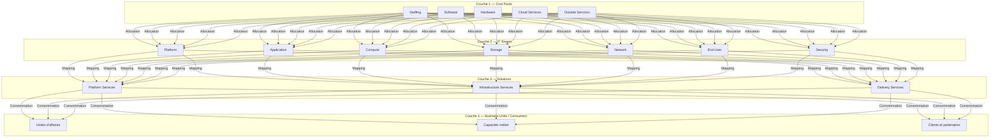
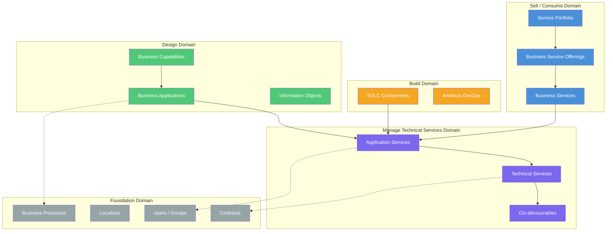
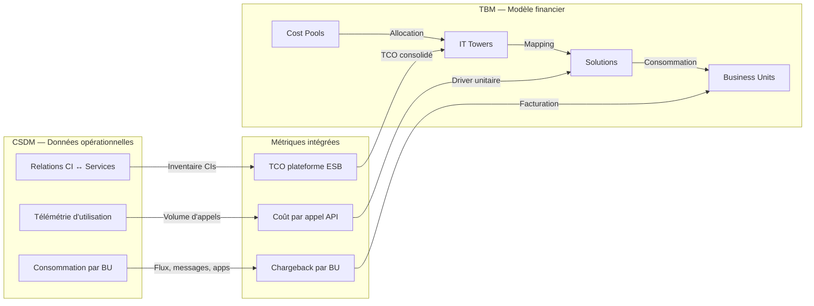
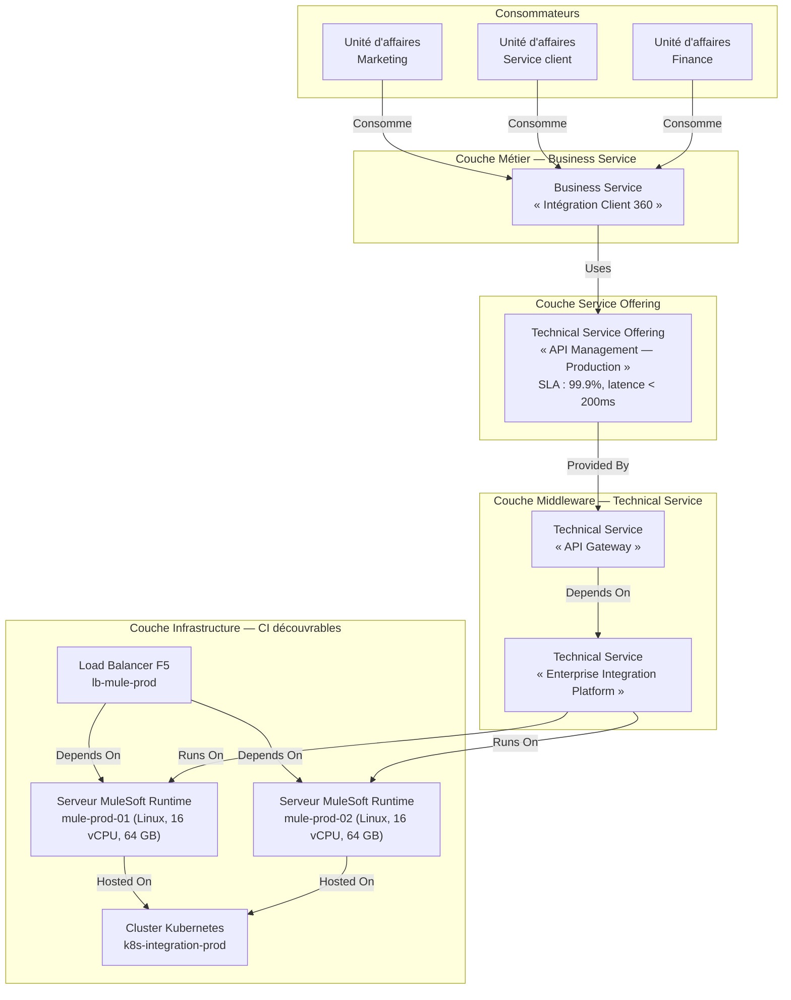
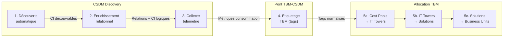

# Documentation des services d'intégration d'entreprise — TBM Taxonomy & CSDM

## Introduction et cadre conceptuel

Les organisations contemporaines exploitent des écosystèmes applicatifs de plus en plus distribués — applications SaaS (Software as a Service), systèmes patrimoniaux on-premise, services cloud-natifs et dispositifs connectés — dont la cohérence opérationnelle repose sur une couche souvent invisible : les services d'intégration d'entreprise. Ces services assurent la circulation des données, la coordination des processus et l'interopérabilité entre les systèmes. Leur périmètre technologique s'articule autour de cinq catégories complémentaires [cite:21] :

- **ESB (Enterprise Service Bus)** — Middleware centralisé coordonnant le routage, la transformation et le monitoring des flux de données entre applications multiples. Bien que les architectures ESB cèdent progressivement le terrain aux approches cloud-natifs, elles demeurent opérationnelles dans les environnements à forte densité patrimoniale.

- **iPaaS (Integration Platform as a Service)** — Plateforme cloud gérant les échanges de données préconfigurés entre applications commerciales via des connecteurs standardisés et des interfaces low-code. Le marché iPaaS connaît une croissance soutenue, porté par la prolifération des applications SaaS.

- **Event streaming** — Architecture événementielle assurant la propagation temps réel des changements d'état entre systèmes. Des plateformes comme Apache Kafka ou Confluent traitent des millions d'événements par seconde, permettant le découplage temporel entre producteurs et consommateurs de données.

- **API management** — Gouvernance centralisée des interfaces de programmation exposées aux consommateurs internes et externes. Les passerelles API (*API gateways*) assurent l'authentification, la limitation de débit et la collecte de télémétrie d'utilisation.

- **Orchestration** — Coordination multi-étapes de processus transversaux via des moteurs de workflow (BPMN 2.0, Apache Airflow, AWS Step Functions), gérant l'état et les compensations transactionnelles nécessaires aux processus métier complexes.

### Le défi de la transparence financière

Ces cinq catégories de services génèrent des dépenses considérables — licences logicielles, infrastructure cloud, personnel spécialisé, services de conseil — qui restent trop souvent opaques dans les budgets IT. Sans classification standardisée, les coûts d'intégration se dispersent entre lignes budgétaires, rendant impossible le calcul du coût total de possession (TCO — *Total Cost of Ownership*) d'une plateforme, la refacturation équitable aux unités d'affaires consommatrices ou la comparaison entre stratégies d'intégration alternatives. Cette opacité compromet les décisions d'investissement et alimente la prolifération incontrôlée d'intégrations point-à-point [cite:21] [cite:14].

Deux cadres de référence complémentaires répondent à ce défi en établissant un langage commun entre les directions IT, Finance et Métier.

La **TBM Taxonomy** (Technology Business Management), maintenue par le TBM Council, fournit un modèle d'allocation financière à quatre couches — des pools de coûts bruts jusqu'à la consommation par les unités d'affaires — permettant de tracer chaque dollar investi en intégration depuis sa source comptable jusqu'au service métier qu'il active [cite:14]. La TBM répond à la question : *combien coûte chaque service d'intégration et qui en supporte la charge ?*

Le **CSDM** (Common Service Data Model) de ServiceNow structure les relations opérationnelles entre les composants techniques, les services et les consommateurs au sein de la CMDB (Configuration Management Database). Organisé en cinq domaines — Foundation, Design, Build, Manage Technical Services et Sell/Consume —, le CSDM fournit l'inventaire vérifiable des actifs d'intégration, leur carte de dépendances et la télémétrie de consommation [cite:22] [cite:10]. Le CSDM répond à la question : *que possédons-nous, comment ces composants sont-ils reliés et qui les consomme ?*

L'alignement de ces deux cadres — le modèle financier de la TBM alimenté par les données opérationnelles du CSDM — transforme la transparence financière en une capacité organisationnelle ancrée dans des données auditables [cite:20] [cite:23].

### Fil conducteur de l'essai

Le présent essai propose une documentation de référence architecturale pour la classification, la modélisation et la gouvernance des services d'intégration d'entreprise, structurée en treize sections formant une progression logique :

Les **sections 2 et 3** posent les fondements de la TBM Taxonomy — architecture à quatre couches, positionnement des services d'intégration dans les tours Platform et Application, puis évolution du framework de la v4.0 à la v5.0.1. La **section 4** établit le second pilier en détaillant l'architecture par domaines du CSDM et ses tables CMDB critiques. La **section 5**, pivot de l'essai, formalise le mappage stratégique TBM-CSDM à travers une matrice de correspondance et trois métriques financières intégrées. La **section 6** traduit ce mappage en guide pratique : classification des patterns, taxonomie des composants et matrice RACI. La **section 7** approfondit les mécanismes d'allocation des coûts et les KPI de pilotage. La **section 8** contextualise l'ensemble par quatre cas d'usage sectoriels — services bancaires, assurance dommages, assurance de personne et gestion de patrimoine. La **section 9** fournit une roadmap en cinq phases (*Foundation* à *Fly*), complétée par l'écosystème d'outils en **section 10**. Les **sections 11 et 12** documentent les défis, bonnes pratiques et perspectives d'évolution, avant la **section 13** qui synthétise l'appel à l'action.

L'objectif : permettre à tout architecte d'entreprise, responsable FinOps ou dirigeant technologique de classifier, modéliser et gouverner ses services d'intégration avec la rigueur d'un langage standardisé partagé entre IT, Finance et Métier.

---

*Les fondations conceptuelles étant posées, les deux sections suivantes détaillent le premier pilier de ce cadre dual : la taxonomie TBM et son architecture à quatre couches.*

## Fondements de la TBM Taxonomy (Partie I)

La taxonomie TBM, maintenue par le TBM Council, fournit un langage standardisé pour catégoriser, allouer et rendre compte des coûts technologiques [cite:14]. À l'image des principes comptables généralement reconnus (GAAP) pour la finance, la TBM Taxonomy établit un cadre de référence commun entre les directions IT, Finance et Métier. Cette section en expose l'architecture fondamentale et positionne les services d'intégration d'entreprise dans cette structure.

### Architecture à quatre couches

Le modèle TBM organise le flux des coûts technologiques à travers quatre couches successives, depuis les dépenses brutes jusqu'à leur consommation par les unités d'affaires [cite:14] [cite:20].

**Couche 1 — Cost Pools (Pools de coûts)** : catégorise la nature de la dépense — *ce qui est acheté*. Chaque pool contient des sous-pools pour une classification granulaire (par exemple, le pool Staffing distingue Internal Labor, Staff Augmentation et Internal Labor Capital) [cite:14].

**Couche 2 — IT Towers (Tours de ressources technologiques)** : révèle *où et comment* la dépense est utilisée, indépendamment de sa nature comptable. Les tours regroupent les coûts par fonction technologique — Platform, Application, Compute, Storage, Network, End User, Security [cite:14].

**Couche 3 — Solutions** : représente la couche orientée métier où les coûts technologiques se consolident pour les conversations de TCO et de valeur. Les solutions englobent les produits et services que l'IT livre aux consommateurs finaux [cite:14].

**Couche 4 — Business Units / Consumers** : identifie les consommateurs finaux des solutions — unités d'affaires, capacités métier, clients et partenaires. Cette couche, formalisée à partir de la v4.0, établit la traçabilité complète entre coût IT et résultat métier [cite:20].

Le principe fondamental est la transparence ascendante : chaque dollar dépensé en technologie doit pouvoir être tracé depuis son pool de coûts, à travers une tour, jusqu'à la solution et l'unité d'affaires qui le consomme.

### Positionnement des services d'intégration dans les IT Towers

Les services d'intégration d'entreprise se positionnent principalement dans deux tours de la couche IT Towers : la tour **Platform** et la tour **Application** [cite:14] [cite:23].

#### Tour Platform

La tour Platform regroupe les ressources d'infrastructure logicielle partagées — middleware, bases de données, orchestration de conteneurs et environnements mainframe. Trois sous-tours sont directement pertinentes pour l'intégration :

| Sous-tour | Périmètre intégration | Exemples de composants |
|---|---|---|
| **Middleware** | Ressources d'intégration système et applicative : bus de services, courtiers de messages, gestionnaires d'API | MuleSoft Anypoint, IBM App Connect, TIBCO BusinessWorks, Apache Kafka, RabbitMQ |
| **Container Orchestration** | Orchestration de conteneurs hébergeant des microservices d'intégration et des runtimes iPaaS déployés en conteneurs | Kubernetes, OpenShift, Amazon ECS, service mesh Istio |
| **Mainframe Middleware** | Intégration des environnements mainframe avec les systèmes modernes : connecteurs CICS, passerelles MQ Series, transactionnels legacy | IBM MQ, CICS Transaction Gateway, connecteurs z/OS |

La sous-tour Middleware constitue le point d'ancrage principal : elle « inclut les ressources d'intégration système et applicative permettant le développement inter-applications, les communications et le partage d'information » [cite:14]. Les courtiers de messages (message brokers), les serveurs d'applications d'intégration et les passerelles API s'y rattachent directement.

#### Tour Application

La tour Application couvre le cycle de vie des applications métier. Deux sous-tours concernent l'intégration :

| Sous-tour | Périmètre intégration |
|---|---|
| **Development** | Développement de connecteurs applicatifs spécifiques, adaptateurs sur mesure, transformations de données propres à une application |
| **Support & Operations** | Exploitation et maintenance des flux d'intégration applicatifs, surveillance des interfaces, résolution d'incidents d'intégration |

La distinction entre les deux tours est structurante : la tour Platform porte les **capacités d'intégration partagées** (plateforme ESB, iPaaS, event broker), tandis que la tour Application porte l'**intégration applicative spécifique** (connecteurs dédiés, adaptateurs métier). Une organisation mature sépare clairement ces deux périmètres pour éviter la double comptabilisation des coûts.

### Pools de coûts applicables aux services d'intégration

Quatre pools de coûts de la couche Finance alimentent directement les tours d'intégration [cite:14] :

#### Staffing (Personnel)

Le pool Staffing capture les coûts de main-d'oeuvre interne et externe affectée à l'intégration. Les sous-pools distinguent :

- **Internal Labor** : architectes d'intégration, développeurs ESB/iPaaS, ingénieurs de plateforme middleware, spécialistes API — salaires et avantages sociaux
- **Staff Augmentation** : consultants contractuels spécialisés en intégration, ressources iPaaS temporaires

*Exemple* : une équipe de 4 développeurs MuleSoft (Internal Labor) complétée par 2 consultants contractuels pour un projet de migration ESB (Staff Augmentation).

#### Software (Logiciel)

Le pool Software couvre les licences et abonnements des plateformes d'intégration :

- **Licences ESB** : MuleSoft Anypoint Platform, TIBCO BusinessWorks, IBM App Connect Enterprise
- **Abonnements iPaaS** : Dell Boomi, Workato, Informatica Cloud, SnapLogic
- **Licences complémentaires** : outils de gouvernance API (Apigee, Kong), registres de services, outils de test d'intégration

*Exemple* : licence annuelle MuleSoft Anypoint Platform (environ 150 000 $ à 500 000 $ selon le nombre de vCores) plus abonnement Workato pour l'intégration SaaS-to-SaaS.

#### Cloud Services (Services infonuagiques)

Formalisé en tant que pool distinct dans la TBM v5.0.1, le pool Cloud Services capture les services d'intégration cloud-natifs facturés à la consommation :

- **Services managés de messaging** : Amazon EventBridge, Azure Service Bus, Google Cloud Pub/Sub
- **Services iPaaS cloud-natifs** : AWS Step Functions, Azure Logic Apps, Google Cloud Workflows
- **Services API** : Amazon API Gateway, Azure API Management

*Exemple* : coûts mensuels Azure Service Bus (files d'attente et topics) de 2 500 $ basés sur 10 millions de messages/mois, plus Azure API Management à 3 000 $/mois pour le tier Premium.

#### Outside Services (Services externes)

Le pool Outside Services regroupe les dépenses de conseil et de services professionnels spécialisés :

- **Consulting en architecture d'intégration** : cabinets spécialisés pour la conception de stratégies iPaaS ou la migration d'un ESB on-premise vers le cloud
- **Services d'implémentation** : intégrateurs systèmes pour le déploiement de plateformes (MuleSoft, TIBCO, Boomi)
- **Services managés** : exploitation externalisée de plateformes d'intégration

*Exemple* : mandat de 6 mois d'un cabinet de conseil pour la conception et l'implémentation d'une architecture d'intégration événementielle (event-driven architecture).

### Solutions consommatrices des services d'intégration

À la couche Solutions, les coûts des tours Platform et Application se consolident en trois catégories de solutions que les unités d'affaires consomment [cite:14] [cite:20] :

**Platform Services** : regroupent les capacités d'intégration partagées offertes à l'ensemble de l'organisation — plateforme ESB/iPaaS mutualisée, service de messaging, API Gateway centralisé. Le coût de la sous-tour Middleware s'y consolide principalement. Les Platform Services représentent le catalogue de services d'intégration à disposition des équipes applicatives.

**Infrastructure Services** : couvrent les ressources d'infrastructure sous-jacentes qui supportent les plateformes d'intégration — serveurs, clusters Kubernetes, réseau, stockage. Les coûts de Container Orchestration et de l'infrastructure Mainframe Middleware s'y rattachent. Ces services sont consommés indirectement par les unités d'affaires à travers les Platform Services.

**Delivery Services** : capturent les coûts de développement, de déploiement et de support des flux d'intégration — projets de connecteurs, maintenance des interfaces, support opérationnel. Les coûts des sous-tours Development et Support & Operations de la tour Application s'y consolident. Ces services se rattachent directement aux applications métier qu'ils intègrent.

### Mécanismes d'allocation basés sur la consommation

L'allocation des coûts d'intégration des tours vers les solutions, puis vers les unités d'affaires, repose sur des drivers de consommation mesurables [cite:14]. Trois mécanismes principaux s'appliquent aux services d'intégration :

#### 1. Nombre de flux d'intégration

Chaque flux d'intégration actif (interface entre deux systèmes) constitue une unité de consommation. Le coût unitaire par flux permet une répartition équitable entre les solutions consommatrices.

*Calcul* : Coût total de la plateforme d'intégration (480 000 $/an) / Nombre total de flux actifs (120) = **4 000 $ par flux par an**. Une application CRM consommant 15 flux se voit allouer 15 x 4 000 $ = **60 000 $/an**.

#### 2. Volume de messages traités

Le volume de messages transitant par la plateforme d'intégration reflète la consommation réelle de capacité par chaque application ou unité d'affaires.

*Calcul* : Coût mensuel du broker de messages (25 000 $) / Volume total de messages (50 millions/mois) = **0,0005 $ par message**. L'unité d'affaires « Commerce en ligne » générant 20 millions de messages/mois se voit allouer 20 000 000 x 0,0005 $ = **10 000 $/mois**.

#### 3. Nombre d'applications connectées

Le nombre d'applications distinctes raccordées à la plateforme d'intégration mesure l'empreinte d'une unité d'affaires sur l'écosystème partagé. Ce driver est particulièrement adapté aux environnements iPaaS où chaque connexion applicative consomme des ressources de gouvernance, de surveillance et de support.

*Calcul* : Coût annuel de la plateforme iPaaS incluant gouvernance et support (360 000 $) / Nombre total d'applications connectées (60) = **6 000 $ par application par an**. Le département Finance, avec 8 applications connectées (ERP, CRM, trésorerie, paie, etc.), se voit allouer 8 x 6 000 $ = **48 000 $/an**.

Ces trois drivers peuvent être combinés dans un modèle d'allocation multidimensionnel pour refléter plus fidèlement la consommation réelle. Par exemple, une allocation pondérée à 40 % par volume de messages, 35 % par nombre de flux et 25 % par applications connectées permet de capturer à la fois l'intensité d'utilisation et la complexité de l'empreinte d'intégration.

---

*L'architecture TBM à quatre couches étant établie, il convient d'examiner comment ce framework a évolué au fil des versions pour mieux répondre aux réalités contemporaines de l'intégration d'entreprise.*

## Évolution de la TBM Taxonomy (v4.0 → v4.1 → v5.0.1)

L'architecture TBM décrite précédemment n'est pas figée. Trois versions majeures redéfinissent la classification et la gouvernance financière des services d'intégration.

### Version 4.0 (décembre 2020) — Architecture de base stabilisée

Publiée le 16 décembre 2020, la v4.0 formalise le modèle à quatre couches et établit la taxonomie comme un standard comparable aux principes comptables GAAP [cite:14]. Neuf pools de coûts standard alimentent une hiérarchie tour → sous-tour → élément de sous-tour dans la couche Towers [cite:14].

Pour les services d'intégration, la v4.0 pose le cadre structurant : la tour Platform / sous-tour Middleware comme point d'ancrage ESB, iPaaS et courtiers de messages, et la tour Application pour l'intégration applicative spécifique. La couche Consumer formalise la traçabilité dépense IT → consommation métier [cite:20].

### Version 4.1 (novembre 2023) — Nouvelles sous-tours et alignement NIST

La v4.1 apporte des raffinements ciblés sans modifier les couches Cost Pools ni Solutions [cite:14].

**Nouvelles sous-tours IT.** Les ajouts Data Management, Data Operations et IT Human Capital Management offrent un premier espace de classification dédié aux pipelines de données et aux flux ETL/ELT traversant les plateformes d'intégration [cite:14]. La v4.1 clarifie également la distinction entre *couches* (taxonomies structurées pour la modélisation) et *vues* (perspectives contextuelles pour l'analyse), permettant aux équipes d'intégration de construire des vues spécifiques — par exemple une « Integration Cost View » — sans altérer la structure taxonomique sous-jacente.

**Mappage NIST CSF 1.1.** Le TBM Council Standards Committee développe un mappage complet vers le NIST Cybersecurity Framework 1.1, ouvrant la voie à des analyses coût-risque [cite:14]. Pour les services d'intégration — au cœur des flux de données sensibles — cette capacité permet de quantifier le coût des contrôles de sécurité appliqués aux plateformes middleware et API gateways.

### Version 5.0.1 (juillet 2025) — Refonte structurelle majeure

La v5.0.1, publiée le 17 juillet 2025, représente la mise à jour la plus importante depuis la v4.0 [cite:14]. Elle modernise chaque couche pour refléter les pratiques contemporaines de livraison technologique.

**Nouvelles tours.** La tour **Data** adresse les coûts de gestion et gouvernance des données, avec des sous-tours dont ML Engineering et Model Hosting pour les charges IA/ML. La tour **Risk & Compliance** incorpore les coûts de sécurité numérique, conformité réglementaire et gestion des risques. Les tours Platform et Output sont retirées, leurs fonctions redistribuées vers Application, Data et Smart Devices. Une tour IoT couvre les systèmes de contrôle industriel [cite:14].

**Retrait des Applications de la couche Solutions.** Les applications ne sont plus des solutions autonomes : elles deviennent des éléments intermédiaires dans la couche Towers, qui alimentent les solutions [cite:14]. Une plateforme iPaaS n'est plus modélisée comme une solution consommée directement par les unités d'affaires, mais comme une ressource technologique alimentant les Platform Services ou les nouveaux types AI Solutions.

**Nouveau pool Cloud Services.** Élevé au rang de pool autonome, il remplace le routage des dépenses cloud via Outside Services [cite:14]. Les coûts des services d'intégration cloud-natifs (Amazon EventBridge, Azure Service Bus, Google Cloud Pub/Sub) bénéficient d'une traçabilité distincte alignée sur les pratiques FinOps.

**Capacités de tagging.** Le Unified Tags & Fields Reference introduit des métadonnées transverses (`solution_id`, `tower`, `sub_tower`, `allocation_driver`, `mapping_method`) permettant une auditabilité fine des allocations de coûts d'intégration [cite:14].

**Couche Consumer élargie.** Renommée Technology Consumers, elle intègre les value streams, produits, portfolios et services numériques, permettant de modéliser la consommation d'intégration par flux de valeur métier [cite:20].

### Tableau comparatif des versions

| Dimension | v4.0 (déc. 2020) | v4.1 (nov. 2023) | v5.0.1 (juil. 2025) |
|---|---|---|---|
| **Pools de coûts** | 9 pools standard (Hardware, Software, Internal/External Labor, Outside Services, etc.) | Inchangés | Cloud Services autonome ; Staffing unifié ; Software & SaaS renommé |
| **Tours IT** | Platform, Application, Compute, Storage, Network, End User, Security | Ajout sous-tours Data Management, Data Operations, IT Human Capital Management | Nouvelles tours Data, Risk & Compliance, IoT, Smart Devices ; retrait Platform et Output |
| **Couche Solutions** | Applications, Platform Services, Infrastructure Services, Delivery Services | Mappage NIST CSF 1.1 ajouté | Applications retirées ; AI Solutions et Sustainability & ESG ajoutés |
| **Couche Consumer** | Business Units | Inchangée | Renommée Technology Consumers ; ajout value streams, produits, portfolios |
| **Tagging** | Absent | Absent | Unified Tags & Fields Reference |
| **Impact intégration** | Middleware = point d'ancrage ESB/iPaaS ; allocation par flux et volume | Sous-tours Data pour pipelines ETL/ELT ; analyses coût-risque NIST pour middleware | Cloud Services pool isole coûts iPaaS cloud ; tour Data couvre ML Engineering ; tags tracent chaque flux d'intégration |

### Synthèse de l'impact sur les services d'intégration

De la v4.0 à la v5.0.1, la modélisation financière des services d'intégration se transforme : les coûts cloud, autrefois noyés dans Outside Services, sont isolés ; les charges IA/ML disposent d'une tour spécialisée ; le tagging permet l'allocation au niveau du flux individuel [cite:14] [cite:20]. Pour les architectures événementielles ou les plateformes iPaaS hybrides, la v5.0.1 offre un modèle fidèle à la réalité opérationnelle : un event broker Kafka classifié dans la tour appropriée, ses coûts cloud isolés, et sa consommation tracée par tags jusqu'au flux de valeur métier.

---

*Le modèle financier TBM étant détaillé dans ses fondements et son évolution, il convient maintenant d'établir le second pilier de notre cadre dual : le Common Service Data Model de ServiceNow, qui fournit la structure opérationnelle complémentaire.*

## Fondements du CSDM

Le CSDM est le cadre de référence normalisé de ServiceNow qui structure la manière dont les organisations modélisent, classifient et relient leurs services IT au sein de la CMDB [cite:22]. Contrairement à la TBM Taxonomy, qui organise les coûts selon une logique financière descendante, le CSDM adopte une perspective opérationnelle ascendante : il part de l'infrastructure découvrable pour remonter jusqu'aux services métier consommés par les unités d'affaires [cite:12]. Pour les services d'intégration d'entreprise — ESB, iPaaS, event streaming, API management — le CSDM fournit le modèle de données qui permet de cartographier chaque composant technique, de tracer ses dépendances et de mesurer son impact sur les services métier [cite:10].

### 4.1 Architecture par domaines

Le CSDM s'organise en cinq domaines fonctionnels, chacun représentant une étape du cycle de vie des services [cite:10] [cite:12]. Ces domaines forment une hiérarchie logique allant des données fondamentales jusqu'à la consommation des services par les utilisateurs finaux.

**Foundation Domain** — Ce domaine constitue le socle référentiel sur lequel reposent tous les autres domaines. Il contient les données organisationnelles de base : utilisateurs (*Users*), groupes (*Groups*), localisations (*Locations*), départements (*Departments*), processus métier (*Business Processes*), contrats (*Contracts*) et modèles de produits (*Product Models*) [cite:12] [cite:19]. Dans le contexte de l'intégration d'entreprise, le Foundation Domain est essentiel pour identifier les groupes de support responsables des plateformes d'intégration, les contrats de licence des solutions ESB/iPaaS et les localisations des équipes d'architecture distribuées.

**Design Domain** — Le domaine de conception représente la vue logique de l'architecture d'entreprise, utilisée par les équipes d'Enterprise Architecture et d'Application Portfolio Management (APM). Ses composants clés sont les *Business Capabilities* (capacités métier que l'organisation doit posséder), les *Business Applications* (applications logiques supportant ces capacités) et les *Information Objects* (entités de données manipulées) [cite:10] [cite:12]. Pour l'intégration, ce domaine permet de modéliser une Business Application « Plateforme d'intégration d'entreprise » et de la relier aux capacités métier qu'elle active, comme « Échange de données inter-systèmes » ou « Orchestration des processus ».

**Build Domain** — Ce domaine couvre le cycle de développement logiciel (SDLC — *Software Development Life Cycle*) et assure la traçabilité entre les artefacts de conception et les composants déployés. Il s'appuie principalement sur la *SDLC Component Table* et s'intègre aux processus DevOps et Agile [cite:10] [cite:11]. Pour les équipes d'intégration, le Build Domain permet de suivre le cycle de vie des flux d'intégration, des connecteurs API et des configurations de bus de messages, depuis leur développement jusqu'à leur déploiement en production.

**Manage Technical Services Domain** — Domaine central pour les opérations IT, il représente le système de livraison de services de bout en bout, incluant l'infrastructure, les technologies et les patterns d'intégration [cite:12] [cite:19]. Ses composants principaux sont les *Technical Services* (services techniques de haut niveau comme « Service de middleware » ou « Service de gestion d'API »), les *Application Services* (vue opérationnelle des applications, liant les Business Applications du Design Domain aux CI d'infrastructure) et les *CIs découvrables* — éléments de configuration (CI — *Configuration Item*) automatiquement identifiés par les outils Discovery, Service Mapping ou Agent Client Collector [cite:19]. C'est dans ce domaine que résident les serveurs ESB, les instances iPaaS, les clusters Kafka et les gateways API en tant qu'éléments opérationnels gérés.

**Sell/Consume Domain** — Le domaine de consommation représente la perspective de l'utilisateur final et du client interne. Il comprend les *Business Services* (services métier composites visibles par les consommateurs), les *Business Service Offerings* (offres spécifiques avec engagements de niveau de service — SLA — *Service Level Agreement*) et le *Service Portfolio* (catalogue consolidé des services disponibles) [cite:10] [cite:12]. Un exemple concret : le Business Service « Intégration Client 360 » agrège plusieurs Application Services (API CRM, flux de données marketing, synchronisation ERP) en une offre métier cohérente, avec des SLA définis pour la disponibilité et la latence.

*Figure 4.1 — Architecture par domaines du CSDM. Les flèches pleines représentent les dépendances hiérarchiques entre domaines ; les flèches pointillées indiquent les références aux données fondamentales.*

### 4.2 Tables CMDB critiques pour l'intégration

Le CSDM s'appuie sur des tables CMDB spécifiques pour stocker les éléments de configuration pertinents aux services d'intégration. Quatre tables sont particulièrement critiques :

| Table CMDB | Classe CI | Domaine CSDM | Cas d'usage intégration |
|---|---|---|---|
| `cmdb_ci_app_server` | Application Server | Manage Technical Services | Serveurs hébergeant les moteurs ESB (IBM App Connect, MuleSoft Runtime), les API gateways (Apigee, Kong, AWS API Gateway) et les brokers de messages (IBM MQ, RabbitMQ). Chaque instance physique ou virtuelle est enregistrée comme CI découvrable [cite:10] [cite:19]. |
| `cmdb_ci_cloud_service` | Cloud Service | Manage Technical Services | Services iPaaS cloud-natifs (Azure Integration Services, AWS EventBridge, Google Cloud Pub/Sub), plateformes d'event streaming managées (Confluent Cloud) et services d'API management SaaS. Cette table capture les services consommés « as-a-service » sans infrastructure sous-jacente gérée en interne [cite:10]. |
| `cmdb_ci_service_auto` | Application Service (auto-discovered) | Manage Technical Services | Services techniques automatiquement découverts par ServiceNow Discovery ou Service Mapping. Pour l'intégration, cette table contient les Application Services opérationnels — par exemple, un service « MuleSoft API Gateway - Production » découvert automatiquement avec ses endpoints, ses dépendances réseau et ses composants applicatifs [cite:9] [cite:19]. |
| `cmdb_ci_service` | Business Service | Sell/Consume | Services métier composites agrégant plusieurs services techniques d'intégration. Exemple : le service « Plateforme d'échange B2B » qui regroupe un API gateway, un service de transformation EDI et un broker de messages, présenté comme un service unitaire aux unités d'affaires avec un SLA global [cite:10] [cite:12]. |

La distinction entre `cmdb_ci_service_auto` (vue technique, découvrable) et `cmdb_ci_service` (vue métier, définie manuellement) est fondamentale : elle reflète la séparation CSDM entre la réalité opérationnelle de l'infrastructure et la perspective de consommation des services [cite:9] [cite:22].

### 4.3 Types de relations CSDM

Le CSDM prescrit des types de relations standardisés pour connecter les CI entre eux au sein de la CMDB. Ces relations, stockées dans la table `cmdb_rel_ci`, établissent la carte des dépendances qui permet l'analyse d'impact, la gestion des changements et la corrélation d'incidents [cite:10]. Cinq types de relations sont particulièrement pertinents pour les services d'intégration :

**Depends On / Used By** — Relation de dépendance fonctionnelle. Un CI *dépend* d'un autre pour fonctionner correctement. Exemple : un Application Service « Flux d'intégration CRM-ERP » *depends on* le Technical Service « Apache Kafka Cluster » pour le transport asynchrone des messages. Si le cluster Kafka tombe, l'analyse d'impact identifie automatiquement le flux d'intégration comme affecté [cite:10] [cite:19].

**Hosted On / Hosts** — Relation d'hébergement physique ou virtuel. Un CI est hébergé sur un autre CI d'infrastructure. Exemple : l'instance MuleSoft Runtime *hosted on* un serveur applicatif `cmdb_ci_app_server` dans le centre de données de Montréal. Cette relation est essentielle pour planifier les fenêtres de maintenance : une intervention sur le serveur hôte impacte toutes les instances d'intégration hébergées [cite:10].

**Runs On / Runs** — Relation d'exécution entre une application et son infrastructure de calcul. Exemple : le processus « IBM App Connect Enterprise » *runs on* un conteneur Kubernetes dans le cluster de production. La distinction avec *Hosted On* est subtile mais importante : *Runs On* implique une relation d'exécution active (processus en cours), tandis que *Hosted On* décrit une relation d'hébergement statique (déploiement) [cite:10] [cite:9].

**Uses / Used By** — Relation de consommation de service entre entités de niveaux différents. Exemple : la Business Application « Portail partenaires B2B » *uses* l'Application Service « API Gateway — Production » pour exposer ses API aux partenaires externes. Cette relation relie le Design Domain (Business Application) au Manage Technical Services Domain (Application Service) [cite:12].

**Provided By / Provides** — Relation entre un service et l'entité organisationnelle qui le fournit. Exemple : le Technical Service « Plateforme iPaaS » *provided by* le département « Architecture d'intégration ». Cette relation est critique pour la gouvernance : elle identifie le groupe responsable de chaque service d'intégration, alignant la CMDB avec la structure organisationnelle du Foundation Domain [cite:12] [cite:19].

| Type de relation | Direction | Exemple intégration | Utilité principale |
|---|---|---|---|
| Depends On | Service → Service/CI | Flux CRM-ERP → Kafka Cluster | Analyse d'impact |
| Hosted On | CI → Infrastructure | MuleSoft Runtime → App Server | Planification maintenance |
| Runs On | Application → Compute | App Connect → Conteneur K8s | Gestion capacité |
| Uses | Business App → App Service | Portail B2B → API Gateway | Traçabilité Design → Ops |
| Provided By | Service → Organisation | iPaaS → Dépt. Architecture | Gouvernance, responsabilité |

Ces relations forment le tissu connectif de la CMDB et transforment une simple base de données d'inventaire en un modèle opérationnel vivant, capable de répondre à la question fondamentale : « Si ce composant d'intégration tombe en panne, quels services métier sont impactés, et qui est responsable de la remédiation ? » [cite:22]

---

*Les deux piliers étant désormais établis — le modèle d'allocation financière TBM et le modèle de données opérationnel CSDM —, la section suivante formalise leur intégration stratégique à travers une matrice de correspondance et des métriques financières bidirectionnelles.*

## Intégration stratégique TBM ↔ CSDM

La valeur distinctive d'une gestion financière IT mature ne réside ni dans la taxonomie TBM seule, ni dans le modèle de données CSDM isolément, mais dans leur intégration systématique. Là où la TBM Taxonomy organise le flux des coûts technologiques — de la dépense brute jusqu'à la consommation métier —, le CSDM structure les relations opérationnelles entre les composants, les services et les consommateurs au sein de la CMDB. L'alignement de ces deux cadres transforme la transparence financière en une capacité organisationnelle ancrée dans des données vérifiables [cite:20] [cite:17].

Le TBM Council et ServiceNow ont formalisé cette convergence dans un livre blanc conjoint qui établit les correspondances recommandées entre les éléments du CSDM et les couches de la taxonomie TBM [cite:23]. Le principe directeur est que le CSDM fournit le *modèle de données opérationnel* — l'inventaire des actifs, les relations de dépendance, la télémétrie de consommation — tandis que la TBM Taxonomy fournit le *modèle d'allocation financière* qui traduit ces données en coûts traçables et en conversations de valeur métier [cite:20] [cite:14].

### 5.1 Mappage conceptuel — Matrice de correspondance

Le mappage entre TBM et CSDM s'articule autour de quatre alignements structurels, chacun reliant une couche TBM à un ou plusieurs domaines CSDM. La matrice suivante synthétise ces correspondances dans le contexte spécifique des services d'intégration d'entreprise.

| Couche TBM | Composant TBM | Domaine CSDM | Composant CSDM | Relation clé | Exemple — Services d'intégration |
|---|---|---|---|---|---|
| **Couche 1 — Cost Pools** | Staffing, Software, Cloud Services, Outside Services | Foundation Domain | Product Models, Contracts, Vendors, Cost Centers | Le Cost Pool alimente les données contractuelles et les modèles de produits du Foundation Domain | Contrat de licence MuleSoft Anypoint (Software pool) → enregistrement `Contract` CSDM lié au vendor Salesforce |
| **Couche 1 — Cost Pools** | Hardware, Cloud Services | Foundation Domain / Manage Technical Services | Asset Models, CIs découvrables | Les actifs physiques et cloud du Cost Pool correspondent aux CIs d'infrastructure CSDM | Instances Azure Service Bus (Cloud Services pool) → CI `cmdb_ci_cloud_service` avec modèle d'actif associé |
| **Couche 2 — IT Towers** | Tour Platform → Middleware | Manage Technical Services | Technical Services | La sous-tour Middleware s'aligne sur les Technical Services d'intégration du CSDM | Sous-tour Middleware (ESB, brokers, API gateways) → Technical Service « Plateforme d'intégration d'entreprise » |
| **Couche 2 — IT Towers** | Tour Application → Development, Support & Operations | Manage Technical Services | Application Services | Les sous-tours applicatives s'alignent sur les Application Services opérationnels | Sous-tour Development (connecteurs, adaptateurs) → Application Service « MuleSoft Runtime — Production » |
| **Couche 3 — Solutions** | Platform Services | Sell/Consume Domain (via Manage Technical Services) | Technical Service Offerings | Les Platform Services TBM correspondent aux offres de services techniques exposées au catalogue | Platform Service « Gestion d'API » → Technical Service Offering « API Management — Tier Premium » avec SLA |
| **Couche 3 — Solutions** | Delivery Services | Manage Technical Services / Sell/Consume | Application Services, Business Service Offerings | Les Delivery Services se rattachent aux services applicatifs et aux offres métier | Delivery Service « Support flux d'intégration » → Application Service lié à une Business Service Offering |
| **Couche 4 — Business Units** | Unités d'affaires, Capacités métier | Sell/Consume Domain | Business Services, Business Service Offerings, Service Portfolio | Les consommateurs TBM correspondent aux Business Services et au catalogue de services | Unité d'affaires « Commerce en ligne » → Business Service « Intégration Client 360 » avec SLA de disponibilité |

*Tableau 5.1 — Matrice de mappage TBM ↔ CSDM pour les services d'intégration d'entreprise* [cite:20] [cite:23] [cite:17]

Ce mappage révèle un principe fondamental : les couches TBM « inférieures » (Cost Pools, IT Towers) s'alignent naturellement avec les domaines CSDM « inférieurs » (Foundation, Manage Technical Services), qui représentent la réalité opérationnelle et technique. Les couches TBM « supérieures » (Solutions, Business Units) s'alignent avec les domaines CSDM « supérieurs » (Sell/Consume), qui représentent la perspective de consommation et de valeur métier [cite:14] [cite:17]. Cette symétrie ascendante n'est pas fortuite : les deux frameworks partagent la même ambition de traçabilité bout-en-bout, de l'actif technique jusqu'au résultat métier.

Le modèle TBM v4.0 est « compatible avec le modèle CSDM de ServiceNow » — les objets des deux taxonomies peuvent être mis en correspondance directe, moyennant une harmonisation terminologique [cite:23]. Ainsi, les Solutions TBM orientées client (*customer-facing*) correspondent aux Business Services CSDM, tandis que les Solutions TBM internes (IT4IT) correspondent aux Technical Services CSDM. Cette distinction est structurante pour les services d'intégration, qui opèrent simultanément comme services techniques internes (plateforme partagée) et comme enablers de services métier externes (intégration visible par le client final) [cite:20].

### 5.2 Alignement pour les services d'intégration — Trois exemples concrets

L'application du mappage conceptuel aux services d'intégration d'entreprise se concrétise à travers trois niveaux de granularité, correspondant aux trois strates du modèle de services CSDM.

#### Exemple 1 : Technical Service — « Enterprise Integration Platform »

Le Technical Service « Enterprise Integration Platform » dans le CSDM encapsule l'ensemble des capacités d'intégration partagées de l'organisation : bus de services d'entreprise, courtiers de messages, moteurs de transformation et connecteurs prépackagés [cite:10] [cite:12].

**Alignement TBM** : Ce Technical Service correspond à la sous-tour **Middleware** de la tour **Platform** (couche IT Towers). Tous les coûts rattachés à cette sous-tour — licences logicielles (pool Software), personnel d'exploitation (pool Staffing), infrastructure cloud sous-jacente (pool Cloud Services) — se consolident dans le TCO du Technical Service [cite:14] [cite:23].

**Mécanisme opérationnel** : Le CSDM fournit la structure relationnelle du Technical Service via la table `cmdb_ci_app_server` (serveurs ESB physiques ou virtuels) et `cmdb_ci_cloud_service` (composants iPaaS cloud). Les relations *Hosted On*, *Runs On* et *Depends On* cartographient les dépendances entre ces CIs. La TBM consomme cet inventaire pour allouer les coûts de la sous-tour Middleware aux CIs sous-jacents identifiés [cite:10] [cite:20].

**Résultat** : L'architecte d'intégration dispose d'une vue unifiée — le Technical Service « Enterprise Integration Platform » avec son TCO complet (TBM) et sa carte de dépendances opérationnelles (CSDM). Si un serveur ESB est décommissionné, le CSDM met à jour les relations et la TBM ajuste automatiquement l'allocation des coûts.

#### Exemple 2 : Technical Service Offering — « API Management Service »

Le Technical Service Offering « API Management Service » représente une offre spécifique du Technical Service d'intégration, exposée dans le catalogue de services avec des engagements de niveau de service (SLA) définis : latence maximale de 200 ms par appel, disponibilité de 99,95 %, capacité de 10 000 appels/seconde [cite:10] [cite:12].

**Alignement TBM** : Ce Technical Service Offering correspond à un **Platform Service** de la couche Solutions. Le Platform Service « Gestion d'API » agrège les coûts de la sous-tour Middleware (API Gateway, portail développeur, analytics) et les présente sous forme de coût unitaire par appel API ou par souscription mensuelle [cite:14].

**Mécanisme opérationnel** : Le CSDM relie le Technical Service Offering à ses Application Services sous-jacents (instances Apigee, Kong ou Azure API Management enregistrées dans `cmdb_ci_service_auto`) et au Technical Service parent. La TBM utilise cette hiérarchie pour distribuer le coût du Platform Service proportionnellement au nombre d'appels API consommés par chaque équipe applicative — un driver d'allocation mesurable et auditable [cite:20] [cite:14].

**Résultat** : L'équipe applicative qui souscrit au « API Management Service — Tier Premium » voit dans son showback le coût exact de sa consommation d'API, calculé à partir des données de télémétrie CSDM et alloué selon la méthode TBM.

#### Exemple 3 : Business Service — « Customer 360 Integration »

Le Business Service « Customer 360 Integration » dans le CSDM représente la capacité métier visible par les unités d'affaires : la consolidation en temps réel des données client provenant du CRM (Customer Relationship Management), de l'ERP (Enterprise Resource Planning), du système de facturation et des canaux digitaux [cite:10] [cite:12].

**Alignement TBM** : Ce Business Service correspond à une **Business Solution** de la couche Solutions TBM, consommée directement par l'unité d'affaires « Marketing » et « Ventes ». Le coût de la Business Solution agrège les contributions de plusieurs Platform Services (API Management, Event Streaming, Data Transformation) et Delivery Services (développement et maintenance des flux d'intégration spécifiques) [cite:14] [cite:20].

**Mécanisme opérationnel** : Le CSDM structure ce Business Service en reliant plusieurs Application Services (*uses* relation) : « Flux CRM → Data Lake », « API Client — Portail web », « Event Stream — Mises à jour temps réel ». Chaque Application Service est lui-même relié à des CIs techniques via *depends on*. La TBM remonte les coûts de chaque composant technique à travers les tours et les solutions jusqu'au Business Service, permettant de calculer le coût total de la capacité « Customer 360 » pour les unités d'affaires consommatrices [cite:23] [cite:17].

**Résultat** : Le directeur marketing peut visualiser le coût total de sa capacité d'intégration « Customer 360 » et comprendre sa décomposition — combien provient de la plateforme API, combien du streaming événementiel, combien du support opérationnel. Cette transparence permet des décisions d'investissement éclairées : augmenter la capacité de streaming pour réduire la latence de synchronisation, ou consolider deux flux redondants pour réduire le coût unitaire.

### 5.3 Métriques financières intégrées — Flux de données bidirectionnels

L'intégration TBM-CSDM atteint sa pleine valeur lorsque les métriques financières sont alimentées par des données opérationnelles vérifiables. Trois métriques illustrent cette boucle bidirectionnelle entre les deux frameworks.

#### Métrique 1 : Coût par appel API (*Cost per API Call*)

| Dimension | Détail |
|---|---|
| **Source de données** | CSDM — télémétrie d'utilisation collectée par les Application Services API (compteurs d'appels par endpoint, par consommateur, par période) via Service Mapping ou Service Graph Connectors [cite:10] [cite:19] |
| **Méthode de calcul** | Coût total du Platform Service « API Management » (TBM couche Solutions) ÷ nombre total d'appels API sur la période. Le coût total inclut : licences API Gateway (pool Software), infrastructure cloud (pool Cloud Services), personnel d'exploitation (pool Staffing) [cite:14] |
| **Destination TBM** | Couche Solutions → Platform Services. Le coût unitaire par appel sert de driver d'allocation pour répartir le coût du Platform Service entre les unités d'affaires consommatrices [cite:14] [cite:20] |
| **Flux d'information** | CSDM (télémétrie d'appels API par consommateur) → TBM (calcul du coût unitaire) → Showback/Chargeback aux Business Units. Le CSDM identifie *qui consomme combien* ; la TBM traduit cette consommation en *combien cela coûte* |

*Exemple chiffré* : Platform Service « API Management » = 180 000 $/an. Télémétrie CSDM = 360 millions d'appels/an. Coût unitaire = 0,0005 $ par appel. L'unité « Commerce en ligne » (120 millions d'appels) se voit allouer 60 000 $/an.

#### Métrique 2 : TCO d'une plateforme ESB

| Dimension | Détail |
|---|---|
| **Source de données** | CSDM — relations entre CIs (*depends on*, *hosted on*, *runs on*) de la table `cmdb_ci_app_server` et `cmdb_ci_cloud_service`, complétées par les contrats et Product Models du Foundation Domain [cite:10] [cite:22] |
| **Méthode de calcul** | Agrégation de tous les coûts de la sous-tour Middleware (TBM couche IT Towers) attribuables aux CIs identifiés par le CSDM comme composants du Technical Service « Enterprise Integration Platform ». Le TCO inclut : licences (Software), infrastructure (Hardware/Cloud Services), personnel (Staffing), consulting (Outside Services), proratisés sur la durée de vie utile [cite:14] [cite:23] |
| **Destination TBM** | Couche IT Towers → sous-tour Middleware, puis consolidation en couche Solutions → Platform Services. Le TCO sert de base aux décisions de renouvellement, de migration cloud ou de rationalisation [cite:14] |
| **Flux d'information** | CSDM (inventaire exhaustif des CIs + relations de dépendance) → TBM (allocation des 4 pools de coûts aux CIs identifiés → agrégation en TCO). Le CSDM garantit la *complétude* de l'inventaire ; la TBM garantit la *complétude* de l'allocation financière |

*Exemple chiffré* : Le CSDM identifie 12 serveurs ESB (4 physiques, 8 VMs), 3 instances de broker de messages, 2 API gateways et 1 service de monitoring — tous liés au Technical Service « Enterprise Integration Platform ». La TBM agrège : 350 000 $ (Software) + 120 000 $ (Cloud Services) + 480 000 $ (Staffing — 4 ETP) + 80 000 $ (Outside Services) = **TCO de 1 030 000 $/an**.

#### Métrique 3 : Refacturation par unité d'affaires (*Chargeback per Business Unit*)

| Dimension | Détail |
|---|---|
| **Source de données** | CSDM — consommation de services par les unités d'affaires, capturée via les relations *uses* entre Business Services et Business Service Offerings du Sell/Consume Domain, combinée avec la télémétrie de consommation (volume de messages, nombre de flux actifs, applications connectées) [cite:10] [cite:12] |
| **Méthode de calcul** | Allocation multidimensionnelle TBM combinant trois drivers pondérés : 40 % volume de messages (télémétrie CSDM), 35 % nombre de flux actifs (inventaire CSDM), 25 % nombre d'applications connectées (relations CSDM). Chaque driver est normalisé en pourcentage par unité d'affaires, puis appliqué au coût total des Platform Services d'intégration [cite:14] [cite:20] |
| **Destination TBM** | Couche Business Units / Consumers. Le chargeback résultant alimente les rapports de coûts par unité d'affaires et les conversations de valeur métier [cite:14] |
| **Flux d'information** | CSDM (données de consommation multi-drivers par Business Unit) → TBM (normalisation, pondération, calcul du chargeback) → Facturation interne aux Business Units. Le CSDM fournit les *données de consommation granulaires* ; la TBM applique le *modèle d'allocation et les règles de pondération* |

*Exemple chiffré* : Coût total des Platform Services d'intégration = 800 000 $/an. L'unité « Commerce en ligne » consomme 35 % du volume de messages, possède 25 % des flux actifs et connecte 30 % des applications. Chargeback = (0,40 x 35 % + 0,35 x 25 % + 0,25 x 30 %) x 800 000 $ = (14 % + 8,75 % + 7,5 %) x 800 000 $ = 30,25 % x 800 000 $ = **242 000 $/an**.

*Figure 5.1 — Flux de données bidirectionnels entre CSDM et TBM pour les métriques financières intégrées. Le CSDM alimente les métriques en données opérationnelles ; la TBM structure l'allocation et produit les rapports financiers.*

### 5.4 Principes d'application — Appliquer le mappage à son contexte

Pour qu'une organisation puisse transposer ce mappage à son propre environnement, quatre principes directeurs encadrent la démarche [cite:20] [cite:23] [cite:17] :

**Principe 1 — Commencer par l'inventaire CSDM, pas par l'allocation TBM.** Le CSDM fournit la vérité opérationnelle : quels composants existent, comment ils sont reliés, qui les consomme. Toute tentative d'allocation TBM sans cet inventaire produit des approximations non auditables. L'approche recommandée par le TBM Council suit une progression *Crawl → Walk → Run* : commencer par des drivers simples (pourcentages estimés), puis enrichir progressivement avec les données relationnelles CSDM, puis atteindre l'attribution directe au niveau des ressources étiquetées [cite:14].

**Principe 2 — Aligner la granularité des deux modèles.** Un Technical Service CSDM trop large (regroupant ESB, API management et event streaming) ne correspondra pas proprement à la sous-tour Middleware si celle-ci est découpée en sous-catégories fines. Inversement, des sous-tours TBM trop granulaires ne trouveront pas de Technical Services CSDM correspondants si le modèle de services est immature. L'alignement de la granularité doit être une décision architecturale explicite, documentée dans un référentiel de mappage centralisé [cite:17] [cite:23].

**Principe 3 — Utiliser les relations CSDM comme drivers d'allocation TBM.** Les relations *uses*, *depends on* et *hosted on* du CSDM fournissent des signaux d'allocation naturels pour la TBM. Le nombre de relations *uses* vers un Technical Service mesure sa consommation ; les relations *depends on* identifient les composants à inclure dans le TCO ; les relations *hosted on* permettent de répartir les coûts d'infrastructure [cite:10] [cite:14].

**Principe 4 — Itérer et réconcilier.** Le mappage TBM-CSDM n'est pas un exercice ponctuel. Les cycles de réconciliation — vérifier que 100 % des coûts d'une sous-tour sont alloués à des Solutions, que chaque Technical Service a un coût associé, que chaque Business Unit a un profil de consommation — doivent être institutionnalisés à une fréquence mensuelle ou trimestrielle [cite:20] [cite:14].

Ces quatre principes fournissent la grille d'évaluation permettant à chaque organisation de mesurer sa maturité d'intégration TBM-CSDM et de planifier les étapes suivantes vers une transparence financière complète des services d'intégration d'entreprise.

---

*Le mappage stratégique TBM-CSDM étant formalisé, la section suivante le traduit en guide pratique : comment classifier concrètement les patterns d'intégration, organiser les composants et attribuer les responsabilités.*

## Modélisation des services d'intégration en pratique

Les sections précédentes ont établi les fondations conceptuelles de la TBM Taxonomy et du CSDM, puis esquissé le mappage stratégique entre ces deux cadres de référence. La présente section traduit ces concepts en un guide pratique et actionnable : comment classifier concrètement les patterns d'intégration, organiser les composants dans une taxonomie duale TBM/CSDM, attribuer les responsabilités et tracer la chaîne complète depuis un CI jusqu'au service métier consommé par les unités d'affaires.

### 6.1 Classification des patterns d'intégration

Les services d'intégration d'entreprise se déclinent en quatre patterns fondamentaux, chacun répondant à des contraintes techniques et métier distinctes [cite:21]. Chaque pattern se matérialise par un Technical Service CSDM dans le domaine *Manage Technical Services*, et s'ancre dans la sous-tour Middleware de la tour Platform en TBM [cite:14] [cite:12].

| Pattern | Technologies représentatives | Technical Service CSDM | Caractéristiques clés | Cas d'usage typique |
|---|---|---|---|---|
| **Synchrone** | REST API, GraphQL, SOAP, gRPC | API Gateway | Requête-réponse immédiate, couplage temporel fort, latence critique | Consultation de solde en temps réel, validation de commande |
| **Asynchrone** | Apache Kafka, Confluent Platform, RabbitMQ, Amazon SQS, Azure Service Bus | Event Streaming Platform | Découplage temporel, tolérance aux pannes, traitement par lot ou flux continu | Propagation d'événements métier, notification de changements d'état |
| **Orchestration** | BPMN 2.0 (Camunda, jBPM), Apache Airflow, AWS Step Functions, Azure Logic Apps | Process Orchestration | Coordination multi-étapes, gestion d'état, compensation transactionnelle (saga) | Processus d'onboarding client, workflow d'approbation multi-niveaux |
| **ETL/ELT** | Informatica PowerCenter, Talend, Apache NiFi, dbt, Azure Data Factory, AWS Glue | Data Integration | Extraction, transformation et chargement de données, traitement par lots ou micro-lots | Alimentation d'un entrepôt de données, synchronisation référentiels maîtres |

*Tableau 6.1 — Classification des quatre patterns d'intégration avec leur matérialisation dans le CSDM et les technologies représentatives.*

Cette classification n'est pas mutuellement exclusive : une architecture d'intégration d'entreprise mature combine typiquement les quatre patterns. Par exemple, un processus de traitement de réclamation d'assurance peut utiliser une API synchrone pour la soumission initiale (API Gateway), un événement asynchrone pour déclencher le traitement (Event Streaming Platform), un workflow orchestré pour les étapes de validation et d'approbation (Process Orchestration), et un pipeline ETL pour alimenter le tableau de bord analytique (Data Integration) [cite:21].

Dans la TBM Taxonomy, les quatre Technical Services se rattachent à la sous-tour **Middleware** de la tour **Platform** [cite:14]. Les coûts associés — licences logicielles, infrastructure cloud, personnel spécialisé — sont consolidés dans cette sous-tour avant d'être alloués aux Solutions consommatrices (Platform Services) puis aux unités d'affaires via les drivers de consommation décrits en section 2.

### 6.2 Taxonomie des composants — Mappage dual TBM/CSDM

Chaque pattern d'intégration mobilise des composants répartis sur quatre couches architecturales. Le tableau ci-dessous établit le mappage systématique entre la classification TBM et la modélisation CSDM pour chacune de ces couches [cite:14] [cite:10] [cite:12].

| Couche | Classification TBM | Modélisation CSDM | Composants typiques | Table CMDB |
|---|---|---|---|---|
| **Infrastructure** | Tour Compute / Storage / Network — Pools de coûts Hardware et Cloud Services | CI découvrable (Manage Technical Services Domain) | Serveurs physiques et virtuels, clusters Kubernetes, répartiteurs de charge (*load balancers*), stockage SAN/NAS | `cmdb_ci_server`, `cmdb_ci_cluster`, `cmdb_ci_lb` |
| **Middleware** | Tour Platform → Sous-tour Middleware — Pools de coûts Software et Cloud Services | Technical Service (Manage Technical Services Domain) | Runtime ESB (MuleSoft, IBM App Connect), API Manager (Apigee, Kong), Message Broker (Kafka, RabbitMQ), iPaaS (Dell Boomi, Workato) | `cmdb_ci_app_server`, `cmdb_ci_cloud_service` |
| **Applications** | Tour Application → Sous-tours Development et Support & Operations | Business Application (Design Domain) | Applications métier intégrées : ERP (SAP S/4HANA), CRM (Salesforce), SIRH (Workday), systèmes core bancaire ou assurance | `cmdb_ci_business_app` |
| **Services** | Couche Solutions → Platform Services | Technical Service + Technical Service Offering (Manage Technical Services / Sell-Consume Domain) | Capacités d'intégration exposées au catalogue : « Service API Management », « Service Event Streaming », « Service Data Integration » | `cmdb_ci_service_auto`, `cmdb_ci_service` |

*Tableau 6.2 — Taxonomie des composants d'intégration avec mappage dual TBM/CSDM par couche architecturale.*

La couche **Infrastructure** fournit le socle de calcul, de stockage et de réseau. En TBM, ses coûts sont capturés dans les tours Compute, Storage et Network ; en CSDM, ses éléments sont des CI découvrables automatiquement par les outils Discovery ou Service Mapping de ServiceNow [cite:19] [cite:10].

La couche **Middleware** constitue le coeur de la plateforme d'intégration. Elle concentre les runtimes, les courtiers de messages et les gestionnaires d'API. En TBM, cette couche correspond précisément à la sous-tour Middleware de la tour Platform [cite:14]. En CSDM, chaque composant middleware est modélisé comme un Technical Service dans le domaine Manage Technical Services, avec les relations *Hosted On* et *Runs On* vers les CI d'infrastructure sous-jacents [cite:10].

La couche **Applications** regroupe les systèmes métier qui consomment les services d'intégration. En TBM, les coûts d'intégration applicative spécifique (connecteurs dédiés, adaptateurs) sont portés par la tour Application. En CSDM, chaque application est une Business Application du Design Domain, reliée aux Application Services opérationnels par la relation *Uses* [cite:12].

La couche **Services** expose les capacités d'intégration sous forme de services consommables. En TBM, ces services correspondent à la couche Solutions (Platform Services). En CSDM, ils se déclinent en Technical Services (vue technique) et Technical Service Offerings (vue catalogue avec SLA, environnement, tarification) [cite:12] [cite:22].

### 6.3 Matrice RACI — Responsabilités de modélisation et de gouvernance

La modélisation duale TBM/CSDM des services d'intégration implique plusieurs parties prenantes dont les responsabilités doivent être clairement attribuées. La matrice RACI (*Responsible, Accountable, Consulted, Informed*) ci-dessous couvre les activités clés de modélisation, de gouvernance et de gestion financière [cite:14] [cite:12].

| Activité | Platform Owner | Integration Architect | FinOps Lead | CMDB Manager | Service Owner | Business Unit Manager |
|---|---|---|---|---|---|---|
| Définir les Technical Services CSDM | **A** | **R** | I | C | C | I |
| Créer les Technical Service Offerings | **A** | **R** | C | C | **R** | I |
| Documenter les CI d'intégration dans la CMDB | C | C | I | **A/R** | I | I |
| Classifier les composants dans les sous-tours TBM | C | **R** | **A** | I | C | I |
| Définir les drivers d'allocation des coûts | I | C | **A/R** | I | C | C |
| Valider les allocations de coûts par BU | I | I | **A** | I | C | **R** |
| Maintenir les relations de dépendance CSDM | C | **R** | I | **A** | C | I |
| Publier les Business Services au catalogue | I | C | I | C | **A/R** | C |
| Réaliser la réconciliation TBM-CSDM périodique | C | **R** | **A** | **R** | C | I |
| Approuver les patterns d'intégration | **A** | **R** | C | I | C | I |

*Tableau 6.3 — Matrice RACI des activités de modélisation et de gouvernance des services d'intégration. Légende : **R** = Responsable (exécute), **A** = Approbateur (rend compte), **C** = Consulté, **I** = Informé.*

Trois rôles méritent une attention particulière :

**Platform Owner** — Responsable de la sous-tour Middleware (TBM) et des Technical Services d'intégration (CSDM). Il approuve les choix de patterns, les nouvelles capacités d'intégration et la définition des services techniques. Il est l'interlocuteur central entre les équipes d'intégration, les architectes et le FinOps [cite:14].

**Integration Architect** — Responsable opérationnel de la modélisation. Il définit les Technical Services et les Technical Service Offerings dans le CSDM, maintient les relations de dépendance entre CI, et assure la cohérence entre les patterns d'intégration déployés et leur documentation dans la CMDB [cite:12].

**FinOps Lead** — Garant de l'allocation des coûts TBM. Il définit les drivers d'allocation (volume de messages, nombre de flux, appels API), valide les allocations aux unités d'affaires et pilote la réconciliation périodique entre les données TBM et CSDM pour garantir que 100 % des coûts de la sous-tour Middleware sont alloués aux Solutions consommatrices [cite:14] [cite:20].

### 6.4 Exemple end-to-end : de l'infrastructure au service métier

Pour illustrer la chaîne complète de modélisation, prenons l'exemple concret d'une plateforme d'intégration ESB déployée sur MuleSoft Anypoint Platform, servant un service métier « Intégration Client 360 » qui unifie les données client en provenance du CRM (Salesforce), de l'ERP (SAP S/4HANA) et du système de facturation.

*Figure 6.1 — Chaîne complète de modélisation CSDM d'une plateforme d'intégration, du CI au Business Service.*

#### Traçabilité CSDM (ascendante)

1. **CI découvrables** (Foundation/Infrastructure) : Les serveurs `mule-prod-01` et `mule-prod-02` sont enregistrés dans la table `cmdb_ci_server`. Le cluster Kubernetes `k8s-integration-prod` est dans `cmdb_ci_cluster`. Le load balancer est dans `cmdb_ci_lb`. Ces CI sont découverts automatiquement par ServiceNow Discovery [cite:10] [cite:19].

2. **Technical Service** (Manage Technical Services) : Le service « Enterprise Integration Platform » agrège les CI middleware et expose la capacité d'intégration. La relation *Runs On* relie le service aux serveurs, et *Depends On* relie l'API Gateway au runtime ESB [cite:10].

3. **Technical Service Offering** (Manage Technical Services) : L'offre « API Management — Production » stratifie le Technical Service avec des engagements concrets : environnement production, SLA de 99,9 % de disponibilité, latence maximale de 200 ms, support 24/7 [cite:12].

4. **Business Service** (Sell/Consume) : Le service « Intégration Client 360 » consomme le Technical Service Offering et expose une capacité métier composite aux unités d'affaires. Ce service est visible dans le catalogue de services et rattaché aux processus métier du Foundation Domain [cite:12] [cite:22].

#### Correspondance TBM (financière)

| Couche CSDM | Élément | Couche TBM | Classification TBM | Coût annuel estimé |
|---|---|---|---|---|
| CI (Serveurs) | `mule-prod-01`, `mule-prod-02` | Cost Pool → Cloud Services | Infrastructure as a Service | 96 000 $ |
| CI (Cluster K8s) | `k8s-integration-prod` | Tour Compute → Container Orchestration | Platform → Container Orchestration | 48 000 $ |
| Technical Service | Enterprise Integration Platform | Tour Platform → Sous-tour Middleware | Software (licences MuleSoft) + Staffing (4 ETP) | 580 000 $ |
| Technical Service Offering | API Management — Production | Couche Solutions → Platform Services | Platform Services (consolidation) | — |
| Business Service | Intégration Client 360 | Couche Business Units | Allocation aux 3 BU consommatrices | — |

*Tableau 6.4 — Correspondance entre la chaîne CSDM et la classification TBM avec estimation des coûts.*

Le coût total de la plateforme d'intégration (724 000 $/an dans cet exemple) est consolidé au niveau de la Solution « Platform Services » en TBM, puis réparti entre les trois unités d'affaires consommatrices via les drivers d'allocation définis en section 2 : nombre de flux d'intégration par BU, volume de messages et nombre d'applications connectées [cite:14] [cite:20].

Par exemple, si le département Marketing consomme 40 % des flux d'intégration, le Service client 35 % et la Finance 25 %, l'allocation annuelle serait respectivement de 289 600 $, 253 400 $ et 181 000 $. Cette traçabilité de bout en bout — du CI physique au coût alloué par unité d'affaires — constitue la proposition de valeur fondamentale de la modélisation duale TBM/CSDM pour les services d'intégration [cite:20] [cite:23].

### 6.5 Synthèse opérationnelle

La modélisation pratique des services d'intégration repose sur quatre piliers interdépendants :

1. **Classifier** — Identifier le pattern d'intégration (synchrone, asynchrone, orchestration, ETL/ELT) et l'associer au Technical Service CSDM correspondant.
2. **Structurer** — Organiser les composants dans la taxonomie à quatre couches (Infrastructure, Middleware, Applications, Services) avec le mappage dual TBM/CSDM.
3. **Responsabiliser** — Attribuer clairement les rôles via la matrice RACI pour éviter les zones grises entre Platform Owner, Integration Architect, FinOps Lead et CMDB Manager.
4. **Tracer** — Établir la chaîne complète de bout en bout (CI → Technical Service → Technical Service Offering → Business Service → Unité d'affaires) pour garantir la transparence financière et l'analyse d'impact.

Cette approche systématique garantit que chaque composant d'intégration est simultanément visible dans la CMDB ServiceNow (pour la gestion opérationnelle) et dans le modèle TBM (pour la transparence financière), éliminant ainsi les angles morts qui compromettent la gouvernance des services d'intégration d'entreprise [cite:20] [cite:23].

---

*La modélisation étant formalisée, il reste à en assurer la pérennité financière. La section suivante détaille les mécanismes de gouvernance, les stratégies d'allocation et les indicateurs de performance qui transforment le modèle dual en outil de pilotage opérationnel.*

## Gouvernance et allocation des coûts

Les sections précédentes ont établi le mappage structurel entre la TBM Taxonomy et le CSDM, puis traduit ce mappage en modélisation concrète des services d'intégration. La présente section aborde le volet opérationnel de cette intégration : comment allouer les coûts de manière vérifiable, quels mécanismes de gouvernance garantissent l'auditabilité, et quels indicateurs de performance permettent de piloter la transparence financière des services d'intégration d'entreprise.

### 7.1 Stratégies d'allocation TBM

Le TBM Council prescrit une progression d'allocation en trois paliers — *Crawl*, *Walk*, *Run* — où la précision augmente avec la maturité des données [cite:14]. Pour les services d'intégration, trois stratégies d'allocation se distinguent par leur granularité et leur applicabilité.

#### Stratégie 1 : Consommation mesurée (Metered Consumption)

Cette stratégie repose sur des compteurs de consommation directement mesurables : nombre d'appels API, volume de messages traités, bande passante réseau consommée. Elle correspond au palier *Run* du TBM Council et offre la précision maximale [cite:14].

**Principe** : Chaque unité de consommation (appel API, message, gigaoctet transféré) porte un coût unitaire calculé en divisant le coût total du service par le volume total mesuré. L'allocation à chaque consommateur découle directement de sa consommation individuelle.

**Exemple chiffré** : Une plateforme API Management coûte 240 000 $/an (licences Apigee : 120 000 $, infrastructure cloud : 60 000 $, personnel dédié 0,5 ETP : 60 000 $). La télémétrie CSDM mesure 480 millions d'appels API annuels répartis entre quatre unités d'affaires.

| Unité d'affaires | Appels API (M/an) | Part (%) | Coût alloué ($/an) |
|---|---|---|---|
| Commerce en ligne | 216 | 45 % | 108 000 |
| Services financiers | 120 | 25 % | 60 000 |
| Ressources humaines | 96 | 20 % | 48 000 |
| Marketing | 48 | 10 % | 24 000 |
| **Total** | **480** | **100 %** | **240 000** |

Coût unitaire = 240 000 $ / 480 000 000 appels = **0,0005 $ par appel API**. Ce driver est auditable : chaque dollar alloué se trace vers un compteur de consommation vérifiable [cite:14] [cite:23].

#### Stratégie 2 : Allocation multidimensionnelle

Lorsqu'un service d'intégration ne peut être réduit à un seul driver, l'allocation multidimensionnelle combine plusieurs dimensions pondérées pour refléter la complexité réelle de la consommation. Cette approche est particulièrement adaptée aux plateformes mutualisées servant des environnements multiples (développement, test, production) avec des profils de consommation hétérogènes [cite:14] [cite:20].

**Dimensions combinées** :

- **Réseau** — Bande passante consommée par les flux d'intégration (Go/mois)
- **Accès** — Nombre de connexions applicatives actives (endpoints configurés)
- **Temps d'utilisation** — Heures de traitement CPU des moteurs d'intégration
- **Environnement** — Facteur multiplicateur selon l'environnement (dev = 0,5, test = 0,75, prod = 1,0) reflétant les exigences différenciées de SLA et de disponibilité

**Exemple chiffré** : Coût total de la plateforme ESB mutualisée : 600 000 $/an. Pondération des dimensions : réseau 25 %, accès 20 %, CPU 35 %, environnement 20 %.

| Dimension | Poids | BU « Commerce » (valeur) | BU « Commerce » (%) | BU « Finance » (valeur) | BU « Finance » (%) |
|---|---|---|---|---|---|
| Réseau (Go/mois) | 25 % | 800 Go | 40 % | 500 Go | 25 % |
| Accès (endpoints) | 20 % | 24 | 30 % | 16 | 20 % |
| CPU (heures/mois) | 35 % | 1 200 h | 35 % | 1 000 h | 29 % |
| Environnement (pondéré) | 20 % | 3 env. (facteur moy. 0,85) | 38 % | 2 env. (facteur moy. 0,88) | 26 % |

Allocation BU « Commerce » = (0,25 x 40 % + 0,20 x 30 % + 0,35 x 35 % + 0,20 x 38 %) x 600 000 $
= (10,0 % + 6,0 % + 12,25 % + 7,6 %) x 600 000 $ = 35,85 % x 600 000 $ = **215 100 $/an**

Cette approche multidimensionnelle capture la réalité d'une consommation qui varie selon l'intensité réseau, la complexité des connexions, la charge de calcul et le niveau d'environnement [cite:14].

#### Stratégie 3 : Pondération manuelle (Manual Weighting)

Pour les services d'intégration à valeur stratégique ou en phase exploratoire (POC — *Proof of Concept*, R&D), les données de consommation sont insuffisantes ou non représentatives de la valeur réelle. La pondération manuelle attribue les coûts selon un jugement expert, validé par un comité de gouvernance IT [cite:14].

**Cas d'usage justifiant cette stratégie** :

- **Services stratégiques** : Une plateforme d'intégration événementielle (EDA — *Event-Driven Architecture*) en déploiement progressif dessert encore peu de flux, mais son coût d'investissement doit être réparti entre les unités d'affaires qui en bénéficieront à terme. L'allocation se fait au prorata de l'engagement stratégique de chaque BU, formalisé dans une feuille de route approuvée.
- **R&D et innovation** : Un projet pilote d'intégration par API GraphQL fédérée ne génère pas de volume mesurable. Le coût (100 000 $/an) est alloué 60 % au pool d'innovation IT centralisé et 40 % à la BU « Digital » qui en est le sponsor.
- **Coûts indivisibles** : Certains coûts fixes (licences de base, contrats de support annuels) ne varient pas avec la consommation et sont répartis selon une clé forfaitaire validée trimestriellement.

Le TBM Council recommande de limiter la part de pondération manuelle à moins de 20 % du coût total alloué et de formaliser un plan de migration vers des drivers mesurables dans un horizon de 12 à 18 mois [cite:14].

### 7.2 Auditabilité et traçabilité

La gouvernance financière des services d'intégration exige que chaque allocation soit traçable, vérifiable et réconciliable. Deux mécanismes complémentaires assurent cette auditabilité : le référentiel de tags TBM et les sources de découverte CSDM.

#### Unified Tags & Fields Reference (TBM v5.0)

La version 5.0 de la TBM Taxonomy introduit un système de tags normalisés permettant d'étiqueter chaque élément de coût avec des métadonnées structurées. Pour les services d'intégration, cinq tags sont essentiels [cite:14] [cite:23] :

| Tag | Description | Exemple — Intégration |
|---|---|---|
| `solution_id` | Identifiant stable et unique de la Solution TBM à laquelle le coût est rattaché | `SOL-INT-001` (Plateforme d'intégration d'entreprise) |
| `tower` | Tour TBM de rattachement du coût au sein de la couche IT Towers | `Platform` |
| `sub_tower` | Sous-tour spécifique au sein de la tour, permettant la granularité d'allocation | `Middleware` |
| `allocation_driver` | Driver de consommation utilisé pour l'allocation du coût vers les Solutions | `api_calls`, `message_volume`, `integration_flows` |
| `mapping_method` | Méthode d'allocation appliquée, selon le palier de maturité TBM | `metered` (Run), `weighted` (Walk), `manual` (Crawl) |

Ces tags doivent être attribués au niveau le plus granulaire possible — idéalement au niveau du voucher de coût (facture, écriture comptable) — pour permettre une allocation précise et un audit complet de la chaîne de coûts [cite:14]. Le tag `mapping_method` est particulièrement important pour la gouvernance : il rend explicite le niveau de maturité de chaque allocation et identifie les zones où des investissements en métrologie sont nécessaires.

#### Sources de découverte CSDM

Le CSDM alimente le modèle d'allocation via deux catégories de sources [cite:10] [cite:19] :

**Sources automatiques (Service Graph Connectors)** — Les Service Graph Connectors de ServiceNow ingèrent automatiquement les données de configuration et de consommation depuis les fournisseurs cloud (AWS, Azure, GCP), les outils de monitoring (Datadog, Dynatrace) et les plateformes d'intégration elles-mêmes (MuleSoft, Confluent). Ces connecteurs alimentent les tables CMDB (`cmdb_ci_app_server`, `cmdb_ci_cloud_service`) avec des CI découvrables, leurs relations de dépendance et leurs métriques de consommation. La précision est élevée mais limitée aux composants découvrables par les agents et connecteurs déployés [cite:19].

**Sources manuelles (CI logiques)** — Les CI logiques — Business Applications, Technical Services, Business Services — sont créés et maintenus manuellement dans le CSDM par les architectes d'intégration et les CMDB Managers. Ces éléments du Design Domain et du Sell/Consume Domain ne sont pas découvrables automatiquement : ils représentent des abstractions organisationnelles qui structurent la vue métier des services d'intégration [cite:10] [cite:12].

#### Contrôles de réconciliation

La gouvernance impose un contrôle de réconciliation périodique (mensuel ou trimestriel) vérifiant que **100 % des coûts de chaque sous-tour sont alloués à des Solutions** [cite:14] [cite:20]. Ce contrôle se décompose en trois vérifications :

1. **Complétude d'allocation** — Aucun coût résiduel non alloué dans les sous-tours Middleware, Development ou Support & Operations. Cible : 100 % des coûts de sous-tour rattachés à au moins une Solution.
2. **Couverture CSDM** — Chaque Technical Service possède au moins un CI associé dans la CMDB, et chaque CI découvrable est rattaché à un Technical Service. Cible : taux de couverture > 95 %.
3. **Cohérence des drivers** — Les drivers d'allocation (`allocation_driver`) sont cohérents avec les données de télémétrie CSDM disponibles. Un tag `metered` sans données de consommation associées déclenche une alerte de gouvernance.

### 7.3 KPIs et métriques de pilotage

Quatre KPI permettent de piloter la gouvernance financière des services d'intégration en combinant les données TBM et CSDM.

#### KPI 1 : TCO par plateforme d'intégration

**Définition** : Coût total de possession d'une plateforme d'intégration, incluant l'ensemble des pools de coûts TBM rattachés aux CI CSDM de cette plateforme.

**Formule** :

TCO = Coûts Software + Coûts Cloud Services + Coûts Staffing + Coûts Outside Services + Coûts Hardware (amortis)

**Méthode de calcul** : Le CSDM identifie tous les CI rattachés au Technical Service (relations *Runs On*, *Hosted On*, *Depends On*). La TBM agrège les coûts des quatre pools pour chaque CI identifié [cite:14] [cite:23].

**Exemple** : TCO plateforme MuleSoft = 350 000 $ (Software) + 96 000 $ (Cloud) + 480 000 $ (Staffing 4 ETP) + 80 000 $ (Outside Services) = **1 006 000 $/an**.

#### KPI 2 : Coût unitaire (Cost per Transaction)

**Définition** : Coût moyen de traitement d'une unité d'oeuvre par la plateforme d'intégration — appel API, message traité ou gigaoctet transféré.

**Formules** :

- Coût par appel API = TCO API Management / Nombre total d'appels API
- Coût par message = TCO Event Streaming / Nombre total de messages traités
- Coût par Go transféré = TCO Data Integration / Volume total transféré (Go)

**Exemple** : Coût par message Kafka = 180 000 $ (TCO annuel Confluent Platform) / 600 000 000 messages/an = **0,0003 $ par message**. Ce KPI permet le benchmarking entre plateformes et la détection de dérives de coût [cite:14].

#### KPI 3 : Taux d'utilisation des capacités

**Définition** : Rapport entre la capacité réellement consommée et la capacité provisionnée, mesuré par la télémétrie CSDM et traduit en impact financier par la TBM.

**Formule** :

Taux d'utilisation (%) = (Capacité consommée / Capacité provisionnée) x 100

**Méthode** : Les Service Graph Connectors CSDM collectent les métriques d'utilisation des composants d'intégration — CPU, mémoire, throughput de messages, connexions actives. La TBM convertit la capacité non utilisée en coût de gaspillage (*waste*) [cite:19] [cite:14].

**Exemple** : Un cluster Kafka provisionné pour 100 000 messages/seconde mais consommant en moyenne 35 000 messages/seconde présente un taux d'utilisation de 35 %. Sur un coût annuel de 180 000 $, cela représente 117 000 $ de capacité sous-utilisée — un signal pour le rightsizing ou la consolidation.

#### KPI 4 : ROI des investissements d'intégration

**Définition** : Retour sur investissement (ROI — *Return on Investment*) des capacités d'intégration, mesurant la valeur métier générée par rapport au coût total investi.

**Formule** :

ROI (%) = ((Valeur métier générée - Coût total d'intégration) / Coût total d'intégration) x 100

**Méthode de calcul** : Le coût total provient du TCO agrégé (KPI 1). La valeur métier est estimée par les gains d'efficacité opérationnelle (réduction du temps de traitement, élimination de saisies manuelles), les revenus activés par les intégrations (nouveaux canaux digitaux, partenariats B2B) et la réduction des risques (élimination de flux point-à-point fragiles) [cite:14] [cite:20].

**Exemple** : Une plateforme iPaaS coûtant 500 000 $/an remplace 15 intégrations point-à-point dont la maintenance coûtait 720 000 $/an et réduit le temps de mise en marché de 30 %, générant 200 000 $ de revenus additionnels estimés. ROI = ((720 000 + 200 000 - 500 000) / 500 000) x 100 = **84 %**.

### 7.4 Pipeline CSDM Discovery vers allocation TBM

Le flux de données depuis la découverte CSDM jusqu'à l'allocation TBM finale suit un pipeline en cinq étapes qui garantit la traçabilité bout-en-bout [cite:20] [cite:23].

**Étape 1 — Découverte automatique** : Les Service Graph Connectors et les agents Discovery de ServiceNow scannent l'infrastructure et identifient les CI d'intégration — serveurs ESB, instances iPaaS cloud, clusters de messaging, API gateways. Ces CI sont enregistrés dans les tables CMDB appropriées (`cmdb_ci_app_server`, `cmdb_ci_cloud_service`) avec leurs attributs techniques [cite:19] [cite:10].

**Étape 2 — Enrichissement relationnel** : Les CI découverts sont reliés aux Technical Services et Application Services du domaine Manage Technical Services via les relations *Hosted On*, *Runs On* et *Depends On*. L'architecte d'intégration complète le modèle en créant les CI logiques (Business Applications, Business Services) et les relations *Uses* et *Provided By* [cite:10] [cite:12].

**Étape 3 — Collecte de télémétrie** : Les métriques de consommation — appels API, volume de messages, heures CPU, bande passante — sont collectées par les outils de monitoring intégrés via les Service Graph Connectors et stockées comme attributs de performance des CI ou dans des tables de métriques associées [cite:19].

**Étape 4 — Étiquetage TBM** : Chaque CI et chaque coût associé reçoit les tags TBM normalisés (`tower`, `sub_tower`, `solution_id`, `allocation_driver`, `mapping_method`). Cette étape fait le pont entre la réalité opérationnelle du CSDM et le modèle financier de la TBM [cite:14].

**Étape 5 — Allocation et reporting** : Les coûts des Cost Pools sont alloués aux IT Towers (via les tags `tower`/`sub_tower`), puis aux Solutions (via les `allocation_driver` et les données de télémétrie), puis aux Business Units consommatrices (via les relations CSDM *Uses* entre Business Services et unités d'affaires). Le résultat alimente les rapports de showback/chargeback et les tableaux de bord de KPI [cite:14] [cite:20].

*Figure 7.1 — Pipeline de données depuis la découverte CSDM jusqu'à l'allocation TBM finale. Les étapes 1-3 relèvent du CSDM opérationnel, l'étape 4 constitue le pont d'intégration, et l'étape 5 exécute l'allocation financière TBM.*

Ce pipeline transforme la donnée brute d'infrastructure (« un serveur MuleSoft existe dans le centre de données de Montréal ») en information financière actionnable (« le département Marketing consomme 108 000 $/an de services d'intégration API, en hausse de 15 % par rapport au trimestre précédent ») [cite:20] [cite:23]. La boucle est vertueuse : plus la couverture CSDM Discovery est complète, plus les allocations TBM sont précises ; plus les allocations sont précises, plus les unités d'affaires ont confiance dans les données financières et participent activement à l'optimisation de leur consommation.

---

*Les mécanismes de gouvernance étant formalisés, il est temps de contextualiser l'ensemble du cadre TBM-CSDM dans des environnements sectoriels concrets, où les contraintes réglementaires et les volumétries conditionnent les choix d'architecture d'intégration.*

## Cas d'usage sectoriels

Les patterns d'intégration classifiés en section 6 — synchrone (API Gateway), asynchrone (Event Streaming Platform), orchestration (Process Orchestration) et ETL/ELT (Data Integration) — se matérialisent différemment selon le secteur d'activité. Chaque industrie impose des contraintes réglementaires, des volumétries et des exigences de latence qui conditionnent le choix des Technical Services CSDM et l'allocation des coûts dans la TBM Taxonomy. Les quatre cas d'usage suivants illustrent cette contextualisation sectorielle et permettent au lecteur d'identifier les services techniques applicables à son propre environnement [cite:21].

### 8.1 Services bancaires

L'entrée en vigueur du cadre *Consumer-Driven Banking* au Canada (phase 1 prévue en 2026) impose aux institutions financières de structurer leurs capacités d'intégration autour d'API standardisées et sécurisées. Les agrégateurs tiers — Plaid, Finicity (Mastercard) — accèdent désormais aux données bancaires via des API normalisées couvrant huit domaines fonctionnels : Assets, Auth, Balance, Transactions, Identity, Income, Transfers et Payments. Cette surface d'API constitue le premier périmètre du Technical Service CSDM « API Gateway » dans un contexte bancaire [cite:21].

**Architecture d'intégration.** Le pattern **synchrone** (REST API via API Gateway) domine les interactions Open Banking : chaque requête d'un agrégateur tiers transite par un API Gateway exposant des endpoints OAuth 2.0 conformes aux standards FDX (*Financial Data Exchange*). Le Technical Service Offering correspondant dans le CSDM — « Open Banking API Gateway — Production » — est assorti d'un SLA de disponibilité de 99,99 % et d'une latence maximale de 150 ms, contraintes dictées par les exigences réglementaires de continuité de service.

En parallèle, le pattern **asynchrone** (Event Streaming Platform) supporte l'architecture événementielle haute fréquence. Les millions de transactions quotidiennes — virements Interac, paiements ACH (*Automated Clearing House*), messages Swift — génèrent des événements traités par des plateformes de type Apache Kafka ou Confluent Platform. Le Technical Service CSDM « Event Streaming Platform » agrège les brokers de messages, les connecteurs temps réel et les services de monitoring transactionnel. L'interopérabilité interbancaire s'appuie sur le pattern **orchestration** (Process Orchestration) pour coordonner les flux de paiement multi-étapes : validation KYC (*Know Your Customer*), vérification AML (*Anti-Money Laundering*), autorisation, règlement et confirmation.

**Mappage TBM/CSDM sectoriel.** Le coût de la conformité Open Banking se trace dans la TBM Taxonomy comme suit : les licences du API Gateway (pool Software, couche Cost Pools) alimentent la sous-tour Middleware de la tour Platform (couche IT Towers), qui se consolide dans le Platform Service « Open Banking API Management » (couche Solutions). Ce Platform Service est consommé par le Business Service CSDM « Services bancaires numériques » du Sell/Consume Domain, lui-même rattaché aux unités d'affaires Banque de détail et Partenariats fintech [cite:21].

**Défis réglementaires.** Le CANAFE (Centre d'analyse des opérations et déclarations financières du Canada) — connu sous l'acronyme anglais FINTRAC — impose des obligations de déclaration des opérations suspectes qui se traduisent par des pipelines **ETL/ELT** (Data Integration) dédiés : extraction des données transactionnelles des systèmes core, transformation selon les schémas réglementaires et chargement vers les systèmes de déclaration. Ces pipelines constituent un Technical Service CSDM « Data Integration — Regulatory Reporting » distinct, dont le coût est alloué aux unités d'affaires Conformité via un driver d'allocation basé sur le volume de transactions déclarées. La protection des renseignements personnels (LPRPDE — Loi sur la protection des renseignements personnels et les documents électroniques) impose un chiffrement de bout en bout et une traçabilité d'accès aux données qui complexifient la gouvernance de chaque Technical Service.

### 8.2 Services Assurance Dommage — P&C

L'assurance de dommages (*Property & Casualty*) repose sur un écosystème de plateformes core — *policy administration*, *claims management*, *billing* et *underwriting* — dont l'intégration conditionne la vélocité opérationnelle. Les plateformes modernes (Guidewire InsuranceSuite, Duck Creek Technologies, Majesco) exposent des API REST et des webhooks événementiels qui se connectent aux quatre patterns d'intégration de la section 6 [cite:21].

**Claims processing automation.** Le traitement des réclamations illustre la combinaison des patterns. La soumission initiale d'une réclamation transite par le pattern **synchrone** (API Gateway) : l'assuré ou le courtier appelle une API REST qui valide les données, enregistre la réclamation et retourne un numéro de dossier. Cet événement de création déclenche un flux **asynchrone** (Event Streaming Platform) qui publie l'événement « Nouvelle réclamation » sur un topic Kafka. Les consommateurs en aval — moteur de classification IA, module de détection de fraude, système de routage vers un expert sinistre ou un TPA (*Third-Party Administrator*) — traitent l'événement de manière découplée. Le workflow complet de traitement est géré par le pattern **orchestration** (Process Orchestration) via un moteur BPMN (Camunda, AWS Step Functions) qui coordonne les étapes : assignation de l'expert, estimation, approbation, paiement et clôture. Chaque étape complétée émet un événement qui alimente le tableau de bord analytique via un pipeline **ETL/ELT** (Data Integration).

**Event streaming et catastrophes naturelles.** Lors d'événements catastrophiques (inondations, feux de forêt, tempêtes de verglas), le volume de réclamations peut décupler en quelques heures. L'Event Streaming Platform absorbe ces pics en découplant l'ingestion des réclamations de leur traitement, permettant une priorisation dynamique basée sur la sévérité estimée et la géolocalisation. Le Technical Service CSDM « Event Streaming Platform » est dimensionné pour ces scénarios de charge avec des SLA de débit définis dans le Technical Service Offering « Event Streaming — Catastrophe Mode ».

**Intégration IoT et télématique.** Les capteurs domotiques (détection de dégâts d'eau) et les dispositifs télématiques automobiles génèrent des flux de données continus intégrés via le pattern **asynchrone**. Ces données alimentent des modèles de tarification basés sur l'usage (*usage-based insurance*) et des déclencheurs automatiques de réclamation.

**Mappage TBM/CSDM sectoriel.** Le Technical Service « Process Orchestration » dans le CSDM encapsule les moteurs BPMN de traitement des réclamations. En TBM, ses coûts se classifient dans la sous-tour Middleware (licences Camunda ou Step Functions dans le pool Software, infrastructure cloud dans le pool Cloud Services, équipe DevOps dédiée dans le pool Staffing). Le Platform Service « Claims Workflow Automation » (couche Solutions) est consommé par le Business Service « Gestion des sinistres — P&C » du Sell/Consume Domain. Le coût est refacturé aux lignes d'affaires (auto, habitation, commercial) proportionnellement au volume de réclamations traitées par chaque branche [cite:21].

**Défis réglementaires.** Les autorités provinciales de réglementation des assurances (AMF au Québec, FSRA en Ontario) imposent des délais maximaux de traitement des réclamations, des obligations de conservation documentaire (ECM — *Enterprise Content Management*) et des normes de protection des données personnelles. L'intégration de smart contracts blockchain pour les réclamations simples (bris de vitre, remorquage) introduit des exigences supplémentaires d'immutabilité et d'auditabilité qui se reflètent dans la configuration des Technical Services CSDM.

### 8.3 Services Assurance de Personne — Life & Annuity

L'assurance de personne (vie, invalidité, rentes) se distingue par des cycles de vie de polices mesurés en décennies et des processus de souscription (*underwriting*) à forte intensité de données médicales. Les systèmes d'administration de polices modernes — PAS (*Policy Administration Systems*) tels qu'Equisoft/manage, Oracle Insurance Policy Administration, EIS Suite — adoptent une architecture API-first qui transforme le paysage d'intégration [cite:21].

**Underwriting automation.** L'automatisation de la souscription combine les quatre patterns d'intégration. Le pattern **synchrone** (API Gateway) expose les API de soumission de propositions et de requêtes de tarification instantanée (*instant quote*). Le pattern **asynchrone** (Event Streaming Platform) orchestre la collecte parallèle de données auprès de multiples sources : dossiers médicaux via les TPA, données de laboratoires, informations provenant de dispositifs portables (*wearables*) et de capteurs IoT de santé (moniteurs de glycémie, tensiomètres connectés). Le pattern **orchestration** (Process Orchestration) coordonne le workflow de décision de souscription : réception de la proposition, collecte de données, scoring IA/ML (*Machine Learning*), décision automatique ou escalade vers un souscripteur humain, émission de la police.

**Émission omnicanale et intégration CRM.** L'émission de polices via portail web, application mobile et courrier électronique repose sur un API Gateway unifié qui expose les services du PAS aux différents canaux. L'intégration bidirectionnelle PAS-CRM (Salesforce Financial Services Cloud, Microsoft Dynamics 365) constitue un flux critique : le CRM pousse les données prospect vers le PAS pour la tarification, et le PAS retourne les données de police vers le CRM pour la vue client 360. Ce flux bidirectionnel est modélisé dans le CSDM comme deux Application Services distincts — « Flux CRM vers PAS » et « Flux PAS vers CRM » — rattachés au Technical Service « API Gateway » via des relations *depends on*.

**Claims adjudication automatisée.** Les réclamations d'assurance vie (décès, invalidité) suivent un workflow orchestré par le pattern **orchestration** : vérification KYC du bénéficiaire, validation de la couverture, détection de fraude par algorithmes ML, calcul du montant et déclenchement du paiement. Les données alimentent un pipeline **ETL/ELT** vers l'entrepôt de données réglementaire.

**Mappage TBM/CSDM sectoriel.** Le PAS constitue une Business Application dans le Design Domain du CSDM, reliée à plusieurs Technical Services (API Gateway, Event Streaming Platform, Process Orchestration) via des relations *uses*. En TBM, le PAS est classifié dans la tour Application (sous-tours Development et Support & Operations), tandis que les composants d'intégration relèvent de la tour Platform (sous-tour Middleware). Le Business Service « Souscription et émission — Vie » du Sell/Consume Domain consomme les Technical Service Offerings associés. Le coût total est alloué aux lignes d'affaires (vie individuelle, vie collective, rentes) via un driver composite : nombre de polices émises (40 %), volume d'appels API (35 %), nombre de workflows de souscription exécutés (25 %) [cite:21].

**Défis réglementaires et assurance intégrée.** La conformité réglementaire en assurance de personne impose des pistes d'audit (*audit trails*) complètes, un versionnage au niveau des champs (*field-level versioning*) et un reporting périodique aux autorités (ACFM — Autorité canadienne en matière de consommation financière). L'émergence de l'assurance intégrée (*embedded insurance*) — distribution de produits d'assurance via des partenaires fintech, employeurs ou plateformes e-commerce — ajoute une couche d'intégration API supplémentaire. Les API de distribution exposées aux partenaires constituent un Technical Service Offering « Embedded Insurance API — Partners » avec des SLA et des conditions d'accès spécifiques, modélisé dans le Sell/Consume Domain du CSDM.

### 8.4 Services Gestion du Patrimoine — Wealth Management

La gestion de patrimoine repose sur des systèmes de gestion de portefeuilles — PMS (*Portfolio Management Systems*) tels que Croesus, Black Diamond (SS&C), Addepar — qui centralisent la gestion de portefeuilles, le trading, le rééquilibrage (*rebalancing*), l'analyse de performance et l'évaluation du risque. L'architecture API-first s'impose comme standard d'intégration dans ce secteur [cite:21].

**Architecture API-first et agrégation de données.** Le pattern **synchrone** (API Gateway) structure les interactions avec les gardiens de valeurs (*custodians*), les fournisseurs de données de marché (Refinitiv, Bloomberg, Morningstar) et les plateformes de trading. Les API RESTful exposées via l'API Gateway permettent la consolidation temps réel de données multi-gardiens — un enjeu critique lorsqu'un conseiller gère des actifs répartis chez plusieurs dépositaires. Le Technical Service CSDM « API Gateway » est configuré avec des Technical Service Offerings différenciés par type de connexion : « Market Data API — Real-time » (SLA de latence < 100 ms), « Custodian API — Batch » (SLA de disponibilité de 99,9 %, synchronisation quotidienne) et « Trading API — Low-latency » (SLA de latence < 50 ms).

**Intégration CRM et analytics temps réel.** L'intégration bidirectionnelle PMS-CRM (Salesforce Financial Services Cloud, Dynamics 365) suit le même pattern que l'assurance de personne : le CRM capture les interactions clients et les préférences d'investissement, le PMS fournit les positions de portefeuille et la performance. Ce flux bidirectionnel utilise le pattern **synchrone** pour les consultations en temps réel et le pattern **asynchrone** (Event Streaming Platform) pour la propagation des mises à jour de positions et des alertes de rééquilibrage. L'analytics temps réel — performance, risque, exposition par classe d'actifs, par géographie et par secteur à tous les niveaux de consolidation (compte, ménage, conseiller, succursale) — repose sur des pipelines **ETL/ELT** (Data Integration) qui alimentent les moteurs analytiques.

**Robo-advisory et connectivité trading.** Les plateformes de conseil automatisé (*robo-advisory*) intègrent des algorithmes de ML pour la gestion automatisée de portefeuilles et les recommandations personnalisées. Ces algorithmes consomment des données de marché en temps réel via le pattern **asynchrone** (flux événementiels de prix et de volumes) et exécutent des ordres via le pattern **synchrone** (API de trading). Le workflow complet — profilage du client, construction du portefeuille modèle, exécution des ordres, rééquilibrage périodique — est géré par le pattern **orchestration** (Process Orchestration). L'intégration de données ESG (*Environmental, Social, Governance*) dans la sélection de titres ajoute des sources de données supplémentaires (MSCI ESG, Sustainalytics) connectées via l'API Gateway.

**Mappage TBM/CSDM sectoriel.** Le PMS est modélisé comme une Business Application dans le Design Domain du CSDM, reliée aux Technical Services API Gateway, Event Streaming Platform et Data Integration. En TBM, les coûts du PMS relèvent de la tour Application, tandis que les composants d'intégration (API Gateway, connecteurs marché, flux de données) se classifient dans la sous-tour Middleware de la tour Platform. Le Business Service « Gestion de portefeuilles — Wealth » du Sell/Consume Domain consomme les Technical Service Offerings de chaque catégorie. Le coût est alloué aux unités d'affaires (gestion privée, courtage, robo-advisory) via un driver composite : actifs sous gestion — AUM (*Assets Under Management*) — (50 %), nombre de comptes actifs (30 %) et volume de transactions exécutées (20 %) [cite:21].

**Défis réglementaires.** L'OCRI (Organisme canadien de réglementation des investissements) impose des vérifications de convenance (*suitability checks*) automatisées avant chaque transaction, des pistes d'audit complètes et des rapports réglementaires périodiques. Ces exigences se traduisent par des workflows d'orchestration intégrés au processus de trading — le pattern **orchestration** intercepte chaque ordre pour exécuter la vérification de convenance avant de le transmettre à la plateforme d'exécution. Les pipelines **ETL/ELT** dédiés au reporting réglementaire constituent un Technical Service CSDM « Data Integration — Regulatory Reporting » commun avec le secteur bancaire, illustrant la réutilisabilité des Technical Services CSDM entre secteurs partageant des contraintes de conformité similaires.

---

*Les cas d'usage sectoriels ayant démontré l'applicabilité concrète du cadre TBM-CSDM, la section suivante fournit la feuille de route pour passer de la théorie à l'opérationnel : une roadmap en cinq phases de maturité croissante.*

## Opérationnalisation et roadmap de mise en oeuvre

L'alignement conceptuel entre la TBM Taxonomy et le CSDM, détaillé dans les sections précédentes, ne produit de valeur que s'il se traduit en actions concrètes, séquencées et mesurables. L'expérience des organisations ayant déployé ces deux cadres conjointement révèle un facteur commun de succès : une approche progressive en phases de maturité croissante, où chaque étape consolide les acquis avant d'élever le niveau d'ambition [cite:20] [cite:23]. ServiceNow recommande explicitement une progression *Foundation → Crawl → Walk → Run → Fly* pour l'adoption du CSDM, tandis que le TBM Council préconise un cheminement analogue pour la maturité financière — de la transparence initiale (*Ramping*) jusqu'à l'optimisation stratégique (*Innovating*) [cite:14]. La convergence de ces deux trajectoires constitue le socle de la roadmap présentée ici, enrichie d'une cinquième phase prospective (*Fly*) orientée vers l'intelligence artificielle et le *value stream management*.

Cette section détaille cinq phases d'opérationnalisation avec, pour chacune, des livrables mesurables, des prérequis explicites, une durée suggérée, les outils recommandés et les critères de passage à la phase suivante.

### Tableau récapitulatif des 5 phases

| Phase | Livrables clés | Outils principaux | Critères de passage à la phase suivante |
|---|---|---|---|---|
| **Phase 1 — Foundation** | Inventaire des composants d'intégration ; données Foundation CSDM peuplées ; pools de coûts TBM identifiés | ServiceNow CMDB, Discovery, feuilles de calcul financières | 100 % des CI d'intégration découverts et enregistrés ; pools de coûts documentés ; groupes de support assignés |
| **Phase 2 — Crawl** | Technical Services CSDM modélisés ; coûts alloués aux Tours Platform et Application ; drivers d'allocation définis | ServiceNow Service Mapping, TBM Software (Apptio/ServiceNow ITBM) | Chaque Technical Service possède un TCO calculé ; drivers d'allocation validés par le FinOps Lead |
| **Phase 3 — Walk** | Technical Service Offerings créés ; coûts alloués aux Solutions (Platform Services) ; showback opérationnel | ServiceNow Service Portfolio, rapports TBM, tableaux de bord | Rapports de showback publiés mensuellement ; 100 % des coûts des sous-tours alloués aux Solutions |
| **Phase 4 — Run** | Chargeback basé sur la consommation ; optimisation via économie unitaire ; alignement FinOps cloud | Plateforme FinOps (CloudHealth, Cloudability), ServiceNow ITFM, télémétrie | Facturation interne automatisée ; KPI unitaires publiés trimestriellement ; écart budget vs réel < 10 % |
| **Phase 5 — Fly** | Prédiction des coûts par ML/IA ; optimisation automatisée des allocations ; intégration value stream management | Outils ML/AI, ServiceNow Predictive Intelligence, plateformes VSM | Modèles prédictifs avec précision > 85 % ; boucle d'optimisation automatisée active ; traçabilité coût → valeur métier |

### Phase 1 — Foundation

**Objectif** : Établir la vérité opérationnelle — savoir ce qui existe, où cela se trouve et combien cela coûte en première approximation.

**Prérequis** : Sponsorship exécutif (CIO/CFO) ; accès aux outils Discovery de ServiceNow ; accès aux données financières de la DSI (contrats, licences, masse salariale).

La phase Foundation pose le socle référentiel sans lequel toute tentative d'allocation financière serait spéculative [cite:20]. Elle cible trois livrables simultanés. Premièrement, l'inventaire exhaustif des composants d'intégration existants : serveurs ESB, instances iPaaS, clusters de courtiers de messages, passerelles API et connecteurs applicatifs. ServiceNow Discovery et les Service Graph Connectors automatisent cette collecte en peuplant les tables `cmdb_ci_app_server` et `cmdb_ci_cloud_service` [cite:10] [cite:19]. Deuxièmement, le peuplement du CSDM Foundation Domain — groupes de support, localisations, contrats de licence, modèles de produits — pour chaque composant d'intégration identifié [cite:12]. Troisièmement, l'identification des pools de coûts TBM applicables : Staffing (personnel d'intégration), Software (licences ESB/iPaaS), Cloud Services (services d'intégration cloud-natifs) et Outside Services (consulting spécialisé), tels que décrits en section 2 [cite:14].

Cette phase correspond à la *Data Foundation* recommandée par ServiceNow pour le CSDM, où l'accent est mis sur la qualité et la complétude des données de base avant toute modélisation de services [cite:22].

#### Checklist d'implémentation — Phase 1

- [ ] Exécuter ServiceNow Discovery sur tous les environnements hébergeant des composants d'intégration
- [ ] Valider et enrichir les CI découverts dans `cmdb_ci_app_server` et `cmdb_ci_cloud_service`
- [ ] Peupler les données Foundation CSDM : Groups (équipes d'intégration), Locations, Contracts (licences middleware)
- [ ] Documenter les Product Models pour chaque plateforme d'intégration (MuleSoft, Kafka, Boomi, etc.)
- [ ] Identifier et documenter les quatre pools de coûts TBM applicables avec montants annuels estimés
- [ ] Assigner un Platform Owner et un CMDB Manager responsables de la qualité des données
- [ ] Produire un rapport d'inventaire consolidé (nombre de CI par type, répartition par environnement)

### Phase 2 — Crawl

**Objectif** : Structurer la vue technique des services d'intégration et établir la première allocation financière.

**Prérequis** : Phase 1 complétée — inventaire validé, Foundation Domain peuplé, pools de coûts identifiés.

La phase Crawl transforme l'inventaire brut de la Phase 1 en un modèle de services structuré [cite:20] [cite:23]. L'activité centrale est la modélisation des Technical Services dans le domaine *Manage Technical Services* du CSDM. Conformément à la classification des patterns établie en section 6, quatre Technical Services types émergent : « API Gateway » (pattern synchrone), « Event Streaming Platform » (pattern asynchrone), « Process Orchestration » (pattern orchestration) et « Data Integration » (pattern ETL/ELT) [cite:10] [cite:12]. Chaque Technical Service est relié aux CI sous-jacents via les relations *Runs On*, *Hosted On* et *Depends On*, établissant la carte de dépendances opérationnelles.

Parallèlement, les coûts des pools TBM identifiés en Phase 1 sont alloués aux tours IT appropriées — principalement la tour **Platform** (sous-tour Middleware) et la tour **Application** (sous-tours Development et Support & Operations) [cite:14]. Les drivers d'allocation initiaux sont définis : nombre de flux d'intégration actifs, volume de messages traités et nombre d'applications connectées, comme détaillé en section 2. À ce stade, des drivers simplifiés (pourcentages estimés) sont acceptables — la précision viendra avec la maturité des données de télémétrie [cite:14] [cite:20].

#### Checklist d'implémentation — Phase 2

- [ ] Créer les Technical Services CSDM pour chaque pattern d'intégration identifié
- [ ] Établir les relations CSDM (*Runs On*, *Hosted On*, *Depends On*) entre Technical Services et CI
- [ ] Configurer ServiceNow Service Mapping pour automatiser la découverte des dépendances
- [ ] Allouer les coûts des pools TBM aux tours Platform et Application
- [ ] Définir et documenter les drivers d'allocation (flux, volume, applications connectées)
- [ ] Calculer un TCO initial pour chaque Technical Service
- [ ] Valider les allocations avec le FinOps Lead et le Platform Owner (matrice RACI, section 6)
- [ ] Produire un premier rapport d'allocation par tour avec ventilation par Technical Service

### Phase 3 — Walk

**Objectif** : Exposer les services d'intégration en offres consommables et rendre les coûts visibles aux unités d'affaires.

**Prérequis** : Phase 2 complétée — Technical Services modélisés avec TCO, drivers d'allocation définis et validés.

La phase Walk marque la transition de la perspective technique vers la perspective de consommation [cite:23]. L'activité structurante est la création des Technical Service Offerings (TSO) dans le CSDM — des déclinaisons des Technical Services avec des engagements concrets : environnement (production, pré-production, développement), niveaux de service (SLA), capacité et tarification [cite:10] [cite:12]. Par exemple, le Technical Service « API Gateway » se décline en « API Management — Production (SLA 99,9 %, latence < 200 ms) » et « API Management — Développement (SLA 99 %, sans garantie de latence) ».

Côté TBM, les coûts des tours sont consolidés au niveau des Solutions — spécifiquement les Platform Services qui regroupent les capacités d'intégration partagées [cite:14]. L'allocation utilise désormais les drivers mesurés (et non plus estimés) grâce aux données de télémétrie collectées via les Application Services CSDM. Le showback est implémenté : chaque unité d'affaires reçoit un rapport mensuel de sa consommation de services d'intégration avec les coûts associés, sans facturation formelle. Ce mécanisme de transparence prépare culturellement l'organisation au chargeback de la Phase 4 [cite:20].

#### Checklist d'implémentation — Phase 3

- [ ] Créer les Technical Service Offerings dans le CSDM pour chaque combinaison service/environnement/SLA
- [ ] Relier chaque TSO au Service Portfolio de ServiceNow pour publication au catalogue
- [ ] Configurer la collecte de télémétrie de consommation (appels API, volume de messages, flux actifs)
- [ ] Consolider les coûts TBM au niveau Solutions (Platform Services)
- [ ] Implémenter les rapports de showback mensuels par unité d'affaires
- [ ] Valider que 100 % des coûts des sous-tours Middleware sont alloués aux Solutions
- [ ] Conduire un cycle de réconciliation TBM-CSDM (principe 4, section 5) pour vérifier la complétude
- [ ] Former les responsables d'unités d'affaires à la lecture des rapports de showback

### Phase 4 — Run

**Objectif** : Facturer la consommation réelle et optimiser en continu via l'économie unitaire.

**Prérequis** : Phase 3 complétée — TSO publiés, showback opérationnel depuis au moins 2 cycles mensuels, données de télémétrie fiables.

La phase Run transforme la transparence du showback en responsabilité financière via le chargeback opérationnel [cite:14] [cite:20]. La facturation interne est désormais basée sur la consommation réelle, mesurée par les drivers d'allocation multidimensionnels décrits en section 5 — pondération combinant volume de messages (40 %), nombre de flux actifs (35 %) et applications connectées (25 %). Les unités d'affaires reçoivent des factures internes mensuelles détaillant le coût de chaque Technical Service Offering consommé.

L'optimisation par économie unitaire (*unit economics*) devient le levier principal de gestion [cite:14]. Les KPI unitaires — coût par appel API, coût par message, coût par flux d'intégration — sont publiés et suivis trimestriellement. Ces métriques permettent d'identifier les services sur-provisionnés, les flux redondants et les opportunités de consolidation.

L'alignement avec les pratiques FinOps s'opère pour les services d'intégration cloud-natifs (Azure Service Bus, AWS EventBridge, Google Cloud Pub/Sub) [cite:14]. Les coûts cloud sont tagués selon la nomenclature TBM v5.0.1 (Unified Tags & Fields Reference) et réconciliés avec les CI CSDM de type `cmdb_ci_cloud_service`, établissant une traçabilité complète entre la facture du fournisseur cloud et le chargeback à l'unité d'affaires.

#### Checklist d'implémentation — Phase 4

- [ ] Activer la facturation interne automatisée basée sur les données de consommation CSDM
- [ ] Implémenter le modèle d'allocation multidimensionnel pondéré (messages, flux, applications)
- [ ] Publier les KPI unitaires (coût par appel API, coût par message, coût par flux) trimestriellement
- [ ] Établir un processus de contestation et de validation des factures internes avec les BU
- [ ] Taguer les ressources cloud d'intégration selon la nomenclature TBM v5.0.1
- [ ] Réconcilier mensuellement les coûts cloud (factures fournisseur) avec les allocations TBM
- [ ] Identifier et documenter au moins 3 opportunités d'optimisation basées sur l'économie unitaire
- [ ] Conduire une revue trimestrielle d'optimisation avec le Platform Owner, le FinOps Lead et les BU

### Phase 5 — Fly

**Objectif** : Anticiper les coûts, automatiser les allocations et relier la dépense d'intégration à la valeur métier produite.

**Prérequis** : Phase 4 complétée — chargeback opérationnel depuis au moins 4 trimestres, historique de données de consommation et de coûts suffisant pour entraîner des modèles prédictifs.

La phase Fly représente l'état de maturité avancé où l'organisation dépasse la gestion réactive des coûts pour entrer dans l'optimisation prédictive et stratégique [cite:20] [cite:23]. Trois capacités distinctives caractérisent cette phase.

**Prédiction des coûts via ML/AI** : Les données historiques de consommation (volumes de messages, appels API, flux actifs) et de coûts (allocations TBM, factures cloud) alimentent des modèles de *machine learning* capables de prévoir les coûts d'intégration à 3, 6 et 12 mois. ServiceNow Predictive Intelligence peut être exploité pour détecter les anomalies de consommation et anticiper les dépassements de capacité. Ces prédictions alimentent la planification budgétaire IT et permettent un provisionnement proactif des ressources d'intégration.

**Optimisation automatisée des allocations** : Les règles d'allocation, initialement définies manuellement en Phase 2, sont enrichies par des algorithmes qui ajustent dynamiquement les pondérations des drivers en fonction des patterns de consommation observés. Par exemple, si le volume de messages devient le facteur dominant de coût pour un Technical Service spécifique, le système ajuste automatiquement la pondération du driver correspondant pour refléter cette réalité.

**Intégration avec le *value stream management* (VSM)** : Le lien entre coût d'intégration (TBM) et valeur métier produite (flux de valeur) est formalisé. Chaque Business Service du CSDM est rattaché aux flux de valeur (*value streams*) de l'organisation, permettant de calculer le coût d'intégration par unité de valeur produite — par exemple, le coût d'intégration par transaction commerciale complétée ou par client onboardé. Cette perspective transforme la conversation de « combien coûte l'intégration » en « quelle valeur l'intégration génère-t-elle par dollar investi » [cite:20].

#### Checklist d'implémentation — Phase 5

- [ ] Constituer un historique de données structuré (minimum 12 mois de consommation et de coûts)
- [ ] Entraîner et valider un modèle prédictif de coûts d'intégration (précision cible > 85 %)
- [ ] Configurer des alertes automatisées pour les anomalies de consommation et les dépassements prévisionnels
- [ ] Implémenter l'ajustement dynamique des pondérations de drivers d'allocation
- [ ] Relier les Business Services CSDM aux value streams de l'organisation
- [ ] Calculer et publier le coût d'intégration par unité de valeur métier
- [ ] Établir une boucle de rétroaction trimestrielle : prédiction → réalisation → ajustement du modèle
- [ ] Documenter les gains d'optimisation cumulés depuis la Phase 1 (baseline vs état actuel)

### Synthèse — Prérequis inter-phases et progression

La progression à travers les cinq phases suit une logique d'accumulation : chaque phase produit les données, les processus et la maturité organisationnelle nécessaires à la phase suivante. Les prérequis sont non négociables — tenter d'implémenter le chargeback (Phase 4) sans avoir établi le showback (Phase 3) génère de la résistance organisationnelle et des contestations sans fin. De même, modéliser des Technical Service Offerings (Phase 3) sans Technical Services validés (Phase 2) produit un catalogue déconnecté de la réalité opérationnelle [cite:20] [cite:23].

Le facteur critique de succès transversal est la réconciliation périodique TBM-CSDM, formalisée comme quatrième principe d'application en section 5 : vérifier que 100 % des coûts de chaque sous-tour sont alloués à des Solutions, que chaque Technical Service possède un coût associé et que chaque unité d'affaires dispose d'un profil de consommation vérifié [cite:14] [cite:20]. Cette réconciliation doit être mensuelle dès la Phase 3 et constitue le filet de sécurité garantissant l'intégrité du modèle à mesure que sa complexité augmente.

La durée totale estimée, de la Phase 1 à la stabilisation de la Phase 4, est de 15 à 25 mois pour une organisation de taille intermédiaire disposant d'une plateforme d'intégration comptant entre 50 et 200 flux actifs. La Phase 5 n'a pas de fin définie — elle représente un état d'amélioration continue qui évolue avec les capacités technologiques et les objectifs stratégiques de l'organisation.

---

*La roadmap étant tracée, il convient d'identifier les outils qui soutiennent chaque phase de cette progression. La section suivante cartographie l'écosystème technologique en cinq catégories complémentaires.*

## Outils et écosystème technologique

La mise en oeuvre du cadre dual TBM/CSDM pour les services d'intégration repose sur cinq catégories d'outils complémentaires [cite:21].

### 10.1 Logiciels TBM — Allocation et transparence financière

Ces outils implémentent le modèle d'allocation à quatre couches (section 2) : ingestion des Cost Pools, répartition à travers les IT Towers, rapports par unité d'affaires [cite:14] [cite:20].

- **IBM Apptio** — Plateforme de référence du TBM Council (acquise par IBM en 2023). Modélise la taxonomie complète, automatise l'allocation par drivers et fournit des benchmarks sectoriels.
- **ServiceNow ITBM** — Module natif exploitant les données CMDB/CSDM pour les allocations TBM, assurant l'unicité entre modèle opérationnel et financier [cite:23].
- **SAP LeanIX** — Plateforme d'Enterprise Architecture Management (EAM) cartographiant le portefeuille applicatif. S'intègre avec Apptio pour enrichir les allocations avec les données d'architecture.

### 10.2 Implémentation CSDM — Modélisation et découverte

Ces outils peuplent la CMDB selon le modèle à cinq domaines (section 4) [cite:10] [cite:22].

- **ServiceNow CMDB** — Répertoire central des CI structuré selon les tables CSDM (`cmdb_ci_app_server`, `cmdb_ci_cloud_service`, `cmdb_ci_service_auto`) [cite:10].
- **Discovery** — Exploration automatisée identifiant serveurs, applications et services comme CI dans le domaine *Manage Technical Services* [cite:19].
- **Service Mapping** — Cartographie les dépendances (*Depends On*, *Hosted On*, *Runs On*) entre CI jusqu'aux Application Services [cite:12].
- **Service Graph Connectors (SGC)** — Connecteurs ingérant les CI depuis AWS, Azure, GCP via le moteur IRE (Identification and Reconciliation Engine).

### 10.3 Plateformes d'intégration — Exécution des flux

Ces plateformes constituent les Technical Services de la sous-tour Middleware et exécutent les patterns de la section 6 [cite:14] [cite:21].

- **MuleSoft Anypoint** — Intégration API-led : conception, déploiement et gouvernance unifiés des API.
- **Boomi Enterprise Platform** — iPaaS cloud-natif low-code couvrant intégration applicative, B2B/EDI et gestion d'API.
- **TIBCO** — Acteur historique du messaging événementiel ; BusinessWorks pour environnements hybrides.
- **WSO2** — Plateforme open-source : Micro Integrator, API Manager, Streaming Integrator.
- **Apache Camel / Confluent** — Camel : framework léger basé sur les Enterprise Integration Patterns (EIP). Confluent : streaming événementiel managé sur Apache Kafka.

### 10.4 Outils FinOps — Optimisation des coûts cloud

Ces outils complètent la TBM avec la granularité fine du pool Cloud Services, critique pour les services iPaaS et cloud-natifs [cite:14].

- **CloudHealth (Broadcom)** — Analytique multi-cloud : allocation des coûts, rightsizing, détection d'anomalies.
- **Apptio Cloudability** — Visibilité multi-cloud native Apptio/IBM, optimisation des engagements (Reserved Instances, Savings Plans).
- **Flexera One** — Gestion unifiée des actifs IT et optimisation cloud combinant licences et dépenses cloud.

### 10.5 Monitoring et télémétrie — Sources des drivers d'allocation

Ces outils génèrent les métriques servant de drivers TBM (volume de messages, appels API, latence) et enrichissent les CI CSDM [cite:14] [cite:20].

- **Datadog** — Observabilité SaaS : APM (*Application Performance Monitoring*), logs, tracing distribué.
- **Splunk** — Ingestion massive de logs pour extraire les métriques d'intégration des plateformes ESB/iPaaS.
- **Prometheus / Grafana** — Couple open-source : collecte de métriques conteneurisées (Prometheus) et visualisation (Grafana).

### 10.6 Matrice outils et fonctions

| Catégorie | Outils principaux | Allocation TBM | Modélisation CSDM | Exécution intégration | Optimisation coûts | Métriques / Drivers |
|---|---|---|---|---|---|---|
| **Logiciels TBM** | Apptio, ITBM, LeanIX | **Principal** | Consommateur | — | Reporting | Consommateur |
| **Implémentation CSDM** | CMDB, Discovery, Service Mapping, SGC | Fournisseur | **Principal** | — | — | Fournisseur |
| **Plateformes d'intégration** | MuleSoft, Boomi, TIBCO, WSO2, Camel, Confluent | Objet d'allocation | Objet modélisé | **Principal** | — | Source brute |
| **Outils FinOps** | CloudHealth, Cloudability, Flexera One | Enrichissement | — | — | **Principal** | Fournisseur |
| **Monitoring / Télémétrie** | Datadog, Splunk, Prometheus, Grafana | Fournisseur drivers | Enrichissement CI | — | Détection gaspillage | **Principal** |

*Tableau 10.1 — Matrice outils et fonctions. **Principal** = fonction primaire de la catégorie.*

La valeur de cet écosystème réside dans sa circularité : les plateformes d'intégration sont les **objets** que le CSDM modélise et que la TBM alloue ; le monitoring génère les **métriques** alimentant les drivers d'allocation ; les outils FinOps apportent la **granularité cloud** aux Cost Pools ; les logiciels TBM produisent les **rapports** justifiant les investissements [cite:21] [cite:23]. Cette boucle fermée garantit la traçabilité complète de chaque dollar investi dans l'intégration d'entreprise.

---

*L'écosystème d'outils étant cartographié, les deux sections suivantes adoptent une perspective réflexive : d'abord les défis et bonnes pratiques issus du terrain, puis les perspectives d'évolution qui redéfiniront le périmètre des services d'intégration.*

## Défis et bonnes pratiques

L'alignement TBM-CSDM pour les services d'intégration se heurte en pratique à des obstacles techniques, organisationnels et culturels. Moins de la moitié des organisations font confiance aux données de leur CMDB pour automatiser les processus [cite:12]. Cette section synthétise les défis courants, les bonnes pratiques validées et les standards de documentation nécessaires à la pérennité du modèle.

### 11.1 Défis courants et stratégies de mitigation

**Défi 1 — Données imparfaites ou incomplètes dans la CMDB.** Les CI d'intégration — serveurs ESB, instances iPaaS, clusters Kafka — sont souvent enregistrés avec des attributs manquants ou des relations de dépendance non documentées. Les CI logiques (Business Applications, Technical Services) restent tributaires de la saisie manuelle [cite:11] [cite:12]. *Mitigation* : implémenter un programme continu de qualité des données exploitant les outils natifs ServiceNow (CMDB Health Dashboard, Data Certification) et assigner un *Data Owner* par type de Foundation Data selon la matrice RACI de la section 6 [cite:12].

**Défi 2 — Résistance organisationnelle au chargeback.** La transition du showback (phase 3) vers le chargeback (phase 4) génère des contestations lorsque les données de consommation ne sont pas vérifiables par les consommateurs eux-mêmes [cite:14]. *Mitigation* : maintenir un cycle de showback d'au moins deux trimestres avant le chargeback, publier des tableaux de bord en libre-service et établir un processus formel de contestation. Le sponsorship CIO/CFO légitime le modèle et arbitre les différends [cite:14].

**Défi 3 — Complexité de l'allocation multidimensionnelle.** Le modèle combinant réseau, accès, CPU et environnement (section 7) peut devenir une boîte noire pour les parties prenantes non techniques [cite:14]. *Mitigation* : commencer avec un seul driver dominant (ex. volume de messages pour Kafka) et n'ajouter des dimensions qu'en présence de distorsions documentées. Le TBM Council recommande de limiter la pondération manuelle à moins de 20 % du coût total [cite:14].

**Défi 4 — Cohérence TBM-CSDM lors des mises à jour.** Les deux cadres évoluent indépendamment : la TBM v5.0.1 a retiré la tour Platform et ajouté le pool Cloud Services (section 3), tandis que le CSDM fait l'objet de mises à jour régulières. Chaque évolution peut invalider des mappings existants [cite:14] [cite:11]. *Mitigation* : maintenir un référentiel de mappings versionné, intégrer une revue d'impact systématique à chaque mise à jour et automatiser les contrôles de cohérence via des règles de validation ServiceNow.

### 11.2 Bonnes pratiques

**1. Démarrer par un cas d'usage pilote.** Sélectionner une plateforme unique — un ESB MuleSoft ou un cluster Kafka — et dérouler le cycle complet : inventaire CSDM, modélisation des Technical Services, allocation TBM, showback. Ce périmètre restreint valide la méthodologie et démontre la valeur avant l'extension [cite:12] [cite:14].

**2. Publier des dashboards de transparence accessibles.** Les rapports de coûts doivent être accessibles aux consommateurs, pas uniquement aux équipes FinOps. Des tableaux de bord en libre-service (ServiceNow, Grafana, Apptio) permettent à chaque unité d'affaires de visualiser sa consommation et piloter son optimisation [cite:14].

**3. Itérer sur des données imparfaites.** Le TBM Council préconise la progression *Crawl → Walk → Run* : démarrer avec des drivers estimés, puis enrichir progressivement avec la télémétrie CSDM (section 5, principe 1). Chaque itération révèle les lacunes et motive leur correction [cite:14].

**4. Sécuriser l'adhésion CIO/CFO.** Le CIO garantit la légitimité technique du CSDM ; le CFO valide la méthodologie d'allocation et légitime le chargeback auprès des directions métier. Sans ce double ancrage, le modèle perd sa crédibilité [cite:14].

**5. Maintenir un référentiel centralisé des mappings TBM-CSDM.** Un document versionné et auditable trace chaque correspondance : Technical Service → sous-tour, driver d'allocation, méthode de mapping. Ce référentiel constitue la source de vérité pour la réconciliation périodique (section 5, principe 4) [cite:11] [cite:12].

### 11.3 Standards de documentation

La pérennité du modèle exige une documentation structurée couvrant quatre domaines.

| Standard | Contenu attendu | Objectif |
|---|---|---|
| **System Architecture Diagrams** | Composants middleware, relations CSDM (*Depends On*, *Hosted On*, *Runs On*), flux de données, environnements. Format ArchiMate ou Mermaid versionné. | Visualiser la topologie et alimenter les relations CSDM dans la CMDB. |
| **API Specifications** | Endpoints, schémas OpenAPI 3.x, protocoles d'authentification (OAuth 2.0, mTLS), SLA (latence, disponibilité, débit), versionnage. | Définir le contrat de service et alimenter le KPI coût par appel API (section 7). |
| **Data Mapping** | Correspondances source-cible par flux d'intégration (champs, transformations, règles de validation). Référentiel des mappings TBM-CSDM (Technical Service → sous-tour, drivers, méthode). | Assurer la traçabilité des transformations et la cohérence du modèle d'allocation. |
| **Configuration Specifications** | Dimensionnement (vCPU, mémoire, débit), politiques de rétention, règles de routage, paramètres de sécurité, tags TBM (`solution_id`, `tower`, `sub_tower`, `allocation_driver`, `mapping_method`). | Documenter l'état de référence de chaque CI pour la gestion des changements et l'auditabilité (section 7). |

Ces quatre standards permettent d'auditer et de faire évoluer le modèle TBM-CSDM sans dépendance à la connaissance tacite [cite:11] [cite:12].

---

*Les défis et bonnes pratiques étant documentés, la section suivante projette les évolutions attendues des frameworks TBM et CSDM, ainsi que l'impact des architectures émergentes sur la classification des services d'intégration.*

## Perspectives d'évolution et tendances

Cette section projette les évolutions attendues des cadres TBM et CSDM, analyse la convergence TBM-FinOps-CSDM, puis examine quatre architectures émergentes et leur impact sur la classification.

### 12.1 Évolution des frameworks — TBM v5.x et CSDM 5.0

La TBM v5.0.1 (juillet 2025) a introduit les tours Data, Risk & Compliance et IoT, le pool Cloud Services autonome, et le Unified Tags & Fields Reference [cite:14]. Le TBM Council prévoit un livre blanc actualisé pour novembre 2026 [cite:14]. Extensions attendues : support IA/ML affiné via les sous-tours ML Engineering et Model Hosting de la tour Data ; ancrage renforcé pour les pipelines ETL/ELT et le data streaming ; consolidation des cas d'usage IA via AI Solutions en couche Solutions [cite:14].

Le CSDM 5.0 opère un virage vers la centralité des produits digitaux (*digital product centricity*), avec sept domaines dont les nouveaux Ideation & Strategy et Build & Integration [cite:20]. Deux apports pour l'intégration : le **System Component Model**, permettant de modéliser connecteurs et adaptateurs comme composants versionnés d'un produit digital ; et le domaine **Build & Integration**, formalisant pipelines CI/CD et environnements de déploiement [cite:20].

| Framework | Version actuelle | Prochaine échéance | Évolution attendue |
|---|---|---|---|
| TBM Taxonomy | v5.0.1 (juil. 2025) | Livre blanc, nov. 2026 | Classification IA/ML affinée, retours tour Data, extensions tagging |
| CSDM | 5.0 (2024-2025) | Releases ServiceNow continues | System Component Model, Build & Integration, produits digitaux versionnés |

### 12.2 Convergence TBM-FinOps-CSDM

La FinOps Foundation a introduit en 2025 son framework *Scopes*, étendant le périmètre FinOps au-delà du cloud vers l'on-premise, le SaaS et les charges IA [cite:14] [cite:20], accélérant la convergence vers un cadre unifié.

**Gestion unifiée on-premise et cloud.** Les plateformes FinOps alimentent les modèles TBM en données cloud granulaires ; la TBM fournit le cadre d'allocation structuré. Le CSDM assure le liant : les CI, on-premise ou cloud, sont modélisés dans les mêmes Technical Services [cite:14].

**Attribution granulaire pod/conteneur.** Les labels Kubernetes (`namespace`, `deployment`, `team`) combinés aux tags TBM v5.0.1 (`solution_id`, `tower`, `sub_tower`) tracent le coût d'un microservice d'intégration depuis son pod jusqu'à l'unité d'affaires consommatrice [cite:14].

**Visibilité en temps réel.** Les événements de consommation alimentent simultanément métriques FinOps et drivers TBM via event streaming, éliminant le décalage entre usage réel et rapport financier.

### 12.3 Architectures émergentes et impact sur la classification

#### Service mesh

Les service meshes — Istio (CNCF diplômé 2025), Linkerd, Consul Connect — ajoutent une couche d'intégration transparente entre microservices via des proxies sidecar. **Impact** : Ne correspondant ni à Middleware ni à Network, le service mesh justifie une sous-tour dédiée ou une extension de Container Orchestration en TBM. En CSDM, il se modélise comme Technical Service rattaché aux clusters Kubernetes via *Hosted On* [cite:14].

#### Architecture événementielle de nouvelle génération

Kafka, NATS, Pulsar et Redpanda évoluent vers des architectures unifiées combinant messaging, streaming et stockage événementiel. **Impact** : Ces plateformes transcendent la sous-tour Middleware. La tour Data (Data Management, Data Operations) offre un ancrage complémentaire pour une modélisation duale reflétant leur double nature [cite:14].

#### iPaaS et Integration-as-Code

Terraform (32,8 % de parts de marché IaC en 2026) et Pulumi (croissance de 45 %/an) permettent de définir et déployer des flux d'intégration de manière déclarative. **Impact** : Les artefacts IaC se classifient dans la sous-tour Development, les runtimes dans Middleware. En CSDM 5.0, le System Component Model modélise ces artefacts comme composants versionnés [cite:20].

#### Workflows d'IA agentique

Gartner prévoit que 40 % des applications d'entreprise intégreront des agents IA d'ici fin 2026. Ces systèmes consomment dynamiquement des services d'intégration via le MCP (Model Context Protocol) d'Anthropic et l'A2A (Agent-to-Agent Protocol) de Google. **Impact** : Les coûts se répartissent entre la tour Data (ML Engineering), Application (orchestration) et Middleware (appels API). La catégorie AI Solutions en couche Solutions TBM v5.0.1 offre un premier point de consolidation ; en CSDM 5.0, un agent se modélise comme System Component consommant des Technical Services via *Uses* [cite:14] [cite:20].

### 12.4 Synthèse prospective

La convergence TBM-FinOps-CSDM, combinée aux quatre architectures émergentes ci-dessus, redéfinit le périmètre des services d'intégration. Les organisations qui structurent dès maintenant leur taxonomie TBM et leur modèle CSDM pour accueillir ces catégories disposeront d'une transparence financière adaptée au rythme de l'innovation.

---

*Les perspectives étant tracées, il est temps de conclure cet essai en synthétisant la valeur stratégique du cadre dual TBM-CSDM et en formulant un appel à l'action concret.*

## Conclusion

Cet essai a démontré que la classification unifiée des services d'intégration d'entreprise par la TBM Taxonomy et le CSDM constitue un levier stratégique de transformation organisationnelle.

### Synthèse de la valeur stratégique

L'architecture TBM à quatre couches positionne les services d'intégration dans les tours Platform et Application, tandis que les cinq domaines CSDM structurent leur réalité opérationnelle dans la CMDB [cite:14] [cite:10]. L'évolution vers la v5.0.1 — pool Cloud Services, tagging unifié, couche Technology Consumers — a aligné la taxonomie sur les pratiques contemporaines. Le mappage stratégique (section 5) a révélé la complémentarité fondamentale des deux cadres : le CSDM fournit le modèle de données opérationnel, la TBM le modèle d'allocation financière [cite:20] [cite:23].

Cette intégration se concrétise par quatre patterns classifiés (section 6), trois stratégies d'allocation assorties de KPI auditables (section 7), une contextualisation dans quatre secteurs — bancaire, assurance dommage, assurance de personne, gestion du patrimoine (section 8) —, une roadmap en cinq phases (section 9) et un écosystème de cinq catégories d'outils (section 10).

### Appel à l'action

Trois étapes concrètes permettent de démarrer dès le prochain trimestre :

1. **Inventorier** (Foundation, 8 semaines) — Exécuter Discovery, peupler le CSDM Foundation Domain, documenter les pools de coûts TBM. Critère de succès : 100 % des CI d'intégration enregistrés.

2. **Structurer** (Crawl, 12 semaines) — Modéliser les Technical Services CSDM, calculer un TCO par plateforme, définir les drivers d'allocation. Critère de succès : chaque Technical Service possède un TCO validé par le FinOps Lead.

3. **Rendre visible** (Walk, 16 semaines) — Créer les Technical Service Offerings, consolider les coûts au niveau Solutions et publier les premiers rapports de showback mensuels. Critère de succès : 100 % des coûts Middleware alloués aux Solutions.

Ces trois étapes, réalisables en 9 à 12 mois, fondent la progression vers le chargeback opérationnel (Run) et l'optimisation prédictive (Fly).

### Vision future — Interopérabilité multi-frameworks

La TBM et le CSDM ne constituent pas une destination, mais un socle d'interopérabilité. Le TBM Council Standards Committee travaille sur des modèles d'intégration avec FinOps, ITSM et Enterprise Agile [cite:20]. Trois pistes prolongent cet essai :

- **TOGAF (The Open Group Architecture Framework)** — Mapper les Business Capabilities du CSDM Design Domain aux vues d'architecture TOGAF pour ancrer la transparence financière TBM dans les artefacts d'architecture d'entreprise.

- **ITIL 4** — Relier les pratiques du Service Value System aux Technical Services CSDM et aux allocations TBM pour quantifier le coût de chaque pratique de gestion des services.

- **SAFe (Scaled Agile Framework)** — Rattacher les Business Services CSDM aux Agile Release Trains et aux flux de valeur SAFe, via la couche Technology Consumers de la v5.0.1, pour tracer chaque investissement d'intégration jusqu'à l'incrément de valeur livré.

Ces convergences dessinent un écosystème de frameworks interconnectés où la TBM et le CSDM servent de tissu connectif entre la réalité technique, la transparence financière et la stratégie métier. L'organisation qui investit aujourd'hui dans ce socle se positionne pour absorber les transformations futures — IA générative, architectures événementielles, edge computing — sans reconstruire ses fondations.

---

## Glossaire des termes TBM et CSDM

| Terme | Définition |
|---|---|
| **ACH** | Automated Clearing House — réseau de paiement interbancaire |
| **AML** | Anti-Money Laundering — lutte contre le blanchiment d'argent |
| **APM** | Application Performance Monitoring / Application Portfolio Management |
| **AUM** | Assets Under Management — actifs sous gestion |
| **BPMN** | Business Process Model and Notation — standard de modélisation de processus |
| **Business Application** | Application logique dans le Design Domain du CSDM, supportant des capacités métier |
| **Business Service** | Service métier composite du Sell/Consume Domain, visible par les consommateurs |
| **CI** | Configuration Item — élément de configuration dans la CMDB |
| **CMDB** | Configuration Management Database — base de données de gestion des configurations |
| **Cost Pool** | Couche 1 de la TBM Taxonomy, catégorisant la nature de la dépense |
| **CRM** | Customer Relationship Management — gestion de la relation client |
| **CSDM** | Common Service Data Model — modèle de données de services de ServiceNow |
| **EAM** | Enterprise Architecture Management — gestion de l'architecture d'entreprise |
| **ECM** | Enterprise Content Management — gestion de contenu d'entreprise |
| **EDA** | Event-Driven Architecture — architecture événementielle |
| **ERP** | Enterprise Resource Planning — progiciel de gestion intégré |
| **ESB** | Enterprise Service Bus — bus de services d'entreprise |
| **ESG** | Environmental, Social, Governance — critères environnementaux, sociaux et de gouvernance |
| **ETL/ELT** | Extract-Transform-Load / Extract-Load-Transform — pipelines de données |
| **ETP** | Équivalent temps plein — unité de mesure de charge de travail |
| **FDX** | Financial Data Exchange — standard d'échange de données financières |
| **FinOps** | Financial Operations — discipline de gestion financière du cloud |
| **GAAP** | Generally Accepted Accounting Principles — principes comptables généralement reconnus |
| **IoT** | Internet of Things — Internet des objets |
| **iPaaS** | Integration Platform as a Service — plateforme d'intégration cloud |
| **IT Tower** | Couche 2 de la TBM Taxonomy, regroupant les coûts par fonction technologique |
| **KPI** | Key Performance Indicator — indicateur de performance clé |
| **KYC** | Know Your Customer — vérification d'identité du client |
| **ML** | Machine Learning — apprentissage automatique |
| **PAS** | Policy Administration System — système d'administration de polices d'assurance |
| **Platform Service** | Type de Solution TBM regroupant les capacités partagées |
| **PMS** | Portfolio Management System — système de gestion de portefeuilles |
| **POC** | Proof of Concept — preuve de concept |
| **RACI** | Responsible, Accountable, Consulted, Informed — matrice de responsabilités |
| **ROI** | Return on Investment — retour sur investissement |
| **SaaS** | Software as a Service — logiciel en tant que service |
| **SAFe** | Scaled Agile Framework — cadre agile à l'échelle |
| **SDLC** | Software Development Life Cycle — cycle de vie du développement logiciel |
| **SLA** | Service Level Agreement — accord de niveau de service |
| **Solution** | Couche 3 de la TBM Taxonomy, regroupant les services livrés aux consommateurs |
| **Sub-Tower** | Sous-tour au sein d'une IT Tower, permettant la classification granulaire |
| **TBM** | Technology Business Management — gestion financière des technologies |
| **TCO** | Total Cost of Ownership — coût total de possession |
| **Technical Service** | Service technique de haut niveau dans le Manage Technical Services Domain du CSDM |
| **Technical Service Offering** | Offre de service technique avec SLA, environnement et tarification |
| **TOGAF** | The Open Group Architecture Framework — cadre d'architecture d'entreprise |
| **TPA** | Third-Party Administrator — administrateur tiers |
| **VSM** | Value Stream Management — gestion des flux de valeur |

## Références

| # | Source | URL |
|---|---|---|
| 1 | Qeios — PDF | https://www.qeios.com/read/59ORLA/pdf |
| 9 | CSDM Layers Diagram — Community | https://www.servicenow.com/community/common-service-data-model-forum/simple-diagram-explaining-csdm-layers/m-p/3329840 |
| 10 | ServiceNow CSDM Conceptual Model | https://www.servicenow.com/docs/r/washingtondc/servicenow-platform/common-service-data-model-csdm/csdm-conceptual-model.html |
| 11 | RapDev — Layered Approach to CSDM | https://www.rapdev.io/blog/a-layered-approach-to-populating-the-csdm |
| 12 | Plat4mation — CSDM Explained | https://plat4mation.com/blog/the-common-service-data-model-explained-aligning-it-to-business-strategy/ |
| 14 | TBM Council — Mapping to Solutions | https://www.tbmcouncil.org/learn-tbm/tbm-modeling/mapping-to-solutions/ |
| 16 | Plat4mation — CSDM 3.0 White Paper | https://plat4mation.com/wp-content/uploads/2023/01/Common-Service-Data-Model-CSDM-3.0-White-Paper.pdf |
| 17 | LinkedIn — Bridging CSDM & TBM | https://www.linkedin.com/pulse/bridging-business-value-aligning-servicenow-csdm-tbm-taxonomy-osman-tlq8c |
| 19 | ProcessX — Getting Started with CSDM | https://processx.com/resources/blogs/getting-started-with-the-common-service-data-model |
| 20 | TBM Integration with ServiceNow CSDM | https://www.tbmcouncil.org/learn-tbm/resource-center/tbm-integration-with-servicenow-csdm/ |
| 21 | Focused.io — Enterprise Integration Services | https://focused.io/lab/enterprise-integration-services-what-you-need-to-know |
| 22 | ServiceNow — What is CSDM | https://www.servicenow.com/products/it-operations-management/what-is-csdm.html |
| 23 | TBM-CSDM Whitepaper (PDF) | https://www.servicenow.com/community/s/cgfwn76974/attachments/cgfwn76974/common-service-data-model-forum/8265/2/TBM%20Integration%20with%20ServiceNow%20CSDM%20(whitepaper).pdf |
