# Chapitre XII — Sécurité, Identité et Conformité dans l’Architecture d’Intégration

*Focus : La protection des flux d’intégration, de l’identité à la conformité, dans les architectures distribuées.*

---

## Introduction

Les chapitres précédents ont construit un édifice architectural complet pour l'interopérabilité en écosystème d'entreprise. Les chapitres III, IV et V ont exploré les trois domaines fondamentaux du continuum d'intégration : les applications (le Verbe), les données (le Nom) et les événements (le Signal). Le chapitre VI a formalisé les contrats d'interface qui permettent aux systèmes de s'accorder sur la forme et le sens de leurs échanges. Le chapitre VII a traité les patrons transversaux de résilience et d'observabilité, reconnaissant que les systèmes distribués requièrent des mécanismes explicites pour survivre aux pannes et pour rendre leur comportement intelligible. Le chapitre VIII a exploré les dimensions de collaboration et d'automatisation, tandis que le chapitre IX a consolidé l'ensemble dans une architecture de référence convergente. Le chapitre X a illustré ces principes à travers l'étude de cas Order-to-Cash, et le chapitre XI a ouvert la perspective vers l'Entreprise Agentique.

Pourtant, une préoccupation transversale majeure n'a reçu qu'un traitement ponctuel au fil de ces chapitres. Le chapitre III a évoqué la surface d'attaque sécuritaire des APIs et mentionné l'approche Zero Trust comme nécessité pour les architectures de microservices. Le chapitre IV a souligné les enjeux de confidentialité dans les flux de données partagés. Le chapitre V a mentionné la confidentialité des événements et les risques liés à la diffusion de données sensibles dans des topics accessibles à de multiples consommateurs. Le chapitre VII a abordé le Service Mesh comme vecteur de chiffrement mutuel. Mais la sécurité, l'identité et la conformité — en tant que disciplines architecturales intégrées — n'ont pas encore fait l'objet d'un examen dédié. Ce douzième chapitre comble cette lacune.

La relation entre la sécurité et l'interopérabilité est intrinsèquement paradoxale. L'interopérabilité vise à ouvrir les systèmes, à faciliter les échanges, à réduire les barrières entre applications, données et événements. La sécurité, à l'inverse, vise à contrôler ces ouvertures, à restreindre les accès, à protéger les périmètres. L'architecte d'intégration opère en permanence sur cette ligne de tension : chaque interface ouverte est simultanément une capacité métier et un vecteur d'attaque. Résoudre cette tension ne consiste pas à choisir entre ouverture et protection, mais à concevoir des mécanismes qui permettent l'une sans compromettre l'autre. C'est précisément l'objet de ce chapitre.

La nécessité d'un traitement dédié tient à la nature même des architectures d'intégration distribuées. Dans un monolithe, le périmètre de sécurité est relativement bien défini : un pare-feu protège l'application, une base de données unique centralise les contrôles d'accès, les communications internes restent dans l'espace mémoire du processus. Dans une architecture distribuée où des dizaines — voire des centaines — de services communiquent par le réseau, chaque point d'intégration devient un vecteur d'attaque potentiel. La surface exposée croît proportionnellement au nombre d'interfaces, tandis que la complexité des flux rend les modèles de menaces considérablement plus difficiles à maîtriser.

Le paysage des menaces lui-même s'est transformé de manière fondamentale. Les attaquants d'aujourd'hui ne se contentent plus de cibler les points d'entrée évidents — le pare-feu, le formulaire de login. Ils exploitent les chaînes d'approvisionnement logiciel (supply chain attacks), compromettent des dépendances transitives pour infiltrer l'ensemble de l'écosystème. Ils ciblent les APIs internes, souvent moins protégées que les interfaces publiques. Ils exploitent les misconfiguration des brokers d'événements, des registres de schémas, des pipelines de données. Le rapport OWASP API Security Top 10 illustre cette évolution : les vulnérabilités les plus critiques des APIs ne sont plus les injections classiques mais les failles d'autorisation (Broken Object Level Authorization, Broken Function Level Authorization), les expositions excessives de données et les configurations de sécurité insuffisantes.

Les exigences réglementaires accentuent cette urgence. Le Règlement Général sur la Protection des Données (RGPD) en Europe, la Loi 25 au Québec, le California Consumer Privacy Act (CCPA), les normes sectorielles comme PCI-DSS pour les paiements ou HIPAA pour la santé — ces cadres imposent des obligations de protection, de traçabilité et d'auditabilité que l'architecte d'intégration ne peut ignorer. Une violation de données qui traverse les frontières de plusieurs systèmes intégrés soulève des questions de responsabilité que les approches de sécurité cloisonnées par application ne savent pas résoudre. Qui est responsable lorsqu'une donnée personnelle est exposée dans un événement Kafka consommé par un service qui n'aurait pas dû y avoir accès ? Le producteur qui a inclus la donnée ? Le broker qui a autorisé l'accès ? Le consommateur qui n'a pas appliqué le masquage ? La réponse, dans la plupart des cadres réglementaires, est « chacun dans son périmètre de responsabilité » — ce qui exige une gouvernance de la sécurité intégrée à l'architecture d'intégration elle-même.

L'émergence de l'Entreprise Agentique, explorée au chapitre XI, ajoute une dimension supplémentaire et sans précédent. Les agents autonomes qui orchestrent les flux d'intégration, invoquent des APIs et prennent des décisions nécessitent des modèles d'identité et d'autorisation sans précédent. Comment authentifier un agent logiciel qui agit au nom d'un utilisateur mais avec une autonomie décisionnelle ? Comment délimiter ses permissions lorsqu'il peut dynamiquement découvrir et invoquer de nouvelles APIs ? Comment tracer ses actions pour garantir l'auditabilité lorsque sa chaîne de raisonnement est opaque ? Ces questions, encore largement ouvertes, requièrent une réflexion architecturale rigoureuse que les cadres traditionnels de gestion des identités n'anticipaient pas.

La sécurité des architectures d'intégration ne se réduit pas à l'application de bonnes pratiques connues — chiffrement TLS, authentification par tokens, pare-feux applicatifs. Elle exige une approche systémique qui considère l'ensemble du flux d'intégration comme un tout cohérent. Un événement Kafka chiffré en transit mais stocké en clair dans un lac de données ne répond pas aux exigences de bout en bout. Une API protégée par OAuth 2.0 mais dont le service en aval transmet les données en HTTP non chiffré crée un maillon faible que l'attaquant exploitera. Un pipeline CDC qui capture les changements d'une base de données — y compris les colonnes sensibles — sans appliquer de masquage propage les données personnelles au-delà de leur périmètre légitime. La sécurité, comme la résilience traitée au chapitre VII, est une propriété émergente du système dans son ensemble, non la somme des sécurités individuelles de ses composants.

> **Perspective stratégique**
> La maturité de la sécurité dans une architecture d'intégration peut se mesurer à sa capacité de réponse à la question suivante : « Si un composant quelconque de la chaîne d'intégration est compromis, quelles sont les conséquences pour l'ensemble du système, et quels mécanismes limitent le rayon d'explosion ? » Une architecture où la compromission d'un service entraîne l'accès à l'ensemble des données et des APIs révèle une posture de sécurité périmétrique. Une architecture où chaque composant est isolé, authentifié et autorisé de manière indépendante reflète une posture Zero Trust mature.

Ce chapitre s'inscrit dans le prolongement direct du chapitre VII sur la résilience et l'observabilité. Là où le chapitre VII répondait à la question « Comment construire des systèmes qui survivent aux pannes ? », le présent chapitre répond à « Comment construire des systèmes qui résistent aux attaques ? ». Les deux préoccupations partagent une parenté profonde : toutes deux sont transversales aux trois domaines d'intégration, toutes deux exigent une approche architecturale plutôt que ponctuelle, toutes deux reposent sur la visibilité comme prérequis (on ne protège que ce que l'on voit, on ne répare que ce que l'on comprend). Le Service Mesh, par exemple, sert simultanément la résilience (Circuit Breaker, Retry, Load Balancing) et la sécurité (mTLS, politiques d'autorisation). L'observabilité des traces distribuées, présentée au chapitre VII comme outil de diagnostic, devient ici un instrument de détection d'intrusion et d'audit de conformité.

Ce chapitre adopte une structure qui reflète cette approche systémique. La section 12.1 pose les enjeux fondamentaux : la surface d'attaque spécifique aux architectures d'intégration, le changement de paradigme vers le Zero Trust, et la modélisation des menaces adaptée aux flux distribués. La section 12.2 traite l'identité et le contrôle d'accès, depuis les standards de fédération (OAuth 2.0, OpenID Connect, SAML) jusqu'aux identités machines et aux modèles d'autorisation fine, en passant par les défis émergents de l'identité agentique. La section 12.3 examine la sécurisation spécifique de chacun des trois domaines d'intégration — APIs, données et événements — en établissant les contrôles propres à chaque domaine. La section 12.4 aborde la gestion des secrets et la cryptographie appliquée aux flux d'intégration. La section 12.5 couvre la conformité réglementaire et l'audit dans les architectures distribuées. La section 12.6 présente les patrons de sécurité transversaux qui unifient les mécanismes précédents en solutions architecturales réutilisables. Enfin, la section 12.7 synthétise l'ensemble en recommandations actionnables et en feuille de route d'adoption.

L'objectif n'est pas de fournir un manuel de sécurité informatique exhaustif — de tels ouvrages existent en abondance — mais d'établir les principes architecturaux qui guident la sécurisation des flux d'intégration. Comme pour les patrons de résilience du chapitre VII, les technologies spécifiques évolueront ; les principes structurants demeureront. L'architecte qui comprend pourquoi le Zero Trust est nécessaire, pourquoi l'identité machine diffère de l'identité humaine, pourquoi l'autorisation fine exige le Policy-as-Code, saura adapter sa pratique aux outils de demain sans devoir reconstruire ses fondations.

Un dernier avertissement s'impose avant d'entrer dans le vif du sujet. La sécurité absolue n'existe pas. Chaque mesure de protection introduit un coût — en performance, en complexité opérationnelle, en expérience développeur. L'enjeu n'est pas d'éliminer tout risque (objectif illusoire) mais de ramener le risque résiduel à un niveau acceptable au regard des actifs protégés et des menaces identifiées. Ce pragmatisme, loin d'être une faiblesse, est la marque d'une approche de sécurité mature. Il exige néanmoins une évaluation rigoureuse des risques — objet de la première section de ce chapitre.

---

## 12.1 Enjeux de la Sécurité en Architecture Distribuée

Les systèmes distribués, par leur nature même, élargissent la surface d'attaque au-delà de ce que les modèles de sécurité périmétrique traditionnels peuvent protéger efficacement. Cette section examine les caractéristiques fondamentales de cette exposition et les paradigmes qui émergent pour y répondre. Elle fournit le cadre conceptuel sur lequel les sections suivantes construiront les mécanismes de protection concrets.

### 12.1.1 La Surface d'Attaque de l'Interopérabilité

L'interopérabilité, telle que définie dès le chapitre I, vise à permettre aux systèmes d'échanger des informations et d'invoquer mutuellement leurs capacités. Chaque interface créée pour atteindre cet objectif constitue simultanément un point d'entrée potentiel pour un attaquant. Cette dualité est irréductible : on ne peut ouvrir un système à ses partenaires légitimes sans l'exposer, dans une certaine mesure, à des acteurs malveillants. L'enjeu réside dans la maîtrise de cette exposition.

#### Le monolithe et son périmètre défini

Dans une architecture monolithique, la frontière entre l'intérieur et l'extérieur du système est nette. L'application s'exécute dans un ou quelques processus sur un nombre limité de serveurs. Les communications internes restent dans l'espace mémoire ou sur le réseau local. Un pare-feu périmétrique filtre le trafic entrant. La base de données, accessible uniquement depuis le réseau interne, centralise les données et les contrôles d'accès. Ce modèle, qualifié de « castle-and-moat » (château et douves), repose sur une hypothèse simple : tout ce qui se trouve à l'intérieur du périmètre est de confiance, tout ce qui vient de l'extérieur est suspect.

Cette hypothèse de confiance interne simplifie considérablement la posture de sécurité. L'authentification s'effectue à l'entrée ; une fois à l'intérieur, les composants communiquent librement. Les contrôles d'accès sont centralisés dans l'application ou la base de données. La surface d'attaque se limite aux points d'exposition externes : les formulaires web, les APIs publiques, les ports réseau ouverts. Les équipes de sécurité peuvent concentrer leurs efforts sur un périmètre relativement restreint et bien identifié.

#### L'éclatement du périmètre

L'architecture d'intégration distribuée pulvérise cette frontière nette. Les services communiquent par le réseau, y compris en interne. Les APIs exposent des fonctionnalités à des consommateurs internes et externes, souvent sans distinction architecturale claire entre les deux catégories. Les bus d'événements transportent des messages sensibles entre des producteurs et des consommateurs qui peuvent résider dans des environnements différents — cloud public, cloud privé, on-premises. Les flux de données traversent des couches de transformation, de stockage intermédiaire et d'agrégation, chacune opérée potentiellement par des équipes distinctes avec des pratiques de sécurité hétérogènes. Chaque franchissement de frontière — entre services, entre domaines, entre environnements — représente une surface d'attaque potentielle.

La multiplication des interfaces n'est pas linéaire. Dans une architecture de N services, le nombre maximal de relations point-à-point croît en O(N²). Une architecture de 50 microservices peut théoriquement engendrer 2 450 relations, chacune constituant un vecteur d'attaque potentiel. Même si l'introduction de médiateurs (API Gateway, broker d'événements) réduit ce nombre effectif, la surface reste considérablement plus vaste que celle d'un monolithe.

> **Définition formelle**
> **Surface d'attaque** : Ensemble des points d'un système par lesquels un acteur non autorisé peut tenter d'extraire des données, d'injecter des commandes ou de perturber le fonctionnement. Dans une architecture d'intégration, la surface d'attaque inclut les interfaces réseau, les mécanismes d'identité, les flux de données en transit et au repos, ainsi que les configurations des composants d'infrastructure.

#### Taxonomie des surfaces d'attaque en intégration

La surface d'attaque d'une architecture d'intégration se décompose en quatre catégories distinctes, chacune appelant des mesures de protection spécifiques.

La **surface réseau** englobe les points d'échange physiques et logiques : endpoints d'APIs, ports de brokers d'événements, connexions aux bases de données, trafic inter-services. Chaque connexion réseau non chiffrée, chaque port ouvert inutilement, chaque service exposé sans nécessité élargit cette surface. Le trafic Est-Ouest (entre services internes), souvent considéré comme « de confiance » par les architectures traditionnelles, constitue un vecteur privilégié pour le mouvement latéral d'un attaquant ayant compromis un premier service. Les études de cas d'incidents majeurs montrent que le mouvement latéral — la capacité pour un attaquant de se déplacer d'un système compromis vers d'autres systèmes accessibles — est la technique qui transforme une compromission initiale limitée en violation de données massive.

La **surface d'identité** concerne les mécanismes d'authentification et d'autorisation. Des tokens JWT mal configurés — durée de vie excessive, absence de validation de signature, claims insuffisamment vérifiés — offrent des opportunités d'usurpation d'identité. Des comptes de service avec des permissions trop larges violent le principe du moindre privilège. Des secrets (clés API, certificats, mots de passe) stockés en clair dans le code source ou les fichiers de configuration exposent l'ensemble du système. La surface d'identité est particulièrement critique car sa compromission donne à l'attaquant les apparences de la légitimité — ses actions ressemblent à du trafic normal, rendant la détection considérablement plus difficile.

La **surface de données** recouvre les informations en transit et au repos. Les données personnelles qui transitent entre systèmes sans chiffrement, les journaux d'audit qui contiennent des informations sensibles en clair, les caches intermédiaires qui conservent des données au-delà de leur durée de vie légitime — chacun de ces points constitue un risque de fuite ou de compromission. Dans une architecture d'intégration où les données traversent de multiples systèmes, la classification et la protection des données doivent suivre les données elles-mêmes, non s'arrêter aux frontières des systèmes individuels. Le patron CDC (Change Data Capture), présenté au chapitre IV, illustre ce risque : il capture tous les changements d'une table, y compris les colonnes contenant des données sensibles, et les diffuse dans un flux d'événements potentiellement accessible à de nombreux consommateurs.

La **surface de configuration** comprend les paramètres qui régissent le comportement des composants d'intégration. Un API Gateway mal configuré qui n'applique pas de rate limiting, un broker Kafka dont les ACLs sont permissives, un pipeline de données dont les transformations ne masquent pas les champs sensibles — ces faiblesses de configuration sont parmi les plus fréquentes et les plus facilement exploitables. Elles résultent souvent de la distance entre les équipes qui conçoivent l'architecture et celles qui la configurent en production. Le principe du « secure by default » (sécurisé par défaut) recommande que chaque composant démarre avec la configuration la plus restrictive possible, et que chaque assouplissement soit explicite et justifié.

> **Exemple concret**
> Considérons une architecture d'intégration typique pour un processus de commande en ligne. Le client envoie une requête à l'API Gateway. L'API Gateway route vers le service de commandes. Le service de commandes publie un événement sur Kafka. Le service d'inventaire consomme cet événement et met à jour le stock. Le CDC capture ce changement et l'envoie vers le data warehouse pour l'analytique. À travers ce flux simple, les données de la commande — incluant potentiellement le nom du client, son adresse, son numéro de carte — traversent cinq systèmes distincts. Si un seul maillon de cette chaîne ne protège pas adéquatement ces données, l'ensemble du flux est compromis.

Le diagramme suivant illustre les points d'attaque typiques dans une architecture d'intégration distribuée :

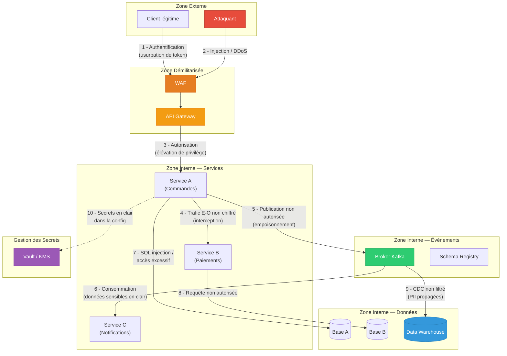
```mermaid
flowchart TB
    subgraph Externe["Zone Externe"]
        ATK["Attaquant"]
        CLI["Client légitime"]
    end

    subgraph DMZ["Zone Démilitarisée"]
        GW["API Gateway"]
        WAF["WAF"]
    end

    subgraph Interne["Zone Interne — Services"]
        direction TB
        SVC_A["Service A<br/>(Commandes)"]
        SVC_B["Service B<br/>(Paiements)"]
        SVC_C["Service C<br/>(Notifications)"]
    end

    subgraph Bus["Zone Interne — Événements"]
        BRK["Broker Kafka"]
        SR["Schema Registry"]
    end

    subgraph Data["Zone Interne — Données"]
        DB_A[("Base A")]
        DB_B[("Base B")]
        DW[("Data Warehouse")]
    end

    subgraph Secrets["Gestion des Secrets"]
        VAULT["Vault / KMS"]
    end

    CLI -->|"1 - Authentification<br/>(usurpation de token)"| WAF
    ATK -->|"2 - Injection / DDoS"| WAF
    WAF --> GW
    GW -->|"3 - Autorisation<br/>(élévation de privilège)"| SVC_A
    SVC_A -->|"4 - Trafic E-O non chiffré<br/>(interception)"| SVC_B
    SVC_A -->|"5 - Publication non autorisée<br/>(empoisonnement)"| BRK
    BRK -->|"6 - Consommation<br/>(données sensibles en clair)"| SVC_C
    SVC_A -->|"7 - SQL injection /<br/>accès excessif"| DB_A
    SVC_B -->|"8 - Requête non autorisée"| DB_B
    BRK -->|"9 - CDC non filtré<br/>(PII propagées)"| DW
    SVC_A -.->|"10 - Secrets en clair<br/>dans la config"| VAULT

    style ATK fill:#e74c3c,color:#fff,stroke:#c0392b
    style GW fill:#f39c12,color:#fff,stroke:#e67e22
    style WAF fill:#e67e22,color:#fff,stroke:#d35400
    style BRK fill:#2ecc71,color:#fff,stroke:#27ae60
    style VAULT fill:#9b59b6,color:#fff,stroke:#8e44ad
    style DW fill:#3498db,color:#fff,stroke:#2980b9
```

Ce diagramme identifie dix vecteurs d'attaque caractéristiques. Les vecteurs 1 à 3 concernent le trafic Nord-Sud (externe vers interne), traditionnellement couvert par les solutions de sécurité périmétrique. Les vecteurs 4 à 6 concernent le trafic Est-Ouest (inter-services et événementiel), souvent moins protégé. Les vecteurs 7 à 9 visent les couches de données et leur propagation. Le vecteur 10 illustre la compromission des secrets. Une stratégie de sécurité complète doit adresser l'ensemble de ces vecteurs, non uniquement les plus visibles.

> **Incident de terrain**
> *Symptôme* : Exfiltration de 2,3 millions d'enregistrements clients sur une période de six semaines, non détectée.
> *Cause racine* : Un service interne de transformation de données, compromis via une dépendance vulnérable (supply chain attack), interceptait les flux transitant par le bus d'événements. Les messages n'étaient pas chiffrés en transit à l'intérieur du réseau interne, car l'architecture reposait sur le modèle de confiance périmétrique. L'absence de monitoring des patterns de consommation a permis à l'exfiltration de se poursuivre sans détection.
> *Solution* : Adoption du chiffrement mTLS pour l'ensemble du trafic inter-services, mise en place de la détection d'anomalies sur les patterns de consommation du broker (un consommateur qui lit tous les topics est suspect), segmentation réseau renforcée, et audit systématique des dépendances logicielles.
> *Leçon* : Le trafic Est-Ouest ne mérite pas moins de protection que le trafic Nord-Sud. La confiance implicite accordée au réseau interne est une dette de sécurité qui finit toujours par être exploitée.

### 12.1.2 Du Périmètre au Zero Trust : Changement de Paradigme

Les limites du modèle périmétrique, mises en évidence par l'analyse précédente, ont conduit l'industrie vers un changement de paradigme fondamental : le modèle Zero Trust. Cette transition n'est pas un simple ajustement technique ; elle représente un renversement philosophique de la posture de sécurité, avec des implications profondes pour la conception des architectures d'intégration.

#### Le modèle périmétrique et ses limites

Le modèle périmétrique — « castle-and-moat » — a longtemps constitué le paradigme dominant de la sécurité des systèmes d'information. Son principe est intuitif : construire une muraille solide (pare-feux, VPN, zones démilitarisées) et considérer que tout ce qui se trouve à l'intérieur de cette muraille est digne de confiance. Les investissements de sécurité se concentrent sur le renforcement du périmètre : filtrage du trafic entrant, détection d'intrusion aux points de passage, authentification à la porte.

Ce modèle a fonctionné raisonnablement bien lorsque les systèmes d'information étaient centralisés dans des centres de données contrôlés, les utilisateurs se connectaient depuis des postes fixes dans des bureaux physiques, et les partenaires externes n'avaient qu'un accès limité et étroitement supervisé. Trois évolutions majeures ont érodé ses fondements au point de le rendre inadéquat pour les architectures d'intégration modernes.

Premièrement, le **cloud computing** a dissous le périmètre physique. Les workloads s'exécutent dans des environnements multi-cloud où la notion de « réseau interne » perd sa signification. Un service déployé sur AWS communique avec un autre sur Azure via un broker Kafka hébergé sur Confluent Cloud. Où se situe le périmètre à protéger ? La réponse — nulle part et partout — invalide la prémisse fondamentale du modèle périmétrique.

Deuxièmement, les **architectures de microservices** ont multiplié les communications internes. Là où un monolithe effectuait des appels de fonction en mémoire, des dizaines de services échangent via le réseau. Le trafic Est-Ouest, autrefois négligeable, dépasse souvent le trafic Nord-Sud en volume. Appliquer le modèle périmétrique à ce trafic interne reviendrait à construire des murailles autour de chaque service — une approche impraticable sans automatisation.

Troisièmement, le **travail à distance** et la **mobilité** ont dispersé les utilisateurs hors du périmètre physique. Les accès VPN, conçus comme des tunnels ponctuels vers le réseau interne, deviennent des conduits permanents qui étendent le périmètre de confiance à des environnements non contrôlés — réseaux domestiques, espaces de coworking, réseaux d'aéroport. Pire, un poste compromis connecté en VPN dispose du même niveau de confiance qu'un poste dans les locaux de l'entreprise.

> **Exemple concret**
> Une entreprise opère une architecture d'intégration hybride : un ERP on-premises expose des APIs via un API Gateway cloud, un broker Kafka sur Confluent Cloud distribue les événements, des services analytiques s'exécutent sur Google Cloud, et des applications mobiles accèdent aux APIs via l'Internet public. Dans ce contexte, le « périmètre » est une fiction topologique — il n'existe aucun point unique où l'on pourrait construire une muraille efficace. Chaque composant doit assurer sa propre protection.

#### Principes du Zero Trust

Le modèle Zero Trust, formalisé par John Kindervag chez Forrester Research en 2010 puis adopté comme architecture de référence par le NIST (Special Publication 800-207, 2020), renverse la posture de confiance. Au lieu de présumer la confiance à l'intérieur du périmètre, il part du principe qu'aucune entité — utilisateur, service, réseau — n'est de confiance par défaut. Chaque accès doit être explicitement vérifié, quelle que soit son origine.

> **Définition formelle**
> **Zero Trust** : Modèle de sécurité fondé sur le principe qu'aucune entité, qu'elle soit interne ou externe au réseau, ne doit être automatiquement considérée comme digne de confiance. Chaque demande d'accès est évaluée indépendamment selon l'identité du demandeur, le contexte de la demande, la sensibilité de la ressource et la posture de sécurité du dispositif. Le modèle se résume dans la maxime « never trust, always verify ».

Quatre principes structurent le modèle Zero Trust dans le contexte des architectures d'intégration.

**La vérification continue.** Chaque requête, chaque appel de service, chaque consommation d'événement fait l'objet d'une vérification d'identité et d'autorisation. Il ne suffit pas de s'authentifier une fois à l'entrée du réseau ; la validité de l'identité et des permissions est réévaluée à chaque interaction. Les tokens à durée de vie courte, la validation continue de la posture du client et les décisions d'accès contextuelles incarnent ce principe. Dans une architecture d'intégration, cela signifie que chaque appel du service A vers le service B est authentifié et autorisé, même si les deux services résident sur le même réseau.

**Le moindre privilège.** Chaque service, chaque utilisateur, chaque agent ne reçoit que les permissions strictement nécessaires à l'accomplissement de sa tâche courante. Un service de notification n'a pas besoin d'accéder aux données financières. Un consommateur d'événements n'a pas besoin de pouvoir publier sur les topics qu'il lit. Un pipeline de données analytiques n'a pas besoin d'accès en écriture aux sources de données opérationnelles. Ce principe, ancien dans la littérature de sécurité, prend une importance accrue dans les architectures distribuées où la granularité des permissions doit suivre la granularité des services.

**La micro-segmentation.** Le réseau est segmenté en zones de confiance minimales, chaque segment n'autorisant que le trafic strictement nécessaire. Au lieu d'un périmètre unique protégeant l'ensemble du réseau interne, chaque service — ou groupe de services — est isolé dans son propre segment. Un attaquant qui compromet un service se trouve confiné dans son segment, incapable de se déplacer latéralement vers d'autres services sans franchir des contrôles supplémentaires. Le rayon d'explosion (blast radius) d'une compromission est ainsi contenu.

**L'inspection et la journalisation systématiques.** Tout le trafic — Nord-Sud comme Est-Ouest — est inspecté, journalisé et analysé. Cette visibilité exhaustive permet la détection d'anomalies, l'investigation d'incidents et l'audit de conformité. Les investissements en observabilité recommandés au chapitre VII trouvent ici une justification sécuritaire directe : les traces distribuées, les métriques de trafic et les journaux d'accès constituent la matière première de la détection d'intrusion et de l'analyse comportementale. Un service qui effectue soudainement des requêtes vers des endpoints inhabituels, ou un consommateur Kafka qui commence à lire des topics auxquels il n'accédait pas précédemment, constituent des signaux d'anomalie que seule une journalisation systématique permet de détecter.

#### Application aux architectures d'intégration

Le Zero Trust trouve dans les architectures d'intégration un terrain d'application naturel. Les composants d'infrastructure étudiés dans les chapitres précédents — API Gateway, Service Mesh, Event Mesh — deviennent les points d'application (Policy Enforcement Points) des politiques Zero Trust.

L'**API Gateway** applique le Zero Trust au trafic Nord-Sud : authentification des clients externes via OAuth 2.0 / OIDC, validation des tokens JWT (signature, expiration, scopes), rate limiting pour prévenir les abus, inspection du contenu des requêtes via un WAF (Web Application Firewall) intégré ou adjacent. Il constitue le premier checkpoint que toute requête externe doit franchir. Mais dans une architecture Zero Trust, l'API Gateway n'est pas le seul checkpoint — il est le premier d'une série.

Le **Service Mesh**, introduit au chapitre VII comme composant de résilience, remplit un rôle dual de sécurité. Il applique le mTLS entre tous les services, garantissant l'authentification mutuelle et le chiffrement du trafic Est-Ouest de manière transparente pour le code applicatif. Il applique des politiques d'autorisation service-à-service (quel service peut appeler quel autre service, sur quels endpoints) sans modifier le code applicatif. Il fournit la journalisation exhaustive du trafic inter-services nécessaire à l'inspection et à la détection d'anomalies.

Le **broker d'événements** applique le Zero Trust aux flux asynchrones : authentification des producteurs et des consommateurs via SASL (Simple Authentication and Security Layer), autorisation par topic et par opération (lecture, écriture, administration) via les ACLs ou des mécanismes d'autorisation externes, chiffrement des messages en transit via TLS et potentiellement au repos via le chiffrement du stockage.

| Caractéristique | Modèle Périmétrique | Modèle Zero Trust |
|---|---|---|
| **Posture de confiance** | Confiance implicite à l'intérieur du périmètre | Aucune confiance implicite |
| **Vérification d'identité** | À l'entrée du réseau (unique) | À chaque requête (continue) |
| **Granularité** | Réseau (zones larges) | Service ou workload individuel |
| **Trafic Est-Ouest** | Généralement non inspecté | Inspecté et autorisé explicitement |
| **Permissions** | Souvent larges par commodité | Moindre privilège systématique |
| **Hypothèse de compromission** | L'intérieur est sûr | Toute entité peut être compromise |
| **Scalabilité cloud** | Difficile (périmètre flou) | Native (identité plutôt que réseau) |
| **Coût d'implémentation** | Initial plus faible | Initial plus élevé, mais TCO comparable |
| **Adapté aux microservices** | Non | Oui |
| **Rayon d'explosion** | Potentiellement illimité en interne | Contenu par la micro-segmentation |

Le diagramme suivant illustre l'architecture Zero Trust appliquée à un écosystème d'intégration, montrant les multiples points d'application des politiques (Policy Enforcement Points) et le rôle central du moteur de décision de politiques :

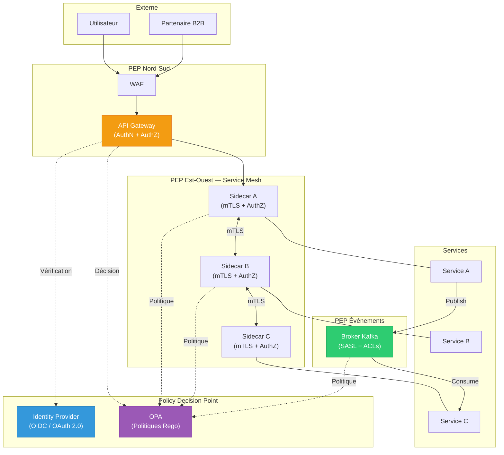
```mermaid
flowchart TB
    subgraph Externe
        USER["Utilisateur"]
        PARTNER["Partenaire B2B"]
    end

    subgraph PEP_NS["PEP Nord-Sud"]
        WAF["WAF"]
        GW["API Gateway<br/>(AuthN + AuthZ)"]
    end

    subgraph PDP["Policy Decision Point"]
        IDP["Identity Provider<br/>(OIDC / OAuth 2.0)"]
        OPA["OPA<br/>(Politiques Rego)"]
    end

    subgraph PEP_EO["PEP Est-Ouest — Service Mesh"]
        direction LR
        MESH_A["Sidecar A<br/>(mTLS + AuthZ)"]
        MESH_B["Sidecar B<br/>(mTLS + AuthZ)"]
        MESH_C["Sidecar C<br/>(mTLS + AuthZ)"]
    end

    subgraph Services
        SVC_A["Service A"]
        SVC_B["Service B"]
        SVC_C["Service C"]
    end

    subgraph PEP_EVT["PEP Événements"]
        BRK["Broker Kafka<br/>(SASL + ACLs)"]
    end

    USER --> WAF --> GW
    PARTNER --> WAF
    GW --> MESH_A
    MESH_A --- SVC_A
    MESH_B --- SVC_B
    MESH_C --- SVC_C
    MESH_A <-->|"mTLS"| MESH_B
    MESH_B <-->|"mTLS"| MESH_C
    SVC_A -->|"Publish"| BRK
    BRK -->|"Consume"| SVC_C

    GW -.->|"Vérification"| IDP
    GW -.->|"Décision"| OPA
    MESH_A -.->|"Politique"| OPA
    MESH_B -.->|"Politique"| OPA
    BRK -.->|"Politique"| OPA

    style IDP fill:#3498db,color:#fff,stroke:#2980b9
    style OPA fill:#9b59b6,color:#fff,stroke:#8e44ad
    style GW fill:#f39c12,color:#fff,stroke:#e67e22
    style BRK fill:#2ecc71,color:#fff,stroke:#27ae60
```

Ce diagramme met en évidence le rôle d'OPA comme point de décision centralisé (Policy Decision Point) consulté par les multiples points d'application (PEP) — API Gateway, sidecars du Service Mesh, broker Kafka. L'Identity Provider émet les identités, OPA prend les décisions d'autorisation, et les PEP appliquent ces décisions. Cette séparation des responsabilités permet de modifier les politiques d'accès sans toucher aux composants d'infrastructure.

> **Perspective stratégique**
> L'adoption du Zero Trust dans une architecture d'intégration n'est pas un basculement binaire. Les organisations procèdent typiquement par étapes successives, chacune réduisant progressivement la surface d'attaque :
>
> 1. **Chiffrement universel** : mTLS pour tout le trafic Est-Ouest via Service Mesh
> 2. **Authentification service-à-service** : chaque appel porte une identité vérifiable
> 3. **Autorisation explicite** : politiques d'accès service-à-service et topic-à-consommateur
> 4. **Micro-segmentation réseau** : isolation des services en segments dédiés
> 5. **Inspection comportementale** : détection d'anomalies basée sur les patterns de trafic
>
> L'erreur serait de considérer le Zero Trust comme un projet ponctuel avec une date de fin plutôt que comme un cheminement continu d'amélioration de la posture de sécurité.

### 12.1.3 Modèle de Menaces pour les Architectures d'Intégration

L'identification des surfaces d'attaque et l'adoption du Zero Trust fournissent un cadre général. Pour le rendre actionnable, l'architecte d'intégration doit construire un modèle de menaces spécifique à son contexte. La méthodologie STRIDE, développée par Microsoft, offre un cadre structuré qui s'applique particulièrement bien aux flux d'intégration.

#### La méthodologie STRIDE

STRIDE est un acronyme qui identifie six catégories de menaces couvrant l'ensemble du spectre des attaques sur un système d'information. Chaque catégorie correspond à la violation d'une propriété de sécurité fondamentale.

Le **Spoofing** (usurpation d'identité) viole la propriété d'**authentification**. Il désigne la capacité d'un attaquant à se faire passer pour une entité légitime — un utilisateur, un service, un agent. Dans le contexte de l'intégration, cela peut se manifester par l'utilisation d'un token JWT volé pour invoquer une API, l'usurpation de l'identité d'un service producteur pour publier des événements frauduleux sur un topic Kafka, ou la compromission d'un certificat pour établir une connexion mTLS illégitime. La contremesure primaire est l'authentification forte — mTLS pour les services, OAuth 2.0 / OIDC pour les utilisateurs, tokens signés et à durée de vie courte.

Le **Tampering** (altération) viole la propriété d'**intégrité**. Il concerne la modification non autorisée des données en transit ou au repos. Un attaquant positionnant un proxy malveillant entre deux services peut altérer les requêtes ou les réponses (attaque man-in-the-middle). Des événements dans un topic Kafka pourraient être modifiés si le broker n'applique pas de contrôles d'intégrité. Des données dans un pipeline de transformation pourraient être corrompues par un composant compromis. La contremesure primaire est le chiffrement en transit (TLS/mTLS), les signatures cryptographiques des messages et les checksums de validation.

La **Repudiation** (répudiation) viole la propriété de **non-répudiation**. Elle désigne la possibilité pour un acteur de nier avoir effectué une action. Sans journalisation adéquate, un service pourrait invoquer une API critique sans que cette invocation soit traçable. Un agent autonome pourrait prendre des décisions dont l'origine et le raisonnement ne seraient pas reconstituables. La non-répudiation exige des mécanismes de journalisation infalsifiables et horodatés — les audit logs immuables, les traces distribuées corrélées et les signatures numériques des transactions critiques.

L'**Information Disclosure** (divulgation d'information) viole la propriété de **confidentialité**. Elle couvre l'exposition non autorisée de données sensibles. Les messages d'erreur trop détaillés exposent la structure interne du système (stack traces, noms de tables, chemins de fichiers). Les événements qui transportent des données personnelles en clair dans des topics accessibles à de nombreux consommateurs violent le principe de minimisation des données. Les logs qui enregistrent les corps des requêtes contenant des informations financières créent des copies non contrôlées de données sensibles. La contremesure combine le chiffrement, le masquage des données sensibles, le contrôle d'accès aux logs et la classification des informations.

Le **Denial of Service** (déni de service) viole la propriété de **disponibilité**. Il vise à rendre un système indisponible. Dans une architecture d'intégration, un attaquant peut saturer un API Gateway par un volume massif de requêtes (DDoS), inonder un topic Kafka pour épuiser l'espace de stockage du broker, provoquer l'ouverture des Circuit Breakers par des requêtes malveillantes ciblées (isolant ainsi un service critique de ses dépendances), ou exploiter des requêtes coûteuses pour épuiser les ressources d'un service (ReDoS, requêtes SQL complexes). La contremesure combine le rate limiting, le quotas par client, les Circuit Breakers (chapitre VII), l'auto-scaling et la validation des entrées.

L'**Elevation of Privilege** (élévation de privilège) viole la propriété d'**autorisation**. Elle permet à un attaquant d'obtenir des permissions supérieures à celles qui lui ont été accordées. Un consommateur d'événements qui exploite une faille de configuration du broker pour accéder à des topics protégés, un service qui obtient un token avec des scopes excessifs par manipulation du flux d'autorisation, ou un agent autonome qui contourne ses garde-fous pour exécuter des actions non autorisées illustrent cette catégorie. La contremesure est l'application systématique du moindre privilège, la validation des scopes à chaque point d'accès et l'audit régulier des permissions.

#### Application STRIDE aux domaines d'intégration

L'application systématique de STRIDE aux trois domaines d'intégration — applications, données, événements — produit une matrice de menaces qui guide la priorisation des mesures de protection. Cette matrice constitue un outil de travail pour l'architecte d'intégration lors des exercices de threat modeling.

| Menace STRIDE | Applications (le Verbe) | Données (le Nom) | Événements (le Signal) |
|---|---|---|---|
| **Spoofing** | Usurpation de token JWT pour invoquer des APIs ; API key compromise ; client malveillant imitant un client légitime | Accès à une base de données avec des identifiants volés ; usurpation de service CDC ; connexion JDBC non authentifiée | Publication d'événements sous une identité de producteur falsifiée ; consommateur usurpant un group-id |
| **Tampering** | Modification de requêtes/réponses via proxy MITM ; injection de paramètres ; altération de headers HTTP | Corruption de données dans le pipeline ETL ; altération de schémas dans le Registry ; modification de données via SQL injection | Modification de messages en transit ; empoisonnement de topics ; altération d'offsets de consommation |
| **Repudiation** | Invocation d'API sans trace d'audit ; absence de corrélation dans les appels chaînés ; pas de logging des mutations | Modification de données sans journalisation de l'auteur ni du contexte ; requêtes DDL non tracées | Consommation ou publication d'événements sans traçabilité ; suppression de messages sans audit |
| **Info. Disclosure** | Messages d'erreur exposant la structure interne ; réponses contenant des données excessives ; endpoints de debug exposés | Données sensibles dans les vues matérialisées non masquées ; logs de requêtes SQL ; backups non chiffrés | Événements contenant des PII en clair ; topics sans contrôle d'accès en lecture ; Schema Registry exposant la structure des données |
| **Denial of Service** | Saturation de l'API Gateway ; épuisement des pools de connexion ; requêtes coûteuses (ReDoS) | Requêtes analytiques massives paralysant les sources ; saturation du CDC ; lock contention sur les bases | Inondation de topics ; épuisement du stockage broker ; consumer lag artificiel ; partitions déséquilibrées |
| **Elev. of Privilege** | Exploitation de failles d'autorisation (BOLA, BFLA) pour accéder à des endpoints protégés | Escalade d'accès dans la couche de données via SQL injection ou misconfiguration ; accès DBA via un compte applicatif | Accès non autorisé à des topics protégés ; modification des ACLs du broker ; accès admin au cluster |

Cette matrice n'est pas exhaustive — chaque architecture spécifique engendre des menaces propres — mais elle constitue un point de départ structuré pour l'analyse de risque. L'architecte d'intégration peut l'utiliser comme checklist lors de la conception de nouveaux flux, en vérifiant que chaque cellule de la matrice est couverte par une mesure de protection adéquate.

#### Modèle de menaces d'un flux d'intégration typique

Le diagramme suivant illustre un modèle de menaces appliqué à un flux d'intégration traversant les trois domaines. Chaque point de franchissement de frontière — matérialisé par une **trust boundary** (frontière de confiance) — fait l'objet d'une analyse STRIDE.

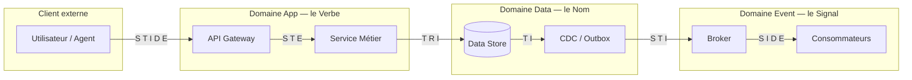
```mermaid
flowchart LR
    subgraph Client["Client externe"]
        U["Utilisateur / Agent"]
    end

    subgraph Domaine_App["Domaine App — le Verbe"]
        GW["API Gateway"]
        SVC["Service Métier"]
    end

    subgraph Domaine_Data["Domaine Data — le Nom"]
        CDC["CDC / Outbox"]
        STORE[("Data Store")]
    end

    subgraph Domaine_Event["Domaine Event — le Signal"]
        BRK["Broker"]
        CONS["Consommateurs"]
    end

    U -->|"S T I D E"| GW
    GW -->|"S T E"| SVC
    SVC -->|"T R I"| STORE
    STORE -->|"T I"| CDC
    CDC -->|"S T I"| BRK
    BRK -->|"S I D E"| CONS

    classDef threat fill:#e74c3c,color:#fff,stroke:#c0392b
    classDef safe fill:#2ecc71,color:#fff,stroke:#27ae60
```

Dans ce diagramme, les lettres sur chaque arc représentent les catégories STRIDE pertinentes : **S** (Spoofing), **T** (Tampering), **R** (Repudiation), **I** (Information Disclosure), **D** (Denial of Service), **E** (Elevation of Privilege). L'arc Client → API Gateway cumule cinq catégories, reflétant la richesse de la surface d'attaque au point d'entrée externe. L'arc Service → Data Store présente des risques d'altération (injection SQL), de répudiation (modification sans audit) et de divulgation (données sensibles accessibles). L'arc CDC → Broker présente des risques d'usurpation (un composant malveillant se substituant au CDC), d'altération (modification des événements émis) et de divulgation (données sensibles capturées par le processus CDC et propagées dans le flux événementiel).

#### Processus de threat modeling pour les flux d'intégration

La construction d'un modèle de menaces n'est pas un exercice académique ponctuel mais un processus opérationnel itératif qui doit s'intégrer au cycle de vie du développement.

> **Configuration recommandée**
> Pour chaque nouveau flux d'intégration, conduire un exercice de threat modeling structuré :
>
> 1. **Cartographier** : Dessiner le diagramme de flux de données (DFD) du bout en bout, incluant tous les composants traversés, les stockages intermédiaires et les acteurs
> 2. **Identifier les frontières** : Marquer les trust boundaries — les points où le niveau de confiance change (externe/interne, service/base de données, producteur/broker)
> 3. **Appliquer STRIDE** : Pour chaque franchissement de frontière, évaluer les six catégories de menaces et identifier les menaces spécifiques au contexte
> 4. **Évaluer le risque** : Pour chaque menace identifiée, évaluer le risque (probabilité x impact) en considérant les contrôles existants
> 5. **Définir les mitigations** : Pour les risques au-dessus du seuil acceptable, définir des mesures de mitigation concrètes avec des responsables et des échéances
> 6. **Documenter les acceptations** : Pour les risques acceptés, documenter explicitement la justification, le propriétaire du risque et les conditions de réévaluation
> 7. **Itérer** : Réviser le modèle lors de chaque changement significatif du flux — ajout d'un consommateur, modification d'un schéma, changement de fournisseur
>
> Cet exercice ne doit pas être un événement ponctuel mais un processus vivant, intégré aux revues d'architecture et aux processus de changement.

---

## 12.2 Identité et Contrôle d'Accès

Si la section précédente a cartographié le paysage des menaces, la présente section aborde le premier et le plus fondamental des mécanismes de défense : l'identité. Savoir qui — ou quoi — effectue une action est le prérequis de toute décision d'autorisation. Sans identité vérifiable, les principes du Zero Trust — vérification continue, moindre privilège, micro-segmentation — ne peuvent être appliqués.

Dans un monolithe, cette question trouve une réponse relativement simple : un utilisateur s'authentifie via un formulaire de login, et sa session HTTP porte son identité à travers les requêtes successives. Le serveur d'application maintient l'état de session en mémoire ou dans un store partagé, et chaque requête est associée à l'utilisateur qui l'a initiée. Dans une architecture d'intégration distribuée, la question se fragmente en de multiples facettes : comment fédérer l'identité à travers des systèmes hétérogènes ? Comment authentifier un service qui invoque un autre service ? Comment un broker d'événements vérifie-t-il que le producteur est légitime ? Comment autoriser finement les actions dans un contexte où les rôles traditionnels ne suffisent plus ? Comment les agents autonomes, présentés au chapitre XI, s'identifient-ils dans cet écosystème ?

### 12.2.1 Fédération d'Identité et Standards (OAuth 2.0, OIDC, SAML)

#### Le problème de l'identité dans les systèmes distribués

Dans un écosystème d'entreprise composé de dizaines de systèmes, la gestion des identités se heurte à un défi fondamental : chaque système a historiquement développé son propre mécanisme d'authentification. L'ERP utilise un annuaire LDAP. Le CRM s'appuie sur son propre registre d'utilisateurs. L'application web utilise un formulaire de login avec stockage local des mots de passe. Le système de gestion documentaire authentifie via Active Directory. Les partenaires externes disposent de comptes dédiés sur chaque système auquel ils doivent accéder.

Cette fragmentation engendre des problèmes opérationnels et sécuritaires considérables. Les utilisateurs doivent mémoriser — ou, plus fréquemment, réutiliser — des mots de passe multiples, chaque réutilisation amplifiant le risque qu'une compromission sur un système en affecte d'autres. La désactivation d'un compte lors d'un départ d'employé nécessite une intervention manuelle sur chaque système ; un oubli laisse un « compte orphelin » exploitable. Les politiques de sécurité (complexité des mots de passe, authentification multifacteur, verrouillage après tentatives échouées) doivent être dupliquées et maintenues en cohérence à travers tous les systèmes — une cohérence rarement atteinte en pratique. L'audit des accès exige la corrélation de journaux provenant de sources hétérogènes avec des formats et des identifiants différents, rendant l'investigation d'incidents considérablement plus laborieuse.

> **Incident de terrain**
> *Symptôme* : Accès non autorisé aux données financières de l'entreprise pendant trois mois après le départ d'un employé.
> *Cause racine* : Le processus de départ désactivait le compte dans l'annuaire Active Directory (SSO principal) mais pas les comptes locaux créés sur quatre systèmes intégrés qui géraient leur propre authentification. L'ancien employé continuait d'accéder à ces systèmes via leurs interfaces propres.
> *Solution* : Migration vers une fédération d'identité centralisée (OIDC) pour l'ensemble des systèmes, avec désactivation automatique cascadée depuis l'IdP central. Audit complet des comptes locaux résiduels.
> *Leçon* : La fragmentation des identités n'est pas seulement un inconvénient opérationnel — c'est un risque de sécurité structurel.

La **fédération d'identité** résout ce problème en centralisant l'émission des identités et en standardisant leur vérification. Un fournisseur d'identité (Identity Provider, IdP) unique authentifie les utilisateurs et émet des attestations que les applications — devenues des parties de confiance (Relying Parties) — acceptent comme preuve d'identité. Cette délégation de l'authentification à un tiers de confiance est le fondement des trois standards examinés ci-dessous.

> **Définition formelle**
> **Fédération d'identité** : Mécanisme par lequel un ensemble de systèmes indépendants acceptent les attestations d'identité émises par un fournisseur d'identité commun, permettant l'authentification unique (SSO) et la gestion centralisée des identités à travers les frontières organisationnelles et techniques.

#### OAuth 2.0 : framework d'autorisation

OAuth 2.0 (RFC 6749) est un framework d'autorisation qui permet à une application d'accéder à des ressources protégées au nom d'un utilisateur, sans que celui-ci ait à partager ses identifiants avec l'application. Contrairement à une idée répandue, OAuth 2.0 n'est pas un protocole d'authentification — il ne définit pas comment vérifier l'identité d'un utilisateur, mais comment déléguer l'accès à des ressources. Cette distinction est cruciale : utiliser OAuth 2.0 seul pour l'authentification (sans OIDC) conduit à des vulnérabilités connues.

Le modèle OAuth 2.0 implique quatre rôles. Le **Resource Owner** (propriétaire de la ressource) est l'entité — généralement un utilisateur — qui autorise l'accès à ses données. Le **Client** est l'application qui souhaite accéder aux ressources pour le compte du propriétaire. Le **Resource Server** (serveur de ressources) héberge les ressources protégées et les expose via une API. L'**Authorization Server** (serveur d'autorisation) authentifie le propriétaire et émet des tokens d'accès au client.

Deux flux d'autorisation sont particulièrement pertinents pour les architectures d'intégration.

Le **flux Authorization Code** (avec PKCE) est le flux recommandé pour les applications web et mobiles interagissant au nom d'un utilisateur. Le client redirige l'utilisateur vers le serveur d'autorisation, qui l'authentifie et recueille son consentement. Le serveur d'autorisation redirige l'utilisateur vers le client avec un code d'autorisation éphémère. Le client échange ce code contre un token d'accès (et éventuellement un refresh token) via un appel back-channel sécurisé. Ce flux, combiné avec l'extension PKCE (Proof Key for Code Exchange, RFC 7636), offre une protection robuste contre l'interception du code d'autorisation — une vulnérabilité particulièrement critique pour les applications mobiles et les SPA (Single Page Applications).

Le **flux Client Credentials** est conçu pour les communications service-à-service, sans implication d'un utilisateur humain. Le service client s'authentifie directement auprès du serveur d'autorisation avec ses propres identifiants (client_id et client_secret, ou un certificat client) et reçoit un token d'accès. Ce flux est le mécanisme standard pour l'authentification machine-to-machine dans les architectures de microservices. Sa simplicité en fait le choix naturel pour les appels inter-services, mais elle exige une gestion rigoureuse des secrets client.

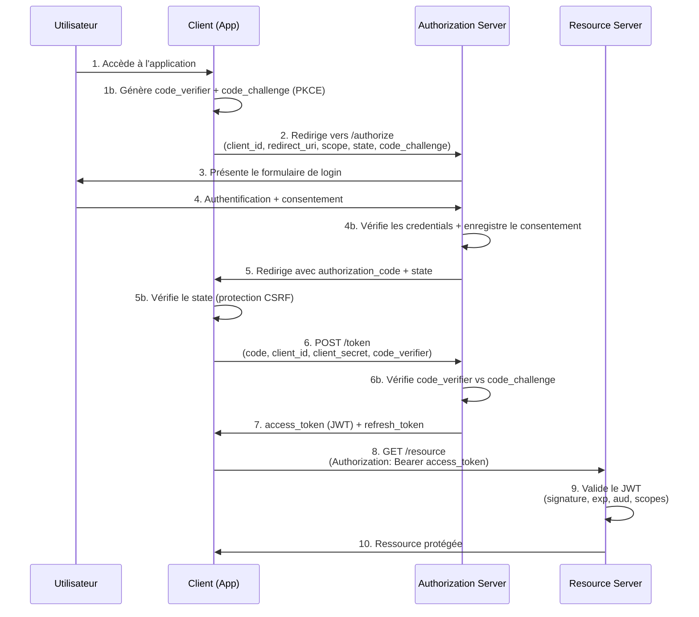
```mermaid
sequenceDiagram
    participant U as Utilisateur
    participant C as Client (App)
    participant AS as Authorization Server
    participant RS as Resource Server

    U->>C: 1. Accède à l'application
    C->>C: 1b. Génère code_verifier + code_challenge (PKCE)
    C->>AS: 2. Redirige vers /authorize<br/>(client_id, redirect_uri, scope, state, code_challenge)
    AS->>U: 3. Présente le formulaire de login
    U->>AS: 4. Authentification + consentement
    AS->>AS: 4b. Vérifie les credentials + enregistre le consentement
    AS->>C: 5. Redirige avec authorization_code + state
    C->>C: 5b. Vérifie le state (protection CSRF)
    C->>AS: 6. POST /token<br/>(code, client_id, client_secret, code_verifier)
    AS->>AS: 6b. Vérifie code_verifier vs code_challenge
    AS->>C: 7. access_token (JWT) + refresh_token
    C->>RS: 8. GET /resource<br/>(Authorization: Bearer access_token)
    RS->>RS: 9. Valide le JWT<br/>(signature, exp, aud, scopes)
    RS->>C: 10. Ressource protégée
```

Les tokens émis par OAuth 2.0 sont typiquement des JWT (JSON Web Tokens, RFC 7519) signés cryptographiquement. Ils contiennent des claims (assertions) sur le sujet authentifié, les scopes accordés, la date d'émission et la date d'expiration. Le serveur de ressources valide le token en vérifiant la signature (via la clé publique du serveur d'autorisation, obtenue par le endpoint JWKS), l'expiration et les scopes requis, sans nécessiter un appel au serveur d'autorisation — ce qui est crucial pour les performances dans les architectures à fort volume.

L'exemple suivant illustre le payload décodé d'un access token JWT typique dans un contexte d'intégration inter-services :

```json
{
  "iss": "https://auth.example.com",
  "sub": "order-service",
  "aud": ["payment-service", "inventory-service"],
  "exp": 1708272000,
  "iat": 1708271100,
  "scope": "payments:read payments:create inventory:read",
  "client_id": "order-service-prod",
  "jti": "a1b2c3d4-e5f6-7890-abcd-ef1234567890",
  "tenant": "acme-corp",
  "env": "production"
}
```

Dans ce token, le claim `iss` identifie le serveur d'autorisation émetteur, `sub` identifie le service client, `aud` restreint les services qui doivent accepter ce token (un token destiné au service de paiement ne devrait pas être accepté par le service de reporting), et `scope` définit les permissions accordées. Le claim `jti` (JWT ID) fournit un identifiant unique qui permet la détection de rejeu et l'audit. Les claims personnalisés `tenant` et `env` enrichissent le contexte pour les décisions d'autorisation fines.

> **Configuration recommandée**
> Bonnes pratiques pour les tokens JWT en contexte d'intégration :
>
> * **Durée de vie courte** : access tokens de 5 à 15 minutes maximum ; refresh tokens de quelques heures avec rotation
> * **Scopes précis** : préférer `orders:read` et `orders:write` à un scope générique `orders` ; le scope doit refléter l'action autorisée
> * **Audience (aud) vérifiée** : chaque resource server doit vérifier que le token lui est destiné, pas simplement qu'il est valide
> * **Algorithme de signature fort** : RS256 ou ES256 (asymétrique) ; éviter HS256 (symétrique) en production sauf si le secret est strictement confiné
> * **Pas de données sensibles dans le payload** : les JWT sont signés, pas chiffrés ; le payload est lisible par quiconque possède le token

#### OpenID Connect : couche d'identité sur OAuth 2.0

OpenID Connect (OIDC) étend OAuth 2.0 en ajoutant une couche d'identité standardisée. Là où OAuth 2.0 répond à « cette application est-elle autorisée à accéder à cette ressource ? », OIDC répond à « qui est l'utilisateur ? ». Cette distinction peut sembler subtile, mais elle est fondamentale : une application qui reçoit un access token OAuth 2.0 sait quelles permissions ont été accordées, mais pas nécessairement qui les a accordées.

OIDC introduit le concept d'**ID Token**, un JWT qui contient des claims d'identité standardisées : le sujet (sub — identifiant unique de l'utilisateur), le nom (name), l'email (email), la date d'émission (iat), l'audience (aud — l'application destinataire), et l'émetteur (iss — le fournisseur OIDC). Ce token est émis en complément de l'access token OAuth 2.0 et permet au client de connaître l'identité de l'utilisateur de manière fiable et standardisée.

OIDC définit également un endpoint **UserInfo** qui retourne des informations détaillées sur l'utilisateur authentifié (adresse, numéro de téléphone, photo, etc.), et un mécanisme de **discovery** qui permet au client de découvrir automatiquement les endpoints du fournisseur OIDC via un document JSON bien connu (`.well-known/openid-configuration`). Cette capacité de découverte est particulièrement précieuse dans les architectures d'intégration où de nouveaux services doivent s'intégrer au système d'identité de manière autonome, sans configuration manuelle des URLs d'endpoints.

#### SAML : fédération enterprise legacy

Security Assertion Markup Language (SAML 2.0) est un standard XML de fédération d'identité qui prédate OAuth 2.0 et OIDC. Il est largement déployé dans les écosystèmes enterprise, notamment pour le Single Sign-On (SSO) entre applications web et les fournisseurs d'identité d'entreprise (Active Directory Federation Services, Okta, Ping Identity, Azure AD).

SAML définit trois rôles : le **Principal** (l'utilisateur), l'**Identity Provider** (IdP, qui authentifie) et le **Service Provider** (SP, l'application qui consomme l'assertion). Le flux SSO typique commence lorsqu'un utilisateur tente d'accéder à un Service Provider. Ce dernier redirige l'utilisateur vers l'IdP, qui l'authentifie (ou reconnaît une session existante) et retourne une assertion SAML signée au SP via le navigateur (HTTP POST Binding). Cette assertion contient les attributs de l'utilisateur (nom, email, rôles) et est validée par le SP via la clé publique de l'IdP.

Malgré sa maturité et son adoption étendue dans les systèmes enterprise existants, SAML présente des limitations significatives pour les architectures d'intégration modernes. Son format XML est verbeux comparé aux tokens JWT. Il est conçu principalement pour les interactions navigateur (SSO web) et s'adapte mal aux communications service-à-service ou aux applications mobiles. Son protocole de binding HTTP POST/Redirect est inadapté aux APIs REST. En pratique, SAML coexiste avec OIDC dans les architectures d'intégration : SAML pour les applications enterprise legacy qui ne supportent pas OIDC, OIDC pour les nouvelles applications et les APIs.

#### Comparaison des standards

| Critère | OAuth 2.0 | OpenID Connect | SAML 2.0 |
|---|---|---|---|
| **Fonction principale** | Autorisation (accès délégué) | Authentification + autorisation | Fédération d'identité (SSO) |
| **Format des tokens** | JWT (typiquement) | JWT (ID Token) | Assertion XML signée |
| **Transport** | HTTP/REST (JSON) | HTTP/REST (JSON) | HTTP POST/Redirect (XML) |
| **Service-à-service** | Oui (Client Credentials) | Non (orienté utilisateur) | Non |
| **API friendly** | Oui | Oui | Limité |
| **Applications mobiles** | Oui (avec PKCE) | Oui (avec PKCE) | Non |
| **Découverte** | Non natif | Oui (.well-known) | Oui (metadata XML) |
| **Adoption** | Universelle | Très large | Legacy enterprise |
| **Complexité** | Moyenne | Moyenne (surcouche OAuth) | Élevée (XML, bindings, metadata) |
| **Cas d'usage principal** | APIs, mobile, SPA, M2M | SSO web + mobile, identité | SSO enterprise, B2B legacy |

> **Configuration recommandée**
> Pour une architecture d'intégration moderne :
>
> * Utiliser **OIDC** pour l'authentification des utilisateurs humains et le SSO entre applications web et mobiles
> * Utiliser **OAuth 2.0 Client Credentials** pour l'authentification service-à-service dans les flux d'intégration
> * Maintenir **SAML 2.0** pour l'intégration avec les systèmes enterprise legacy qui ne supportent pas OIDC, en planifiant une migration progressive
> * Centraliser l'émission et la gestion des tokens dans un serveur d'autorisation unique (ou un nombre minimal), évitant la prolifération d'IdP qui recréerait le problème initial de fragmentation
> * Implémenter le **Token Exchange** (RFC 8693) pour les scénarios où un service intermédiaire doit propager l'identité de l'utilisateur vers un service en aval sans réutiliser le token original

### 12.2.2 Identité Machine et Service-à-Service (mTLS, SPIFFE/SPIRE)

Les standards examinés dans la section précédente répondent principalement au besoin d'identification des utilisateurs humains. Toutefois, dans une architecture de microservices, la majorité du trafic est machine-to-machine : un service invoque un autre service, un pipeline de données accède à une source, un consommateur d'événements se connecte à un broker, un job batch interroge une API interne. Ces entités machines requièrent leur propre système d'identité, distinct et complémentaire de l'identité humaine.

#### La distinction identité humaine vs identité machine

L'identité humaine s'appuie sur des facteurs d'authentification interactifs : un mot de passe que l'utilisateur connaît (facteur de connaissance), un appareil qu'il possède (facteur de possession), une empreinte biométrique qui le caractérise (facteur d'inhérence). L'identité machine ne dispose pas de ces facteurs. Un conteneur Kubernetes ne peut pas saisir un mot de passe, et il serait imprudent de stocker un secret statique dans son image — le secret serait exposé dans le registry de conteneurs et dans toutes les instances déployées à partir de cette image. De plus, les conteneurs sont éphémères par nature : ils naissent et meurent au gré de l'autoscaling, ce qui invalide les approches d'identité liées à une instance spécifique.

L'identité machine doit répondre à des exigences spécifiques qui diffèrent profondément de l'identité humaine. Elle doit être **automatiquement provisionnée** lors du déploiement du workload, sans intervention manuelle. Elle doit être **éphémère**, avec une durée de vie courte pour limiter l'impact d'une compromission — un certificat qui expire en une heure est moins dangereux qu'un secret statique qui ne change jamais. Elle doit être **indépendante de l'environnement** — un service déployé sur Kubernetes, sur une VM bare-metal, ou sur un FaaS doit pouvoir obtenir une identité de manière uniforme. Elle doit permettre l'**authentification mutuelle** — le client vérifie le serveur, et le serveur vérifie le client — car dans une architecture Zero Trust, aucune des deux parties ne fait confiance à l'autre a priori.

#### mTLS : authentification mutuelle par certificats

Le protocole mTLS (mutual TLS) étend le protocole TLS standard en exigeant que les deux parties d'une connexion présentent un certificat. Dans le TLS classique (unidirectionnel), seul le serveur présente un certificat que le client vérifie — le client prouve son identité de l'utilisateur par d'autres moyens (session cookie, token Bearer). En mTLS (bidirectionnel), le client présente également un certificat que le serveur vérifie, réalisant ainsi une authentification mutuelle au niveau transport.

Le fonctionnement est le suivant. Lors de l'établissement de la connexion TLS (handshake), le serveur envoie son certificat au client et demande un certificat client (via le message `CertificateRequest`). Le client vérifie le certificat du serveur (chaîne de confiance, date de validité, correspondance du nom d'hôte) et envoie son propre certificat. Le serveur vérifie le certificat du client (chaîne de confiance, date de validité, identité). Si les deux vérifications réussissent, la connexion chiffrée est établie avec authentification mutuelle. L'identité des deux parties est alors cryptographiquement garantie pour toute la durée de la connexion.

Le mTLS offre plusieurs avantages pour les architectures d'intégration. Le chiffrement du trafic et l'authentification sont réalisés au niveau transport, de manière transparente pour le code applicatif — le service ne voit qu'une connexion HTTP classique, la couche TLS gérant la cryptographie. L'identité est cryptographiquement vérifiable — falsifier un certificat signé par une autorité de confiance est computationnellement infaisable avec les algorithmes modernes. La rotation des certificats peut être automatisée pour maintenir des durées de vie courtes, limitant la fenêtre d'exploitation d'un certificat compromis.

Cependant, la gestion des certificats à grande échelle constitue un défi opérationnel significatif. Chaque service a besoin d'un certificat et de sa clé privée. Les certificats doivent être émis par une autorité de certification (CA) de confiance, renouvelés avant expiration (en évitant les interruptions de service lors du renouvellement) et révoqués en cas de compromission (ce qui nécessite des mécanismes de vérification de révocation performants). Dans une architecture de centaines de services avec des instances éphémères, cette gestion manuelle devient impraticable. C'est précisément le problème que SPIFFE et SPIRE résolvent.

#### SPIFFE : framework d'identité pour workloads

SPIFFE (Secure Production Identity Framework for Everyone) est un ensemble de standards ouverts, incubé par la Cloud Native Computing Foundation (CNCF), qui résout le problème de l'identité des workloads de manière portable et automatisée. SPIFFE a été conçu spécifiquement pour les environnements cloud-native où les workloads sont éphémères, hétérogènes et distribués.

SPIFFE définit trois concepts fondamentaux. Le **SPIFFE ID** est un URI qui identifie de manière unique un workload dans un domaine de confiance. Sa forme canonique est `spiffe://trust-domain/path`, par exemple `spiffe://production.example.com/service/order-service`. Le trust domain identifie l'autorité de confiance (typiquement une organisation ou un environnement), et le path identifie le workload dans ce domaine. Cette convention fournit un nommage uniforme indépendant de la plateforme d'exécution — le même service a le même SPIFFE ID qu'il s'exécute sur Kubernetes, sur une VM ou dans un conteneur Docker.

Le **SVID** (SPIFFE Verifiable Identity Document) est le document qui atteste de l'identité d'un workload. Il existe sous deux formes : un certificat X.509 (X509-SVID) pour mTLS, ou un token JWT (JWT-SVID) pour les contextes où TLS n'est pas applicable (par exemple, les en-têtes HTTP dans un proxy de niveau 7). Le SVID est émis par l'autorité SPIFFE et a une durée de vie courte — typiquement quelques minutes à quelques heures — ce qui limite drastiquement l'impact d'une compromission : un SVID volé est inutilisable après son expiration.

Le **Workload API** est l'interface locale par laquelle un workload obtient son SVID. Le workload contacte un socket Unix local (pas de réseau, pas de secret à stocker) pour obtenir son certificat et sa clé privée. Cette approche élimine le besoin de stocker des secrets dans la configuration ou les variables d'environnement du workload — un avantage critique car les secrets dans les variables d'environnement sont visibles dans les dumps de processus, les logs de crash et les interfaces d'orchestration.

> **Définition formelle**
> **SPIFFE** : Framework standardisé d'identité pour les workloads (charges de travail) en production. Il fournit un identifiant universel (SPIFFE ID), un mécanisme d'attestation vérifiable (SVID) et une API locale pour l'obtention automatique des identités, indépendamment de la plateforme d'exécution. SPIFFE résout le problème du « secret zéro » — comment un workload obtient-il son premier credential — par l'attestation de la plateforme plutôt que par la distribution de secrets.

#### SPIRE : implémentation de référence

SPIRE (SPIFFE Runtime Environment) est l'implémentation de référence de SPIFFE, également incubée par la CNCF. Il se compose de deux composants principaux opérant en tandem.

Le **SPIRE Server** gère le registre des workloads et les politiques d'attestation. Il maintient les clés de signature racine et émet les SVIDs. Il opère comme l'autorité de confiance du trust domain. Le Server ne distribue pas les SVIDs directement aux workloads — il les émet aux Agents, qui les relaient localement.

Le **SPIRE Agent** s'exécute sur chaque noeud (machine, VM, noeud Kubernetes) et sert les identités aux workloads locaux via le Workload API (socket Unix). L'Agent effectue deux niveaux d'attestation. L'**attestation du noeud** vérifie que le noeud physique ou virtuel est légitime — sur AWS, via l'instance identity document ; sur Kubernetes, via le service account du noeud. L'**attestation du workload** vérifie que le processus demandeur correspond à un workload enregistré — sur Kubernetes, via le namespace, le service account et les labels du pod ; sur Linux, via le PID et les propriétés du processus.

Le processus d'attestation est le mécanisme clé qui résout le problème du « secret zéro ». Plutôt que de distribuer des secrets aux workloads (ce qui créerait un problème de poule et d'oeuf — comment transmettre le premier secret de manière sécurisée ?), SPIRE interroge la plateforme d'exécution pour vérifier l'identité du demandeur. La plateforme elle-même (Kubernetes, AWS, GCP) sert de témoin de confiance. Cette attestation par la plateforme est le fondement de l'identité machine automatisée.

Le diagramme suivant illustre le flux d'attestation SPIRE pour un workload déployé sur Kubernetes :

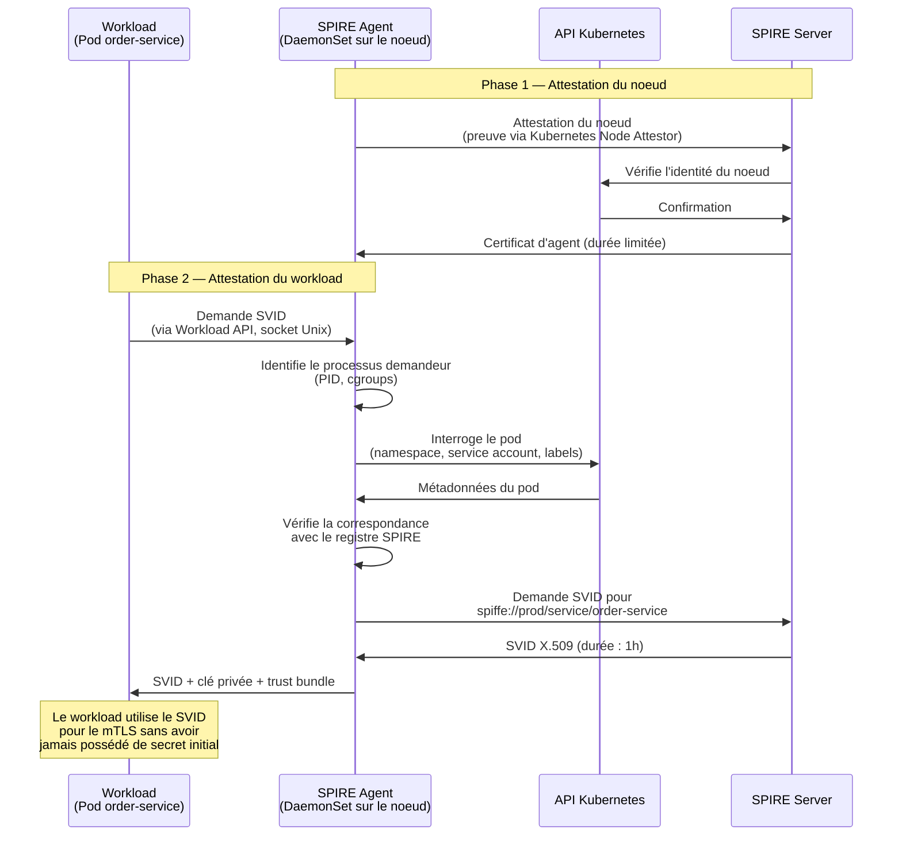
```mermaid
sequenceDiagram
    participant WL as Workload<br/>(Pod order-service)
    participant AG as SPIRE Agent<br/>(DaemonSet sur le noeud)
    participant K8S as API Kubernetes
    participant SRV as SPIRE Server

    Note over AG,SRV: Phase 1 — Attestation du noeud
    AG->>SRV: Attestation du noeud<br/>(preuve via Kubernetes Node Attestor)
    SRV->>K8S: Vérifie l'identité du noeud
    K8S->>SRV: Confirmation
    SRV->>AG: Certificat d'agent (durée limitée)

    Note over WL,AG: Phase 2 — Attestation du workload
    WL->>AG: Demande SVID<br/>(via Workload API, socket Unix)
    AG->>AG: Identifie le processus demandeur<br/>(PID, cgroups)
    AG->>K8S: Interroge le pod<br/>(namespace, service account, labels)
    K8S->>AG: Métadonnées du pod
    AG->>AG: Vérifie la correspondance<br/>avec le registre SPIRE
    AG->>SRV: Demande SVID pour<br/>spiffe://prod/service/order-service
    SRV->>AG: SVID X.509 (durée : 1h)
    AG->>WL: SVID + clé privée + trust bundle

    Note over WL: Le workload utilise le SVID<br/>pour le mTLS sans avoir<br/>jamais possédé de secret initial
```

Ce flux illustre comment SPIRE élimine le problème du « secret zéro ». Le workload n'a besoin d'aucun secret pré-provisionné — il contacte simplement le socket Unix local du SPIRE Agent. L'Agent vérifie l'identité du workload en interrogeant la plateforme Kubernetes (namespace, service account, labels du pod), puis obtient un SVID du Server. L'ensemble du processus est automatique et transparent, et le SVID résultant a une durée de vie courte (typiquement une heure), renouvelée automatiquement avant expiration.

#### Service Mesh et mTLS transparent

Le Service Mesh, introduit au chapitre VII dans le contexte de la résilience, trouve dans l'identité machine l'une de ses applications les plus puissantes. Les Service Meshes comme Istio, Linkerd ou Consul Connect intègrent nativement le mTLS entre les proxies sidecar, rendant le chiffrement et l'authentification mutuelle transparents pour le code applicatif.

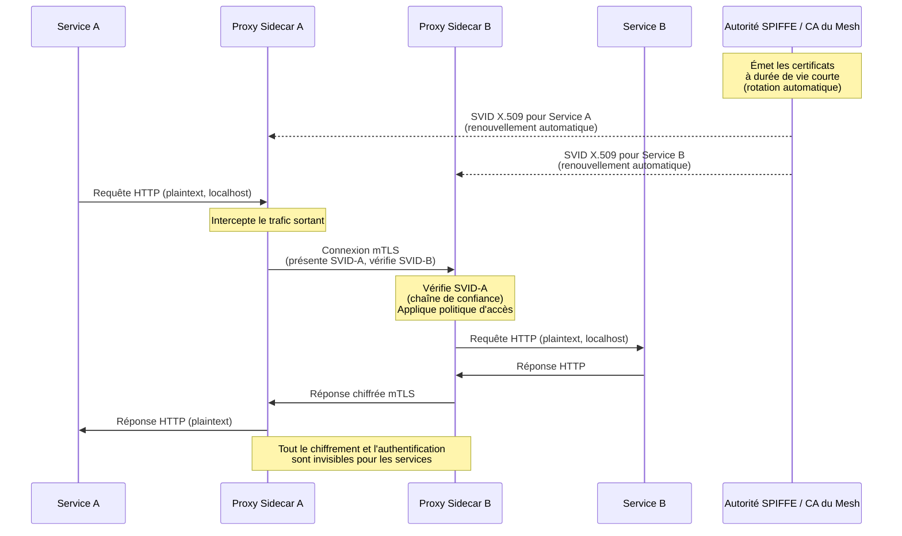
```mermaid
sequenceDiagram
    participant SA as Service A
    participant PA as Proxy Sidecar A
    participant PB as Proxy Sidecar B
    participant SB as Service B
    participant CA as Autorité SPIFFE / CA du Mesh

    Note over CA: Émet les certificats<br/>à durée de vie courte<br/>(rotation automatique)

    CA-->>PA: SVID X.509 pour Service A<br/>(renouvellement automatique)
    CA-->>PB: SVID X.509 pour Service B<br/>(renouvellement automatique)

    SA->>PA: Requête HTTP (plaintext, localhost)
    Note over PA: Intercepte le trafic sortant
    PA->>PB: Connexion mTLS<br/>(présente SVID-A, vérifie SVID-B)
    Note over PB: Vérifie SVID-A<br/>(chaîne de confiance)<br/>Applique politique d'accès
    PB->>SB: Requête HTTP (plaintext, localhost)
    SB->>PB: Réponse HTTP
    PB->>PA: Réponse chiffrée mTLS
    PA->>SA: Réponse HTTP (plaintext)
    Note over PA,PB: Tout le chiffrement et l'authentification<br/>sont invisibles pour les services
```

Dans ce modèle, le Service A envoie une requête HTTP en clair sur localhost vers son proxy sidecar. Le proxy intercepte le trafic sortant et établit une connexion mTLS avec le proxy du Service B, présentant le certificat SVID du Service A et vérifiant celui du Service B. Le proxy du Service B applique les politiques d'autorisation — ce service A est-il autorisé à appeler ce service B, sur cet endpoint, avec cette méthode HTTP ? — puis transmet la requête en clair au Service B sur localhost. L'ensemble de la négociation cryptographique est invisible pour les services eux-mêmes, qui n'ont besoin d'aucune modification de code.

Cette transparence est précieuse dans les architectures d'intégration existantes. Le mTLS peut être déployé sans modifier une seule ligne de code applicatif, en ajoutant simplement la couche de Service Mesh. Les services legacy, écrits en Java, Python, Go ou tout autre langage, qui n'ont pas été conçus avec le mTLS en tête, bénéficient néanmoins d'une authentification et d'un chiffrement de niveau production. Cette approche « infrastructure-driven security » est un enabler clé de l'adoption du Zero Trust dans les architectures existantes.

> **Perspective stratégique**
> La combinaison SPIFFE/SPIRE + Service Mesh constitue aujourd'hui la solution la plus mature pour l'identité machine à grande échelle. Elle résout les trois problèmes fondamentaux : le provisionnement automatique (via l'attestation par la plateforme — pas de « secret zéro »), la rotation continue (via les certificats à durée de vie courte — minutes ou heures plutôt que mois ou années), et la transparence applicative (via les proxies sidecar — pas de modification de code). Les organisations qui déploient un Service Mesh pour la résilience (comme recommandé au chapitre VII) obtiennent l'identité machine « gratuitement » en activant le mTLS — un argument puissant pour justifier l'investissement dans le Service Mesh auprès des décideurs.

### 12.2.3 Autorisation Fine : RBAC, ABAC, Policy-as-Code (OPA/Rego)

L'authentification — vérifier l'identité — n'est que la première moitié de l'équation. L'autorisation — déterminer ce que l'entité authentifiée a le droit de faire — est la seconde, et souvent la plus complexe. Dans les architectures d'intégration, la granularité et la dynamique des décisions d'autorisation dépassent rapidement les capacités des modèles traditionnels.

La différence entre authentification et autorisation peut être illustrée simplement. L'authentification répond à « est-ce bien le service Order-Service qui effectue cet appel ? ». L'autorisation répond à « Order-Service a-t-il le droit de lire les données de paiement du client X à 3h du matin depuis la zone de staging ? ». La seconde question est de nature fondamentalement différente et plus riche que la première.

#### RBAC : modèle basé sur les rôles

Le modèle RBAC (Role-Based Access Control) est le plus répandu et le plus intuitif des modèles d'autorisation. Il associe des permissions à des rôles, et des rôles à des sujets (utilisateurs ou services). Un utilisateur qui possède le rôle « gestionnaire de commandes » hérite des permissions associées : créer une commande, consulter une commande, annuler une commande. Un service qui possède le rôle « lecteur d'inventaire » peut consulter les stocks mais pas les modifier.

RBAC offre une simplicité administrative remarquable. L'ajout d'un nouvel utilisateur se réduit à l'attribution des rôles appropriés. La modification des permissions d'un groupe d'utilisateurs se fait en modifiant les permissions du rôle. L'audit est facilité : pour savoir ce qu'un utilisateur peut faire, il suffit d'examiner ses rôles et les permissions associées. Cette lisibilité fait de RBAC le choix par défaut de la plupart des systèmes.

Toutefois, RBAC atteint ses limites dans les architectures d'intégration complexes pour deux raisons principales.

Premièrement, le nombre de rôles explose (phénomène de **role explosion**) lorsque les permissions doivent capturer des combinaisons fines de contextes. Considérons un service qui peut lire les commandes de la région Europe mais pas celles de la région Amérique, qui peut modifier les commandes inférieures à 10 000 euros mais pas au-delà, et qui a accès uniquement pendant les heures ouvrées. Cette combinaison nécessite un rôle dédié — et chaque nouvelle dimension contextuelle (région, montant, horaire, environnement) multiplie le nombre de rôles nécessaires. Dans une architecture d'intégration avec des dizaines de services, des centaines de ressources et des dizaines de contraintes contextuelles, le registre de rôles devient un enchevêtrement ingérable de milliers d'entrées.

Deuxièmement, RBAC ne capture pas facilement les décisions contextuelles dynamiques. L'heure de la requête, la localisation du demandeur, l'état du système cible, la charge courante, le niveau d'alerte sécurité — ces facteurs influencent légitimement les décisions d'autorisation mais ne s'expriment pas naturellement en termes de rôles statiques.

#### ABAC : modèle basé sur les attributs

Le modèle ABAC (Attribute-Based Access Control) résout les limites de RBAC en fondant les décisions d'autorisation sur des attributs plutôt que sur des rôles fixes. Les attributs peuvent concerner quatre dimensions : le **sujet** (département, ancienneté, habilitation de sécurité, localisation), la **ressource** (classification, propriétaire, date de création, sensibilité), l'**action** (lecture, écriture, suppression, administration) et l'**environnement** (heure, localisation réseau, niveau d'alerte, charge système).

Une politique ABAC s'exprime comme une règle combinant ces attributs : « Autoriser l'accès si le sujet appartient au département Finance ET que la ressource a une classification inférieure ou égale à Confidentiel ET que l'action est en lecture ET que l'heure est comprise entre 8h et 20h ET que la requête provient du réseau interne ». Cette expressivité permet de capturer des politiques d'accès arbitrairement fines sans créer de rôles dédiés pour chaque combinaison.

ABAC présente toutefois une complexité accrue en conception, en test et en audit. Comprendre pourquoi une requête a été autorisée ou refusée nécessite l'évaluation de toutes les règles applicables avec tous les attributs pertinents. Le débogage des politiques ABAC peut devenir un exercice de logique combinatoire non trivial. La question « quelles ressources l'utilisateur X peut-il accéder ? » n'a plus de réponse simple et directe — elle dépend du contexte complet de la requête.

#### Policy-as-Code avec Open Policy Agent (OPA) et Rego

Open Policy Agent (OPA) est un moteur de décision d'autorisation à usage général, projet graduée de la CNCF, qui incarne le paradigme « Policy-as-Code ». Au lieu de coder les règles d'autorisation dans le code applicatif de chaque service — créant une dispersion ingouvernable et des incohérences inévitables — OPA centralise la logique d'autorisation dans des politiques déclaratives écrites en Rego, un langage dédié conçu pour l'évaluation de politiques.

L'architecture OPA repose sur un principe de découplage. Le service qui doit prendre une décision d'autorisation envoie une requête JSON à l'agent OPA (déployé localement comme sidecar ou en service partagé) contenant le sujet, l'action, la ressource et le contexte. OPA évalue les politiques Rego applicables en considérant les données contextuelles chargées (données d'habilitation, classification des ressources, règles métier) et retourne une décision structurée (allow/deny) accompagnée de la justification. Le service applicatif n'a besoin que de poser la question — la logique de réponse est externalisée.

L'intérêt de Policy-as-Code pour les architectures d'intégration est triple. Les politiques sont **versionnées** dans un dépôt Git, bénéficiant des mêmes pratiques que le code applicatif : revue par les pairs, historique des changements, branches de développement, pipeline CI/CD. Elles sont **testables** unitairement — OPA fournit un framework de test natif (`opa test`) pour valider le comportement des politiques avant déploiement, incluant la couverture de code. Elles sont **uniformes** à travers les services — la même politique d'accès peut être appliquée par l'API Gateway, par les services métier, par le broker d'événements et par les pipelines de données, éliminant les incohérences entre les points d'application.

L'exemple suivant illustre une politique Rego pour contrôler l'accès à un topic Kafka en fonction de l'identité du service, de l'opération demandée et de la classification du topic :

```rego
package kafka.authz

import rego.v1

# Données de classification des topics (chargées depuis une source externe)
topic_classification := data.topics

# Données d'habilitation des services (chargées depuis le registre de services)
service_clearance := data.services

# Règle par défaut : refuser (deny by default)
default allow := false

# Autoriser la lecture si le service a une habilitation suffisante
# pour la classification du topic
allow if {
    input.action == "read"
    topic := topic_classification[input.topic]
    service := service_clearance[input.service_id]
    clearance_level[service.clearance] >= clearance_level[topic.classification]
}

# Autoriser l'écriture uniquement pour les producteurs
# explicitement enregistrés pour ce topic
allow if {
    input.action == "write"
    topic := topic_classification[input.topic]
    input.service_id in topic.authorized_producers
}

# Échelle ordinale des niveaux d'habilitation
clearance_level := {
    "public": 0,
    "internal": 1,
    "confidential": 2,
    "restricted": 3,
}
```

Cette politique exprime deux règles claires. Pour la lecture, un service est autorisé si son niveau d'habilitation est supérieur ou égal à la classification du topic — un service habilité « confidential » peut lire les topics publics, internes et confidentiels, mais pas les topics restricted. Pour l'écriture, seuls les producteurs explicitement enregistrés pour ce topic sont autorisés — pas de write access implicite. La même politique est applicable que le service accède au topic via le broker directement, via un connecteur Kafka Connect, ou via un consommateur intermédiaire.

Un test unitaire pour cette politique illustre la testabilité native :

```rego
package kafka.authz_test

import rego.v1

test_read_allowed_sufficient_clearance if {
    allow with input as {
        "action": "read",
        "topic": "orders.created",
        "service_id": "analytics-service"
    }
    with data.topics as {"orders.created": {"classification": "internal"}}
    with data.services as {"analytics-service": {"clearance": "confidential"}}
}

test_read_denied_insufficient_clearance if {
    not allow with input as {
        "action": "read",
        "topic": "payments.processed",
        "service_id": "notification-service"
    }
    with data.topics as {"payments.processed": {"classification": "restricted"}}
    with data.services as {"notification-service": {"clearance": "internal"}}
}

test_write_denied_unregistered_producer if {
    not allow with input as {
        "action": "write",
        "topic": "orders.created",
        "service_id": "rogue-service"
    }
    with data.topics as {"orders.created": {
        "classification": "internal",
        "authorized_producers": ["order-service"]
    }}
}
```

#### Comparaison des modèles d'autorisation

| Critère | RBAC | ABAC | Policy-as-Code (OPA) |
|---|---|---|---|
| **Expressivité** | Limitée (rôles fixes) | Élevée (attributs combinés) | Très élevée (logique programmatique) |
| **Complexité de conception** | Faible | Élevée | Moyenne (langage dédié Rego) |
| **Scalabilité des règles** | Role explosion | Règles combinatoires | Modulaire et composable (packages) |
| **Auditabilité** | Simple (qui a quel rôle ?) | Difficile (quels attributs déclenchent ?) | Bonne (politiques versionnées, décisions tracées) |
| **Testabilité** | Limitée | Complexe | Native (framework opa test) |
| **Décentralisation** | Difficile à distribuer | Possible | Conçue pour (agents OPA locaux) |
| **Contexte dynamique** | Non | Oui | Oui |
| **Courbe d'apprentissage** | Faible | Moyenne | Moyenne (apprentissage de Rego) |
| **Cas d'usage optimal** | Permissions simples et stables | Permissions fines et contextuelles | Architectures distribuées multi-services |

> **Configuration recommandée**
> La plupart des architectures d'intégration combinent ces modèles plutôt que d'en choisir un seul, chaque modèle opérant à son niveau de granularité optimal :
>
> * **RBAC** pour les permissions grossières et stables : rôles d'administration des plateformes, accès aux environnements (dev/staging/prod), permissions par équipe
> * **ABAC/Policy-as-Code (OPA)** pour les décisions fines et contextuelles : accès aux données sensibles selon la classification, autorisations inter-services selon le domaine métier, restrictions temporelles et géographiques
> * **OPA** comme moteur unifié pour garantir l'uniformité et la gouvernance des politiques à travers l'ensemble de l'écosystème d'intégration — API Gateway, services, broker, pipelines de données
>
> L'avantage d'OPA est qu'il peut implémenter à la fois RBAC et ABAC dans le même framework, permettant une migration progressive du premier vers le second au fur et à mesure que les besoins de granularité augmentent.

### 12.2.4 Identité des Agents Autonomes : Défis Émergents

Le chapitre XI a introduit l'Entreprise Agentique, où des agents logiciels autonomes orchestrent les flux d'intégration, invoquent des APIs, consomment des événements et prennent des décisions. Cette émergence pose des questions d'identité et d'autorisation fondamentalement nouvelles que les cadres existants — conçus pour des utilisateurs humains et des services aux comportements prédéterminés — n'anticipaient pas pleinement.

#### Comment authentifier un agent IA autonome ?

Un agent autonome n'est ni un utilisateur humain ni un service traditionnel. Un utilisateur possède des identifiants personnels et peut répondre à des défis d'authentification interactifs (mots de passe, MFA). Un service traditionnel possède une identité fixe et exécute des opérations prédéfinies — son comportement est déterministe et ses besoins d'accès sont connus à l'avance. Un agent, en revanche, opère avec une autonomie décisionnelle — il choisit dynamiquement quelles APIs invoquer, quelles données consulter, quelles actions entreprendre — tout en agissant au nom d'un utilisateur ou d'un processus métier dont il hérite partiellement les permissions.

Cette nature hybride exige un modèle d'identité à deux niveaux. L'agent possède sa propre **identité technique** — un SPIFFE ID, un certificat mTLS ou un client credential OAuth 2.0 — qui l'authentifie comme entité dans le système. Mais il agit également au nom d'un **principal** (l'utilisateur ou le processus qui l'a initié), et ses permissions doivent refléter cette délégation. Le concept d'**impersonation contrainte** — l'agent agit avec un sous-ensemble des permissions du principal, limité à la tâche en cours — offre un cadre adapté.

> **Exemple concret**
> Un utilisateur du département Finance demande à un agent : « Prépare-moi un rapport de réconciliation des paiements du trimestre ». L'agent doit accéder aux données de paiement (permission héritée de l'utilisateur Finance), interroger le système comptable (permission nécessaire pour la tâche), et potentiellement appeler une API de génération de rapports. Mais il ne devrait pas pouvoir modifier des transactions, accéder aux données d'autres départements, ou effectuer des paiements — même si l'utilisateur a ces permissions dans d'autres contextes. L'agent opère avec un scope restreint au périmètre de la tâche demandée.

#### Délégation de permissions et scope limité

La délégation de permissions aux agents doit respecter deux principes fondamentaux. Le premier est le **moindre privilège temporel** : l'agent ne reçoit que les permissions nécessaires à la tâche en cours, pour la durée de cette tâche uniquement. Un agent chargé de vérifier l'état d'une commande n'a pas besoin de pouvoir annuler des commandes. Un agent chargé de produire un rapport n'a pas besoin d'accès en écriture aux données sources. Les permissions sont accordées au moment de l'initiation de la tâche et révoquées à sa complétion — ou à l'expiration du token, selon ce qui survient en premier.

Le second principe est la **dégradation gracieuse des permissions** : lorsqu'un agent délègue une sous-tâche à un autre agent (dans le cadre d'une collaboration multi-agents telle que décrite au chapitre XI), les permissions de l'agent délégué ne peuvent excéder celles de l'agent délégant. Cette propriété, analogique à la règle juridique « nemo plus juris ad alium transferre potest quam ipse habet » (nul ne peut transférer plus de droits qu'il n'en possède), empêche l'escalade de privilèges par délégation en chaîne. Sans cette contrainte, un agent pourrait créer un sous-agent avec des permissions supérieures aux siennes, puis utiliser ce sous-agent pour contourner ses propres restrictions.

En pratique, ces principes se traduisent par l'émission de tokens à scope limité, à durée de vie courte, enchaînés au contexte de la tâche. Le diagramme suivant illustre ce mécanisme de délégation contrainte :

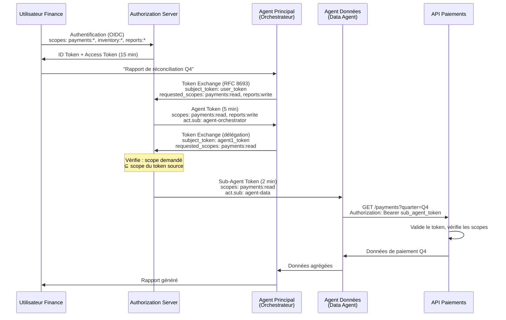
```mermaid
sequenceDiagram
    participant U as Utilisateur Finance
    participant AS as Authorization Server
    participant AG1 as Agent Principal<br/>(Orchestrateur)
    participant AG2 as Agent Données<br/>(Data Agent)
    participant API as API Paiements

    U->>AS: Authentification (OIDC)<br/>scopes: payments:*, inventory:*, reports:*
    AS->>U: ID Token + Access Token (15 min)

    U->>AG1: "Rapport de réconciliation Q4"
    AG1->>AS: Token Exchange (RFC 8693)<br/>subject_token: user_token<br/>requested_scopes: payments:read, reports:write
    AS->>AG1: Agent Token (5 min)<br/>scopes: payments:read, reports:write<br/>act.sub: agent-orchestrator

    AG1->>AS: Token Exchange (délégation)<br/>subject_token: agent1_token<br/>requested_scopes: payments:read
    Note over AS: Vérifie : scope demandé<br/>⊆ scope du token source
    AS->>AG2: Sub-Agent Token (2 min)<br/>scopes: payments:read<br/>act.sub: agent-data

    AG2->>API: GET /payments?quarter=Q4<br/>Authorization: Bearer sub_agent_token
    API->>API: Valide le token, vérifie les scopes
    API->>AG2: Données de paiement Q4
    AG2->>AG1: Données agrégées
    AG1->>U: Rapport généré
```

Ce flux illustre la dégradation des permissions. L'utilisateur dispose de scopes larges (`payments:*`, `inventory:*`, `reports:*`). L'agent principal obtient un sous-ensemble (`payments:read`, `reports:write`). L'agent délégué obtient un sous-ensemble encore plus restreint (`payments:read` uniquement). À chaque niveau de délégation, les permissions se réduisent, et chaque token a une durée de vie plus courte que le précédent. Le claim `act.sub` (acting subject) dans le token identifie l'agent qui agit, distinct du principal au nom duquel il agit.

#### Traçabilité des actions des agents

L'auditabilité des agents constitue un enjeu critique de conformité et de gouvernance, qui va au-delà de ce que les journaux d'audit traditionnels offrent. Chaque action d'un agent — invocation d'API, lecture de données, publication d'événement, décision de routage — doit être traçable avec un contexte suffisant pour reconstruire non seulement l'action mais aussi le raisonnement qui l'a motivée.

La chaîne de traçabilité d'un agent inclut plusieurs dimensions complémentaires :

- L'**identité de l'agent** : quel agent a agi (SPIFFE ID, nom, version)
- L'**identité du principal** : au nom de qui l'agent agit (utilisateur, processus, autre agent)
- La **tâche** en cours : dans quel contexte (identifiant de tâche, demande originale)
- L'**action** exécutée : quelle API, quels paramètres, quelle méthode
- Le **raisonnement** : pourquoi cette action — les éléments de contexte qui ont conduit à la décision (chain-of-thought)
- Le **résultat** : succès, échec, données retournées (résumé, pas intégralement)
- L'**horodatage** : quand, à la milliseconde
- La **corrélation** : identifiant de trace distribuée permettant de reconstituer le flux complet

Cette traçabilité enrichie va au-delà des journaux d'audit traditionnels qui enregistrent « qui a fait quoi et quand ». Pour les agents, le « pourquoi » est aussi important que le « quoi ». Un audit de conformité qui constate qu'un agent a accédé à des données clients doit pouvoir déterminer si cet accès était justifié par la tâche en cours et conforme aux politiques établies. Les chaînes de raisonnement (chain-of-thought) des agents, mentionnées au chapitre XI dans le contexte de la gouvernance agentique, trouvent ici une application concrète en matière de conformité réglementaire.

#### Standards émergents pour l'identité agentique

L'industrie commence à produire des standards pour l'identité et l'interopérabilité des agents. Le protocole **Agent-to-Agent (A2A)**, évoqué au chapitre XI, inclut des mécanismes d'authentification mutuelle entre agents, de déclaration de capacités (quels outils un agent peut-il utiliser) et de négociation de tâches. Le **Model Context Protocol (MCP)** standardise l'accès des agents aux ressources et aux outils, avec des considérations de contrôle d'accès — un serveur MCP peut déclarer les permissions requises pour chaque outil exposé.

Ces standards, encore en cours de maturation, convergeront probablement vers un cadre unifié d'identité agentique dans les années à venir. En attendant, les organisations peuvent s'appuyer sur les briques existantes — OAuth 2.0 pour la délégation, SPIFFE pour l'identité des workloads agents, OPA pour l'autorisation fine — en les combinant selon les principes énoncés ci-dessus.

La gestion de l'identité des agents n'est pas un problème à résoudre demain. Les organisations qui déploient des agents aujourd'hui — même à titre expérimental — doivent dès maintenant définir leurs politiques d'identité agentique. Les décisions prises dans cette phase précoce — centralisé vs décentralisé, tokens courts vs longs, scope large vs strict, traçabilité minimale vs exhaustive — conditionneront la sécurité et la gouvernabilité de l'écosystème agentique à maturité.

> **Perspective stratégique**
> L'identité des agents autonomes représente l'un des défis de sécurité les plus significatifs des prochaines années. Les organisations disposent toutefois des briques fondamentales pour y répondre : OAuth 2.0 pour la délégation d'accès, Token Exchange (RFC 8693) pour la propagation d'identité, SPIFFE pour l'identité des workloads, OPA pour l'autorisation fine et contextuelle. Le défi n'est pas technologique mais architectural : combiner ces briques dans un modèle cohérent qui préserve l'autonomie des agents tout en garantissant la gouvernabilité de leurs actions. Les organisations qui investissent maintenant dans ce cadre disposeront d'un avantage significatif lorsque l'adoption agentique s'accélérera.

---

## 12.3 Sécurisation des Trois Domaines d'Intégration

Les chapitres III, IV et V ont établi la trilogie fondamentale du continuum d'intégration : les applications (le Verbe), les données (le Nom) et les événements (le Signal). Chacun de ces domaines expose une surface d'attaque distincte, des vecteurs de menace spécifiques et des mécanismes de protection adaptés. La sécurisation d'une architecture d'intégration ne peut se concevoir comme une couche monolithique appliquée uniformément ; elle doit au contraire épouser les caractéristiques intrinsèques de chaque domaine.

Le domaine applicatif, fondé sur des échanges synchrones via des APIs, requiert une protection centralisée au point d'entrée et une validation rigoureuse de chaque interaction. Le domaine des données, gardien de l'état persistant, exige le chiffrement, la classification et le contrôle d'accès granulaire sur l'information au repos et en transit. Le domaine événementiel, caractérisé par des flux asynchrones à haut débit, impose l'authentification des producteurs et consommateurs, l'intégrité des messages et l'isolation entre locataires.

Cette section examine systématiquement les préoccupations de sécurité propres à chaque domaine, en établissant pour chacun les principes, les mécanismes et les configurations recommandées. L'objectif n'est pas de fournir un guide d'installation pour un produit spécifique, mais de cartographier les points de contrôle architecturaux que toute implémentation doit adresser.

---

### 12.3.1 Domaine Applications — Sécurité des APIs

L'intégration des applications repose sur l'exposition et la consommation d'APIs. Chaque endpoint constitue une porte d'entrée potentielle pour un attaquant. La multiplication des microservices amplifie cette surface d'attaque : là où une application monolithique exposait quelques dizaines de points d'entrée, une architecture distribuée en expose potentiellement des centaines. La sécurisation du domaine applicatif s'articule autour d'un composant central — l'API Gateway — et d'un ensemble de pratiques défensives qui protègent chaque couche de l'interaction.

#### Le rôle de l'API Gateway comme point de contrôle de sécurité

L'API Gateway constitue le point de passage obligé du trafic Nord-Sud (entre les clients externes et les services internes). En centralisant les préoccupations de sécurité à ce niveau, l'architecture évite la duplication des mécanismes de protection dans chaque service et garantit une application homogène des politiques.

**Authentification centralisée.** L'API Gateway valide l'identité de chaque appelant avant de transmettre la requête au service cible. Cette validation prend typiquement la forme d'une vérification de jeton JWT (JSON Web Token) : le gateway vérifie la signature cryptographique, la date d'expiration, l'émetteur et l'audience du jeton. Pour les jetons opaques, le gateway effectue une introspection auprès du serveur d'autorisation (endpoint `/introspect` du protocole OAuth 2.0). Cette centralisation garantit qu'aucun service en aval ne reçoit de requête non authentifiée.

**Rate limiting et throttling.** La limitation de débit protège les services contre les abus, qu'ils soient malveillants (attaques par déni de service) ou accidentels (boucles infinies dans un client mal codé). Le rate limiting s'applique selon plusieurs dimensions : par client (identifié par sa clé API ou son jeton), par endpoint, par adresse IP source ou par combinaison de ces critères. Le throttling introduit un ralentissement progressif plutôt qu'un rejet brutal, permettant aux clients légitimes temporairement excessifs de s'auto-réguler.

**Validation des entrées.** L'API Gateway constitue la première ligne de défense contre les injections. La validation du Content-Type, la vérification de la taille maximale des payloads, le rejet des caractères non attendus et la conformité au schéma OpenAPI déclaré permettent de filtrer une part significative des tentatives d'exploitation avant qu'elles n'atteignent la logique métier.

**Web Application Firewall (WAF) intégré.** Un WAF positionné devant ou intégré à l'API Gateway analyse le contenu des requêtes selon des règles prédéfinies (signatures d'attaques connues) et des heuristiques comportementales. Il détecte les tentatives d'injection SQL, les attaques XSS (Cross-Site Scripting), les traversées de répertoires et les patterns caractéristiques d'outils d'exploitation automatisés. Les règles WAF doivent être actualisées régulièrement pour couvrir les nouvelles signatures d'attaques, et les faux positifs doivent être gérés avec soin pour ne pas bloquer le trafic légitime d'intégration — certains payloads métier complexes peuvent déclencher des règles trop agressives.

> **Configuration recommandée**
> L'API Gateway doit être configuré en mode « deny by default » : seuls les endpoints explicitement déclarés sont accessibles. Tout chemin non enregistré retourne un code 404 sans divulguer d'information sur l'infrastructure sous-jacente. Les en-têtes de réponse doivent supprimer toute indication de version logicielle ou de technologie employée.

Le diagramme de séquence suivant illustre le flux complet d'authentification et d'autorisation d'une requête API traversant les couches de sécurité du Gateway.

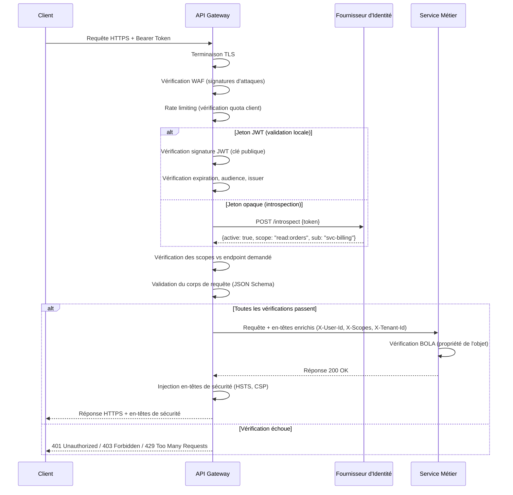
```mermaid
sequenceDiagram
    participant C as Client
    participant GW as API Gateway
    participant IdP as Fournisseur d'Identité
    participant S as Service Métier

    C->>GW: Requête HTTPS + Bearer Token
    GW->>GW: Terminaison TLS
    GW->>GW: Vérification WAF (signatures d'attaques)
    GW->>GW: Rate limiting (vérification quota client)

    alt Jeton JWT (validation locale)
        GW->>GW: Vérification signature JWT (clé publique)
        GW->>GW: Vérification expiration, audience, issuer
    else Jeton opaque (introspection)
        GW->>IdP: POST /introspect {token}
        IdP-->>GW: {active: true, scope: "read:orders", sub: "svc-billing"}
    end

    GW->>GW: Vérification des scopes vs endpoint demandé
    GW->>GW: Validation du corps de requête (JSON Schema)

    alt Toutes les vérifications passent
        GW->>S: Requête + en-têtes enrichis (X-User-Id, X-Scopes, X-Tenant-Id)
        S->>S: Vérification BOLA (propriété de l'objet)
        S-->>GW: Réponse 200 OK
        GW->>GW: Injection en-têtes de sécurité (HSTS, CSP)
        GW-->>C: Réponse HTTPS + en-têtes de sécurité
    else Vérification échoue
        GW-->>C: 401 Unauthorized / 403 Forbidden / 429 Too Many Requests
    end
```

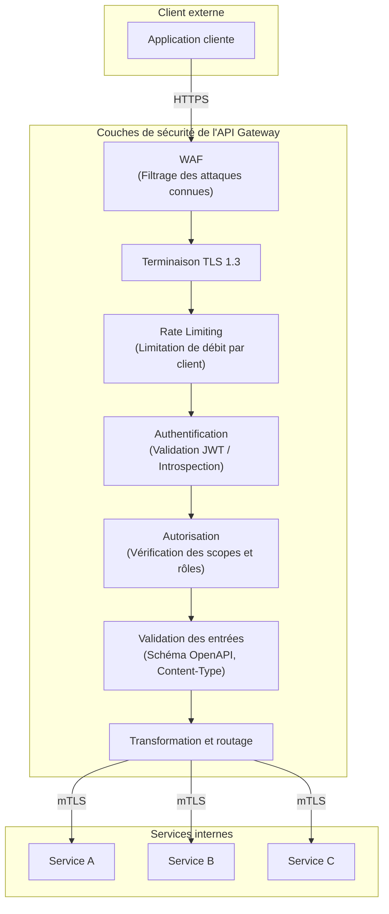
```mermaid
flowchart TB
    subgraph "Client externe"
        CL["Application cliente"]
    end

    subgraph "Couches de sécurité de l'API Gateway"
        direction TB
        WAF["WAF<br/>(Filtrage des attaques connues)"]
        TLS["Terminaison TLS 1.3"]
        RL["Rate Limiting<br/>(Limitation de débit par client)"]
        AUTH["Authentification<br/>(Validation JWT / Introspection)"]
        AUTHZ["Autorisation<br/>(Vérification des scopes et rôles)"]
        VAL["Validation des entrées<br/>(Schéma OpenAPI, Content-Type)"]
        TRANS["Transformation et routage"]
    end

    subgraph "Services internes"
        S1["Service A"]
        S2["Service B"]
        S3["Service C"]
    end

    CL -->|"HTTPS"| WAF
    WAF --> TLS
    TLS --> RL
    RL --> AUTH
    AUTH --> AUTHZ
    AUTHZ --> VAL
    VAL --> TRANS
    TRANS -->|"mTLS"| S1
    TRANS -->|"mTLS"| S2
    TRANS -->|"mTLS"| S3
```

#### OWASP API Security Top 10

Le référentiel OWASP API Security Top 10 (édition 2023) identifie les dix risques les plus critiques pour la sécurité des APIs. Dans le contexte de l'intégration d'entreprise, ces risques prennent une dimension particulière car une API compromise peut servir de vecteur de propagation à travers l'ensemble de l'écosystème.

| # | Risque | Description | Exemple en contexte d'intégration | Mitigation |
|---|--------|-------------|-----------------------------------|------------|
| API1 | **Broken Object Level Authorization (BOLA)** | L'API ne vérifie pas que l'appelant est autorisé à accéder à l'objet demandé | Un service consommateur accède aux commandes d'un autre tenant en manipulant l'identifiant | Vérification systématique de la propriété de l'objet à chaque requête ; ne jamais se fier uniquement à l'identifiant fourni par le client |
| API2 | **Broken Authentication** | Mécanismes d'authentification défaillants ou absents | Un endpoint d'intégration interne exposé sans authentification, accessible depuis le réseau | Authentification obligatoire sur tous les endpoints, y compris internes ; rotation des clés ; MFA pour les opérations sensibles |
| API3 | **Broken Object Property Level Authorization** | L'API expose des propriétés d'objets que l'appelant ne devrait pas voir ou modifier | Un service de consultation retourne des champs internes (coût de revient, marge) à un partenaire externe | Filtrage explicite des champs retournés selon le rôle ; schémas de réponse distincts par audience |
| API4 | **Unrestricted Resource Consumption** | Absence de limites sur les ressources consommées par l'API | Un appel de synchronisation de données sans pagination déclenche un transfert de millions d'enregistrements | Pagination obligatoire ; limites de taille de réponse ; timeouts ; rate limiting |
| API5 | **Broken Function Level Authorization** | L'API ne vérifie pas que l'appelant est autorisé à invoquer la fonction demandée | Un consommateur standard accède aux endpoints d'administration de l'API Gateway | Séparation stricte des endpoints par niveau de privilège ; contrôle RBAC sur chaque opération |
| API6 | **Unrestricted Access to Sensitive Business Flows** | Accès non contrôlé à des flux métier critiques | Automatisation abusive de la création de comptes via l'API d'enregistrement | Détection comportementale ; CAPTCHA adaptatif ; limites métier (pas seulement techniques) |
| API7 | **Server-Side Request Forgery (SSRF)** | L'API peut être manipulée pour émettre des requêtes vers des systèmes internes | Un paramètre d'URL de callback exploité pour scanner le réseau interne | Validation stricte des URLs ; liste blanche de destinations ; isolation réseau |
| API8 | **Security Misconfiguration** | Configuration par défaut non sécurisée ou incomplète | API Gateway déployé avec les endpoints de diagnostic activés en production | Hardening systématique ; revues de configuration automatisées ; infrastructure as code |
| API9 | **Improper Inventory Management** | Absence de visibilité sur les APIs exposées et leur statut | Des versions obsolètes d'APIs d'intégration restent accessibles après migration | Catalogue d'APIs centralisé ; décommissionnement actif ; versioning explicite |
| API10 | **Unsafe Consumption of APIs** | L'API fait confiance aveuglément aux réponses des APIs tierces qu'elle consomme | Un connecteur d'intégration injecte directement en base les données reçues d'un partenaire sans validation | Validation des réponses des APIs tierces ; timeouts ; circuit breakers ; ne jamais traiter une réponse externe comme fiable |

> **Perspective stratégique**
> Dans une architecture d'intégration, le risque BOLA (API1) est particulièrement insidieux. Les APIs internes, conçues pour être consommées par des services « de confiance », négligent souvent la vérification d'autorisation au niveau de l'objet. Un attaquant ayant compromis un seul service peut alors explorer latéralement l'ensemble des données accessibles via les APIs internes, en manipulant simplement les identifiants dans les requêtes.

#### Hardening de l'API Gateway

Le durcissement de l'API Gateway va au-delà de la simple activation des fonctionnalités de sécurité. Il impose une configuration minutieuse de chaque paramètre pour éliminer les vecteurs d'attaque résiduels.

**Configuration TLS stricte.** Seul TLS 1.3 devrait être autorisé en production. Les versions antérieures (TLS 1.0 et 1.1, définitivement obsolètes depuis la RFC 8996) et TLS 1.2 avec des suites de chiffrement faibles doivent être désactivées. La configuration doit imposer le Perfect Forward Secrecy (PFS) via les suites ECDHE, garantissant que la compromission d'une clé privée ne permet pas le déchiffrement des sessions passées.

**Politique CORS (Cross-Origin Resource Sharing).** La politique CORS doit être restrictive, limitant les origines autorisées à une liste blanche explicite. L'utilisation du wildcard `*` dans `Access-Control-Allow-Origin` est inacceptable en production. Les méthodes HTTP autorisées et les en-têtes acceptés doivent être déclarés explicitement.

**En-têtes de sécurité.** L'API Gateway doit injecter systématiquement les en-têtes de sécurité dans les réponses : `Strict-Transport-Security` (HSTS) pour forcer HTTPS, `X-Content-Type-Options: nosniff` pour prévenir le MIME sniffing, `X-Frame-Options: DENY` pour bloquer le clickjacking, et `Cache-Control: no-store` pour les réponses contenant des données sensibles.

```yaml
# Exemple de configuration d'un API Gateway sécurisé (format Kong/déclaratif)
_format_version: "3.0"

services:
  - name: order-service
    url: https://order-service.internal:8443
    connect_timeout: 5000
    read_timeout: 30000
    write_timeout: 30000

    routes:
      - name: order-api
        paths:
          - /api/v1/orders
        methods:
          - GET
          - POST
        protocols:
          - https
        strip_path: false

    plugins:
      # Authentification JWT
      - name: jwt
        config:
          claims_to_verify:
            - exp
            - nbf
          maximum_expiration: 3600
          header_names:
            - Authorization

      # Rate limiting par consommateur
      - name: rate-limiting
        config:
          minute: 100
          hour: 5000
          policy: redis
          fault_tolerant: true
          hide_client_headers: false

      # Validation du corps de requête
      - name: request-validator
        config:
          body_schema: '{"type":"object","required":["customerId","items"]}'
          verbose_response: false

      # En-têtes de sécurité
      - name: response-transformer
        config:
          add:
            headers:
              - "Strict-Transport-Security: max-age=31536000; includeSubDomains"
              - "X-Content-Type-Options: nosniff"
              - "X-Frame-Options: DENY"
              - "Cache-Control: no-store"
              - "Content-Security-Policy: default-src 'none'"
          remove:
            headers:
              - Server
              - X-Powered-By

      # Restriction CORS
      - name: cors
        config:
          origins:
            - "https://app.entreprise.com"
            - "https://portail.entreprise.com"
          methods:
            - GET
            - POST
          headers:
            - Authorization
            - Content-Type
          max_age: 3600
          credentials: true
```

#### Validation et sanitisation des entrées

La validation des entrées constitue la dernière ligne de défense avant que les données n'atteignent la logique métier. Même lorsque l'API Gateway effectue une première validation, chaque service doit valider indépendamment les données qu'il reçoit — principe de défense en profondeur.

**Validation par schéma JSON.** Chaque endpoint doit déclarer un schéma JSON strict (via OpenAPI/Swagger) définissant les types, les formats, les longueurs maximales, les valeurs autorisées et les champs obligatoires. Les requêtes non conformes au schéma sont rejetées avant tout traitement métier. Cette validation structurelle élimine une catégorie entière d'attaques fondées sur des entrées malformées.

**Protection contre les injections.** Les injections demeurent parmi les vecteurs d'attaque les plus exploités. L'injection SQL exploite la concaténation de chaînes dans les requêtes de base de données ; elle se prévient par l'utilisation systématique de requêtes paramétrées. L'injection NoSQL manipule les opérateurs de requête dans les bases documentaires (MongoDB, par exemple) ; elle exige la validation du type des paramètres (rejeter un objet lorsqu'une chaîne est attendue). L'injection de commandes OS exploite les appels système avec des paramètres non validés ; elle se prévient en évitant tout appel shell avec des entrées utilisateur. L'injection LDAP cible les annuaires d'entreprise ; elle impose l'échappement des caractères spéciaux LDAP dans les filtres de recherche.

**Enforcement du Content-Type.** L'API doit rejeter toute requête dont le Content-Type ne correspond pas au format attendu. Un endpoint déclaré comme acceptant `application/json` ne doit pas traiter silencieusement un corps en `text/xml` ou `multipart/form-data`. Cette vérification stricte prévient les attaques par confusion de type où l'attaquant exploite les différences de parsing entre formats.

**Limitation de la profondeur et de la complexité.** Les payloads JSON profondément imbriqués ou contenant des tableaux de grande taille peuvent être exploités pour des attaques par déni de service applicatif (*hash collision attacks*, *XML bomb* en JSON). La validation doit imposer des limites explicites : profondeur maximale d'imbrication (typiquement 10 niveaux), taille maximale des tableaux, nombre maximal de propriétés par objet. Ces limites structurelles complètent la validation sémantique du schéma.

> **Exemple concret**
> En 2022, une vulnérabilité dans une API d'intégration bancaire a permis l'exfiltration de données clients via une injection NoSQL. L'attaquant a remplacé un paramètre de recherche `{"accountId": "12345"}` par `{"accountId": {"$ne": null}}`, ce qui a retourné l'ensemble des comptes de la base. Le correctif a consisté à valider que `accountId` est une chaîne de caractères conforme à un format prédéfini, et non un objet arbitraire. Cet incident illustre un principe fondamental : la validation de type est aussi importante que la validation de valeur.

#### Sécurité du trafic Est-Ouest (inter-services)

La sécurisation du trafic Nord-Sud (via l'API Gateway) ne suffit pas. Dans une architecture de microservices, le trafic Est-Ouest — les appels entre services internes — représente souvent un volume supérieur au trafic externe. Un attaquant ayant compromis un seul service peut exploiter la confiance implicite du réseau interne pour se déplacer latéralement.

**Le Service Mesh comme couche de sécurité.** Un Service Mesh (Istio, Linkerd) injecte un proxy sidecar devant chaque service, interceptant tout le trafic réseau. Ce proxy applique automatiquement le mTLS entre services, sans modification du code applicatif. Il permet également de définir des politiques d'autorisation service-à-service : le service de facturation peut appeler le service de commandes, mais le service de notification ne le peut pas.

**Politiques d'autorisation réseau.** Les Network Policies Kubernetes complètent le Service Mesh en restreignant les communications au niveau réseau. Combinées aux politiques d'autorisation du mesh, elles établissent une défense en profondeur : même si un attaquant contourne le proxy sidecar, les règles réseau bloquent les communications non autorisées.

> **Incident de terrain**
> En 2023, une attaque sur une plateforme de commerce en ligne a exploité l'absence de mTLS entre services internes. L'attaquant, ayant compromis un service de notification peu protégé via une vulnérabilité dans une dépendance, a pu émettre des requêtes directes vers le service de paiement interne en usurpant l'identité du service de commandes. L'absence d'authentification mutuelle entre services a permis cette escalade latérale.

---

### 12.3.2 Domaine Données — Protection et Souveraineté

Le domaine des données occupe une position singulière dans la trilogie de l'intégration. Là où les APIs et les événements sont des vecteurs de communication éphémères, les données persistent. Elles constituent la mémoire de l'entreprise, l'actif stratégique que l'ensemble de l'architecture d'intégration a pour mission de rendre accessible. Cette persistance en fait simultanément la cible la plus convoitée des attaquants et l'actif le plus réglementé par les législateurs. La protection des données dans un contexte d'intégration doit adresser cinq préoccupations : le chiffrement, la tokenisation, le masquage, la prévention des fuites et la souveraineté.

#### Chiffrement des données

Le chiffrement constitue le mécanisme fondamental de protection de la confidentialité. Il intervient à trois niveaux distincts, chacun adressant un vecteur de menace spécifique.

**Chiffrement au repos (*at-rest*).** Les données stockées dans les bases de données, les fichiers et les sauvegardes doivent être chiffrées pour prévenir leur exploitation en cas de vol physique du support de stockage ou d'accès non autorisé au système de fichiers. L'algorithme AES-256 (Advanced Encryption Standard avec clé de 256 bits) constitue le standard de facto. Deux approches coexistent : le TDE (Transparent Data Encryption), intégré au moteur de base de données, chiffre automatiquement les données sans modification applicative ; le chiffrement au niveau du système de fichiers (dm-crypt/LUKS sous Linux, BitLocker sous Windows) protège l'ensemble du volume de stockage.

**Chiffrement en transit (*in-transit*).** Toutes les communications entre composants de l'architecture doivent être chiffrées. TLS 1.3 constitue le minimum acceptable pour les communications externes. Pour les communications internes (trafic Est-Ouest entre services), le mTLS (mutual TLS) ajoute l'authentification bidirectionnelle : chaque service présente un certificat validé par l'autorité de certification interne. Cette mutualité prévient les attaques de type *man-in-the-middle* même au sein du réseau interne.

**Chiffrement applicatif (*application-level encryption*).** Certains cas d'usage exigent que les données soient chiffrées avant même d'atteindre la base de données, de sorte que ni l'administrateur de la base ni un attaquant ayant compromis le serveur de base de données ne puisse accéder aux données en clair. Cette approche, connue sous le nom de *client-side encryption*, impose à l'application de gérer le chiffrement et le déchiffrement. Elle est particulièrement pertinente pour les données soumises à des exigences réglementaires strictes (données de santé, numéros de cartes bancaires) ou pour les architectures multi-cloud où l'on ne fait pas confiance au fournisseur d'infrastructure.

> **Définition formelle**
> **Enveloppe de chiffrement (*envelope encryption*)** : Technique où les données sont chiffrées avec une clé de données (*Data Encryption Key*, DEK) générée aléatoirement, et cette DEK est elle-même chiffrée avec une clé maîtresse (*Key Encryption Key*, KEK) stockée dans un service de gestion de clés (KMS). Ce mécanisme permet la rotation des clés sans re-chiffrer l'intégralité des données.

#### Tokenisation et pseudonymisation

La tokenisation et la pseudonymisation répondent à un besoin distinct du chiffrement : elles permettent de manipuler des données sensibles sans les exposer, tout en préservant certaines propriétés utiles au traitement.

**Principe de la tokenisation.** La tokenisation remplace une donnée sensible par un jeton (*token*) aléatoire, sans relation mathématique avec la valeur originale. La correspondance entre le jeton et la valeur réelle est stockée dans un coffre-fort (*token vault*) hautement sécurisé. Contrairement au chiffrement, la tokenisation est irréversible sans accès au coffre-fort : même avec une puissance de calcul illimitée, le jeton ne révèle rien sur la valeur originale.

**Différence entre tokenisation et chiffrement.** Le chiffrement transforme les données de manière réversible à l'aide d'une clé : quiconque possède la clé peut déchiffrer. La tokenisation substitue les données sans algorithme réversible : seul l'accès au coffre-fort permet la correspondance inverse. Cette distinction a des implications réglementaires majeures : dans le cadre PCI-DSS, les données tokenisées ne sont pas considérées comme des données de carte de paiement, ce qui réduit considérablement le périmètre de conformité.

| Critère | Chiffrement | Tokenisation |
|---------|-------------|--------------|
| Réversibilité | Réversible avec la clé | Irréversible sans le coffre-fort |
| Relation mathématique | Algorithme déterministe | Aucune relation |
| Format préservé | Non (sauf FPE) | Oui (le jeton peut conserver le format) |
| Périmètre PCI-DSS | Les données chiffrées restent dans le périmètre | Les données tokenisées sortent du périmètre |
| Performance | Coût cryptographique | Recherche dans le coffre-fort |
| Cas d'usage typique | Protection des données au repos et en transit | Données de paiement, identifiants personnels |

**Pseudonymisation selon le RGPD.** La pseudonymisation est le traitement de données personnelles de telle sorte qu'elles ne puissent plus être attribuées à une personne concernée sans recourir à des informations supplémentaires conservées séparément. Le RGPD reconnaît la pseudonymisation comme une mesure technique de protection mais ne la considère pas comme une anonymisation : les données pseudonymisées restent des données personnelles soumises au règlement.

> **Exemple concret**
> Une plateforme de commerce électronique intégrée avec un système de paiement externe tokenise les numéros de carte bancaire dès leur saisie. Le jeton `tok_4x8y2z` circule dans l'ensemble de l'architecture d'intégration — service de commande, service de facturation, service de réconciliation — sans qu'aucun de ces services ne détienne le numéro réel. Seul le service de paiement, accrédité PCI-DSS, peut résoudre le jeton via le coffre-fort pour effectuer la transaction.

#### Masquage dynamique des données

Le masquage dynamique (*dynamic data masking*) adapte la visibilité des données sensibles en temps réel selon le contexte de la requête : le rôle de l'appelant, le canal d'accès, la localisation géographique ou le niveau de sensibilité de la donnée.

Contrairement au chiffrement ou à la tokenisation qui protègent les données au stockage, le masquage dynamique intervient à la présentation. Les données sont stockées en clair (ou chiffrées séparément) et masquées au moment de la lecture. Un administrateur voit le numéro de téléphone complet `514-555-1234` ; un agent de support voit `514-555-****` ; un service analytique reçoit un hachage irréversible.

**Implémentation au niveau du data layer.** Les bases de données modernes (SQL Server, PostgreSQL, Oracle) offrent des fonctionnalités natives de masquage dynamique, appliquées par des politiques déclaratives associées aux colonnes sensibles. Cette approche est transparente pour les applications existantes mais limitée aux accès directs à la base.

**Implémentation au niveau de l'API.** Dans une architecture d'intégration, le masquage est plus efficacement implémenté dans la couche API, où le contexte de l'appelant (rôle, scopes OAuth, tenant) est pleinement disponible. L'API applique des règles de masquage avant de sérialiser la réponse, garantissant que les données sensibles ne quittent jamais le périmètre de confiance en clair.

**Stratégies de masquage.** Plusieurs techniques de masquage coexistent selon le type de donnée et le besoin de préservation du format. Le masquage par substitution de caractères (`****`) est le plus simple mais ne préserve pas les propriétés statistiques. Le masquage par troncature conserve les premiers ou derniers caractères pour permettre l'identification partielle (les quatre derniers chiffres d'une carte bancaire). Le hachage déterministe permet des jointures analytiques sur des données masquées sans exposer les valeurs réelles — deux occurrences du même courriel produisent le même hachage, autorisant la déduplication sans démasquage. La généralisation remplace une valeur précise par une catégorie plus large (un âge de 34 ans devient « 30-39 ans »), technique particulièrement utilisée pour les données analytiques soumises au RGPD.

```json
// Réponse API pour un rôle "support_agent"
{
  "customerId": "CUST-78421",
  "name": "Jean D.",
  "email": "j****@entreprise.com",
  "phone": "514-***-**34",
  "creditCard": "****-****-****-7890",
  "address": {
    "city": "Montréal",
    "postalCode": "H2X ***"
  }
}
```

#### Data Loss Prevention (DLP)

La prévention des pertes de données (DLP) constitue un ensemble de mécanismes qui détectent et empêchent la fuite de données sensibles hors du périmètre autorisé. Dans une architecture d'intégration, le risque de fuite est amplifié par la multiplication des canaux de sortie : APIs exposées aux partenaires, flux d'événements partagés, réplications de données inter-environnements.

**Classification automatique des données sensibles.** Un système DLP efficace commence par l'identification et la classification des données. Les techniques de détection incluent l'analyse de patterns (expressions régulières pour les numéros de carte bancaire, les numéros de sécurité sociale, les adresses courriel), l'analyse contextuelle (un champ nommé `password` ou `ssn` dans un payload JSON) et l'apprentissage automatique (classification de documents selon leur niveau de sensibilité). La classification alimente ensuite les politiques de protection : les données classifiées « confidentiel » ne peuvent transiter que par des canaux chiffrés, les données « restreint » ne peuvent quitter la zone géographique autorisée.

**Surveillance des canaux de sortie.** Dans une architecture d'intégration, les données sensibles peuvent fuir par des canaux inattendus : messages d'erreur verbeux contenant des données métier, logs applicatifs incluant des payloads complets, métriques de monitoring exposant des valeurs métier, ou réponses d'API incluant des champs non filtrés. Le système DLP doit surveiller l'ensemble de ces canaux, et non seulement les flux de données explicites.

**Politiques de rétention et suppression.** Le droit à l'effacement (article 17 du RGPD) impose la capacité de supprimer les données personnelles sur demande. Dans une architecture d'intégration où les données sont répliquées à travers de multiples systèmes via CDC, APIs et événements, la suppression effective exige une traçabilité complète de la lignée des données (*data lineage*). Un événement de suppression doit se propager à l'ensemble des systèmes ayant reçu une copie de la donnée, y compris les caches, les index de recherche et les systèmes analytiques. L'absence de cette propagation constitue une violation du RGPD, même si la donnée originale a été correctement supprimée dans le système source.

> **Incident de terrain**
> Une entreprise de services financiers a découvert que ses flux d'intégration CDC répliquaient des numéros de sécurité sociale en clair vers un data lake analytique accessible à l'ensemble des équipes de data science. La classification automatique n'avait pas été étendue aux flux Kafka, et les données sensibles circulaient sans masquage pendant plusieurs mois avant la détection par un audit interne. Le correctif a impliqué l'ajout d'un intercepteur Kafka transformant les données sensibles avant leur écriture dans le data lake.

#### Souveraineté des données

La souveraineté des données désigne le principe selon lequel les données sont soumises aux lois et à la gouvernance du pays ou de la juridiction dans laquelle elles résident physiquement. Dans un contexte d'intégration d'entreprise multi-cloud et multi-région, cette contrainte influence directement les choix architecturaux.

**Résidence des données et contraintes géographiques.** Le RGPD (Union européenne), la Loi 25 (Québec), le PIPL (Chine) et d'autres réglementations imposent que certaines catégories de données personnelles soient stockées et traitées dans des juridictions spécifiques. Une architecture d'intégration doit garantir que les flux de données respectent ces contraintes : un événement contenant des données personnelles d'un citoyen européen ne doit pas transiter par un courtier Kafka hébergé aux États-Unis, sauf si des garanties contractuelles et techniques adéquates sont en place (clauses contractuelles types, chiffrement de bout en bout avec clés contrôlées par le responsable de traitement).

**Implications pour les architectures multi-cloud.** La souveraineté impose souvent un déploiement régionalisé de l'infrastructure d'intégration. Les clusters Kafka, les bases de données et les API Gateways sont déployés dans chaque région réglementaire, avec des mécanismes de réplication sélective qui filtrent les données sensibles avant le transfert inter-région. Cette architecture augmente la complexité opérationnelle mais constitue une exigence non négociable dans de nombreux secteurs (finance, santé, administration publique).

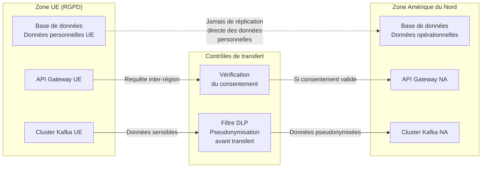
```mermaid
flowchart LR
    subgraph "Zone UE (RGPD)"
        DB_EU["Base de données<br/>Données personnelles UE"]
        API_EU["API Gateway UE"]
        KAFKA_EU["Cluster Kafka UE"]
    end

    subgraph "Contrôles de transfert"
        DLP_FILTER["Filtre DLP<br/>Pseudonymisation<br/>avant transfert"]
        CONSENT["Vérification<br/>du consentement"]
    end

    subgraph "Zone Amérique du Nord"
        DB_NA["Base de données<br/>Données opérationnelles"]
        API_NA["API Gateway NA"]
        KAFKA_NA["Cluster Kafka NA"]
    end

    KAFKA_EU -->|"Données sensibles"| DLP_FILTER
    DLP_FILTER -->|"Données pseudonymisées"| KAFKA_NA
    API_EU -->|"Requête inter-région"| CONSENT
    CONSENT -->|"Si consentement valide"| API_NA
    DB_EU -.->|"Jamais de réplication<br/>directe des données<br/>personnelles"| DB_NA
```

| Technique de protection | Au repos | En transit | À la présentation | Réversible | Impact réglementaire |
|------------------------|----------|------------|-------------------|------------|---------------------|
| Chiffrement AES-256 / TDE | Oui | — | — | Oui (avec clé) | Atténuation de risque |
| TLS 1.3 / mTLS | — | Oui | — | N/A | Exigence minimale |
| Chiffrement applicatif | Oui | Oui | — | Oui (avec clé) | Protection renforcée |
| Tokenisation | Oui | — | — | Via coffre-fort uniquement | Réduit le périmètre PCI-DSS |
| Pseudonymisation | Oui | — | — | Via table de correspondance | Mesure RGPD (art. 25) |
| Masquage dynamique | — | — | Oui | Non applicable | Accès selon le besoin d'en connaître |
| DLP | — | Oui | — | N/A | Prévention des fuites |
| Résidence des données | Oui | Oui | — | N/A | Exigence légale stricte |

---

### 12.3.3 Domaine Événements — Sécurisation du Bus Événementiel

Le domaine événementiel présente des défis de sécurité distincts des deux précédents. Le bus événementiel — typiquement Apache Kafka dans les architectures d'intégration modernes — opère comme le système nerveux de l'entreprise : il transporte en continu des flux massifs de données métier entre producteurs et consommateurs qui ne se connaissent pas mutuellement. Cette caractéristique de découplage, force architecturale du modèle événementiel, crée paradoxalement des vulnérabilités spécifiques. Un producteur compromis peut injecter des événements malveillants dans un flux consommé par des dizaines de services. Un consommateur non autorisé peut s'abonner silencieusement à un topic contenant des données confidentielles. L'absence de frontière requête/réponse rend les mécanismes de contrôle d'accès traditionnels insuffisants.

#### Authentification et autorisation dans Apache Kafka

Apache Kafka supporte plusieurs mécanismes d'authentification via le framework SASL (Simple Authentication and Security Layer), chacun adapté à un contexte opérationnel spécifique.

**SASL/PLAIN.** Authentification par nom d'utilisateur et mot de passe transmis en clair. Ce mécanisme n'est acceptable qu'en combinaison avec TLS pour protéger les identifiants en transit. Il convient aux environnements de développement et de test, mais sa simplicité le rend inadapté à la production dans les contextes exigeants.

**SASL/SCRAM (Salted Challenge Response Authentication Mechanism).** Mécanisme défi-réponse où le mot de passe n'est jamais transmis sur le réseau, même en l'absence de TLS. SCRAM-SHA-256 ou SCRAM-SHA-512 offrent une sécurité nettement supérieure à PLAIN et constituent le minimum recommandé pour les environnements de production.

**SASL/OAUTHBEARER.** Authentification fondée sur des jetons OAuth 2.0, permettant l'intégration avec les fournisseurs d'identité d'entreprise (Keycloak, Azure AD, Okta). Ce mécanisme est le plus adapté aux architectures Zero Trust car il s'appuie sur des jetons à durée de vie limitée, émis par un serveur d'autorisation centralisé, et porteurs de scopes et de claims qui peuvent alimenter les décisions d'autorisation.

> **Configuration recommandée**
> En production, privilégier SASL/OAUTHBEARER pour l'authentification des clients Kafka. Ce choix permet d'unifier la gestion des identités avec le reste de l'infrastructure d'intégration (APIs, services) et d'exploiter les jetons JWT pour porter les informations d'autorisation (tenant, rôle, scopes autorisés).

**ACLs Kafka.** Le système d'autorisation natif de Kafka repose sur des listes de contrôle d'accès (ACLs) qui définissent les permissions à plusieurs niveaux de granularité : cluster, topic, consumer group et transaction ID. Chaque ACL associe un principal (identité authentifiée), une opération (Read, Write, Create, Delete, Alter, Describe), une ressource (topic, group) et une décision (Allow ou Deny).

```properties
# Exemple de configuration ACLs Kafka
# Autoriser le service order-service à écrire dans le topic orders
kafka-acls --bootstrap-server kafka:9092 \
  --add \
  --allow-principal User:order-service \
  --operation Write \
  --topic orders

# Autoriser le service billing-service à lire depuis le topic orders
# avec un consumer group spécifique
kafka-acls --bootstrap-server kafka:9092 \
  --add \
  --allow-principal User:billing-service \
  --operation Read \
  --topic orders \
  --group billing-consumer-group

# Interdire tout accès non explicitement autorisé (deny by default)
kafka-acls --bootstrap-server kafka:9092 \
  --add \
  --deny-principal User:* \
  --operation All \
  --topic orders

# Autoriser le service analytics à lire les topics commençant par "events."
kafka-acls --bootstrap-server kafka:9092 \
  --add \
  --allow-principal User:analytics-service \
  --operation Read \
  --topic events. \
  --resource-pattern-type prefixed
```

#### Chiffrement des événements

Le chiffrement dans le domaine événementiel intervient à deux niveaux complémentaires dont les objectifs diffèrent.

**Chiffrement au niveau transport.** TLS sécurise les communications entre les clients (producteurs et consommateurs) et les brokers Kafka, ainsi qu'entre les brokers eux-mêmes (réplication inter-broker). Cette couche protège contre l'interception réseau mais ne protège pas les données au repos sur les disques des brokers.

**Chiffrement au niveau message (*payload encryption*).** Le chiffrement du contenu des événements avant leur publication garantit que même un administrateur Kafka, un attaquant ayant accès aux disques des brokers, ou un consommateur non autorisé ayant contourné les ACLs ne peut lire les données. Le producteur chiffre le payload avec une clé spécifique au topic ou au tenant ; seuls les consommateurs disposant de la clé de déchiffrement peuvent exploiter les événements.

**Schema Registry et schémas chiffrés.** Le Schema Registry de Confluent stocke les schémas Avro, Protobuf ou JSON Schema utilisés pour la sérialisation des événements. Lorsque le chiffrement au niveau message est activé, les schémas eux-mêmes peuvent contenir des annotations désignant les champs à chiffrer sélectivement. Cette approche, connue sous le nom de *field-level encryption*, permet de chiffrer uniquement les champs sensibles (numéro de client, montant) tout en laissant les métadonnées (type d'événement, horodatage) lisibles pour le routage et le monitoring.

> **Définition formelle**
> **Field-level encryption** : Technique de chiffrement sélectif où seuls certains champs d'un enregistrement sont chiffrés, tandis que les métadonnées et les champs non sensibles restent en clair. Cette granularité permet de concilier sécurité des données sensibles et exploitabilité des événements pour le routage, le monitoring et l'analytique non sensible.

```properties
# Configuration Kafka broker — Sécurité TLS et SASL
# Fichier server.properties

# Listeners sécurisés
listeners=SASL_SSL://0.0.0.0:9093
advertised.listeners=SASL_SSL://kafka-broker-1.entreprise.com:9093
inter.broker.listener.name=SASL_SSL

# Configuration TLS
ssl.keystore.location=/var/ssl/private/kafka-broker-1.jks
ssl.keystore.password=${KEYSTORE_PASSWORD}
ssl.key.password=${KEY_PASSWORD}
ssl.truststore.location=/var/ssl/private/kafka-truststore.jks
ssl.truststore.password=${TRUSTSTORE_PASSWORD}
ssl.enabled.protocols=TLSv1.3
ssl.protocol=TLSv1.3
ssl.client.auth=required

# Configuration SASL
sasl.enabled.mechanisms=OAUTHBEARER
sasl.mechanism.inter.broker.protocol=OAUTHBEARER
listener.name.sasl_ssl.oauthbearer.sasl.jaas.config= \
  org.apache.kafka.common.security.oauthbearer.OAuthBearerLoginModule required \
  clientId="kafka-broker" \
  clientSecret="${BROKER_CLIENT_SECRET}" \
  scope="kafka" \
  tokenEndpointUrl="https://idp.entreprise.com/oauth2/token";

# Autorisation
authorizer.class.name=kafka.security.authorizer.AclAuthorizer
allow.everyone.if.no.acl.found=false
super.users=User:kafka-admin
```

#### Intégrité et authenticité des messages

Au-delà de la confidentialité assurée par le chiffrement, l'intégrité et l'authenticité des événements constituent des préoccupations critiques dans une architecture événementielle.

**Signature numérique des événements.** La signature cryptographique d'un événement par son producteur permet aux consommateurs de vérifier que l'événement n'a pas été altéré après sa publication et qu'il provient bien du producteur déclaré. Le producteur signe le payload (ou un hachage du payload) avec sa clé privée ; le consommateur vérifie la signature avec la clé publique du producteur. Ce mécanisme est particulièrement important dans les architectures où plusieurs producteurs publient dans le même topic, rendant l'attribution d'origine critique.

**Prévention de la falsification et du rejeu.** Une attaque par rejeu (*replay attack*) consiste à capturer un événement légitime et à le republier ultérieurement pour provoquer un traitement dupliqué. Bien que l'idempotence des consommateurs (principe établi au chapitre V) constitue la première défense, des mécanismes complémentaires renforcent la protection : l'inclusion d'un nonce (nombre aléatoire à usage unique) dans chaque événement, la vérification de la fenêtre temporelle (rejet des événements dont l'horodatage est trop ancien) et la déduplication par identifiant unique au niveau du consommateur.

**Headers de traçabilité sécurisés.** Les en-têtes (*headers*) Kafka transportent les métadonnées de traçabilité : `correlation-id` pour le suivi distribué, `source-service` pour l'identification du producteur, `trace-id` pour l'intégration avec OpenTelemetry. Ces en-têtes doivent être protégés contre la falsification. Un attaquant ne doit pas pouvoir injecter un `source-service` frauduleux pour masquer l'origine réelle d'un événement. La signature numérique, lorsqu'elle couvre les en-têtes en plus du payload, garantit cette protection.

La configuration suivante illustre la mise en place d'un producteur Kafka sécurisé avec authentification OAUTHBEARER et TLS.

```java
// Configuration d'un producteur Kafka sécurisé (Java)
Properties producerConfig = new Properties();

// Bootstrap et protocole de sécurité
producerConfig.put(ProducerConfig.BOOTSTRAP_SERVERS_CONFIG,
    "kafka-broker-1.entreprise.com:9093");
producerConfig.put("security.protocol", "SASL_SSL");

// Configuration TLS
producerConfig.put("ssl.truststore.location",
    "/var/ssl/private/kafka-truststore.jks");
producerConfig.put("ssl.truststore.password", truststorePassword);
producerConfig.put("ssl.enabled.protocols", "TLSv1.3");

// Configuration SASL/OAUTHBEARER
producerConfig.put("sasl.mechanism", "OAUTHBEARER");
producerConfig.put("sasl.jaas.config",
    "org.apache.kafka.common.security.oauthbearer.OAuthBearerLoginModule required "
    + "clientId=\"order-service\" "
    + "clientSecret=\"" + clientSecret + "\" "
    + "scope=\"kafka:write\" "
    + "tokenEndpointUrl=\"https://idp.entreprise.com/oauth2/token\";");

// Sérialisation avec Schema Registry
producerConfig.put(ProducerConfig.KEY_SERIALIZER_CLASS_CONFIG,
    StringSerializer.class.getName());
producerConfig.put(ProducerConfig.VALUE_SERIALIZER_CLASS_CONFIG,
    KafkaAvroSerializer.class.getName());
producerConfig.put("schema.registry.url",
    "https://schema-registry.entreprise.com:8081");
producerConfig.put("schema.registry.ssl.truststore.location",
    "/var/ssl/private/kafka-truststore.jks");

// Idempotence du producteur (prévention des doublons côté broker)
producerConfig.put(ProducerConfig.ENABLE_IDEMPOTENCE_CONFIG, true);
producerConfig.put(ProducerConfig.ACKS_CONFIG, "all");

KafkaProducer<String, OrderEvent> producer =
    new KafkaProducer<>(producerConfig);
```

> **Perspective stratégique**
> L'intégrité des événements prend une dimension particulière dans les architectures d'event sourcing, où le flux d'événements constitue la source de vérité du système. Un événement falsifié ne corrompt pas seulement un traitement ponctuel : il altère de manière permanente l'historique du système. La signature numérique des événements dans un contexte d'event sourcing n'est pas une option de sécurité avancée mais une nécessité architecturale fondamentale.

#### Isolation et multi-tenancy

Dans les architectures d'intégration servant plusieurs locataires (*tenants*) — qu'il s'agisse de divisions internes, de clients d'une plateforme SaaS ou de partenaires d'un écosystème — l'isolation des flux événementiels constitue une exigence de sécurité de premier ordre.

**Isolation par namespace et topic.** L'approche la plus courante consiste à dédier des topics Kafka par tenant, suivant une convention de nommage structurée (par exemple, `tenant-acme.orders`, `tenant-globex.orders`). Les ACLs garantissent qu'un tenant ne peut ni lire ni écrire dans les topics d'un autre tenant. Cette isolation logique est renforcée par des quotas de production et de consommation qui empêchent un tenant de monopoliser les ressources du cluster.

**Quotas par tenant.** Kafka permet de définir des quotas à plusieurs niveaux : débit de production (octets/seconde par client), débit de consommation, et taux de requêtes (connections/seconde). Ces quotas protègent le cluster contre les pics d'activité d'un tenant et préviennent les attaques par déni de service où un tenant malveillant ou défaillant saturerait les ressources partagées.

**Prévention des attaques par déni de service sur le bus.** Un bus événementiel partagé est vulnérable à plusieurs formes de déni de service : saturation du stockage par publication massive de messages volumineux, épuisement des connexions broker par multiplication des clients, ou dégradation des performances par des requêtes de métadonnées excessives. Les mécanismes de défense combinent les quotas par client, la limitation du nombre de connexions, le dimensionnement des partitions par tenant et la surveillance proactive des indicateurs de saturation.

```properties
# Configuration des quotas Kafka par tenant
# Limiter le débit de production à 10 Mo/s pour le tenant acme
kafka-configs --bootstrap-server kafka:9092 \
  --alter \
  --add-config 'producer_byte_rate=10485760' \
  --entity-type users \
  --entity-name tenant-acme

# Limiter le débit de consommation à 20 Mo/s pour le tenant acme
kafka-configs --bootstrap-server kafka:9092 \
  --alter \
  --add-config 'consumer_byte_rate=20971520' \
  --entity-type users \
  --entity-name tenant-acme

# Limiter le taux de requêtes (connections/seconde) pour le tenant globex
kafka-configs --bootstrap-server kafka:9092 \
  --alter \
  --add-config 'request_percentage=25' \
  --entity-type users \
  --entity-name tenant-globex
```

**Audit et traçabilité des accès.** Le journal d'audit (*audit log*) de Kafka enregistre toutes les opérations d'autorisation — les accès accordés comme les accès refusés. Cette traçabilité est essentielle pour la détection d'intrusion (un pic d'accès refusés peut signaler une tentative d'exploration latérale), la conformité réglementaire (preuve que les données n'ont été accédées que par les acteurs autorisés) et l'investigation post-incident (reconstitution chronologique des actions d'un compte compromis). Confluent Platform enrichit ces journaux avec des métadonnées supplémentaires : identité du client, adresse IP source, topic concerné, opération tentée et décision rendue.

> **Exemple concret**
> Une plateforme SaaS multi-tenant utilisant Kafka comme bus événementiel a implémenté une stratégie d'isolation à trois niveaux. Premier niveau : authentification OAUTHBEARER avec des jetons contenant le claim `tenant_id`, garantissant l'identification du tenant à chaque connexion. Deuxième niveau : ACLs par préfixe de topic (`tenant-{id}.*`), assurant l'isolation logique des flux. Troisième niveau : quotas de production et consommation par tenant, dimensionnés proportionnellement au contrat de service (SLA). Cette approche a permis de consolider 47 tenants sur un cluster Kafka unique tout en maintenant une isolation de sécurité équivalente à des clusters dédiés.

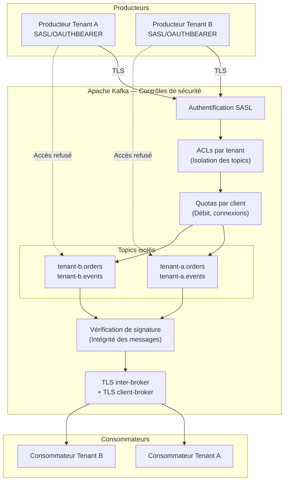
```mermaid
flowchart TB
    subgraph "Producteurs"
        P_A["Producteur Tenant A<br/>SASL/OAUTHBEARER"]
        P_B["Producteur Tenant B<br/>SASL/OAUTHBEARER"]
    end

    subgraph "Apache Kafka — Contrôles de sécurité"
        direction TB
        AUTH_K["Authentification SASL"]
        ACL["ACLs par tenant<br/>(Isolation des topics)"]
        QUOTA["Quotas par client<br/>(Débit, connexions)"]

        subgraph "Topics isolés"
            T_A["tenant-a.orders<br/>tenant-a.events"]
            T_B["tenant-b.orders<br/>tenant-b.events"]
        end

        TLS_K["TLS inter-broker<br/>+ TLS client-broker"]
        SIGN["Vérification de signature<br/>(Intégrité des messages)"]
    end

    subgraph "Consommateurs"
        C_A["Consommateur Tenant A"]
        C_B["Consommateur Tenant B"]
    end

    P_A -->|"TLS"| AUTH_K
    P_B -->|"TLS"| AUTH_K
    AUTH_K --> ACL
    ACL --> QUOTA
    QUOTA --> T_A
    QUOTA --> T_B
    T_A --> SIGN
    T_B --> SIGN
    SIGN --> TLS_K
    TLS_K --> C_A
    TLS_K --> C_B

    P_A -.->|"Accès refusé"| T_B
    P_B -.->|"Accès refusé"| T_A
```

---

### Synthèse : Matrice de Sécurité des Trois Domaines

La table suivante croise les trois domaines d'intégration avec les cinq préoccupations transversales de sécurité, synthétisant les mécanismes recommandés pour chaque intersection.

| Préoccupation | Applications (Le Verbe) | Données (Le Nom) | Événements (Le Signal) |
|---------------|------------------------|-------------------|----------------------|
| **Authentification** | JWT / OAuth 2.0 via API Gateway ; mTLS pour le trafic Est-Ouest | Authentification base de données (Kerberos, certificats) ; IAM cloud | SASL (OAUTHBEARER recommandé) ; mTLS client-broker |
| **Autorisation** | Scopes OAuth, RBAC/ABAC appliqués par le Gateway et les services | Row-Level Security (RLS) ; Column-Level Security ; politiques IAM | ACLs Kafka (topic, consumer group, cluster) ; RBAC Confluent |
| **Chiffrement** | TLS 1.3 (Nord-Sud) ; mTLS (Est-Ouest) | AES-256 au repos (TDE) ; TLS en transit ; chiffrement applicatif | TLS broker/client ; chiffrement au niveau message ; field-level encryption |
| **Intégrité** | Validation des entrées (JSON Schema) ; WAF ; HMAC des webhooks | Checksums ; hachage des enregistrements ; audit trail immuable | Signature numérique des événements ; nonce anti-rejeu ; headers protégés |
| **Audit** | Journalisation des appels API (requête, réponse, identité, horodatage) | Journaux d'accès base de données ; data lineage ; classification DLP | Consumer offsets ; audit logs Kafka ; traçabilité par correlation-id |

## 12.4 Gestion des Secrets et Cryptographie

Dans une architecture d'intégration distribuée, les secrets sont omniprésents. Identifiants de bases de données, clés d'API, certificats TLS, jetons d'accès OAuth, clés de chiffrement : chaque connexion entre services repose sur un ou plusieurs artefacts cryptographiques dont la compromission suffirait à anéantir l'ensemble des contrôles d'accès décrits aux sections précédentes. L'authentification la plus rigoureuse, les politiques d'autorisation les plus fines, le chiffrement le plus robuste -- tout s'effondre si les secrets qui les sous-tendent sont exposés, partagés sans contrôle ou jamais renouvelés.

La gestion des secrets constitue donc le socle opérationnel de la sécurité des flux d'intégration. Elle répond à une question en apparence simple mais redoutablement complexe dans un système distribué : comment garantir que chaque composant dispose des credentials nécessaires à son fonctionnement, sans jamais exposer ces credentials à un acteur non autorisé, et sans créer de dépendance fragile sur des secrets statiques dont la compromission passerait inaperçue ?

Cette section explore les trois dimensions de cette problématique : le stockage sécurisé des secrets dans des coffres-forts numériques, la rotation et l'injection automatiques qui éliminent les secrets statiques, et l'infrastructure à clé publique (PKI) qui fournit le fondement cryptographique de la confiance entre services.

### 12.4.1 Coffre-forts numériques (HashiCorp Vault, AWS Secrets Manager)

#### Le problème des secrets en clair

Le point de départ de toute réflexion sur la gestion des secrets est un constat accablant : dans la majorité des organisations, les secrets sont disséminés dans le code source, les fichiers de configuration, les variables d'environnement, les scripts de déploiement et les pipelines CI/CD. Une étude de GitGuardian (2024) révèle que plus de 12,8 millions de secrets ont été détectés dans les dépôts publics GitHub au cours de l'année, soit une augmentation de 28 % par rapport à l'année précédente. Les dépôts privés ne sont pas épargnés : les audits internes révèlent régulièrement des credentials de production stockés en clair dans des fichiers `.env`, des tokens d'API codés en dur dans des constantes applicatives, et des certificats partagés par courriel entre équipes.

> **Incident de terrain**
> En 2023, un acteur malveillant a compromis l'environnement CI/CD d'un fournisseur majeur de solutions d'identité en exploitant un jeton d'accès stocké en clair dans une variable d'environnement d'un pipeline de build. Ce jeton, qui n'avait jamais été soumis à rotation depuis sa création deux ans plus tôt, donnait accès aux archives de support client contenant des fichiers HAR avec des cookies de session actifs. L'incident a affecté des milliers d'organisations clientes et illustre parfaitement la chaîne de causalité : secret statique, absence de rotation, surface d'attaque excessive, compromission en cascade.

Ce problème n'est pas uniquement technique. Il résulte d'une tension fondamentale entre la facilité d'utilisation et la sécurité. Un développeur qui doit accéder à une base de données de test choisira naturellement la solution la plus rapide -- copier la chaîne de connexion dans un fichier de configuration local. Sans outillage adapté, la friction associée à une gestion sécurisée des secrets est telle que les pratiques dangereuses deviennent la norme.

La taxonomie des secrets dans une architecture d'intégration révèle l'étendue du problème :

| Type de secret | Exemples | Durée de vie typique | Risque en cas de compromission |
|----------------|----------|----------------------|-------------------------------|
| Credentials de bases de données | Mot de passe PostgreSQL, chaîne de connexion Oracle | Mois à années (statique) | Accès complet aux données métier |
| Clés d'API | Clé Stripe, token SendGrid, clé Google Maps | Années (rarement renouvelé) | Usage frauduleux, coûts financiers |
| Certificats TLS | Certificat serveur, certificat client mTLS | 1 an (Let's Encrypt : 90 jours) | Interception de trafic (MitM) |
| Tokens OAuth/JWT | Access token, refresh token | Minutes à heures | Usurpation d'identité |
| Clés de chiffrement | Clé AES pour données au repos, clé de signature | Années | Déchiffrement de données sensibles |
| Credentials d'infrastructure | Token Kubernetes, clé SSH, token Terraform | Variable | Compromission de l'infrastructure |
| Secrets inter-services | Shared secrets pour HMAC, clés de bus de messages | Mois à années | Injection de messages frauduleux |

#### Architecture de HashiCorp Vault

HashiCorp Vault s'est imposé comme la solution de référence pour la gestion centralisée des secrets dans les architectures cloud-native. Son architecture repose sur trois concepts fondamentaux : les **moteurs de secrets** (*secrets engines*), les **méthodes d'authentification** (*auth methods*) et les **politiques d'accès** (*policies*).

> **Définition formelle**
> **Coffre-fort numérique** (*Secrets Vault*) : Service centralisé de gestion du cycle de vie des secrets, fournissant le stockage chiffré, le contrôle d'accès granulaire, l'audit exhaustif et la génération dynamique de credentials éphémères. À la différence d'un simple magasin de clés, un coffre-fort numérique gère activement les secrets : il les génère, les distribue, les renouvelle et les révoque.

Les **moteurs de secrets** sont des composants modulaires qui gèrent différentes catégories de secrets. Le moteur KV (*Key-Value*) stocke des paires clé-valeur statiques avec versionnage. Le moteur de bases de données génère des credentials éphémères à la demande pour PostgreSQL, MySQL, Oracle et d'autres SGBD. Le moteur PKI émet des certificats X.509. Le moteur AWS génère des credentials IAM temporaires. Le moteur Transit fournit le chiffrement en tant que service (*Encryption as a Service*), permettant aux applications de chiffrer et déchiffrer des données sans jamais manipuler directement les clés de chiffrement. Cette architecture modulaire permet à Vault de servir de point unique de gestion pour l'ensemble des secrets d'une organisation.

Les **méthodes d'authentification** permettent aux clients de prouver leur identité avant d'accéder aux secrets. Vault supporte l'authentification par token, par certificat TLS, par rôle Kubernetes (via le ServiceAccount du pod), par identité cloud (AWS IAM, Azure MSI, GCP IAM), par LDAP, par OIDC et par de nombreux autres mécanismes. Cette diversité est essentielle dans une architecture d'intégration où les consommateurs de secrets sont hétérogènes : microservices Kubernetes, fonctions serverless, pipelines CI/CD, scripts d'administration.

Les **politiques** définissent les permissions d'accès selon le principe du moindre privilège. Elles sont exprimées en HCL (*HashiCorp Configuration Language*) et associées aux identités authentifiées via des rôles. Chaque politique spécifie les chemins (*paths*) accessibles et les capacités autorisées (*create*, *read*, *update*, *delete*, *list*, *sudo*, *deny*).

```hcl
# Politique Vault pour le service de commandes (order-service)
# Principe du moindre privilège : accès uniquement aux secrets nécessaires

# Accès en lecture seule aux credentials de la base de données
path "database/creds/order-service-role" {
  capabilities = ["read"]
}

# Accès au moteur Transit pour chiffrer les données client
path "transit/encrypt/customer-data" {
  capabilities = ["update"]
}

path "transit/decrypt/customer-data" {
  capabilities = ["update"]
}

# Accès aux certificats TLS du service
path "pki/issue/order-service" {
  capabilities = ["create", "update"]
}

# Accès en lecture aux secrets de configuration partagés
path "kv/data/shared/integration-config" {
  capabilities = ["read"]
}

# Interdiction explicite d'accès aux secrets d'autres services
path "database/creds/payment-*" {
  capabilities = ["deny"]
}

path "database/creds/billing-*" {
  capabilities = ["deny"]
}
```

L'architecture interne de Vault mérite une attention particulière. Le stockage sous-jacent (*storage backend*) est chiffré par une clé maîtresse elle-même protégée par un mécanisme de scellement (*seal/unseal*). Au démarrage, Vault est scellé : il possède les données chiffrées mais pas la clé pour les déchiffrer. Le déscellement requiert un quorum de clés (*Shamir's Secret Sharing*) ou l'utilisation d'un mécanisme d'auto-unseal via un HSM ou un service KMS cloud. Cette architecture garantit qu'une compromission du stockage sous-jacent ne suffit pas à accéder aux secrets.

#### Solutions cloud natives

Les fournisseurs cloud proposent des services managés de gestion de secrets qui offrent une alternative à Vault pour les organisations engagées dans un écosystème cloud spécifique.

**AWS Secrets Manager** fournit le stockage chiffré, la rotation automatique via des fonctions Lambda, et l'intégration native avec les services AWS (RDS, Redshift, DocumentDB). La rotation automatique pour les bases de données RDS est prête à l'emploi : Secrets Manager gère l'ensemble du cycle via une fonction Lambda prédéfinie qui crée un nouvel utilisateur, valide la connexion, puis bascule la version active.

**Azure Key Vault** offre une séparation entre secrets, clés et certificats avec une intégration profonde dans l'écosystème Azure (Managed Identity, Azure Policy). La fonctionnalité Managed HSM permet de bénéficier d'un module matériel de sécurité dédié pour les cas d'usage les plus exigeants (conformité FIPS 140-2 Level 3).

**Google Cloud Secret Manager** propose un modèle simple avec versionnage, intégration IAM et réplication géographique automatique. Son API est particulièrement bien adaptée aux architectures serverless sur Cloud Functions et Cloud Run.

| Critère | HashiCorp Vault | AWS Secrets Manager | Azure Key Vault | GCP Secret Manager |
|---------|----------------|--------------------|-----------------|--------------------|
| Déploiement | Self-hosted ou Cloud (HCP) | Service managé AWS | Service managé Azure | Service managé GCP |
| Secrets dynamiques | Oui (natif) | Rotation Lambda | Non natif | Non natif |
| Multi-cloud | Oui | Non | Non | Non |
| Moteur de transit (chiffrement) | Oui | Non (utiliser KMS) | Oui (HSM optionnel) | Non (utiliser Cloud KMS) |
| Auth Kubernetes native | Oui | Via IRSA | Via Workload Identity | Via Workload Identity |
| PKI intégrée | Oui | Non (utiliser ACM) | Oui | Non (utiliser CAS) |
| Audit intégré | Oui (audit log détaillé) | Via CloudTrail | Via Azure Monitor | Via Cloud Audit Logs |
| Coût | Licence + infra (ou HCP) | Par secret par mois | Par opération | Par version active |
| Complexité opérationnelle | Élevée | Faible | Faible | Faible |

> **Perspective stratégique**
> Le choix entre Vault et une solution cloud native n'est pas binaire. Dans une architecture d'intégration multi-cloud ou hybride, Vault fournit une couche d'abstraction unifiée au-dessus des mécanismes cloud hétérogènes. Dans un environnement mono-cloud, le service managé du fournisseur offre une intégration plus fluide et une charge opérationnelle réduite. L'architecte d'intégration doit évaluer ce compromis en fonction de la stratégie cloud de l'organisation et de la complexité de son paysage d'intégration. Une approche hybride est fréquente : Vault pour les secrets multi-cloud et les secrets dynamiques, le service managé du fournisseur pour les secrets spécifiques à un environnement cloud.

Le diagramme suivant illustre le flux d'accès aux secrets via Vault dans une architecture de microservices déployée sur Kubernetes.

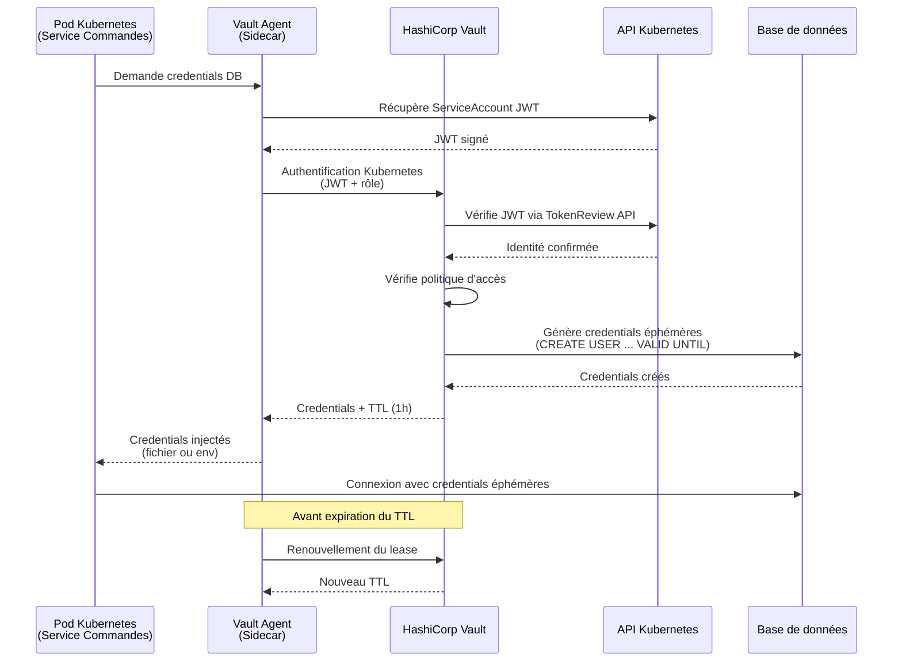
```mermaid
sequenceDiagram
    participant Pod as Pod Kubernetes<br/>(Service Commandes)
    participant Agent as Vault Agent<br/>(Sidecar)
    participant Vault as HashiCorp Vault
    participant K8s as API Kubernetes
    participant DB as Base de données

    Pod->>Agent: Demande credentials DB
    Agent->>K8s: Récupère ServiceAccount JWT
    K8s-->>Agent: JWT signé
    Agent->>Vault: Authentification Kubernetes<br/>(JWT + rôle)
    Vault->>K8s: Vérifie JWT via TokenReview API
    K8s-->>Vault: Identité confirmée
    Vault->>Vault: Vérifie politique d'accès
    Vault->>DB: Génère credentials éphémères<br/>(CREATE USER ... VALID UNTIL)
    DB-->>Vault: Credentials créés
    Vault-->>Agent: Credentials + TTL (1h)
    Agent-->>Pod: Credentials injectés<br/>(fichier ou env)
    Pod->>DB: Connexion avec credentials éphémères

    Note over Agent,Vault: Avant expiration du TTL
    Agent->>Vault: Renouvellement du lease
    Vault-->>Agent: Nouveau TTL
```

### 12.4.2 Rotation automatique et injection des secrets

#### L'impératif de la rotation

La rotation des secrets est le processus de remplacement périodique d'un secret par une nouvelle valeur. Cette pratique, souvent perçue comme une contrainte opérationnelle, répond à trois objectifs fondamentaux.

Le premier est la **limitation de la fenêtre d'exposition**. Si un secret est compromis sans que l'organisation le détecte -- scénario plus fréquent qu'on ne l'imagine --, la rotation limite la durée pendant laquelle l'attaquant peut exploiter ce secret. Un mot de passe de base de données ayant une rotation quotidienne offre une fenêtre d'exploitation maximale de 24 heures, contre une durée indéfinie pour un secret statique.

Le second est la **conformité réglementaire**. Les référentiels PCI-DSS (exigence 8.2.4), SOC 2 et les politiques internes des grandes organisations imposent des cycles de rotation pour les credentials privilégiés. L'absence de rotation automatisée contraint les équipes à des processus manuels fastidieux, sources d'erreurs et de temps d'arrêt.

Le troisième est la **limitation des dégâts d'une fuite non détectée**. Les études post-mortem d'incidents de sécurité révèlent que le délai moyen de détection d'une compromission (*dwell time*) dépasse 200 jours dans de nombreux secteurs. Un secret statique compromis offre un accès persistant pendant toute cette durée. La rotation réduit mécaniquement ce risque.

> **Définition formelle**
> **Secret dynamique** (*Dynamic Secret*) : Credential généré à la demande par un coffre-fort numérique, associé à une durée de vie limitée (TTL) et automatiquement révoqué à expiration. À la différence d'un secret statique soumis à rotation périodique, un secret dynamique n'existe qu'en réponse à une demande d'accès authentifiée et autorisée, éliminant ainsi le risque de compromission par exfiltration d'un magasin de secrets.

#### Patterns de rotation

Trois modèles de rotation coexistent dans les architectures d'intégration modernes.

**La rotation périodique** remplace le secret à intervalle fixe (quotidien, hebdomadaire). Elle est simple à implémenter mais crée un intervalle durant lequel l'ancien et le nouveau secret doivent coexister (*dual-secret rotation*) pour éviter les interruptions de service. AWS Secrets Manager implémente ce patron via des fonctions Lambda qui orchestrent le cycle en quatre étapes : création du nouveau secret (*createSecret*), validation de sa fonctionnalité (*testSecret*), finalisation de la bascule (*finishSecret*) et nettoyage de l'ancien secret. Durant la phase de transition, les deux versions sont actives, ce qui nécessite que les applications supportent le rechargement dynamique de leurs credentials.

**La rotation à la demande** est déclenchée par un événement : détection d'anomalie, départ d'un employé, alerte de sécurité. Elle exige une capacité de rotation instantanée, ce qui présuppose une automatisation complète du processus. Ce modèle est particulièrement pertinent pour les réponses aux incidents : lorsqu'une compromission est suspectée, la capacité de renouveler tous les secrets affectés en quelques minutes -- plutôt qu'en heures ou jours -- réduit considérablement la fenêtre d'exploitation.

**Les secrets dynamiques** constituent le modèle le plus avancé : au lieu de remplacer périodiquement un secret existant, le coffre-fort génère un nouveau credential à chaque demande d'accès. Vault excelle dans ce domaine : son moteur de base de données crée un utilisateur temporaire avec les permissions appropriées, associé à un TTL (typiquement 1 heure), et révoque automatiquement l'utilisateur à expiration. Ce modèle élimine complètement la notion de secret à long terme. Chaque instance de service dispose de son propre credential unique, ce qui permet une traçabilité fine des accès et une révocation ciblée sans impact sur les autres instances.

| Modèle | Fenêtre d'exposition | Complexité | Impact opérationnel | Cas d'usage recommandé |
|--------|---------------------|------------|---------------------|------------------------|
| Rotation périodique | Intervalle de rotation | Moyenne | Temps d'arrêt potentiel lors de la bascule | Systèmes legacy, credentials partagés |
| Rotation à la demande | Variable (réactive) | Moyenne | Intervention manuelle ou automatisée | Réponse aux incidents, off-boarding |
| Secrets dynamiques | Durée du TTL (minutes/heures) | Élevée (coffre-fort requis) | Aucun (transparent) | Microservices, cloud-native |

#### Injection de secrets dans les conteneurs

Dans un environnement Kubernetes, l'injection de secrets dans les pods constitue un défi spécifique. Trois approches principales existent, chacune avec ses compromis.

Les **Kubernetes Secrets natifs** stockent les secrets dans etcd sous forme encodée en base64 (et non chiffrée par défaut). Ils sont montés comme fichiers ou variables d'environnement dans les pods. Cette approche, bien que simple, présente des faiblesses significatives : les secrets sont stockés en clair dans etcd (sauf activation explicite du chiffrement au repos via `EncryptionConfiguration`), leur rotation exige le redémarrage des pods, et tout utilisateur disposant d'un accès `get` sur les Secrets du namespace peut lire l'ensemble des credentials. De plus, les secrets montés en variables d'environnement sont visibles via `/proc/<pid>/environ`, ce qui constitue un vecteur d'exfiltration supplémentaire.

L'**injection par sidecar** (Vault Agent Injector) déploie un conteneur auxiliaire dans chaque pod qui s'authentifie auprès de Vault, récupère les secrets et les injecte sous forme de fichiers dans un volume partagé. Les secrets sont renouvelés automatiquement sans redémarrage du pod. L'Agent Vault surveille les TTL et déclenche le renouvellement avant expiration. Cette approche offre un excellent compromis entre sécurité et facilité d'intégration, mais ajoute un conteneur sidecar à chaque pod, augmentant la consommation de ressources.

Le **Secrets Store CSI Driver** avec le provider Vault monte les secrets comme un volume CSI (*Container Storage Interface*), offrant une intégration transparente avec l'API Kubernetes tout en maintenant Vault comme source de vérité. Cette approche permet de synchroniser optionnellement les secrets vers des Kubernetes Secrets natifs pour les applications qui les consomment via des variables d'environnement.

```yaml
# External Secrets Operator - Synchronisation Vault -> Kubernetes
apiVersion: external-secrets.io/v1beta1
kind: ExternalSecret
metadata:
  name: order-service-db-credentials
  namespace: order-service
spec:
  refreshInterval: 15m
  secretStoreRef:
    name: vault-backend
    kind: ClusterSecretStore
  target:
    name: db-credentials
    creationPolicy: Owner
    template:
      type: Opaque
      data:
        # Template pour la chaîne de connexion
        connection-string: |
          postgresql://{{ .username }}:{{ .password }}@postgres.internal:5432/orders?sslmode=require
  data:
    - secretKey: username
      remoteRef:
        key: database/creds/order-service-role
        property: username
    - secretKey: password
      remoteRef:
        key: database/creds/order-service-role
        property: password
---
# Utilisation dans le Deployment
apiVersion: apps/v1
kind: Deployment
metadata:
  name: order-service
  namespace: order-service
spec:
  template:
    spec:
      containers:
        - name: order-service
          image: registry.internal/order-service:v2.3.1
          env:
            - name: DATABASE_URL
              valueFrom:
                secretKeyRef:
                  name: db-credentials
                  key: connection-string
          volumeMounts:
            - name: tls-certs
              mountPath: /etc/tls
              readOnly: true
      volumes:
        - name: tls-certs
          secret:
            secretName: order-service-tls
```

> **Exemple concret**
> **Anti-patron : secrets dans les images Docker.** L'inclusion de secrets dans les images Docker -- que ce soit dans les layers de build, les arguments `ARG`, ou les fichiers copiés dans l'image -- constitue un anti-patron critique. Même si un secret est supprimé dans un layer subséquent, il reste accessible dans les layers précédents via `docker history` ou l'inspection directe du système de fichiers. En 2024, des chercheurs en sécurité ont identifié plus de 8 000 credentials valides dans des images publiques sur Docker Hub. La règle est absolue : jamais de secret dans une image Docker, même temporairement. Les builds multi-étapes (*multi-stage builds*) avec des mounts secrets (`--mount=type=secret`) offrent une alternative sûre pour les cas où un secret est nécessaire durant le build (par exemple, un token pour accéder à un registre de packages privé).

### 12.4.3 PKI et gestion du cycle de vie des certificats

#### Infrastructure à clé publique pour l'entreprise

L'infrastructure à clé publique (PKI -- *Public Key Infrastructure*) fournit le socle cryptographique sur lequel reposent l'authentification mutuelle TLS (mTLS), le chiffrement des communications et la signature des artefacts dans une architecture d'intégration. La PKI permet d'établir une chaîne de confiance hiérarchique : une autorité de certification racine (*Root CA*) délègue à des autorités intermédiaires (*Intermediate CA*) le pouvoir d'émettre des certificats pour les services, qui peuvent ainsi prouver leur identité sans partage préalable de secrets symétriques.

> **Définition formelle**
> **PKI d'entreprise** (*Enterprise PKI*) : Ensemble des politiques, procédures, composants matériels et logiciels, et des rôles nécessaires à la création, la gestion, le stockage, la distribution et la révocation de certificats numériques. Dans le contexte de l'intégration, la PKI permet à chaque service de disposer d'une identité cryptographique vérifiable, fondement du Zero Trust (cf. section 12.2).

Dans une architecture d'intégration, la PKI intervient à plusieurs niveaux : les certificats de serveur authentifient les endpoints d'API, les certificats clients permettent l'authentification mutuelle entre services (mTLS, cf. section 12.3), les certificats de signature garantissent l'intégrité des messages et des artefacts échangés, et les certificats de chiffrement protègent les données sensibles au repos.

La conception d'une PKI d'entreprise pour l'intégration doit respecter le principe de séparation des préoccupations. La CA racine, dont la clé privée est le secret le plus critique de l'infrastructure, doit être maintenue hors ligne (*air-gapped*) et n'être utilisée que pour signer les certificats des CA intermédiaires. Les CA intermédiaires, dédiées à des domaines spécifiques (services d'intégration, utilisateurs, partenaires externes), émettent les certificats opérationnels. Cette hiérarchie permet de révoquer une branche entière de la PKI sans affecter les autres.

#### Cycle de vie des certificats

Le cycle de vie d'un certificat comprend quatre phases : l'émission, le déploiement, le renouvellement et la révocation. Chaque phase présente des défis spécifiques dans un environnement distribué.

L'**émission** commence par la génération d'une paire de clés (publique et privée) par le demandeur, suivie de la création d'une requête de signature de certificat (*Certificate Signing Request* -- CSR) contenant la clé publique et les informations d'identité. L'autorité de certification vérifie la demande selon sa politique, puis signe le certificat. Dans un environnement Kubernetes, cert-manager automatise ce processus en interceptant les ressources `Certificate` et en communicant avec l'émetteur configuré (Vault PKI, Let's Encrypt, CA interne).

Le **déploiement** distribue le certificat et la clé privée associée vers le service demandeur. Dans un environnement Kubernetes, cert-manager stocke les certificats comme des Secrets Kubernetes. Pour les environnements non-Kubernetes, des agents de déploiement (Vault Agent, Consul-Template) ou des webhooks de notification déclenchent la distribution.

Le **renouvellement** doit intervenir avant l'expiration du certificat pour éviter les interruptions de service. L'automatisation est critique : un certificat expiré est la cause la plus fréquente d'incidents non planifiés dans les architectures de microservices. Les outils comme cert-manager déclenchent le renouvellement automatiquement lorsque le certificat atteint un seuil de renouvellement configurable (typiquement 2/3 de la durée de vie). Le protocole ACME (*Automatic Certificate Management Environment*), popularisé par Let's Encrypt, standardise cette automatisation pour les certificats publics.

La **révocation** invalide un certificat avant son expiration naturelle, en réponse à une compromission ou à un changement d'identité. Les mécanismes traditionnels -- CRL (*Certificate Revocation Lists*) et OCSP (*Online Certificate Status Protocol*) -- présentent des limitations de scalabilité dans les architectures distribuées. Les CRL croissent linéairement avec le nombre de certificats révoqués et doivent être distribuées à tous les vérificateurs. OCSP requiert un service en ligne disponible à chaque vérification, introduisant un point de défaillance. Ces limitations poussent vers l'adoption de certificats à durée de vie courte comme alternative à la révocation explicite.

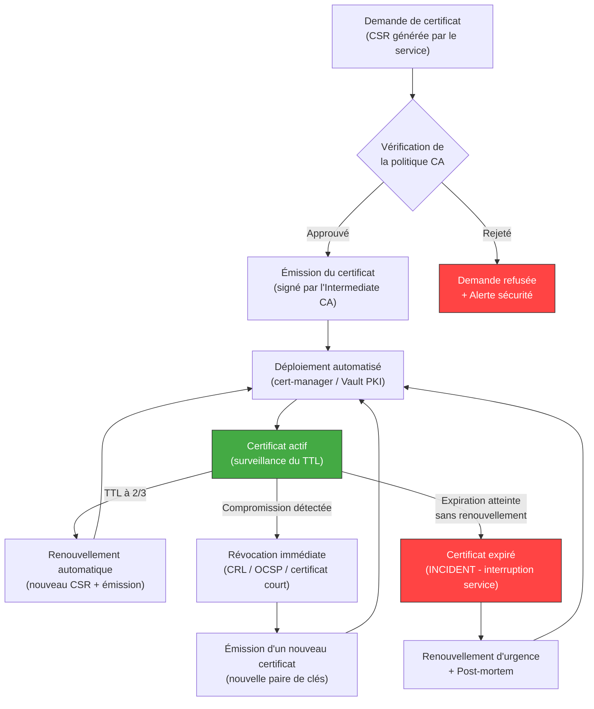
```mermaid
flowchart TD
    A["Demande de certificat<br/>(CSR générée par le service)"] --> B{"Vérification de<br/>la politique CA"}
    B -->|Approuvé| C["Émission du certificat<br/>(signé par l'Intermediate CA)"]
    B -->|Rejeté| Z["Demande refusée<br/>+ Alerte sécurité"]
    C --> D["Déploiement automatisé<br/>(cert-manager / Vault PKI)"]
    D --> E["Certificat actif<br/>(surveillance du TTL)"]
    E -->|TTL à 2/3| F["Renouvellement automatique<br/>(nouveau CSR + émission)"]
    F --> D
    E -->|Compromission détectée| G["Révocation immédiate<br/>(CRL / OCSP / certificat court)"]
    G --> H["Émission d'un nouveau certificat<br/>(nouvelle paire de clés)"]
    H --> D
    E -->|Expiration atteinte<br/>sans renouvellement| I["Certificat expiré<br/>(INCIDENT - interruption service)"]
    I --> J["Renouvellement d'urgence<br/>+ Post-mortem"]
    J --> D

    style I fill:#f44,stroke:#333,color:#fff
    style Z fill:#f44,stroke:#333,color:#fff
    style E fill:#4a4,stroke:#333,color:#fff
```

#### Certificats courts et identité SPIFFE

L'approche traditionnelle de la PKI -- certificats à longue durée de vie (1 an ou plus) avec révocation par CRL/OCSP -- s'adapte mal aux architectures cloud-native où les services sont éphémères et où des milliers de pods apparaissent et disparaissent quotidiennement.

Le framework **SPIFFE** (*Secure Production Identity Framework for Everyone*) propose une approche radicalement différente. Il attribue à chaque charge de travail une identité cryptographique sous forme de **SVID** (*SPIFFE Verifiable Identity Document*), typiquement un certificat X.509 à durée de vie courte (quelques minutes à quelques heures). L'identité SPIFFE est exprimée sous forme d'URI standardisée : `spiffe://trust-domain/path`, par exemple `spiffe://acme.com/ns/production/sa/order-service`.

L'implémentation de référence, **SPIRE** (*SPIFFE Runtime Environment*), automatise l'ensemble du cycle de vie : attestation de la charge de travail (vérification que le processus demandeur est bien celui qu'il prétend être, via des attestateurs de noeud et de charge de travail), émission du SVID, rotation avant expiration. L'attestation est un concept clé : au lieu de s'appuyer sur un secret pré-partagé pour prouver l'identité (ce qui créerait un problème de bootstrap circulaire), SPIRE utilise les propriétés observables de l'environnement d'exécution (identité du noeud Kubernetes, hash du binaire, attributs du conteneur) pour établir l'identité.

> **Perspective stratégique**
> L'adoption de certificats à durée de vie courte représente un changement de paradigme pour la sécurité des flux d'intégration. Au lieu de gérer la révocation -- problème notoirement difficile dans les systèmes distribués --, on élimine le problème en rendant les certificats suffisamment éphémères pour que leur compromission ait une fenêtre d'exploitation négligeable. Cette approche s'inscrit dans la philosophie Zero Trust (cf. section 12.2) : chaque interaction est authentifiée avec des credentials frais, et aucune confiance résiduelle ne s'accumule au fil du temps. Dans le contexte de l'intégration, SPIFFE permet à un service Kafka Connect de prouver son identité auprès d'un broker Kafka, d'un connecteur de base de données ou d'un service REST, avec un certificat renouvelé toutes les heures, sans intervention humaine ni secret statique.

---

## 12.5 Conformité Réglementaire et Audit

La sécurité technique décrite dans les sections précédentes ne prend sa pleine signification que lorsqu'elle s'inscrit dans un cadre réglementaire et normatif. L'architecte d'intégration se trouve en première ligne de cette exigence : les flux qu'il conçoit traversent les frontières organisationnelles, les domaines métier et souvent les juridictions géographiques. Un message Kafka transportant une commande client peut contenir des données personnelles (RGPD), des informations de paiement (PCI-DSS) et des données de santé (HIPAA) si le contexte métier le requiert. Chaque flux d'intégration est un vecteur potentiel de non-conformité.

Cette réalité impose à l'architecte une double compétence : technique, pour concevoir des flux sécurisés, et juridico-réglementaire, pour comprendre les obligations applicables et les traduire en contraintes architecturales. L'ignorance de la réglementation n'est pas une défense recevable ; les amendes RGPD peuvent atteindre 4 % du chiffre d'affaires mondial, et les sanctions PCI-DSS incluent la révocation du droit de traiter des paiements par carte.

Cette section examine comment les exigences réglementaires se traduisent en contraintes architecturales concrètes pour les systèmes d'intégration. Nous aborderons successivement l'impact du RGPD sur les flux de données, les exigences sectorielles (PCI-DSS, SOC 2, HIPAA), la construction d'un audit trail distribué, et l'automatisation de la conformité par le code.

### 12.5.1 RGPD/GDPR : impact sur les flux d'intégration

Le Règlement Général sur la Protection des Données (RGPD), en vigueur depuis mai 2018, impose des obligations spécifiques qui affectent directement la conception des flux d'intégration. Au-delà des principes généraux que tout architecte devrait connaître -- finalité, minimisation, consentement, portabilité, droit à l'oubli --, ce sont les implications techniques de ces principes dans un système distribué qui méritent une analyse approfondie.

#### Droit à l'oubli distribué

Le droit à l'effacement (article 17 du RGPD) permet à un individu d'exiger la suppression de ses données personnelles. Dans un système monolithique, cette opération est relativement simple : une requête `DELETE` sur la base de données suffit. Dans une architecture d'intégration où les données d'un client ont été propagées vers N systèmes -- CRM, ERP, entrepôt de données, système de facturation, plateforme analytique, sauvegardes --, l'opération devient un défi d'orchestration distribuée.

L'implémentation exige un **registre de lignage des données personnelles** (*Personal Data Registry*) qui documente, pour chaque catégorie de données personnelles, l'ensemble des systèmes dans lesquels elles ont été propagées. Ce registre constitue la carte nécessaire à l'exécution du droit à l'oubli. Il doit être maintenu à jour en temps réel, car tout nouveau flux d'intégration qui propage des données personnelles vers un système supplémentaire doit être enregistré.

La suppression elle-même n'est pas toujours une suppression physique. Le RGPD reconnaît que certaines données doivent être conservées pour satisfaire des obligations légales (article 17.3) : données de facturation pour les obligations fiscales, données nécessaires à la défense en justice, données relevant de l'intérêt public. L'architecte doit distinguer les données personnelles supprimables de celles soumises à rétention légale, et implémenter la **pseudonymisation** plutôt que la suppression pour ces dernières.

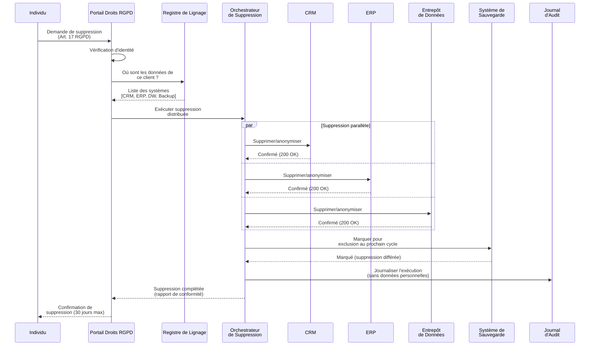
```mermaid
sequenceDiagram
    participant Client as Individu
    participant Portal as Portail Droits RGPD
    participant Registry as Registre de Lignage
    participant Orchestrator as Orchestrateur<br/>de Suppression
    participant CRM as CRM
    participant ERP as ERP
    participant DW as Entrepôt<br/>de Données
    participant Backup as Système de<br/>Sauvegarde
    participant Audit as Journal<br/>d'Audit

    Client->>Portal: Demande de suppression<br/>(Art. 17 RGPD)
    Portal->>Portal: Vérification d'identité
    Portal->>Registry: Où sont les données de<br/>ce client ?
    Registry-->>Portal: Liste des systèmes<br/>[CRM, ERP, DW, Backup]
    Portal->>Orchestrator: Exécuter suppression<br/>distribuée

    par Suppression parallèle
        Orchestrator->>CRM: Supprimer/anonymiser
        CRM-->>Orchestrator: Confirmé (200 OK)
    and
        Orchestrator->>ERP: Supprimer/anonymiser
        ERP-->>Orchestrator: Confirmé (200 OK)
    and
        Orchestrator->>DW: Supprimer/anonymiser
        DW-->>Orchestrator: Confirmé (200 OK)
    end

    Orchestrator->>Backup: Marquer pour<br/>exclusion au prochain cycle
    Backup-->>Orchestrator: Marqué (suppression différée)

    Orchestrator->>Audit: Journaliser l'exécution<br/>(sans données personnelles)
    Orchestrator-->>Portal: Suppression complétée<br/>(rapport de conformité)
    Portal-->>Client: Confirmation de<br/>suppression (30 jours max)
```

> **Exemple concret**
> **Propagation d'une demande de suppression RGPD dans le processus Order-to-Cash.** Considérons le processus O2C décrit au chapitre X. Un client exerce son droit à l'oubli. Le registre de lignage révèle que ses données personnelles sont présentes dans le Service Commandes (nom, adresse, historique), le Service Facturation (coordonnées de facturation), le Service Paiements (références de paiement), le système de reporting (données agrégées) et les sauvegardes. L'orchestrateur de suppression doit pseudonymiser les enregistrements dans les systèmes transactionnels (remplacement par des identifiants irréversibles), anonymiser les données dans l'entrepôt analytique (suppression ou généralisation des attributs identifiants), et marquer les sauvegardes pour exclusion. Certaines données doivent être conservées pour des obligations légales (factures, obligations fiscales) : l'architecte doit distinguer les données personnelles des données transactionnelles imposées par la loi. Par exemple, le montant d'une commande et sa date sont des données comptables à conserver ; le nom et l'adresse du client peuvent être pseudonymisés tout en maintenant l'intégrité comptable.

#### Consentement propagé

Dans une architecture d'intégration, le consentement du client est souvent recueilli par un système frontal (site web, application mobile), mais les données sont ensuite propagées vers des systèmes en aval qui n'ont pas de lien direct avec le point de collecte. Comment garantir que chaque système consommateur respecte le périmètre du consentement accordé ?

La solution architecturale consiste à propager le **contexte de consentement** avec les données elles-mêmes. Chaque message d'intégration transporte, en plus des données métier, un en-tête de consentement qui précise les finalités autorisées, la date de collecte et la version des conditions générales acceptées. Les services consommateurs vérifient cet en-tête avant de traiter les données.

```json
{
  "metadata": {
    "eventType": "customer.created",
    "timestamp": "2025-06-15T10:30:00Z",
    "source": "/services/registration"
  },
  "consent": {
    "subjectId": "cust-2025-abc123",
    "collectedAt": "2025-06-15T10:29:45Z",
    "purposes": ["order_processing", "delivery", "invoicing"],
    "excludedPurposes": ["marketing", "analytics_nominative"],
    "termsVersion": "v3.2",
    "expiresAt": "2026-06-15T10:29:45Z",
    "withdrawalEndpoint": "https://api.internal/consent/cust-2025-abc123"
  },
  "data": {
    "customerId": "cust-2025-abc123",
    "email": "client@exemple.fr",
    "shippingAddress": { "...": "..." }
  }
}
```

Un service analytique recevant ce message doit vérifier que `analytics_nominative` figure dans les finalités autorisées avant de persister les données nominatives. Si cette finalité est exclue, le service ne peut stocker que des données anonymisées ou agrégées. Le champ `withdrawalEndpoint` permet aux services en aval de vérifier en temps réel si le consentement est toujours actif, pour les traitements différés.

Ce patron de consentement propagé introduit une complexité supplémentaire : la **rétroactivité du retrait de consentement**. Lorsqu'un client retire son consentement pour une finalité donnée, tous les systèmes en aval ayant traité des données sous cette finalité doivent être notifiés. Ce mécanisme s'apparente au droit à l'oubli mais porte sur une finalité spécifique plutôt que sur l'ensemble des données.

#### Minimisation des données dans les flux

Le principe de minimisation (article 5.1.c du RGPD) impose de ne collecter et traiter que les données strictement nécessaires à la finalité déclarée. Dans une architecture d'intégration, ce principe se traduit par une règle de conception : **chaque flux ne doit transporter que les attributs nécessaires au service consommateur**.

Ce principe contredit la tendance naturelle à propager des événements riches contenant l'ensemble des attributs d'une entité. Un événement `order.created` destiné au service de facturation n'a pas besoin de l'adresse de livraison ; un événement destiné au service d'expédition n'a pas besoin des coordonnées de paiement. L'architecte doit concevoir des projections spécifiques (*claim-based delivery*) ou des vues filtrées pour chaque consommateur.

Deux approches architecturales permettent d'implémenter la minimisation. La première, **événement maigre + enrichissement** (*thin event*), consiste à publier un événement contenant uniquement l'identifiant de l'entité et le type de changement, puis à laisser chaque consommateur interroger l'API source pour obtenir uniquement les attributs dont il a besoin. La seconde, **projections par consommateur**, crée des topics ou des vues dédiés à chaque catégorie de consommateur, contenant uniquement les attributs autorisés. La première approche est plus simple à implémenter mais réintroduit un couplage temporel ; la seconde est plus découplée mais nécessite une maintenance des projections.

#### Data lineage et traçabilité

La traçabilité des données personnelles est une obligation implicite du RGPD : pour exercer les droits des personnes (accès, rectification, effacement, portabilité), le responsable du traitement doit savoir où se trouvent les données. Dans une architecture d'intégration, cette exigence se traduit par la mise en place d'un système de **data lineage** qui enregistre, pour chaque enregistrement de donnée personnelle, son parcours à travers les systèmes.

Le data lineage peut être implémenté de manière passive (analyse des logs d'intégration, inspection des schémas de données) ou active (chaque service signale les données personnelles qu'il reçoit et stocke via un mécanisme de callback ou d'événement). L'approche active, bien que plus coûteuse, est la seule qui offre une garantie de complétude dans un système distribué où les flux évoluent fréquemment. Elle peut s'appuyer sur les headers de traçabilité OpenTelemetry (cf. chapitre VII) pour corréler le parcours des données à travers les services.

### 12.5.2 SOC 2, PCI-DSS, HIPAA : exigences par secteur

Au-delà du RGPD, qui s'applique transversalement à toute organisation traitant des données personnelles de résidents européens, des référentiels sectoriels imposent des exigences spécifiques qui affectent directement l'architecture d'intégration.

#### SOC 2 : principes de confiance

SOC 2 (*Service Organization Control 2*) est un référentiel d'audit développé par l'AICPA (*American Institute of Certified Public Accountants*) qui évalue les contrôles d'une organisation de services selon cinq principes de confiance (*Trust Services Criteria*) : sécurité, disponibilité, intégrité du traitement, confidentialité et vie privée. L'audit SOC 2 de Type II examine non seulement la conception des contrôles, mais aussi leur fonctionnement effectif sur une période de 6 à 12 mois.

Pour l'architecte d'intégration, SOC 2 impose des exigences sur la journalisation des accès, la gestion des changements, la surveillance des anomalies et la réponse aux incidents. Chaque flux d'intégration doit produire des traces auditables démontrant que les données sont traitées de manière sécurisée, disponible et intègre. Le principe d'intégrité du traitement est particulièrement pertinent : il exige que les données soient traitées de manière complète, exacte et autorisée, ce qui impose des contrôles de validation à chaque point d'intégration.

#### PCI-DSS : données de paiement

PCI-DSS (*Payment Card Industry Data Security Standard*) s'applique à toute organisation qui stocke, traite ou transmet des données de carte de paiement. Ses 12 exigences principales couvrent la totalité du périmètre de sécurité, de la segmentation réseau au chiffrement, du contrôle d'accès à la surveillance. La version 4.0, entrée en vigueur en mars 2024, renforce les exigences d'authentification multi-facteur et de chiffrement.

> **Configuration recommandée**
> Dans le processus Order-to-Cash, les données de carte de paiement ne doivent jamais traverser le bus d'intégration en clair. L'architecture recommandée utilise la **tokenisation** : le service de paiement remplace le numéro de carte par un jeton opaque avant de publier l'événement `payment.processed`. Les services en aval (facturation, reporting) ne manipulent que le jeton, incapable de reconstituer le numéro de carte. Cette approche réduit considérablement le périmètre PCI-DSS (*cardholder data environment*) aux seuls services qui manipulent les données de carte natives. Concrètement, si seul le service de paiement accède au PAN (*Primary Account Number*), seul ce service et son infrastructure directe sont soumis à l'audit PCI-DSS complet ; les autres services opèrent hors périmètre.

#### HIPAA : données de santé

HIPAA (*Health Insurance Portability and Accountability Act*) protège les informations de santé protégées (*Protected Health Information* -- PHI) aux États-Unis. Pour les architectures d'intégration dans le secteur de la santé, HIPAA impose le chiffrement des PHI en transit et au repos, des contrôles d'accès basés sur le rôle, une journalisation exhaustive des accès et une notification en cas de violation dans les 60 jours.

L'exigence de *Business Associate Agreement* (BAA) est particulièrement pertinente pour l'intégration : tout fournisseur de services cloud ou de middleware qui traite des PHI doit signer un BAA, ce qui limite le choix des plateformes d'intégration aux fournisseurs offrant cette garantie contractuelle.

| Exigence | SOC 2 | PCI-DSS v4.0 | HIPAA | RGPD |
|----------|-------|---------|-------|------|
| Chiffrement en transit | Requis | Requis (TLS 1.2+) | Requis | Recommandé (Art. 32) |
| Chiffrement au repos | Recommandé | Requis | Requis | Recommandé (Art. 32) |
| Contrôle d'accès granulaire | Requis | Requis (moindre privilège) | Requis (RBAC) | Requis (Art. 25) |
| Journalisation des accès | Requis | Requis (exig. 10) | Requis (6 ans) | Requis (Art. 30) |
| Notification de violation | Requis | 72 heures (acquéreur) | 60 jours (individus) | 72 heures (autorité) |
| Rétention des logs | Définie par politique | 1 an minimum | 6 ans minimum | Définie par finalité |
| Évaluation régulière | Audit annuel Type II | Scan trimestriel + audit annuel | Évaluation des risques | Analyse d'impact (DPIA) |
| Tokenisation/pseudonymisation | Recommandé | Fortement recommandé | Recommandé | Encouragée (Art. 25) |
| MFA pour accès privilégiés | Requis | Requis (exig. 8.4) | Recommandé | Recommandé |
| Segmentation réseau | Recommandé | Requis (exig. 1) | Recommandé | Non spécifié |

> **Perspective stratégique**
> L'architecte d'intégration doit concevoir des flux capables de satisfaire simultanément plusieurs référentiels. Un flux de commande transportant des données personnelles (RGPD), des informations de paiement (PCI-DSS) et des données de santé (HIPAA dans le cas d'un fournisseur de dispositifs médicaux) doit appliquer les exigences les plus strictes de chaque référentiel applicable. La stratégie recommandée consiste à concevoir l'architecture d'intégration selon les exigences les plus contraignantes, puis à valider la conformité avec chaque référentiel individuellement. Cette approche, dite de « conformité par conception » (*compliance by design*), évite les coûteuses mises en conformité rétroactives.

### 12.5.3 Audit trail distribué et traçabilité réglementaire

#### Exigences d'audit dans les systèmes distribués

Chaque référentiel réglementaire exige une capacité de traçabilité : pouvoir reconstituer, a posteriori, qui a fait quoi, quand, sur quelles données et avec quel résultat. Dans un système monolithique, cette exigence se satisfait par une table d'audit dans la base de données. Dans une architecture distribuée, la reconstitution d'une transaction métier implique la corrélation de traces provenant de dizaines de services, de brokers de messages et de bases de données.

L'audit trail distribué doit répondre à trois propriétés fondamentales :

**L'exhaustivité** : chaque opération significative sur des données réglementées doit être journalisée, y compris les consultations (lecture), pas seulement les modifications. Cette exigence est souvent sous-estimée : PCI-DSS exige la journalisation de tout accès aux données de carte, et HIPAA impose la traçabilité de chaque consultation d'un dossier médical. Un service d'intégration qui lit des données personnelles dans le cadre d'un enrichissement de flux doit journaliser cet accès.

**L'immutabilité** : les enregistrements d'audit ne doivent pas pouvoir être modifiés ou supprimés, même par les administrateurs du système. Cette propriété protège contre les tentatives de dissimulation d'activités non autorisées. Elle est explicitement exigée par SOC 2 (critère CC7.2) et implicitement par la plupart des référentiels.

**La corrélabilité** : il doit être possible de reconstituer le parcours complet d'une transaction métier à travers l'ensemble des services impliqués. Un auditeur qui examine un incident doit pouvoir suivre le flux d'une commande depuis sa réception jusqu'à son traitement final, en passant par chaque service d'intégration intermédiaire.

#### Corrélation des traces entre services

La corrélation s'appuie sur la propagation d'un identifiant unique à travers l'ensemble de la chaîne de traitement. OpenTelemetry (cf. chapitre VII) fournit le mécanisme technique via les *trace IDs* et les *span IDs*. Chaque entrée d'audit doit inclure le trace ID de la transaction, permettant ainsi la reconstitution du parcours complet.

L'entrée d'audit ne doit pas se limiter aux métadonnées techniques. Pour satisfaire les exigences réglementaires, elle doit inclure le contexte métier et réglementaire : la classification des données accédées, le cadre réglementaire applicable, la finalité du traitement, et l'identité du sujet de données concerné.

```json
{
  "timestamp": "2025-06-15T14:32:01.234Z",
  "traceId": "4bf92f3577b34da6a3ce929d0e0e4736",
  "spanId": "00f067aa0ba902b7",
  "service": "order-service",
  "action": "READ",
  "resource": "customer.personalData",
  "subject": {
    "serviceAccount": "order-service-sa",
    "authenticatedVia": "mTLS",
    "certificateSerial": "7A:3B:2C:..."
  },
  "dataSubject": "cust-2025-abc123",
  "purpose": "order_processing",
  "outcome": "SUCCESS",
  "dataClassification": "PII",
  "regulatoryFrameworks": ["GDPR", "SOC2"],
  "retentionPolicy": "3-years-pii-audit"
}
```

#### Journalisation immutable

L'immutabilité des journaux d'audit peut être obtenue par plusieurs mécanismes, chacun offrant un niveau de garantie différent.

Les **append-only logs** stockent les enregistrements dans des systèmes où seule l'écriture est autorisée. Apache Kafka, configuré avec une rétention infinie et des ACL interdisant la suppression de topics, offre un support naturel pour ce modèle. Amazon QLDB (*Quantum Ledger Database*) fournit un journal immutable avec preuve cryptographique d'intégrité, particulièrement adapté aux cas d'usage d'audit réglementaire.

Le **chaînage cryptographique** (*hash chaining*), inspiré des registres distribués (blockchain), lie chaque enregistrement au précédent par un hash, rendant toute modification rétroactive détectable. Cette approche ne nécessite pas une blockchain complète : un simple chaînage séquentiel des hash dans un flux Kafka ou une base de données suffit à garantir la détectabilité des altérations. La formule est directe : `hash(N) = SHA-256(hash(N-1) || données(N))`. Toute modification d'un enregistrement passé invalide le hash de tous les enregistrements suivants.

La **réplication vers un stockage immutable** copie les journaux d'audit vers un système de stockage où la suppression est physiquement impossible pendant la période de rétention. AWS S3 avec Object Lock en mode Compliance, Azure Immutable Blob Storage et Google Cloud Storage avec Retention Policy offrent cette garantie. Le mode Compliance (par opposition au mode Governance) interdit la suppression même par l'administrateur root du compte, offrant ainsi la protection la plus forte.

> **Configuration recommandée**
> Pour une architecture d'intégration soumise à plusieurs référentiels, l'approche recommandée combine les trois mécanismes : journalisation primaire dans Kafka (accès rapide, corrélation en temps réel), chaînage cryptographique pour la détection d'altération, et réplication vers un stockage immutable S3/GCS pour l'archivage long terme. Cette architecture en couches répond aux exigences d'accès rapide (investigation d'incidents) comme d'archivage réglementaire (rétention multi-années).

#### Rétention et archivage réglementaire

Les durées de rétention varient selon les référentiels et les juridictions. PCI-DSS impose 1 an de rétention immédiate et l'accessibilité rapide des 3 derniers mois. HIPAA exige 6 ans. Les obligations fiscales nationales peuvent imposer 10 ans pour les documents comptables. Le RGPD, paradoxalement, ne fixe pas de durée minimale mais exige que les données ne soient pas conservées au-delà de la durée nécessaire à la finalité -- ce qui s'applique aussi aux journaux d'audit contenant des données personnelles.

L'architecture d'audit doit supporter une stratégie de **tiering** : stockage chaud pour les 3-6 derniers mois (accès rapide pour investigation), stockage tiède pour 1-2 ans (accès en quelques minutes), stockage froid pour l'archivage long terme (accès en quelques heures). Chaque tier doit maintenir les garanties d'immutabilité et de disponibilité exigées par les référentiels applicables.

### 12.5.4 Compliance-as-Code : automatisation de la conformité

#### Principe

La conformité traditionnelle repose sur des audits périodiques : une équipe d'audit vérifie, une ou deux fois par an, que les contrôles sont en place et fonctionnent. Entre deux audits, les dérives sont possibles et souvent invisibles. Le mouvement **Compliance-as-Code** propose de transposer les exigences de conformité en règles exécutables par des machines, intégrées dans les pipelines de déploiement et évaluées en continu.

> **Définition formelle**
> **Compliance-as-Code** : Pratique consistant à exprimer les exigences de conformité réglementaire et normative sous forme de politiques codifiées, versionnées et exécutables automatiquement dans les pipelines d'intégration et de déploiement continus. Cette approche transforme la conformité d'un exercice d'audit périodique en une vérification continue et reproductible.

Le Compliance-as-Code s'inscrit dans une tendance plus large de codification des pratiques opérationnelles : Infrastructure-as-Code (Terraform, Pulumi), Security-as-Code (SAST/DAST dans les pipelines), Policy-as-Code (OPA, Sentinel). La conformité est le dernier maillon de cette chaîne : si l'infrastructure, la sécurité et les politiques sont déjà codifiées, il est naturel d'y ajouter la conformité réglementaire.

#### Outils et écosystème

L'écosystème Compliance-as-Code s'articule autour de plusieurs catégories d'outils.

**OPA/Rego** (*Open Policy Agent*), déjà présenté en section 12.2.3 pour l'autorisation, s'applique également à la conformité. Les politiques Rego peuvent vérifier que les déploiements respectent les exigences réglementaires : chiffrement activé, tags de classification des données présents, limites de ressources définies. La force d'OPA réside dans son découplage : les politiques sont évaluées indépendamment des systèmes qu'elles contrôlent, ce qui permet de centraliser la gouvernance tout en laissant l'autonomie opérationnelle aux équipes.

**Checkov** analyse les configurations d'infrastructure-as-code (Terraform, CloudFormation, Kubernetes, Helm, Dockerfile) pour détecter les violations des bonnes pratiques et des exigences de conformité. Il inclut des bibliothèques de règles prédéfinies pour CIS Benchmarks, SOC 2, PCI-DSS, HIPAA et RGPD, et permet de définir des règles personnalisées en Python ou en YAML.

**HashiCorp Sentinel** fournit un framework de politique-as-code intégré dans l'écosystème HashiCorp (Terraform Enterprise, Vault Enterprise, Consul Enterprise). Sentinel s'exécute entre le plan et l'application dans Terraform, permettant de bloquer les déploiements non conformes avant qu'ils n'atteignent l'infrastructure.

**Kyverno** et **Gatekeeper** (basé sur OPA) opèrent comme des contrôleurs d'admission Kubernetes (*admission controllers*), validant chaque ressource créée ou modifiée dans le cluster contre un ensemble de politiques de conformité. Ils constituent la dernière ligne de défense avant le déploiement.

```rego
# Politique OPA : vérification de conformité pour les déploiements Kubernetes
# Applicable aux flux d'intégration transportant des données PII

package compliance.integration

import rego.v1

# Règle 1 : Tout deployment traitant des données PII doit avoir
# le chiffrement au repos activé
deny contains msg if {
    input.kind == "Deployment"
    input.metadata.labels["data-classification"] == "PII"
    some container in input.spec.template.spec.containers
    not container_has_encryption_env(container)
    msg := sprintf(
        "Le deployment '%s' traite des données PII mais n'a pas la variable ENCRYPTION_AT_REST_ENABLED",
        [input.metadata.name]
    )
}

container_has_encryption_env(container) if {
    some env in container.env
    env.name == "ENCRYPTION_AT_REST_ENABLED"
    env.value == "true"
}

# Règle 2 : Les services d'intégration doivent déclarer une politique de rétention
deny contains msg if {
    input.kind == "Deployment"
    input.metadata.labels["component-type"] == "integration-service"
    not input.metadata.annotations["compliance/data-retention-days"]
    msg := sprintf(
        "Le service d'intégration '%s' ne déclare pas de politique de rétention des données",
        [input.metadata.name]
    )
}

# Règle 3 : mTLS obligatoire pour les services traitant des données réglementées
deny contains msg if {
    input.kind == "Deployment"
    input.metadata.labels["data-classification"] in {"PII", "PCI", "PHI"}
    not has_mtls_sidecar(input.spec.template.spec)
    msg := sprintf(
        "Le deployment '%s' traite des données '%s' sans sidecar mTLS",
        [input.metadata.name, input.metadata.labels["data-classification"]]
    )
}

has_mtls_sidecar(spec) if {
    some container in spec.containers
    contains(container.name, "istio-proxy")
}

has_mtls_sidecar(spec) if {
    some container in spec.initContainers
    contains(container.name, "istio-init")
}

# Règle 4 : Les containers doivent spécifier des limites de ressources
# (exigence SOC 2 - intégrité du traitement)
deny contains msg if {
    input.kind == "Deployment"
    some container in input.spec.template.spec.containers
    not container.resources.limits
    msg := sprintf(
        "Le container '%s' dans '%s' ne définit pas de limites de ressources",
        [container.name, input.metadata.name]
    )
}
```

#### Pipeline Compliance-as-Code

L'intégration de la conformité dans le pipeline CI/CD transforme chaque déploiement en un point de vérification automatisé. Les violations sont détectées avant la mise en production, pas lors de l'audit annuel.

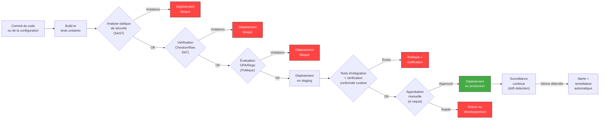
```mermaid
flowchart LR
    A["Commit du code<br/>ou de la configuration"] --> B["Build et<br/>tests unitaires"]
    B --> C{"Analyse statique<br/>de sécurité<br/>(SAST)"}
    C -->|Violations| FAIL1["Déploiement<br/>bloqué"]
    C -->|OK| D{"Vérification<br/>Checkov/tfsec<br/>(IaC)"}
    D -->|Violations| FAIL2["Déploiement<br/>bloqué"]
    D -->|OK| E{"Évaluation<br/>OPA/Rego<br/>(Politique)"}
    E -->|Violations| FAIL3["Déploiement<br/>bloqué"]
    E -->|OK| F["Déploiement<br/>en staging"]
    F --> G{"Tests d'intégration<br/>+ vérification<br/>conformité runtime"}
    G -->|Échec| FAIL4["Rollback +<br/>notification"]
    G -->|OK| H{"Approbation<br/>manuelle<br/>(si requis)"}
    H -->|Approuvé| I["Déploiement<br/>en production"]
    H -->|Rejeté| FAIL5["Retour au<br/>développement"]
    I --> J["Surveillance<br/>continue<br/>(drift detection)"]
    J -->|Dérive détectée| K["Alerte +<br/>remédiation<br/>automatique"]

    style FAIL1 fill:#f44,stroke:#333,color:#fff
    style FAIL2 fill:#f44,stroke:#333,color:#fff
    style FAIL3 fill:#f44,stroke:#333,color:#fff
    style FAIL4 fill:#f44,stroke:#333,color:#fff
    style FAIL5 fill:#f44,stroke:#333,color:#fff
    style I fill:#4a4,stroke:#333,color:#fff
```

La surveillance continue (*drift detection*) est le complément indispensable de la vérification au déploiement. Même si chaque déploiement est validé, des modifications manuelles (accès direct à l'infrastructure, modifications via la console cloud) peuvent introduire des dérives de conformité. Des outils comme AWS Config Rules, Azure Policy et les scans périodiques Checkov détectent ces dérives et peuvent déclencher une remédiation automatique ou une alerte aux équipes de sécurité.

> **Perspective stratégique**
> Le Compliance-as-Code ne remplace pas les audits humains : il les rend plus efficaces. L'auditeur, au lieu de vérifier manuellement des centaines de configurations, examine les politiques codifiées et les résultats de leur exécution continue. Le rapport d'audit devient un sous-produit du pipeline de déploiement, généré automatiquement et toujours à jour. Cette approche réduit le coût de la conformité, accélère les cycles d'audit et, surtout, élimine l'écart entre l'état audité et l'état réel du système -- un écart qui, dans les approches traditionnelles, constitue le risque principal. Pour l'architecte d'intégration, le Compliance-as-Code signifie que chaque nouveau flux, chaque nouvelle connexion, chaque nouveau service d'intégration est automatiquement évalué contre les politiques de conformité de l'organisation, sans intervention manuelle et sans délai.

## 12.6 Patrons de Sécurité pour l'Intégration

Les chapitres III à V ont catalogué les patrons d'intégration fonctionnels — API Gateway, Pub/Sub, CDC, Saga — qui répondent aux besoins d'orchestration, de réplication et de réactivité. Chacun de ces patrons résout un problème d'architecture distribué, mais aucun n'adresse intrinsèquement les préoccupations de sécurité qui émergent dès qu'un flux traverse les frontières d'un système. Tout comme les patrons de résilience du chapitre VII complètent les patrons fonctionnels en leur conférant la robustesse nécessaire en production, les patrons de sécurité présentés dans cette section les complètent en leur conférant la confiance nécessaire dans un environnement hostile.

L'absence de patrons de sécurité explicites dans les catalogues d'intégration traditionnels n'est pas un oubli : elle reflète une conception historique où la sécurité était traitée comme une préoccupation d'infrastructure — le pare-feu protège le périmètre, le VPN sécurise l'accès distant, le certificat SSL chiffre le transport. Cette conception périmétrique s'effondre dans les architectures modernes où les frontières sont poreuses, les composants éphémères et les chemins de données multiples. La sécurité doit être intégrée au niveau architectural, au même titre que la résilience ou l'observabilité.

Cette section catalogue cinq patrons de sécurité fondamentaux pour l'intégration d'entreprise. Chaque patron est présenté selon une structure uniforme — problème résolu, mécanisme, illustration, exemple d'usage et contexte d'application — afin de constituer un répertoire actionnable pour l'architecte d'intégration. Une matrice de décision et un inventaire des anti-patrons complètent le catalogue.

### 12.6.1 Catalogue des patrons

#### Gateway Security Pattern

**Problème résolu.** Dans une architecture de microservices, chaque service expose des points d'entrée réseau. Si chaque service implémente individuellement l'authentification, l'autorisation, le rate limiting et la protection contre les attaques, la duplication du code de sécurité crée des incohérences : un service applique OAuth 2.0 avec validation JWT stricte tandis qu'un autre accepte des tokens expirés, un troisième ne limite pas le débit des requêtes. La surface d'attaque croît linéairement avec le nombre de services, et la moindre faille dans un service compromet potentiellement l'ensemble du système.

Ce problème s'aggrave avec l'évolution rapide des vulnérabilités. Lorsqu'une faille critique est découverte dans une bibliothèque de validation JWT, corriger trente services indépendants prend des jours ; corriger un gateway unique prend des minutes. La centralisation de la sécurité n'est pas seulement une question de cohérence — c'est une question de vélocité de réponse aux menaces.

**Mécanisme.** Le Gateway Security Pattern centralise l'application des politiques de sécurité en un point unique — l'API Gateway — situé à la frontière entre le réseau externe et le réseau interne. Ce composant intercepte toutes les requêtes entrantes et applique, dans un ordre déterministe, une série de contrôles avant de relayer la requête vers le service cible.

L'authentification constitue le premier contrôle : le gateway valide le token d'accès (JWT, opaque token) en vérifiant sa signature, sa date d'expiration et son émetteur. L'autorisation intervient ensuite : le gateway évalue si le sujet authentifié dispose des permissions nécessaires pour accéder à la ressource demandée, en consultant les scopes du token ou un service de politiques externe (OPA, Cedar). Le rate limiting protège les services en aval contre les abus en limitant le nombre de requêtes par client, par endpoint ou par fenêtre temporelle. Enfin, le Web Application Firewall (WAF) intégré analyse le contenu des requêtes pour détecter les tentatives d'injection SQL, de cross-site scripting ou d'autres vecteurs d'attaque connus.

Les services en aval reçoivent des requêtes déjà authentifiées et autorisées. Ils peuvent se concentrer sur la logique métier, recevant le contexte d'identité via des headers standardisés (X-User-ID, X-Roles, X-Tenant-ID) ajoutés par le gateway.

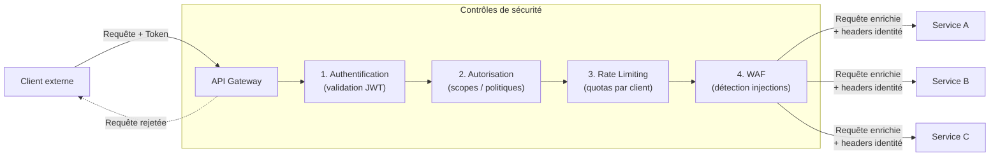
```mermaid
flowchart LR
    Client["Client externe"] -->|Requête + Token| GW["API Gateway"]

    subgraph "Contrôles de sécurité"
        GW --> AuthN["1. Authentification<br/>(validation JWT)"]
        AuthN --> AuthZ["2. Autorisation<br/>(scopes / politiques)"]
        AuthZ --> RL["3. Rate Limiting<br/>(quotas par client)"]
        RL --> WAF["4. WAF<br/>(détection injections)"]
    end

    WAF -->|Requête enrichie<br/>+ headers identité| SvcA["Service A"]
    WAF -->|Requête enrichie<br/>+ headers identité| SvcB["Service B"]
    WAF -->|Requête enrichie<br/>+ headers identité| SvcC["Service C"]

    GW -.->|Requête rejetée| Client
```

> **Configuration recommandée**
> La configuration du gateway doit appliquer le principe de défense en profondeur. L'ordre des contrôles importe : l'authentification précède l'autorisation (inutile de vérifier les permissions d'un token invalide), le rate limiting précède le WAF (inutile d'analyser en profondeur une requête qui dépasse les quotas). Chaque contrôle échoué doit produire une réponse HTTP appropriée (401 pour l'authentification, 403 pour l'autorisation, 429 pour le rate limiting) avec un corps de réponse qui ne divulgue pas d'informations sensibles sur l'architecture interne.

**Exemple d'usage.** Une plateforme de commerce électronique expose une trentaine de microservices (catalogue, panier, paiement, livraison). L'API Gateway Kong, déployé en frontal, valide les tokens OAuth 2.0 émis par Keycloak, applique des quotas différenciés selon le plan d'abonnement du partenaire (100 requêtes/minute pour le plan standard, 1 000 pour le plan premium), et filtre les requêtes contenant des patterns d'injection SQL. Les microservices ne contiennent aucun code d'authentification ; ils extraient l'identité du header X-User-ID injecté par le gateway.

La configuration type du plugin JWT sur Kong illustre la simplicité de cette centralisation :

```yaml
plugins:
  - name: jwt
    config:
      uri_param_names: []
      claims_to_verify:
        - exp
        - nbf
      key_claim_name: iss
      maximum_expiration: 3600
  - name: rate-limiting
    config:
      minute: 100
      policy: redis
      redis_host: redis-cluster
  - name: acl
    config:
      allow:
        - partners-standard
        - partners-premium
```

> **Quand utiliser ce patron**
> Le Gateway Security Pattern s'impose dans toute architecture exposant des APIs à des clients externes (applications mobiles, partenaires, navigateurs). Il est également pertinent pour les architectures internes lorsque le nombre de services dépasse une dizaine et que la cohérence des politiques de sécurité devient difficile à maintenir de manière décentralisée. Ce patron se combine naturellement avec le Service Mesh (chapitre VII) pour étendre la sécurité au trafic Est-Ouest entre services internes, le gateway protégeant le trafic Nord-Sud (externe vers interne) et le mesh protégeant le trafic Est-Ouest (service à service).

#### Token Exchange Pattern

**Problème résolu.** Un service reçoit un token d'accès représentant un utilisateur final et doit appeler un service situé dans un autre domaine de confiance — un partenaire externe, un autre tenant, ou un microservice opérant sous une autorité d'authentification différente. Transmettre le token original pose plusieurs problèmes : le service cible ne reconnaît pas l'émetteur du token, le token contient des scopes excessifs pour l'opération demandée, ou les claims du token ne correspondent pas au modèle d'identité du domaine cible.

Ce problème survient fréquemment dans les architectures d'entreprise réelles. L'acquisition d'une filiale introduit un nouveau domaine d'identité. L'adoption d'un service cloud SaaS crée une frontière de confiance avec un fournisseur externe. La mise en place d'une architecture multi-région implique parfois des fournisseurs d'identité distincts par juridiction. Dans chacun de ces cas, le simple transfert du token original est insuffisant ou dangereux.

**Mécanisme.** Le Token Exchange Pattern, formalisé par le RFC 8693 (OAuth 2.0 Token Exchange), permet à un service de soumettre un token existant à un serveur d'autorisation et d'obtenir en retour un nouveau token adapté au contexte cible. Le flux se décompose en quatre étapes.

Premièrement, le service intermédiaire reçoit le token original de l'appelant. Deuxièmement, il soumet une requête d'échange au serveur d'autorisation, spécifiant le token original (subject_token), le type d'échange souhaité (grant_type = urn:ietf:params:oauth:grant-type:token-exchange), et éventuellement une audience cible et des scopes réduits. Troisièmement, le serveur d'autorisation valide le token original, vérifie que le service intermédiaire est autorisé à effectuer l'échange, transforme les claims selon les règles de mapping configurées, et émet un nouveau token avec une audience, des scopes et une durée de vie adaptés. Quatrièmement, le service intermédiaire utilise le nouveau token pour appeler le service cible.

La réduction de scope constitue un mécanisme essentiel de ce patron : le token échangé ne contient que les permissions strictement nécessaires à l'opération demandée, conformément au principe du moindre privilège. Si le token original autorise lecture et écriture sur le catalogue, le token échangé pour une opération de consultation n'autorisera que la lecture.

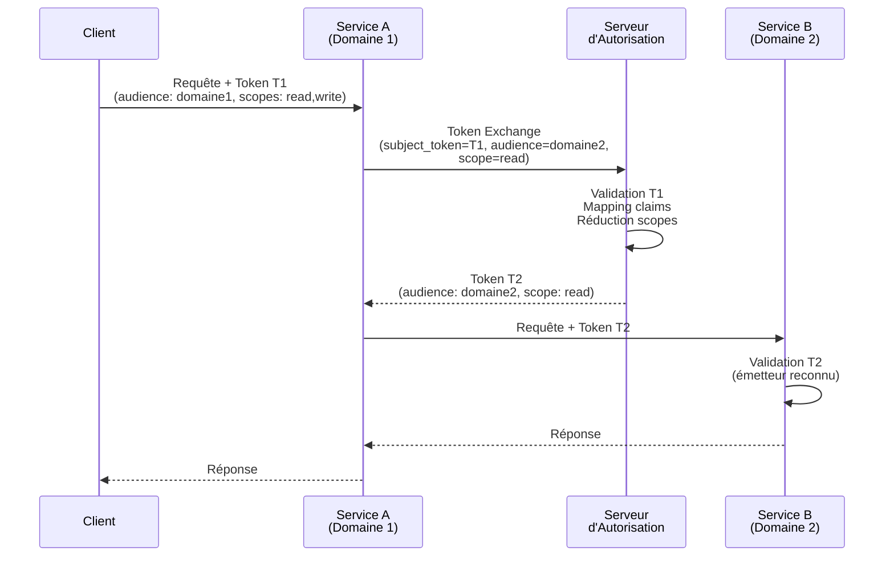
```mermaid
sequenceDiagram
    participant Client
    participant ServiceA as Service A<br/>(Domaine 1)
    participant AuthServer as Serveur<br/>d'Autorisation
    participant ServiceB as Service B<br/>(Domaine 2)

    Client->>ServiceA: Requête + Token T1<br/>(audience: domaine1, scopes: read,write)
    ServiceA->>AuthServer: Token Exchange<br/>(subject_token=T1, audience=domaine2,<br/>scope=read)
    AuthServer->>AuthServer: Validation T1<br/>Mapping claims<br/>Réduction scopes
    AuthServer-->>ServiceA: Token T2<br/>(audience: domaine2, scope: read)
    ServiceA->>ServiceB: Requête + Token T2
    ServiceB->>ServiceB: Validation T2<br/>(émetteur reconnu)
    ServiceB-->>ServiceA: Réponse
    ServiceA-->>Client: Réponse
```

La requête d'échange suit le format standardisé du RFC 8693 :

```http
POST /oauth/token HTTP/1.1
Host: auth.entreprise.com
Content-Type: application/x-www-form-urlencoded

grant_type=urn:ietf:params:oauth:grant-type:token-exchange
&subject_token=eyJhbGciOiJSUzI1NiIs...
&subject_token_type=urn:ietf:params:oauth:token-type:access_token
&audience=https://api.finance.partenaire.com
&scope=payroll:leave:read
&requested_token_type=urn:ietf:params:oauth:token-type:access_token
```

> **Définition formelle**
> **Token Exchange** (RFC 8693) : Protocole permettant à un client OAuth 2.0 de soumettre un token de sécurité existant et d'obtenir en retour un token de sécurité différent, potentiellement avec une audience, un émetteur, des scopes et des claims distincts. Le processus d'échange est encadré par des politiques configurées sur le serveur d'autorisation, qui déterminent quels échanges sont autorisés et quelles transformations de claims sont appliquées.

**Exemple d'usage.** Un système de gestion des ressources humaines (domaine RH) doit vérifier le solde de congés d'un employé auprès du système de paie (domaine Finance), opéré par un prestataire externe avec son propre serveur d'autorisation. Le service RH soumet le token de l'utilisateur connecté au serveur d'autorisation central, qui émet un token d'échange reconnu par le domaine Finance, limité au scope `payroll:leave:read`, avec une durée de vie de 30 secondes. Le serveur d'autorisation journalise l'échange, créant une piste d'audit qui documente que le service RH a demandé un accès en lecture seule au domaine Finance au nom de l'utilisateur identifié.

> **Quand utiliser ce patron**
> Le Token Exchange Pattern est indispensable dans les architectures multi-domaines de confiance : fédérations d'identité inter-organisations, architectures multi-cloud avec des fournisseurs d'identité distincts, ou intégrations avec des partenaires externes. Il est également pertinent en interne lorsque différentes équipes opèrent des serveurs d'autorisation distincts pour des raisons de souveraineté ou de conformité réglementaire. Ce patron doit être préféré à la propagation directe du token original dès que le flux traverse une frontière de confiance ou que le principe du moindre privilège exige une réduction de scope.

#### Claim Propagation Pattern

**Problème résolu.** Dans une architecture de microservices, une requête utilisateur traverse typiquement une chaîne de cinq à quinze services. Chaque service de la chaîne doit connaître l'identité de l'appelant original pour appliquer des règles d'autorisation, journaliser les actions et assurer la traçabilité. Sans mécanisme de propagation, le contexte d'identité se perd dès le premier saut : le service B ne sait pas que la requête provient initialement de l'utilisateur Alice via le service A.

Ce problème se manifeste de manière particulièrement aiguë dans les contextes réglementés. Lorsqu'un régulateur demande « qui a accédé aux données de ce client le 15 janvier ? », l'organisation doit pouvoir reconstituer la chaîne complète : l'utilisateur qui a initié l'action, les services qui l'ont traitée, les données qui ont été accédées. Sans propagation systématique de l'identité, cette reconstitution est au mieux laborieuse, au pire impossible.

**Mécanisme.** Le Claim Propagation Pattern maintient le contexte d'identité à travers l'ensemble de la chaîne de services en propageant les claims (assertions d'identité) via des en-têtes HTTP ou des métadonnées de message. Trois approches complémentaires constituent ce patron.

La première approche, la **propagation directe du token**, consiste à transmettre le token JWT original de service en service via le header Authorization. Chaque service valide le token et en extrait les claims nécessaires. Cette approche est simple mais présente des limitations : le token peut expirer au cours d'une chaîne longue, et tous les services doivent être capables de valider les tokens du même émetteur.

La deuxième approche, les **claims signés dans des headers**, consiste à extraire les claims pertinents au niveau du gateway et à les propager sous forme de headers signés (par exemple, un header X-Identity contenant un JWT interne compact). La signature garantit que les claims n'ont pas été falsifiés par un service intermédiaire. Cette approche découple la propagation d'identité du mécanisme d'authentification externe.

La troisième approche, la **corrélation par identifiant de requête**, associe un identifiant unique (X-Request-ID, traceparent W3C) à chaque requête entrante. Cet identifiant se propage à travers tous les services et permet de reconstituer la chaîne complète d'appels dans les systèmes de traçabilité. Combiné aux traces OpenTelemetry (chapitre VII), il crée un lien auditable entre l'action de l'utilisateur et l'ensemble des opérations déclenchées.

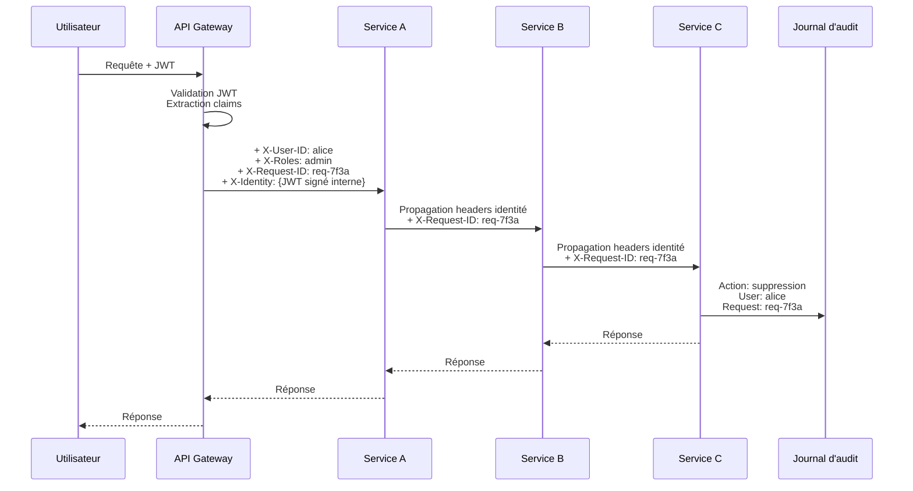
```mermaid
sequenceDiagram
    participant User as Utilisateur
    participant GW as API Gateway
    participant SvcA as Service A
    participant SvcB as Service B
    participant SvcC as Service C
    participant Audit as Journal d'audit

    User->>GW: Requête + JWT
    GW->>GW: Validation JWT<br/>Extraction claims
    GW->>SvcA: + X-User-ID: alice<br/>+ X-Roles: admin<br/>+ X-Request-ID: req-7f3a<br/>+ X-Identity: {JWT signé interne}
    SvcA->>SvcB: Propagation headers identité<br/>+ X-Request-ID: req-7f3a
    SvcB->>SvcC: Propagation headers identité<br/>+ X-Request-ID: req-7f3a
    SvcC->>Audit: Action: suppression<br/>User: alice<br/>Request: req-7f3a
    SvcC-->>SvcB: Réponse
    SvcB-->>SvcA: Réponse
    SvcA-->>GW: Réponse
    GW-->>User: Réponse
```

En pratique, les frameworks de microservices modernes automatisent cette propagation. Un intercepteur (middleware) côté serveur extrait les headers d'identité de la requête entrante et les injecte dans le contexte de la requête. Un intercepteur côté client relit ces headers depuis le contexte et les ajoute à chaque requête sortante. Le code métier n'a pas conscience de cette propagation :

```java
// Intercepteur côté serveur (Spring Boot)
@Component
public class IdentityPropagationFilter implements Filter {
    @Override
    public void doFilter(ServletRequest req, ServletResponse res,
                         FilterChain chain) throws IOException, ServletException {
        HttpServletRequest httpReq = (HttpServletRequest) req;
        SecurityContext ctx = SecurityContext.builder()
            .userId(httpReq.getHeader("X-User-ID"))
            .roles(httpReq.getHeader("X-Roles"))
            .requestId(httpReq.getHeader("X-Request-ID"))
            .build();
        SecurityContextHolder.set(ctx);
        try {
            chain.doFilter(req, res);
        } finally {
            SecurityContextHolder.clear();
        }
    }
}
```

**Exemple d'usage.** Un système bancaire traite une opération de virement qui traverse les services de vérification d'identité, de contrôle anti-fraude, de débit du compte source et de crédit du compte cible. L'identité du client et du conseiller qui a initié l'opération sont propagées via des headers signés à chaque étape. Le journal d'audit reconstitue la chaîne complète grâce au X-Request-ID, permettant de répondre à la question réglementaire : « Qui a autorisé cette opération, à quelle heure, et quels systèmes l'ont traitée ? »

> **Quand utiliser ce patron**
> Le Claim Propagation Pattern est un prérequis dans toute architecture de microservices qui nécessite une traçabilité de bout en bout. Il est particulièrement critique dans les domaines réglementés (finance, santé, administration publique) où la capacité à démontrer l'origine et le cheminement d'une action constitue une obligation légale. Ce patron se combine naturellement avec l'infrastructure OpenTelemetry présentée au chapitre VII pour unifier traçabilité technique et traçabilité de sécurité dans un même pipeline d'observabilité.

#### Encryption Envelope Pattern

**Problème résolu.** Dans un flux d'intégration, les données transitent par de nombreux intermédiaires : API Gateway, bus de messages, connecteurs ETL, caches. Certains de ces intermédiaires doivent lire les métadonnées du message (topic, partition, headers de routage) sans pour autant accéder au contenu sensible (données personnelles, informations financières). Le chiffrement de transport (TLS) protège les données en transit entre deux nœuds, mais ne protège pas les données au repos dans les files d'attente, les logs ou les caches intermédiaires. Le chiffrement intégral du message empêche le routage par les intermédiaires.

Ce dilemme — chiffrer pour protéger ou laisser en clair pour router — se manifeste de manière particulièrement aiguë dans les architectures événementielles. Un broker Kafka stocke les messages sur disque pendant la période de rétention (potentiellement des jours ou des semaines). Un connecteur Kafka Connect lit les messages pour les répliquer vers un data lake. Un outil de monitoring échantillonne les messages pour vérifier la santé du flux. Aucun de ces composants n'a besoin d'accéder aux données médicales d'un patient ou au numéro de carte bancaire d'un client.

**Mécanisme.** L'Encryption Envelope Pattern sépare le chiffrement en deux couches distinctes, inspirées du modèle DEK/KEK (Data Encryption Key / Key Encryption Key) utilisé par les services de gestion de clés cloud (AWS KMS, Azure Key Vault, Google Cloud KMS).

La **couche externe** (enveloppe) contient les métadonnées en clair nécessaires au routage et au traitement : topic Kafka, headers de corrélation, type d'événement, horodatage. Ces informations permettent aux composants d'infrastructure (brokers, routeurs, systèmes de monitoring) de traiter le message sans accéder à son contenu.

La **couche interne** (payload) contient les données métier chiffrées avec une clé de données (DEK) symétrique générée pour chaque message ou lot de messages. La DEK elle-même est chiffrée avec une clé maîtresse (KEK) stockée dans un service de gestion de clés. Le message contient donc le payload chiffré et la DEK chiffrée ; seul un consommateur disposant de l'accès à la KEK peut déchiffrer la DEK, puis utiliser celle-ci pour déchiffrer le payload.

Ce mécanisme offre plusieurs propriétés de sécurité. La **rotation des clés** s'effectue en changeant la KEK sans rechiffrer les messages existants : les anciennes DEK restent déchiffrables avec l'ancienne KEK conservée dans le gestionnaire de clés. Le **contrôle d'accès granulaire** permet de restreindre l'accès à la KEK à un groupe restreint de consommateurs autorisés, même si le topic Kafka est accessible en lecture à d'autres services pour des besoins de monitoring. L'**audit** du gestionnaire de clés enregistre chaque opération de déchiffrement, créant une piste d'audit complète des accès aux données sensibles.

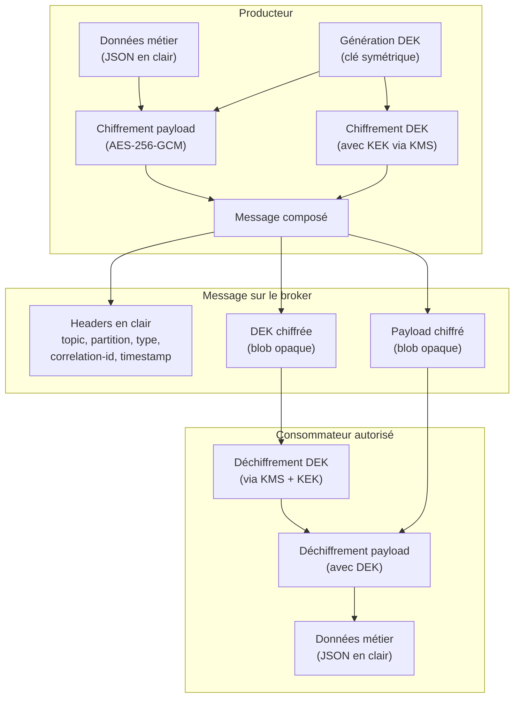
```mermaid
flowchart TB
    subgraph "Producteur"
        P1["Données métier<br/>(JSON en clair)"]
        P2["Génération DEK<br/>(clé symétrique)"]
        P3["Chiffrement payload<br/>(AES-256-GCM)"]
        P4["Chiffrement DEK<br/>(avec KEK via KMS)"]
        P5["Message composé"]
    end

    P1 --> P3
    P2 --> P3
    P2 --> P4
    P3 --> P5
    P4 --> P5

    subgraph "Message sur le broker"
        M1["Headers en clair<br/>topic, partition, type,<br/>correlation-id, timestamp"]
        M2["DEK chiffrée<br/>(blob opaque)"]
        M3["Payload chiffré<br/>(blob opaque)"]
    end

    P5 --> M1
    P5 --> M2
    P5 --> M3

    subgraph "Consommateur autorisé"
        C1["Déchiffrement DEK<br/>(via KMS + KEK)"]
        C2["Déchiffrement payload<br/>(avec DEK)"]
        C3["Données métier<br/>(JSON en clair)"]
    end

    M2 --> C1
    C1 --> C2
    M3 --> C2
    C2 --> C3
```

L'implémentation côté producteur Kafka utilise un sérialiseur personnalisé qui encapsule la logique de chiffrement :

```python
# Producteur Kafka avec Encryption Envelope
from cryptography.fernet import Fernet
import boto3, json, base64

kms_client = boto3.client('kms')

def encrypt_envelope(payload: dict, kek_id: str) -> tuple:
    """Retourne (encrypted_payload, encrypted_dek)."""
    # Génération d'une DEK via KMS
    response = kms_client.generate_data_key(
        KeyId=kek_id,
        KeySpec='AES_256'
    )
    dek_plaintext = response['Plaintext']
    dek_encrypted = base64.b64encode(response['CiphertextBlob'])

    # Chiffrement du payload avec la DEK
    fernet = Fernet(base64.urlsafe_b64encode(dek_plaintext))
    encrypted_payload = fernet.encrypt(json.dumps(payload).encode())

    return encrypted_payload, dek_encrypted
```

**Exemple d'usage.** Un système de santé publie des événements de mise à jour de dossier patient sur un topic Kafka. Les headers contiennent le type d'événement (admission, sortie, prescription) et l'identifiant du service hospitalier — informations nécessaires au routage mais non sensibles. Le payload contient les données cliniques du patient, chiffrées avec une DEK dont la KEK est accessible uniquement aux services autorisés par le responsable du traitement des données. Le service de monitoring peut compter les événements par type sans jamais accéder aux données de santé. Le service d'archivage stocke les messages chiffrés dans le data lake ; seule une requête explicitement autorisée et journalisée permet le déchiffrement pour analyse.

> **Quand utiliser ce patron**
> L'Encryption Envelope Pattern est essentiel pour les flux contenant des données soumises à des réglementations de protection (RGPD, HIPAA, PCI-DSS) qui transitent par des intermédiaires ne nécessitant pas l'accès au contenu. Il s'impose dans les architectures événementielles (Kafka, Pulsar) où les brokers stockent les messages de manière persistante, et dans les intégrations multi-tenant où l'isolation cryptographique des données entre tenants constitue une exigence. Le surcoût de performance (typiquement 2 à 5 ms par opération de chiffrement/déchiffrement) est négligeable pour la majorité des flux d'intégration.

#### Secure Event Relay Pattern

**Problème résolu.** Deux bus événementiels opèrent dans des domaines de confiance distincts — le réseau interne de l'entreprise et le réseau d'un partenaire, deux régions cloud soumises à des juridictions différentes, ou un environnement de production et un environnement d'analyse hébergé par un tiers. Connecter directement les deux bus crée un vecteur d'attaque : un événement malveillant publié sur le bus externe pourrait se propager au bus interne, et une fuite de données confidentielles pourrait transiter dans l'autre sens.

Le problème est analogue à celui résolu par les DMZ réseau traditionnelles pour le trafic HTTP, mais appliqué au trafic événementiel. Les pare-feux et proxies HTTP ne comprennent pas les protocoles des bus de messages (Kafka Wire Protocol, AMQP) et ne peuvent pas inspecter le contenu des événements pour appliquer des politiques de filtrage sémantique. Un composant spécialisé est nécessaire.

**Mécanisme.** Le Secure Event Relay Pattern insère un composant de relais sécurisé entre les deux bus événementiels, fonctionnant comme une DMZ événementielle. Ce relais effectue quatre opérations sur chaque événement en transit.

Le **filtrage** constitue la première opération : le relais n'admet que les types d'événements explicitement autorisés par une liste blanche configurable. Un événement dont le type n'est pas reconnu est rejeté et journalisé. Ce mécanisme empêche la propagation d'événements inattendus ou malveillants.

La **validation** constitue la deuxième opération : le relais vérifie la conformité de l'événement à son schéma déclaré (via un Schema Registry), contrôle la taille du payload, valide les signatures numériques et rejette les événements malformés ou non signés. Cette validation constitue une défense contre les attaques par injection d'événements forgés.

La **transformation sécurisée** constitue la troisième opération : le relais supprime ou masque les champs sensibles qui ne doivent pas franchir la frontière de confiance (numéros de sécurité sociale, données de géolocalisation, identifiants internes), rechiffre le payload avec les clés du domaine cible, et adapte les claims d'identité au modèle du domaine destinataire.

La **journalisation d'audit** constitue la quatrième opération : chaque événement relayé, filtré ou rejeté est enregistré dans un journal d'audit immuable, incluant l'horodatage, le type d'événement, la source, la destination et la décision prise. Ce journal constitue la preuve de conformité pour les échanges inter-organisationnels.

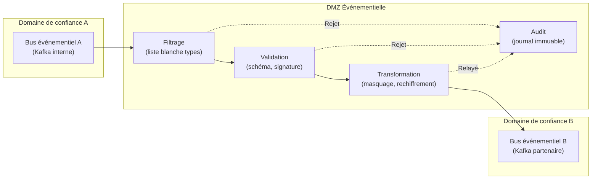
```mermaid
flowchart LR
    subgraph "Domaine de confiance A"
        BusA["Bus événementiel A<br/>(Kafka interne)"]
    end

    subgraph "DMZ Événementielle"
        F["Filtrage<br/>(liste blanche types)"]
        V["Validation<br/>(schéma, signature)"]
        T["Transformation<br/>(masquage, rechiffrement)"]
        A["Audit<br/>(journal immuable)"]
    end

    subgraph "Domaine de confiance B"
        BusB["Bus événementiel B<br/>(Kafka partenaire)"]
    end

    BusA --> F
    F --> V
    V --> T
    T --> BusB
    F -.->|Rejet| A
    V -.->|Rejet| A
    T -.->|Relayé| A
```

L'implémentation du relais peut s'appuyer sur Kafka Connect avec des transformations personnalisées (Single Message Transforms) ou sur un microservice dédié consommant d'un cluster et produisant vers l'autre. La configuration de filtrage suit typiquement un modèle déclaratif :

```yaml
# Configuration du Secure Event Relay
relay:
  source:
    cluster: kafka-internal
    topics:
      - inventory.stock.updated
      - catalog.price.changed
  target:
    cluster: kafka-partner
    topic_prefix: partner.
  security:
    allowed_event_types:
      - stock.updated
      - price.changed
    schema_validation: strict
    signature_required: true
  transformation:
    remove_fields:
      - production_cost
      - internal_supplier_id
      - warehouse_coordinates
    mask_fields:
      - sku_internal: "HASH"
  audit:
    destination: audit-topic
    include_payload_hash: true
```

**Exemple d'usage.** Un constructeur automobile partage des événements de mise à jour de stock avec son réseau de concessionnaires. Le relais sécurisé, déployé dans une DMZ réseau, n'autorise que les événements de type `stock.updated` et `price.changed`, valide leur conformité au schéma Avro enregistré, supprime les champs de coût de production (information confidentielle), et rechiffre le payload avec la clé publique du réseau de concessionnaires. Les événements de type `internal.audit` ou `manufacturing.defect`, même s'ils étaient accidentellement publiés sur le mauvais topic, ne franchissent jamais la frontière.

> **Quand utiliser ce patron**
> Le Secure Event Relay Pattern est nécessaire dès que des flux événementiels traversent des frontières de confiance : intégrations B2B avec des partenaires, architectures multi-cloud avec des exigences de souveraineté des données, ou connexion entre des environnements de production et des environnements d'analyse ou de développement. Ce patron s'applique également à l'intégration événementielle entre des filiales soumises à des juridictions réglementaires distinctes (par exemple, données soumises au RGPD ne devant pas transiter vers une juridiction sans protection adéquate).

### 12.6.2 Matrice de décision des patrons de sécurité

Le choix du patron de sécurité approprié dépend du contexte d'intégration, du domaine concerné et des contraintes opérationnelles. La matrice suivante guide la sélection en croisant les patrons avec les scénarios d'usage les plus fréquents.

| Patron | Domaine principal | Contexte d'utilisation | Complexité | Prérequis |
|--------|------------------|----------------------|------------|-----------|
| **Gateway Security** | App (synchrone) | APIs exposées à des clients externes ou internes multiples | Moyenne | API Gateway, IdP centralisé |
| **Token Exchange** | App (synchrone) | Appels inter-domaines de confiance, fédération d'identité | Élevée | Serveur d'autorisation compatible RFC 8693 |
| **Claim Propagation** | App (synchrone) | Chaînes de microservices nécessitant traçabilité de bout en bout | Faible | Convention de headers, mécanisme de signature |
| **Encryption Envelope** | Event / Data | Données sensibles transitant par des intermédiaires non autorisés | Moyenne | KMS, gestion des clés DEK/KEK |
| **Secure Event Relay** | Event | Flux événementiels traversant des frontières de confiance | Élevée | DMZ réseau, Schema Registry, relais dédié |

> **Perspective stratégique**
> Ces patrons ne sont pas mutuellement exclusifs. Un flux d'intégration complet combine typiquement plusieurs patrons : le Gateway Security Pattern protège le point d'entrée, le Claim Propagation Pattern maintient l'identité à travers la chaîne, le Token Exchange Pattern négocie l'accès aux domaines externes, et l'Encryption Envelope Pattern protège les données sensibles dans les flux événementiels. L'architecte d'intégration compose ces patrons comme des couches de défense en profondeur, chacune adressant une préoccupation distincte.

Le guide de sélection suivant résume la démarche décisionnelle :

1. **Le flux traverse-t-il une frontière externe ?** Si oui, le Gateway Security Pattern et le Secure Event Relay Pattern (pour les événements) constituent le premier rempart.
2. **Le flux implique-t-il plusieurs domaines de confiance ?** Si oui, le Token Exchange Pattern et le Secure Event Relay Pattern assurent la transition sécurisée entre domaines.
3. **Le flux traverse-t-il une chaîne de services ?** Si oui, le Claim Propagation Pattern maintient le contexte d'identité de bout en bout.
4. **Le flux contient-il des données sensibles transitant par des intermédiaires ?** Si oui, l'Encryption Envelope Pattern isole les données du contenant.

> **Exemple concret**
> Reprenons le processus Order-to-Cash du chapitre X. La capture de commande via l'API REST est protégée par le Gateway Security Pattern (authentification du partenaire, rate limiting). Le traitement de la commande à travers la chaîne de microservices (validation, inventaire, paiement, expédition) utilise le Claim Propagation Pattern pour maintenir l'identité du partenaire et l'identifiant de corrélation. L'appel au processeur de paiement externe utilise le Token Exchange Pattern pour obtenir un token reconnu par le domaine financier. Les événements de confirmation de commande publiés vers le partenaire utilisent le Secure Event Relay Pattern pour filtrer les champs internes et valider les schémas. Les données de carte bancaire transitant par Kafka utilisent l'Encryption Envelope Pattern. Cinq patrons, un seul flux, une défense en profondeur complète.

### 12.6.3 Anti-patrons de sécurité en intégration

L'expérience des architectures d'intégration en production révèle des pratiques récurrentes qui compromettent la sécurité. Ces anti-patrons sont d'autant plus insidieux qu'ils fonctionnent apparemment — les tests passent, les flux opèrent — jusqu'au jour où une faille est exploitée. Les identifier permet de les prévenir dès la conception.

#### Trust-the-Network

**Description.** Cet anti-patron repose sur l'hypothèse que le réseau interne est sûr et que seul le périmètre externe nécessite une protection. Les services internes communiquent en HTTP non chiffré, sans authentification mutuelle, en postulant que le pare-feu périmétrique suffit.

**Risque.** Une brèche dans le périmètre — un service compromis, un conteneur vulnérable, un mouvement latéral après hameçonnage — donne à l'attaquant un accès libre à l'ensemble des communications internes. Le rapport Mandiant 2024 indique que le temps médian de résidence d'un attaquant dans un réseau compromis est de 10 jours — suffisant pour intercepter massivement le trafic interne non chiffré.

**Remédiation.** Adopter une approche Zero Trust (section 12.2) : mTLS systématique entre services, authentification de chaque requête interne, micro-segmentation réseau. Le Service Mesh (Istio, Linkerd) automatise le déploiement de mTLS sans modifier le code applicatif.

#### God Token

**Description.** Un token d'accès unique, doté de tous les scopes et de toutes les permissions, est partagé entre plusieurs services pour « simplifier » l'intégration. Ce token est souvent un token de service account stocké en variable d'environnement, sans rotation régulière, parfois même codé en dur dans le code source.

**Risque.** La compromission d'un seul service expose l'intégralité du système. Le token offre un accès total à toutes les APIs, tous les topics Kafka, toutes les bases de données. Le principe du moindre privilège est violé de manière absolue. De plus, l'absence de rotation signifie que la fenêtre d'exploitation d'un token volé est illimitée.

**Remédiation.** Attribuer un token spécifique à chaque service avec des scopes limités à ses besoins réels. Implémenter la rotation automatique des tokens (section 12.4). Utiliser le Token Exchange Pattern pour les appels inter-services nécessitant des permissions contextuelles.

#### Security-as-Afterthought

**Description.** L'architecture d'intégration est conçue, développée et déployée sans considération de sécurité. La sécurité est ajoutée après coup, souvent sous la pression d'un audit ou d'un incident. Les contrôles sont superposés à une architecture qui n'a pas été pensée pour les accueillir.

**Risque.** Les contrôles de sécurité ajoutés a posteriori sont fragiles, contournables et incomplets. Une authentification plaquée sur des APIs qui transmettent des données sensibles dans les paramètres d'URL ne protège rien — les URLs sont journalisées en clair par les proxies et les load balancers. Un chiffrement ajouté tardivement peut ne pas couvrir tous les flux, laissant des chemins non protégés.

**Remédiation.** Intégrer la sécurité dès la conception (Security by Design). Inclure un architecte sécurité dans les revues d'architecture d'intégration. Utiliser la checklist de la section 12.7.1 comme prérequis de validation avant tout déploiement.

#### Plaintext Secrets

**Description.** Les secrets (clés d'API, mots de passe de bases de données, certificats) sont stockés en clair dans le code source, les fichiers de configuration, les variables d'environnement non protégées, ou les fichiers Docker Compose versionnés dans Git.

**Risque.** Les dépôts Git conservent l'historique complet : un secret commité une seule fois reste accessible même après suppression du fichier. Les outils automatisés de scan de dépôts publics (TruffleHog, GitLeaks) détectent ces secrets en quelques minutes. Un secret exposé dans une image Docker publique compromet l'environnement de production.

**Remédiation.** Utiliser systématiquement un gestionnaire de secrets (HashiCorp Vault, AWS Secrets Manager) comme décrit en section 12.4. Mettre en place des hooks pre-commit (detect-secrets) qui bloquent le commit de secrets. Scanner régulièrement l'historique Git avec des outils de détection.

#### Bypass-for-Performance

**Description.** Les contrôles de sécurité sont désactivés ou contournés pour améliorer les performances. La validation JWT est supprimée « car elle ajoute 5 ms par requête ». Le chiffrement TLS est désactivé entre les services internes « car il consomme du CPU ». La journalisation des événements de sécurité est réduite « car elle sature les disques ».

**Risque.** Chaque contournement crée une brèche silencieuse. La latence ajoutée par la validation JWT (typiquement 1 à 5 ms) est négligeable comparée au temps de résolution d'une brèche de sécurité. Le coût CPU du TLS (moins de 2 % avec les processeurs modernes supportant AES-NI) est dérisoire comparé au coût d'une interception de trafic.

**Remédiation.** Mesurer avant de contourner : les performances perçues comme dégradées sont souvent causées par d'autres facteurs. Optimiser les contrôles plutôt que les supprimer (mise en cache des validations JWT, sessions TLS réutilisées). Si un contrôle de sécurité crée un goulot d'étranglement mesurable, chercher une implémentation plus performante plutôt qu'une suppression.

#### Insufficient Logging

**Description.** Les événements de sécurité (tentatives d'authentification échouées, accès refusés, modifications de permissions, accès aux données sensibles) ne sont pas journalisés, ou le sont dans des formats incohérents dispersés entre les services sans corrélation possible.

**Risque.** Sans journalisation des événements de sécurité, les intrusions passent inaperçues, les enquêtes post-incident sont impossibles, et la conformité réglementaire ne peut être démontrée. Le RGPD exige la capacité de démontrer la conformité (article 5.2, principe de responsabilité) ; sans journal d'audit, cette démonstration est impossible.

**Remédiation.** Centraliser la journalisation des événements de sécurité dans un SIEM (section 12.5). Définir un schéma standardisé d'événements de sécurité incluant horodatage, identité de l'acteur, action, ressource, résultat et identifiant de corrélation. Intégrer les événements de sécurité dans les traces OpenTelemetry (chapitre VII) pour une corrélation technique et sécurité unifiée.

La table suivante synthétise les six anti-patrons pour servir de référence rapide lors des revues d'architecture :

| Anti-patron | Signal d'alerte | Impact | Priorité de remédiation |
|-------------|----------------|--------|------------------------|
| Trust-the-Network | HTTP entre services internes, absence de mTLS | Mouvement latéral non détecté | Critique |
| God Token | Token partagé entre > 2 services, scopes `*` ou `admin` | Compromission totale sur brèche unitaire | Critique |
| Security-as-Afterthought | Absence de revue sécurité dans le processus d'architecture | Contrôles fragiles et contournables | Élevée |
| Plaintext Secrets | Secrets dans Git, variables d'environnement non chiffrées | Exposition des credentials de production | Critique |
| Bypass-for-Performance | Commentaires `// TODO: re-enable security` dans le code | Brèche silencieuse permanente | Élevée |
| Insufficient Logging | Absence de corrélation entre événements de sécurité | Investigation post-incident impossible | Élevée |

---

## 12.7 Synthèse et Recommandations

La sécurité de l'architecture d'intégration n'est ni un composant à ajouter ni une couche à superposer : elle est une propriété émergente de choix architecturaux disciplinés, appliqués de manière cohérente à travers les trois domaines d'intégration. Ce chapitre a parcouru le spectre complet — de l'identité et du contrôle d'accès à la sécurisation par domaine, de la gestion des secrets à la conformité, des patrons de sécurité aux anti-patrons à éviter. Cette section finale consolide ces apprentissages en outils directement actionnables : des checklists par domaine, une feuille de route progressive et une vision de convergence avec les préoccupations transversales de résilience et d'observabilité.

### 12.7.1 Checklist de sécurité par domaine d'intégration

Les trois tables suivantes synthétisent les contrôles de sécurité essentiels pour chaque domaine d'intégration, classés par priorité. Elles constituent un outil de revue d'architecture utilisable en amont de tout déploiement.

**Intégration des Applications (le Verbe)**

| Contrôle | Priorité | Mise en œuvre | Référence |
|----------|----------|--------------|-----------|
| TLS 1.3 sur toutes les communications | Critique | Terminaison TLS au gateway, mTLS inter-services | §12.3.1 |
| Authentification centralisée (OAuth 2.0 / OIDC) | Critique | IdP centralisé, validation JWT au gateway | §12.2.1 |
| Autorisation basée sur les scopes et les rôles | Critique | Scopes OAuth 2.0, politiques OPA/Cedar | §12.2.2 |
| Rate limiting et protection contre les abus | Élevée | Configuration au niveau gateway, quotas par client | §12.6.1 |
| Propagation d'identité de bout en bout | Élevée | Headers signés, Claim Propagation Pattern | §12.6.1 |
| Validation des entrées et protection contre les injections | Élevée | WAF au gateway, validation côté service | §12.3.1 |
| Échange de tokens inter-domaines | Élevée | Token Exchange Pattern (RFC 8693) | §12.6.1 |
| Gestion du cycle de vie des tokens | Moyenne | Durée de vie courte, refresh tokens, révocation | §12.2.1 |
| Versionnement sécurisé des APIs | Moyenne | Dépréciation progressive, contrats de compatibilité | §12.3.1 |

**Intégration des Données (le Nom)**

| Contrôle | Priorité | Mise en œuvre | Référence |
|----------|----------|--------------|-----------|
| Chiffrement des données au repos | Critique | TDE bases de données, chiffrement stockage cloud | §12.3.2 |
| Contrôle d'accès aux données par colonnes/lignes | Critique | Row-Level Security, Dynamic Data Masking | §12.3.2 |
| Chiffrement des flux CDC | Élevée | TLS pour les connecteurs, Encryption Envelope pour les payloads | §12.3.2, §12.6.1 |
| Anonymisation/pseudonymisation des données personnelles | Élevée | Masquage en pipeline, tokenisation réversible | §12.5 |
| Audit des accès aux données sensibles | Élevée | Journalisation des requêtes, intégration SIEM | §12.5 |
| Gestion des clés de chiffrement | Moyenne | KMS centralisé, rotation automatique, séparation KEK/DEK | §12.4 |
| Validation des schémas de données | Moyenne | Schema Registry avec validation stricte | §12.3.2 |
| Isolation des données entre tenants | Moyenne | Schémas séparés, clés de chiffrement par tenant | §12.3.2 |

**Intégration des Événements (le Signal)**

| Contrôle | Priorité | Mise en œuvre | Référence |
|----------|----------|--------------|-----------|
| Authentification et autorisation des producteurs/consommateurs | Critique | SASL/SCRAM ou mTLS sur les brokers Kafka | §12.3.3 |
| ACLs sur les topics | Critique | Permissions read/write par service et par topic | §12.3.3 |
| Chiffrement en transit | Critique | TLS entre clients et brokers, entre brokers | §12.3.3 |
| Chiffrement des payloads sensibles | Élevée | Encryption Envelope Pattern (DEK/KEK) | §12.6.1 |
| Validation des événements entrants | Élevée | Schema Registry, rejet des événements malformés | §12.3.3 |
| Relais sécurisé pour les flux inter-domaines | Élevée | Secure Event Relay Pattern (DMZ événementielle) | §12.6.1 |
| Signature des événements | Moyenne | Signature numérique du producteur, vérification côté consommateur | §12.3.3 |
| Journalisation des événements de sécurité | Moyenne | Audit logs Kafka, intégration SIEM | §12.5 |
| Rétention sécurisée et purge des événements expirés | Moyenne | Politiques de rétention, suppression cryptographique | §12.3.3 |

> **Configuration recommandée**
> Ces checklists doivent être intégrées au processus de revue d'architecture (Architecture Decision Record, ADR). Chaque nouveau flux d'intégration fait l'objet d'une revue systématique contre la checklist du domaine concerné. Les contrôles de priorité « Critique » constituent des prérequis non négociables ; les contrôles « Élevée » doivent être adressés avant la mise en production ; les contrôles « Moyenne » peuvent être planifiés dans les itérations suivantes.

### 12.7.2 Feuille de route de sécurisation progressive

La sécurisation d'une architecture d'intégration ne se décrète pas en un jour. Une approche « big bang » qui tenterait d'implémenter simultanément l'ensemble des contrôles présentés dans ce chapitre échouerait sous le poids de sa propre complexité. La feuille de route suivante propose une progression en quatre phases, chacune construisant sur les fondations de la précédente.

**Phase 1 — Fondations** (0 à 3 mois). Cette phase établit le socle de sécurité minimal sans lequel aucune amélioration ultérieure n'a de sens. Le chiffrement TLS est déployé sur l'ensemble des communications, éliminant le trafic en clair. Un fournisseur d'identité centralisé (Keycloak, Azure AD, Okta) est mis en place pour unifier l'authentification. Un gestionnaire de secrets (Vault, AWS Secrets Manager) remplace les secrets en clair dans les configurations et le code source. La journalisation centralisée est activée pour les événements de sécurité critiques (tentatives d'authentification échouées, accès refusés). Les livrables de cette phase sont concrets et mesurables : zéro communication HTTP en clair, zéro secret dans Git, un tableau de bord des événements d'authentification.

**Phase 2 — Renforcement** (3 à 9 mois). Cette phase affine les contrôles au-delà du minimum. L'autorisation fine est implémentée avec des politiques basées sur les attributs (ABAC) ou les relations (ReBAC), remplaçant les contrôles binaires « authentifié ou non » par des décisions granulaires « autorisé à effectuer cette action sur cette ressource dans ce contexte ». Le chiffrement des données au repos est activé pour les bases de données et les stockages contenant des données sensibles. Un journal d'audit complet est déployé, couvrant les accès aux données, les modifications de permissions et les actions administratives. Les patrons Claim Propagation et Token Exchange sont implémentés pour les flux critiques, assurant la traçabilité de bout en bout et la sécurité inter-domaines. Les livrables incluent : politiques ABAC déployées, chiffrement au repos vérifié, audit trail opérationnel avec rétention conforme.

**Phase 3 — Maturité** (9 à 18 mois). Cette phase introduit l'automatisation et la codification des politiques. L'approche Zero Trust est déployée avec mTLS systématique entre tous les services et vérification de chaque requête indépendamment de son origine réseau. Les politiques de sécurité sont codifiées (Policy-as-Code avec OPA/Rego ou Cedar) et versionnées dans Git, permettant la revue par les pairs, l'historique des changements et le déploiement automatisé. La conformité est vérifiée automatiquement (Compliance-as-Code) par des pipelines CI/CD qui valident les configurations de sécurité avant chaque déploiement — un service déployé sans mTLS, sans rate limiting ou sans journalisation est rejeté par le pipeline. Les patrons Encryption Envelope et Secure Event Relay sont déployés pour les flux contenant des données réglementées.

**Phase 4 — Excellence** (18 mois et au-delà). Cette phase intègre les capacités avancées qui caractérisent une architecture de sécurité mature. La sécurité agentique, telle qu'évoquée au chapitre XI, introduit des agents autonomes capables de détecter les anomalies de sécurité et de déclencher des actions correctives sans intervention humaine. L'auto-remédiation permet au système de révoquer automatiquement un token compromis, d'isoler un service présentant un comportement anormal, ou de basculer le trafic vers une instance saine. Le Security Mesh unifie la gestion de la sécurité à travers l'ensemble des domaines d'intégration, des environnements cloud et des frontières organisationnelles. Les tests de sécurité automatisés (chaos security engineering) valident en continu la résilience du système face aux attaques simulées.

```mermaid
flowchart LR
    subgraph P1["Phase 1 — Fondations<br/>(0-3 mois)"]
        P1a["TLS partout"]
        P1b["IdP centralisé"]
        P1c["Gestionnaire<br/>de secrets"]
        P1d["Logs de sécurité<br/>centralisés"]
    end

    subgraph P2["Phase 2 — Renforcement<br/>(3-9 mois)"]
        P2a["Autorisation fine<br/>(ABAC/ReBAC)"]
        P2b["Chiffrement<br/>au repos"]
        P2c["Audit trail<br/>complet"]
        P2d["Claim Propagation<br/>Token Exchange"]
    end

    subgraph P3["Phase 3 — Maturité<br/>(9-18 mois)"]
        P3a["Zero Trust<br/>(mTLS)"]
        P3b["Policy-as-Code<br/>(OPA/Cedar)"]
        P3c["Compliance-as-Code<br/>(CI/CD)"]
        P3d["Encryption Envelope<br/>Secure Event Relay"]
    end

    subgraph P4["Phase 4 — Excellence<br/>(18+ mois)"]
        P4a["Sécurité<br/>agentique"]
        P4b["Auto-<br/>remédiation"]
        P4c["Security Mesh<br/>+ Chaos Security"]
    end

    P1 --> P2
    P2 --> P3
    P3 --> P4
```

> **Perspective stratégique**
> Cette feuille de route n'est pas un carcan rigide mais un guide d'orientation. Le rythme de progression dépend de la maturité initiale de l'organisation, de ses contraintes réglementaires et de ses ressources. Une organisation soumise à PCI-DSS devra peut-être accélérer la Phase 2 (chiffrement au repos obligatoire) ; une organisation adoptant une architecture multi-cloud pourra prioriser les patrons inter-domaines de la Phase 3. L'essentiel est de ne pas sauter les fondations : sans TLS, sans gestion des secrets, sans journalisation, les contrôles avancés reposent sur du sable.

La table suivante fournit les indicateurs de progression mesurables pour chaque phase :

| Phase | Indicateur clé | Cible |
|-------|---------------|-------|
| Fondations | % de communications chiffrées (TLS) | 100 % |
| Fondations | Nombre de secrets en clair dans Git | 0 |
| Fondations | Couverture des logs d'authentification | 100 % des endpoints |
| Renforcement | % de services avec autorisation fine | > 80 % |
| Renforcement | Couverture du chiffrement au repos | 100 % des données sensibles |
| Renforcement | Temps moyen de détection d'accès anormal | < 1 heure |
| Maturité | % de politiques codifiées (Policy-as-Code) | > 90 % |
| Maturité | Taux de rejet CI/CD pour non-conformité sécurité | > 0 (preuve d'efficacité) |
| Maturité | % de flux inter-domaines avec Encryption Envelope | 100 % des flux réglementés |
| Excellence | Temps moyen de remédiation automatique | < 5 minutes |
| Excellence | Couverture des tests de chaos security | > 70 % des scénarios critiques |

### 12.7.3 Convergence sécurité–observabilité–résilience

Le chapitre VII a établi la résilience et l'observabilité comme les deux préoccupations transversales fondamentales de l'architecture d'intégration. Le présent chapitre ajoute la sécurité comme troisième pilier transversal. Ces trois préoccupations ne sont pas indépendantes ; elles entretiennent des synergies profondes que l'architecte d'intégration doit exploiter pour construire des systèmes véritablement robustes.

**La convergence traces de sécurité et observabilité.** Les traces OpenTelemetry, présentées au chapitre VII comme outil de diagnostic de performance, constituent également un outil de sécurité puissant. En enrichissant les spans avec des attributs de sécurité (identité de l'appelant, décision d'autorisation, niveau de sensibilité des données accédées), une même infrastructure de traces sert simultanément le diagnostic opérationnel et l'investigation de sécurité. Lorsqu'un analyste SOC enquête sur un accès suspect, il peut reconstituer la chaîne complète d'appels dans le même outil que l'équipe SRE utilise pour diagnostiquer les problèmes de latence. Cette convergence élimine les silos entre les équipes de sécurité et les équipes d'exploitation, qui travaillent traditionnellement avec des outils et des données séparés.

Concrètement, un span OpenTelemetry enrichi pour la sécurité pourrait contenir les attributs suivants :

```
span.attributes:
  # Attributs opérationnels (chapitre VII)
  http.method: POST
  http.url: /api/v2/payments
  http.status_code: 200
  service.name: payment-service
  # Attributs de sécurité (chapitre XII)
  enduser.id: alice@entreprise.com
  enduser.role: finance-admin
  security.authz.decision: ALLOW
  security.authz.policy: payment-approval-policy
  security.data.sensitivity: PCI
  security.token.issuer: https://auth.entreprise.com
  security.token.scopes: payments:write
```

Cette convergence des attributs dans un même span permet des requêtes transversales : « Quels utilisateurs ont accédé à des données PCI avec une latence anormalement élevée au cours des dernières 24 heures ? » — une question qui intéresse simultanément l'équipe de sécurité (accès aux données sensibles) et l'équipe d'exploitation (latence anormale).

**La convergence résilience et sécurité.** Les patrons de résilience du chapitre VII acquièrent une dimension sécuritaire lorsqu'ils sont déclenchés par des anomalies de sécurité plutôt que par des défaillances techniques. Un Circuit Breaker peut s'ouvrir non seulement lorsqu'un service répond avec des erreurs 500, mais également lorsqu'un service présente un taux anormalement élevé de requêtes non authentifiées — signe possible d'une compromission. Un Bulkhead peut isoler non seulement les ressources d'un service défaillant, mais également les ressources d'un tenant dont le comportement est suspect. Le rate limiting, présenté au chapitre VII comme mécanisme de protection contre la surcharge, constitue simultanément un mécanisme de défense contre les attaques par déni de service.

Cette convergence se manifeste aussi dans le sens inverse : les mécanismes de sécurité renforcent la résilience. Un système qui valide systématiquement les entrées (WAF, validation de schéma) est plus résilient car il rejette les requêtes malformées avant qu'elles ne provoquent des erreurs dans la logique métier. Un système qui chiffre ses données est plus résilient face aux compromissions car les données exfiltrées sont inexploitables sans les clés.

**La vision unifiée pour l'architecte d'intégration.** L'architecte qui conçoit un flux d'intégration ne devrait pas traiter la sécurité, la résilience et l'observabilité comme trois préoccupations séquentielles — « d'abord ça marche, ensuite c'est résilient, enfin c'est sécurisé ». Ces trois propriétés doivent être considérées simultanément, dès la conception, car elles se renforcent mutuellement. Un système observable est plus facile à sécuriser car les anomalies sont détectées rapidement. Un système résilient est plus sécurisé car les attaques par déni de service sont contenues. Un système sécurisé est plus résilient car les défaillances causées par des accès malveillants sont prévenues.

La table suivante synthétise les synergies entre les trois piliers transversaux :

| Synergie | Mécanisme | Bénéfice |
|----------|-----------|----------|
| Observabilité → Sécurité | Traces enrichies d'attributs de sécurité | Investigation d'incidents accélérée, détection d'anomalies comportementales |
| Observabilité → Résilience | Métriques de santé, alertes prédictives | Détection précoce des dégradations, auto-scaling proactif |
| Résilience → Sécurité | Circuit Breaker déclenché par anomalies de sécurité | Isolation automatique des services compromis |
| Résilience → Observabilité | Événements de résilience (ouverture/fermeture de circuits) | Visibilité sur les défaillances contenues |
| Sécurité → Résilience | Validation des entrées, chiffrement, authentification | Rejet précoce des requêtes malveillantes, protection des données exfiltrées |
| Sécurité → Observabilité | Journal d'audit, événements de sécurité | Enrichissement du corpus d'observabilité, conformité démontrée |

> **Exemple concret**
> Considérons un flux de traitement de paiement traversant cinq microservices. L'architecte conçoit ce flux avec : (1) le Gateway Security Pattern pour l'authentification et l'autorisation au point d'entrée, (2) le Claim Propagation Pattern pour maintenir l'identité du client à travers la chaîne, (3) un Circuit Breaker entre chaque service configuré pour s'ouvrir sur les erreurs techniques ET sur les anomalies de sécurité (tokens invalides récurrents), (4) des traces OpenTelemetry enrichies avec les décisions d'autorisation et les identifiants de transaction, (5) l'Encryption Envelope Pattern pour les données de carte bancaire en transit vers le processeur de paiement externe. Ce flux intègre nativement les trois propriétés transversales sans les traiter comme des ajouts successifs.

Cette convergence des trois piliers transversaux — résilience, observabilité, sécurité — constitue le socle sur lequel repose l'architecture d'intégration d'entreprise mature. Les chapitres qui ont précédé, du continuum d'intégration (chapitres III-V) aux standards et contrats (chapitre VI), de la résilience et l'observabilité (chapitre VII) à la collaboration et l'automatisation (chapitre VIII), de l'architecture de référence (chapitre IX) à l'étude de cas Order-to-Cash (chapitre X) et aux perspectives agentiques (chapitre XI), convergent vers cette vision unifiée. La sécurité n'est pas le dernier chapitre parce qu'elle est la dernière préoccupation ; elle est le dernier chapitre parce qu'elle intègre et transcende toutes les précédentes.

L'architecte d'intégration qui maîtrise ces trois piliers ne construit pas seulement des systèmes qui fonctionnent — il construit des systèmes dignes de confiance. Dans un monde où les flux d'intégration portent les processus critiques de l'entreprise, où les données traversent des frontières géographiques et organisationnelles, où les menaces évoluent plus vite que les défenses, cette confiance architecturale constitue un avantage compétitif durable. Elle permet aux organisations d'innover avec audace tout en protégeant leurs actifs les plus précieux : les données de leurs clients, l'intégrité de leurs processus et la réputation de leur marque.

---

*Chapitre suivant : [Chapitre II.A — Annexes](Chapitre_II.A_Annexes.md)*
